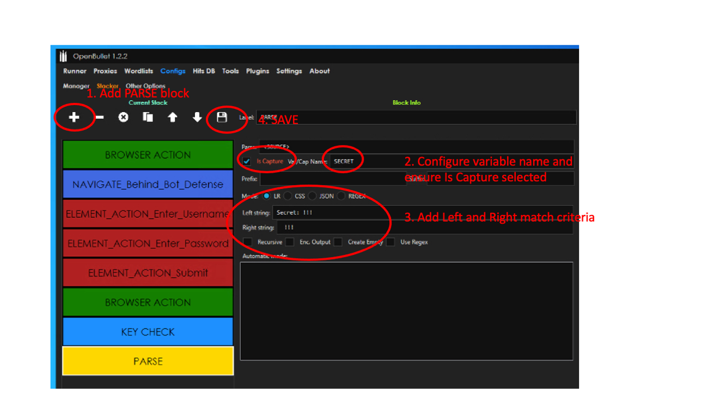

Lab 3: Human Like Automation 
==============================

**Run this lab from the JUMPHOST**

In this test we will replicate a more "human like" automation that fully renders the page by remotely controlling the Chrome browser.   

1. Launch OpenBullet from the desktop.

2. Navigate to **Configs -> Manager -> New**  Give it a name "*Human Credential Stuffing*" and Accept.  Double click to edit this item.

|lab001|
 
3. Add a new **BROWSER ACTION** block. The default action of OPEN is all we need.

|lab002|

4. Add a new **NAVIGATE** block. Configure URL as **http://namespace.lab-sec.f5demos.com/user/vipsignin**

|lab003|

5. Now we will add find the Username and Password fields and inject the text into them.  The field ID's or Names can be found in the HTML of the site but are provided 

4. Add a new **ELEMENT ACTION** block. Under Find Element Element By ID = **email**  (case sensitive).  For Action choose **SENDKEYSHUMAN** and for the INPUT put in **<USERNAME>**

|lab004|

5. Add a new **ELEMENT ACTION** block. Under Find Element Element By ID = **password**  (case sensitive).  For Action choose **SENDKEYSHUMAN** and for the INPUT put in **<PASSWORD>**

|lab005|

6. Add a new **ELEMENT ACTION** block. Under Find Element Element By ID = **password**  (case sensitive).  For Action choose **SUBMIT**

|lab006|

7. Add a new **BROWSER ACTION** block. For the Action choose **DOMtoSOURCE**.  This will copy the page source code from the browser to the local <SOURCE> variable

|lab007|

8. Next we want to ensure we identify when the login was successful and to capture the secret word.

9. Add a new **KEY CHECK** block. Click the Keychain + button twice.  Now in the first entry this will be to determine success we will look in the page source for the follow string.  Enter **Login Successful** in the indicated field.  For the second block we will use this for failure.  Change the type to **FAILURE** and enter **Incorrect Details** into the indicated field.

|lab008|

10. Add a new **PARSE** block.  Configure **Var/Cap Name** as "*SECRET*" and click "*IS CAPTURE*".  Then for the **Left String** we use **SECRET: !!!** and Right String we use **!!!**   This will capture and save the value to the log during an attack.  Ensure your configuration is *SAVED*.

|lab009|

11. Lets test our configuration.  Now fill in the credentials **john.smith@nobody.com:test123** in the **DATA** field and ensure **Credentials** is the method selected.  Now hit **Start**.  A new Chrome window should open and we can watch the bot work its magic.  Close the browser manually once it completes.

|lab010|

12. Now its time to run a large credential stuffing attack!

13. Swith to the *RUNNER* menu.  Choose *NEW* and click on the entry to edit it.

14. Click *SELECT CFG* and choose the configuration we just created *Human Credential Stuffing*, click *SELECT LIST* and choose *LAB2* and lastly hit *START* and watch the attack begin. Leave the number of bots set to 1 as multiple browser may make the system slow.  If you need to rerun the test you need to reset the start count to 1 (Used if you have a very long credential list)

|lab011|

15. Now you can see the attack running in realtime on the left hand side and on the right hand side it will show any of the successful attempts.  This will also bring up the chrome window to watch.  (Chrome could be run in headless mode if desired)

|lab012|

16. Additionally we can go to the distributed cloud dashboard  outside of the RDP Jumphost.  Clickon *HTTP Load Balancers* then *Security Monitoring* and explore using the *Bot Defense* tabs.  One thing to note that this attack is seeing as Threat Intelligence, essentially this means that the telemetry information was able to determine if this was a bot based on how it acted and the signals received.

|lab013|

**End of Lab 3:**  This concludes the overall lab, feel free to review and test the configuration. Closing presentation and remarks will begin shortly.

|labend|

.. |lab001| image:: _static/Slide6.png
   :width: 800px
.. |lab002| image:: _static/Slide19.png
   :width: 800px
.. |lab003| image:: _static/Slide20.png
   :width: 800px
.. |lab004| image:: _static/Slide21.png
   :width: 800px
.. |lab005| image:: _static/Slide22.png
   :width: 800px
.. |lab006| image:: _static/Slide23.png
   :width: 800px
.. |lab007| image:: _static/Slide24.png
   :width: 800px
.. |lab008| image:: _static/Slide25.png
   :width: 800px

.. |lab010| image:: _static/Slide27.png
   :width: 800px
.. |lab011| image:: _static/Slide28.png
   :width: 800px
.. |lab012| image:: _static/Slide29.png
   :width: 800px
.. |lab013| image:: _static/Slide30.png
   :width: 800px
.. |labend| image:: _static/labend.png
   :width: 800px

