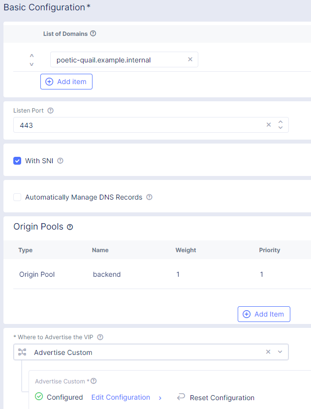
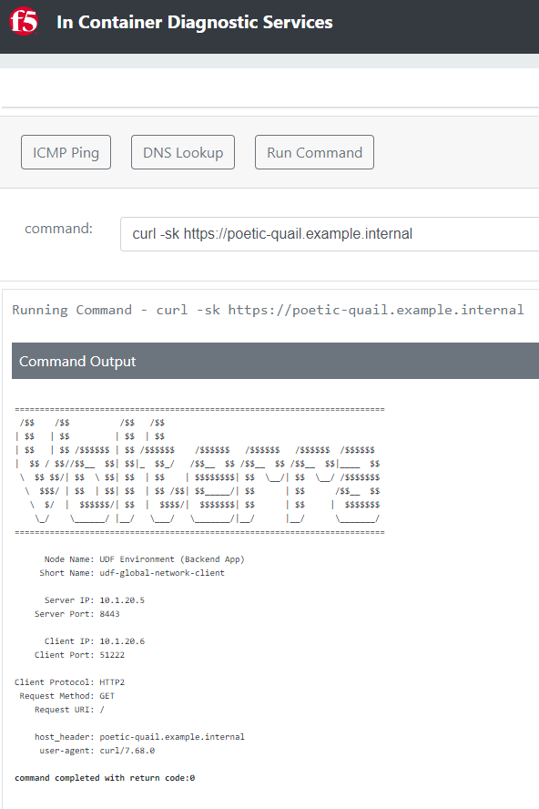
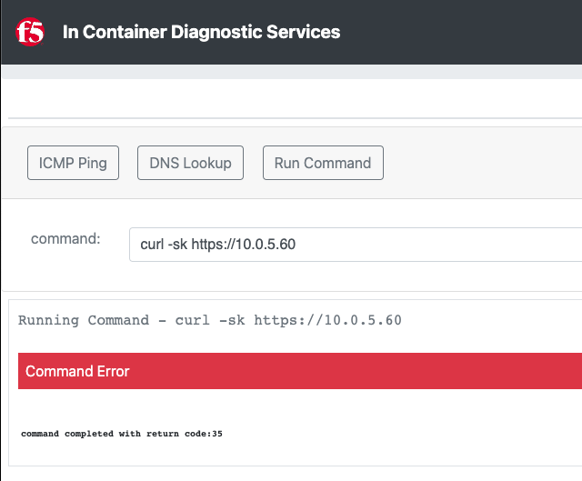

Lab 3: Create TCP Load Balancer
===============================

On of the requirements from the "Narrative" is to enable the frontend application
in AWS to communicate with the backend application that is on-prem.

The frontend application makes use of DNS to determine the IP address of the backend
application.  In the on-prem environment the name "adjective-animal.example.internal" resolves to
the backend IP of 10.1.20.5.

In the AWS environment we want to resolve the name "adjective-animal.example.internal" to resolve to
the IP address of the Distributed Cloud Mesh.  The Cloud Mesh will host a Virtual IP (VIP) that will
host a TCP Load Balancer that will proxy traffic back to the original backend application.

.. image:: ../images/tcplb-lab.png

Exercise 1: Verify DNS
~~~~~~~~~~~~~~~~~~~~~~

In the previous lab exercise we made a "In Container Diagnostic Services" service available.

This is small application that allows you to run tools to verify DNS and run commands like "curl"
to simulate HTTP/HTTPS connections from inside the AWS environment.

#. Click on DNS Lookup
#. Enter "jumphost.lab.f5demos.internal" in the *target* field.
#. After the "@" replace the 10.0.5.xxx value with "10.0.0.2"
#. Click on **Lookup**

   .. image:: ../images/dns-lookup-jumphost.png

You'll see that the private IP of the jumphost is returned.  The Distributed Cloud Mesh node used the 
internal DNS of your AWS site to resolve the IP of the private jumphost and made use of the 
secure tunnel to the Distributed Cloud Regional Edge to expose the service.

Next we will verify that we do not have a DNS record for adjective-animal.example.internal

#. Refresh your browser window
#. Click on DNS Lookup
#. Verify that you see "10.0.5.xxx" after the "@"
#. Enter "adjective-animal.example.internal" (replace adjective-animal with your namespace ID i.e. poetic-quail)
#. Click on Lookup

You should receive an error.  You should look for "SERVFAIL" that indicates the name does not exist.

.. code-block::
        
    ; <<>> DiG 9.16.1-Ubuntu <<>> @10.0.5.220 poetic-quail.example.internal A
    ; (1 server found)
    ;; global options: +cmd
    ;; Got answer:
    ;; ->>HEADER<<- opcode: QUERY, status: SERVFAIL, id: 22347
    ;; flags: qr rd; QUERY: 1, ANSWER: 0, AUTHORITY: 0, ADDITIONAL: 0
    ;; WARNING: recursion requested but not available

    ;; QUESTION SECTION:
    ;student002.example.internal.	IN	A

    ;; Query time: 3 msec
    ;; SERVER: 10.0.5.220#53(10.0.5.220)
    ;; WHEN: Thu Mar 03 05:02:49 UTC 2022
    ;; MSG SIZE  rcvd: 45

Exercise 2: Origin Pool
~~~~~~~~~~~~~~~~~~~~~~~~~~~~~~~~~~~~~~~

#. Navigate the menu to go to *Manage* -> *Load Balancer*, then click *Origin Pools*.

   |origin_pools_menu|

#. Click the *Add Origin Pool* button.

   |origin_pools_add|
    
#. Enter the following variables in the "Metadata" section:

=============================== ===============
Variable                        Value
=============================== ===============
Origin Pool Name                backend
=============================== ===============

#. Click on "Add Item" under Origin Servers
#. Enter the following variables:

=============================== ===============
Select Type of Origin Server    IP address of Origin Server on given Sites
IP address                      10.1.20.5
Site                            system/student-onprem
Select Network on the site      Inside Network
=============================== ===============

Click on "Apply" to return to the previous screen

#. Enter "8443" for the Port.

#. Under the *Health Checks* section, click the *Add Item* button.

#. Click the *Health Check object* dropdown list. Click the *Add Item* button.

#. In the *Metadata* section, enter the following variables:

=============================== ===============
Variable                        Value
=============================== ===============
Name                            tcp
Health Check                    TCP HealthCheck
=============================== ===============

#. Add `abcd1234` as the *Send Payload* then click "Continue".

#. Click the *Save and Exit* button to close the *Origin Pool* dialogue.

Exercise 3: Create Backend TCP Load Balancer
~~~~~~~~~~~~~~~~~~~~~~~~~~~~~~~~~~~~~~~~~~~~~

#. Navigate the menu to go to *Manage* -> *Load Balancers*, then click *TCP Load Balancers*.

   |tcp_lb_menu|

#. Click the *Add TCP Load Balancer* button.

#. Click the *Add Item* button in the "Basic Configuration" section.

#. Enter the following variables into the form:

   ==============================  =====
   Variable                        Value
   ==============================  =====
   Name                            backend
   Domain                          adjective-animal.example.internal
   Listen Port                     443
   SNI and Default LB choice       SNI
   Where to Advertise the VIP      Advertise Custom
   ==============================  =====

   .. note::
      *In the table above, replace adjective-animal with your namespace ID i.e. poetic-quail.*

#. Configure Origin Pools

   #. Under the *Origin Pools* section, click the *Add Item* link.
   #. Select the *backend* pool.
   #. Click the *Apply* button to close the *Origin Pools* dialogue.

#. Configure Advertisement 

   #. Under *Advertise Custom* click the *Configure* link.
   #. Click on "Add Item"
   #. You will need to add a site:
            
      =========================== =====
      Variable                    Value
      =========================== =====
      Select Where to Advertise   Site
      Site Network                Inside Network
      Site Reference              student-awsnet
      =========================== =====

      |tcp_lb_advertise|

   #. Click the *Apply* button to exit the *Advertise Custom* dialogue.
   #. Click the *Apply* button again to return to TCP Load Balancer configuration page.

   |tcp_lb_config|

#. Click the *Save and Exit* button to exit the *TCP Load Balancer* dialogue.

Exercise 4: Verify DNS Again
~~~~~~~~~~~~~~~~~~~~~~~~~~~~~

F5 XC Gateway provides a recursive DNS resolver. You can either point a client
directly at the gateway or forward DNS queries that you would like F5 XC to process.

Using the "In Container Diagnostic Services"

#. Click on DNS Lookup
#. Enter "adjective-animal.example.internal" (replace adjective-animal with your namespace ID i.e. poetic-quail)
#. Click on Lookup

You should no longer get an error.

|dns_check|

Exercise 5: Connect to the backend
~~~~~~~~~~~~~~~~~~~~~~~~~~~~~~~~~~

In this exercise we will emulate how a distributed application could access a resource that 
resides in another remote network via the Distributed Cloud Global Network.

Using the "In Container Diagnostic Services"

#. Click on "Run Command"
#. Enter "curl -sk https://adjective-animal.example.internal" (replace adjective-animal with your namespace ID i.e. poetic-quail)
#. Click on Run Command

|check_host|

You should see an output.  Now try repeating the same but using the IP address that you retrieved in Exercise 4.

#. Click on "Run Command"
#. Enter "curl -sk https://10.0.5.XX" (replace XX with the value your retrieved in Exercise 4)
#. Click on Run Command

|check_ip|

You should see an error.  This is because Distributed Cloud is expecting an SNI value.  This allows you to re-use
the same IP address for multiple different services.

This concludes showing how we can solve Multi Cloud Networking with the use of F5 XC Load Balancer resources.

We can also make use of Distributed Cloud "Global Networks" to provide routed connectivity between networks (requires non-overlapping IP space).

If you are interested in learning more about Global Networks you can use the following Distributed Cloud simulator: https://simulator.f5.com/s/cloud2cloud_via_sites

Thank you for completing the lab!

.. |app-context| image:: ../images/app-context.png
.. |tcp_lb_menu| image:: ../images/tcp_lb_menu.png

.. |tcp_lb_advertise| image:: ../images/tcp_lb_advertise.png
.. |origin_pools_menu| image:: ../images/origin_pools_menu.png
.. |origin_pools_add| image:: ../images/origin_pools_add.png
.. |origin_pools_config_mongodb| image:: ../images/origin_pools_config_mongodb.png
.. |dns_check| image:: ../images/m-dns-check.png

