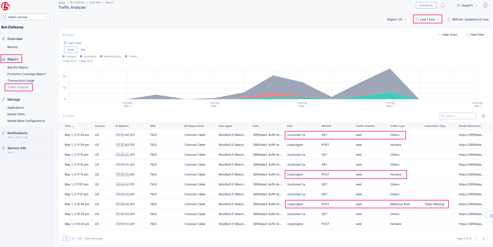

Lab 4: F5 Distributed Cloud Bot Defense connector for BIG-IP
============================================================

This lab will focus on the deployment of Bot Defense via a Bot Defense Connector on a BIG-IP.
You will use both the F5 Distributed Cloud Console and a BIG-IP in your lab deployment to complete
this lab.

Task 1: Define the protected application in F5 Distributed Cloud Bot Defense
~~~~~~~~~~~~~~~~~~~~~~~~~~~~~~~~~~~~~~~~~~~~~~~~~~~~~~~~~~~~~~~~~~~~~~~~~~~~

1. Login to your F5 Distributed Cloud tenant at https://f5-xc-lab-sec.console.ves.volterra.io/web/home.

2. From the Home page select the Bot Defense tile.

|lab001|

3. From the left-hand menu select **Manage >> Applications**. Then select the “\ **Add Application**\ ” button.

|lab002|

4. On the Protected Application screen do the following:

   a. Give the application a descriptive **Name** (like “f5airlines”)

   b. Leave the **Application Region** as “US”.

   c. Select “Custom” for the **Connector Type**.

   d. Click **Save and Exit**.

|lab003|

5. This will return you to the Applications screen. Click the ellipsis
   icon on the right of your newly defined application. Here you will
   find the ability to copy various values that are needed to configure
   the BIGIP connector.

|lab004|

Task 2: Configure F5 BIGIP Distributed Cloud Bot Defense connector profile
~~~~~~~~~~~~~~~~~~~~~~~~~~~~~~~~~~~~~~~~~~~~~~~~~~~~~~~~~~~~~~~~~~~~~~~~~~

1. Select the **Airline App** Access Method for your F5 BIGIP in your UDF deployment.

|lab017|

2. From this new browser tab, take note of the FQDN. You will need it
   when configuring the F5 Distributed Cloud Bot Defense profile later
   in this lab.

|lab005|

3. Access the TMUI of your BIGIP 17.1. Login credentials are **admin/f5xcdemo!**.

|lab016|

4. In the F5 BIGIP TMUI, browse to **Distributed Cloud Services > Bot  Defense > BD Profiles** and click the (+) icon to create a new Bot Defense profile.

|lab006|

5. On the **New BD Profile…** screen edit the following settings:

   **General Properties**

   a. Give the BD profile a descriptive **Name**.

   **API Request Settings**

   b. Paste into the **Application ID** field the value copied from F5 Distributed Cloud console.

   c. Paste into the **Tenant ID** field the value copied from F5 Distributed Cloud console.

   d. Paste into the **API Key** field the value copied from F5 Distributed Cloud console.

   |lab007|

   **JS Insertion Configuration**

   e. Select the check box to enable **Inject JS in Specific URL**.

   f. In the **JS Inject Included Paths**, enter **/user/signin** and click **Add**.

   **Protected Endpoint(s) – Web**

   g. For **Protected URIs**:

      i. In the **Host** field paste in the FQDN from the Airline App Access Method to you BIGIP.

      .. note::
         *See Exercise 1 step 8. FQDN for your Airline App will be similar to 3995dde2-4cf8-4c5b-89f2-2d0717d76d5b.access.udf.f5.com.*

      ii.  Enter **/user/signin** into the **Path** field.

      iii. Select **Block** from the **Mitigation Action** dropdown.

      iv.  Click **Add**.

      |lab008|

   **Advanced Features**

   h. Select the **Advanced** view from the section dropdown.

   i. From the **Protection Pool – Web** dropdown select the **ibd-webus.fastcache.net** pool.

   j. From the **SSL Profile** dropdown select the **serverssl** profile.

   |lab009|

   k. Choose **X-Forwarded-For** from the **Source of Client IP Address** dropdown.

   l. Click **Finished**.

The F5 Distributed Cloud Bot Defense connector profile is now
configured. However, in order to protect the application we must assign
the BD profile to the virtual server.

6. From the F5 BIGIP TMUI, browse to **Local Traffic >> Virtual Servers**. Select the **airline-backend.f5se.com** virtual server.

|lab010|

7. Select the **Distributed Cloud Services** tab at the top and then do the following:

   a. Set **Bot Defense** to **Enabled**.

   b. From the **Profile** dropdown, select the BD profile created in the previous step.

   c. Click **Update**.

|lab011|

Task 3: Test and Monitor Protected Traffic
~~~~~~~~~~~~~~~~~~~~~~~~~~~~~~~~~~~~~~~~~~

1. Select the **Airline App** Access Method for your F5 BIGIP in your UDF deployment

2. Select **Signin** in the top left to access the F5 AIR login page.
   This is the protected page configured in your F5 BIGIP Distributed
   Cloud Bot Defense Profile.

3. Enter any email address and password and click **Confirm** to submit a login attempt.

|lab012|

4. Try several login attempts with your browser.

5. You can generate “attack” traffic by opening your browser’s
   “Developer Tools”, selecting the Network tab, finding the POST
   request to the login page, right-clicking it, and choosing “Copy as
   cURL”.

|lab013|

You can then paste the copied request into a terminal/command prompt and hit **Enter**.

Repeat this several times to generate many requests.

6. Return to the **F5 Distributed Cloud** console and navigate to the **Bot Defense** service.

7. From the left-hand menu, select **Overview >>** **Monitor**. Change the time range to **Last 1 hour**.

|lab014|

Here you will see a high-level overview of the traffic to your Bot Defense protected applications.

8. From the left-hand menu, select **Report >> Traffic Analyzer**.

|lab015|

Here you can see the most recent requests associated with your
connector-protected applications, the Traffic Type, the Automation Type,
and additional detailed information about these requests.

9. Browse to the other sections under **Report** in the Bot Defense
   console; **Bad Bot Report**, **Protection Coverage Report**, **Transaction Usage**.

.. |lab001| image:: _static/lab4-image1.png
   :width: 6.5in
   :height: 4.91597in

.. |lab002| image:: _static/lab4-image2.png
   :width: 6.5in
   :height: 2.88264in

.. |lab003| image:: _static/lab4-image3.png
   :width: 6.5in
   :height: 3.99514in

.. |lab004| image:: _static/lab4-image4.png
   :width: 6.5in
   :height: 2.96181in

.. |lab005| image:: _static/lab4-image5.png
   :width: 6.5in
   :height: 3.57778in

.. |lab006| image:: _static/lab4-image6.png
   :width: 4.68476in
   :height: 5.54063in

.. |lab007| image:: _static/lab4-image7.png
   :width: 6.5in
   :height: 6.68194in

.. |lab008| image:: _static/lab4-image8.png
   :width: 6.5in
   :height: 3.70903in

.. |lab009| image:: _static/lab4-image9.png
   :width: 6.5in
   :height: 4.74792in

.. |lab010| image:: _static/lab4-image10.png
   :width: 6.5in
   :height: 2.74722in

.. |lab011| image:: _static/lab4-image11.png
   :width: 6.5in
   :height: 3.07083in

.. |lab012| image:: _static/lab4-image12.png
   :width: 5.87275in
   :height: 3.07943in

.. |lab013| image:: _static/lab4-image13.png
   :width: 5.99382in
   :height: 4.64393in

.. |lab014| image:: _static/lab4-image14.png
   :width: 6.5in
   :height: 4.46111in

.. |lab016| image:: _static/lab4-image16.png
   :width: 6.5in
   :height: 3.26667in
   
.. |lab017| image:: _static/lab4-image17.png
   :width: 6.5in
   :height: 3.26667in