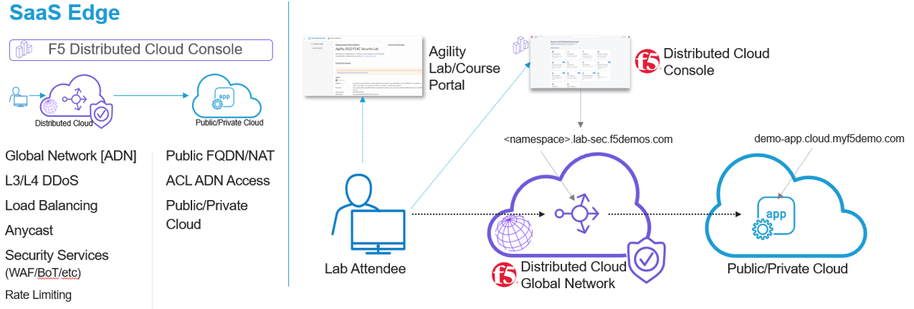
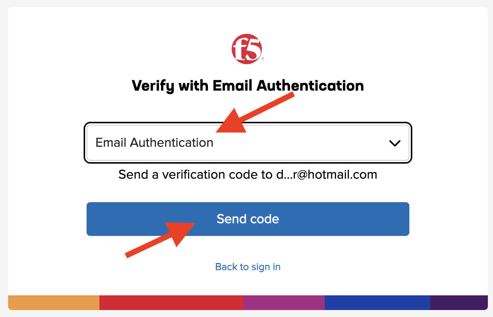
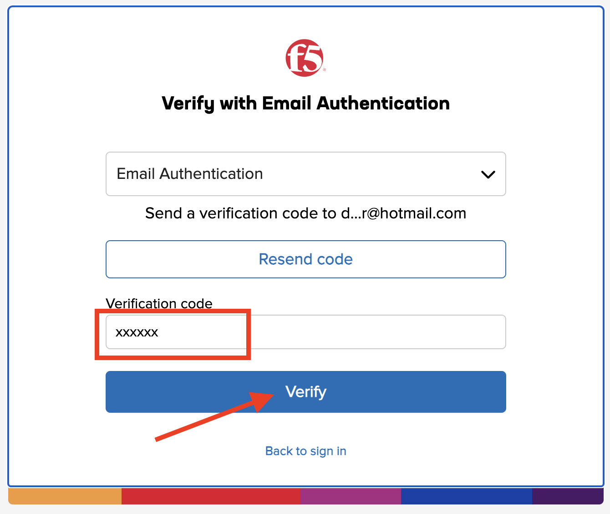
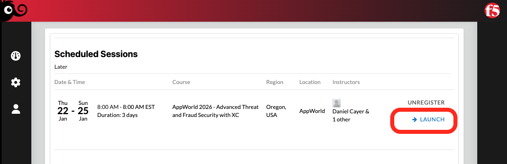
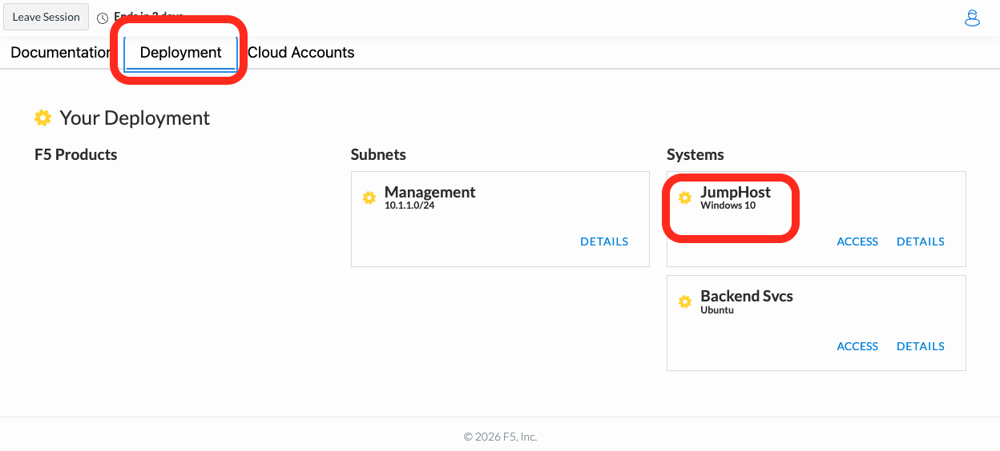
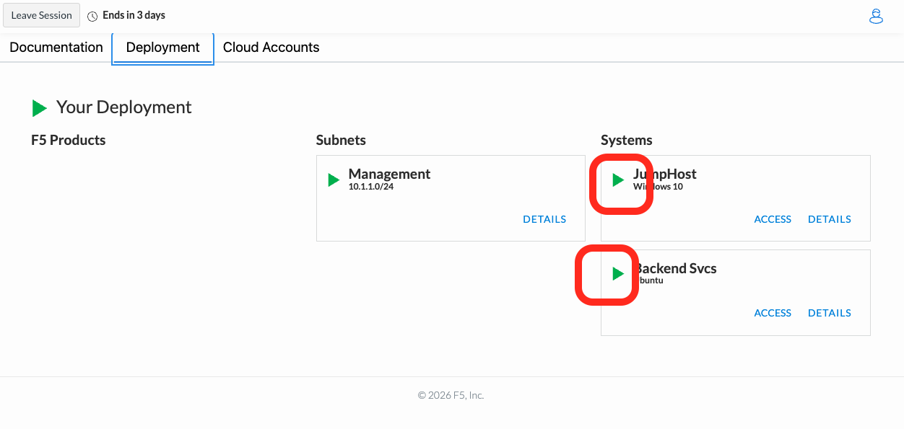
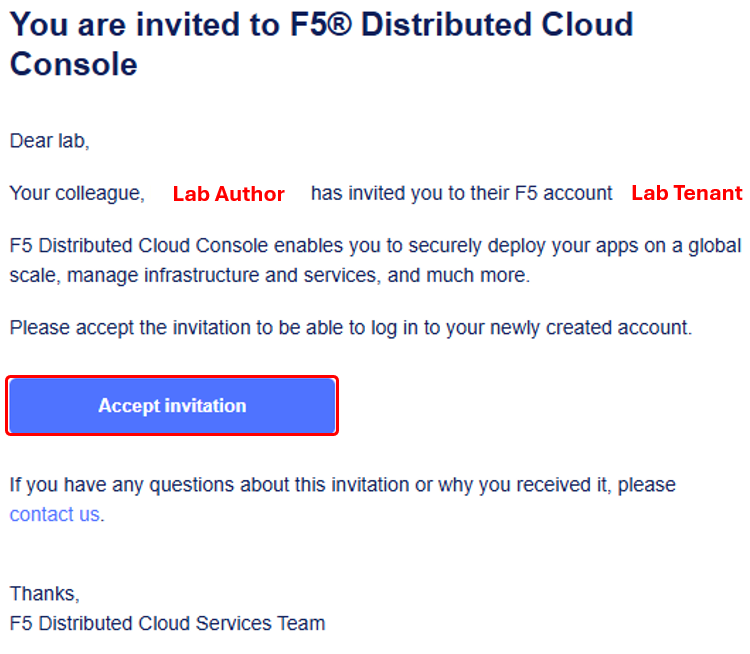
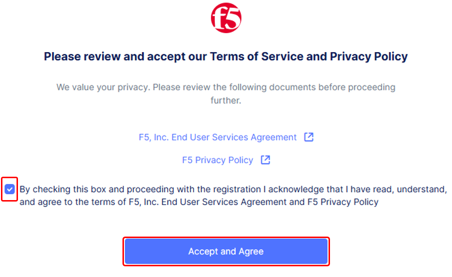
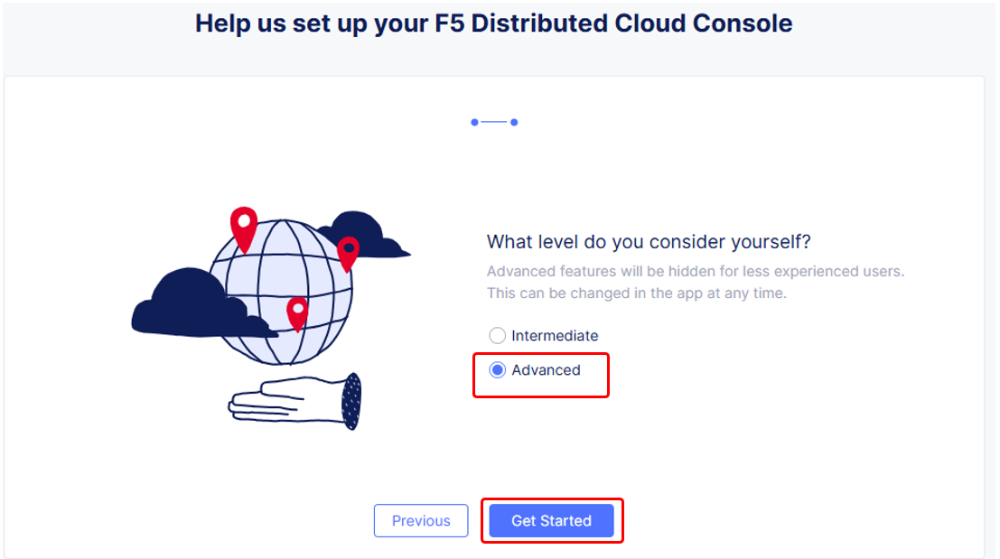
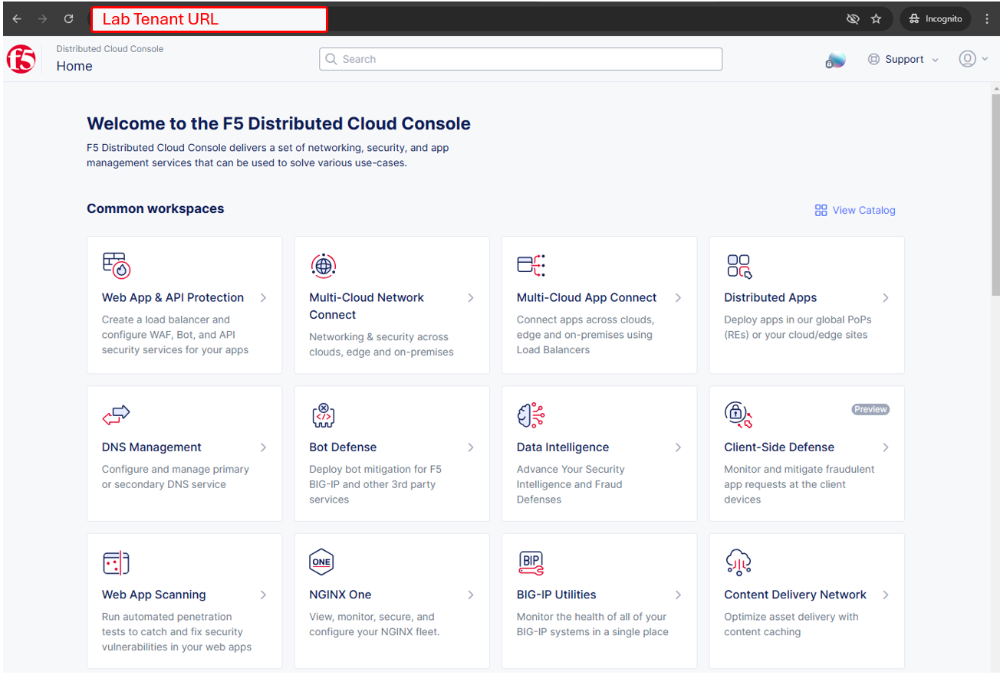

Introduction: Accessing F5 Distributed Cloud Console
====================================================

Welcome to this F5 Distributed Cloud Lab.

The following tasks will guide you through the initial 
access requirements for the associated lab environment.  Lab attendees should have received an 
invitation email to the lab environment based on the submitted registration email.  Please check 
email and spam folders if it has not been received.  If you have not received an email, please 
contact a member of the lab team.
 
F5 Distributed Cloud Console, where this lab will be conducted, is a SaaS control-plane for 
services that provides a UI and API for managing network, security, and compute services. The F5
Distributed Cloud Console can manage "sites" in existing on-premises data centers and sites in
AWS, Azure, and GCP cloud environments.

Task 1: Lab Environment
~~~~~~~~~~~~~~~~~~~~~~~

+----------------------------------------------------------------------------------------------+
| The image below represents an overview of the lab environment. F5 Distributed Cloud Services |
|                                                                                              |
| will be configured as a SaaS Edge delivery and security service tier to a publicly hosted web|
|                                                                                              |
| application. The key elements lab attendees will interact with are as follows:               |
|                                                                                              |
| * **F5 Distributed Cloud Console**                                                           |
| * **F5 Distributed Cloud Global Network / Application Delivery Network (ADN)**               |
| * **Publicly hosted application (Public Cloud)**                                             |
+----------------------------------------------------------------------------------------------+
| |intro000|                                                                                   |
+----------------------------------------------------------------------------------------------+

Course/Lab Invitation
~~~~~~~~~~~~~~~~~~~~~

+----------------------------------------------------------------------------------------------+
| Course/Lab Attendees will receive an email similar to the graphic displayed in this section. |
| The email will come from courses@notify.udf.f5.com.                                          |
|                                                                                              |
| As attendees maybe registered for several lab/courses, ensure the corrcetly identified course|
| is selected.  Use either the first or second link position (indicated by arrows) based on    |
| the attendee's F5 UDF (Unified Demo Framework) Account Status.                               |
|                                                                                              |
| #. **New UDF Users**                                                                         |
| #. **Returning UDF Users going directly to Course**                                          |
+----------------------------------------------------------------------------------------------+
| |intro001|                                                                                   |
+----------------------------------------------------------------------------------------------+

Accessing UDF (F5 Unified Demo Framework)
~~~~~~~~~~~~~~~~~~~~~~~~~~~~~~~~~~~~~~~~~

+----------------------------------------------------------------------------------------------+
| The following will guide attendees through the initial Lab environment access within F5 UDF. |
| Following the instructions from the Course/Lab invitation above, attendees will be prompted  |
| to login at  https://udf.f5.com                                                              |
|                                                                                              |
| .. note::                                                                                    |
|    *The steps for new UDF Users or the steps for resetting UDF User account passwords are*   |
|    *not shown.*                                                                              |
|                                                                                              |
|    *Please contact a member of the lab team if further assistance is needed.*                |
+----------------------------------------------------------------------------------------------+
| |intro002|                                                                                   |
+----------------------------------------------------------------------------------------------+

+----------------------------------------------------------------------------------------------+
| Attendees will be prompted to enter their email address, password and complete MFA as shown. |
| MFA must be completed by selecting one of the available options.                             |
|                                                                                              |
| .. note::                                                                                    |
|    *If you choose the email verification option as shown below, make sure you have access*   |
|    *to your UDF email account when starting this class*                                      |
|    *(to retrieve your one-time MFA verification code.)*                                      |
+----------------------------------------------------------------------------------------------+
| |intro003|                                                                                   |
|                                                                                              |
| |intro004|                                                                                   |
|                                                                                              |
| |intro003a|                                                                                  |
|                                                                                              |
| |intro003b|                                                                                  |
+----------------------------------------------------------------------------------------------+

+----------------------------------------------------------------------------------------------+
| Attendees will then be presented their scheduled course sessions. Locate the course/lab with |
| the appropriate **Date**, **Time** and **Name** and then click **Launch**.                   |
+----------------------------------------------------------------------------------------------+
| |intro006|                                                                                   |
+----------------------------------------------------------------------------------------------+

+----------------------------------------------------------------------------------------------+
| Once redirected to the selected Course/Lab, click the **Join** button.                       |
+----------------------------------------------------------------------------------------------+
| |intro007|                                                                                   |
+----------------------------------------------------------------------------------------------+

+----------------------------------------------------------------------------------------------+
| The Lab environment window will now be displayed.  Click on the **Documentation** tab in the |
| horizontal navigation links.  Locate and observe the state of **System**.                    |
|                                                                                              |
| .. note::                                                                                    |
|    *Your specific lab environment may vary from the graphics shown below. Your environment   |
|    might contain different systems.*                                                         |
+----------------------------------------------------------------------------------------------+
| |intro008|                                                                                   |
+----------------------------------------------------------------------------------------------+
| It will take at least 5 minutes for the systems to start. The **yellow gear** icons will     |
| change to **green arrow** icons. Wait for all systems to be running (green) before           |
| proceeding to the next section.                                                              |
+----------------------------------------------------------------------------------------------+
| |intro009|                                                                                   |
+----------------------------------------------------------------------------------------------+

Accessing F5 Distributed Cloud
~~~~~~~~~~~~~~~~~~~~~~~~~~~~~~

+----------------------------------------------------------------------------------------------+
| Shortly after joining the UDF course, attendees will receive a second email.                 |
| This email will come from no-reply@cloud.f5.com.                                             |
| Click the **Accept invitation** button within the email.                                     |
|                                                                                              |
| .. note::                                                                                    |
|    *This link should be accessed in the same browser session as UDF was accessed for*        |
|    *seamless experience.*                                                                    |
|                                                                                              |
| .. warning::                                                                                 |
|    *Attendess should not attempt access to F5 Distributed Cloud tenant prior to receiving*   |
|    *email. Lab permissions may need to be re-applied.*                                       |
+----------------------------------------------------------------------------------------------+
| |intro010|                                                                                   |
+----------------------------------------------------------------------------------------------+

+----------------------------------------------------------------------------------------------+
| The initial XC logon prompt will be presented. Click **Sign on with Okta** to continue.      |
| In the interest of time, SSO has been pre-configured and lab attendees will be automatically | 
| logged in (with their UDF credentials). Each student is assigned a new dedicated name-space  |
| that was pre-configured with various components.                                             |
+----------------------------------------------------------------------------------------------+
| |intro011|                                                                                   |
+----------------------------------------------------------------------------------------------+

+----------------------------------------------------------------------------------------------+
| Next the **Terms of Service and Privacy Policy** will display, check the box and then click  |
| **Accept and Agree**.                                                                        |
|                                                                                              |
| .. note::                                                                                    |
|    *Several Guidance ToolTips or Notices may appear.  Attendees can safely close these out*  |
|    *in order to begin the lab.*                                                              |
+----------------------------------------------------------------------------------------------+
| |intro012|                                                                                   |
+----------------------------------------------------------------------------------------------+
| In the following screen, select all persona roles and click **Next**. This allows attendees  |
| to see all the various configurations. Personas can be changed anytime later within the      |
| console if desired.                                                                          |
+----------------------------------------------------------------------------------------------+
| |intro013|                                                                                   |
+----------------------------------------------------------------------------------------------+
| In the next screen, click **Advanced** to expose more menu options and then **Get Started**  |
| to begin. You can change this setting after logging in as well.                              |
+----------------------------------------------------------------------------------------------+
| |intro014|                                                                                   |
+----------------------------------------------------------------------------------------------+

+----------------------------------------------------------------------------------------------+
| Attendees will now be presented the Home page of the F5 Distributed Cloud Console with all   |
| the workspaces, features and services available.                                             |
+----------------------------------------------------------------------------------------------+
| |intro015|                                                                                   |
+----------------------------------------------------------------------------------------------+

+----------------------------------------------------------------------------------------------+
| **Beginning of Lab:**  You are now ready to begin the lab, Enjoy! Ask questions as needed.   |
+----------------------------------------------------------------------------------------------+
| |labbgn|                                                                                     |
+----------------------------------------------------------------------------------------------+

.. |intro001| image:: _static/intro-01.png
   :width: 800px
.. |intro002| image:: _static/intro-02.png
   :width: 800px
.. |intro003| image:: _static/intro-03.png
   :width: 800px

.. |intro004| image:: _static/intro-04.png
   :width: 800px
.. |intro005| image:: _static/intro-05.png
   :width: 800px

.. |intro007| image:: _static/intro-07.png
   :width: 800px

.. |intro011| image:: _static/intro-11.png
   :width: 800px

.. |intro013| image:: _static/intro-13.png
   :width: 800px

