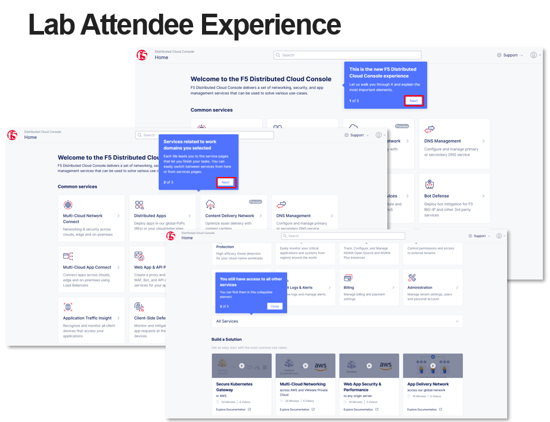

Introduction: Accessing F5 Distributed Cloud Console
====================================================

Welcome to this F5 Distributed Cloud Lab. The following tasks will guide you through the initial 
access requirements for this multi-part lab.  Lab attendees should have received an invitation 
email to the lab environment based on the submitted registration email.  Please check email and
spam folders if it has not been received.  If you have not received an email, please contact a 
member of the lab team.
 
F5 Distributed Cloud Console where this lab will be conducted, is a SaaS control-plane for 
services that provides a UI and API for managing network, security, and compute services. The F5
Distributed Cloud Console can manage "sites" in existing on-premises data centers and sites in
AWS, Azure, and GCP cloud environments.

Task 1: Lab Environment
~~~~~~~~~~~~~~~~~~~~~~~

+----------------------------------------------------------------------------------------------+
| The image below represents an overview of the lab environment. F5 Distributed Cloud Services |
|                                                                                              |
| will be configured as a SaaS Edge delivery and security service tier to a publicly hosted web|
|                                                                                              |
| application. Key elements lab attendees will interact with are as follows:                   |
|                                                                                              |
| * **F5 Distributed Cloud Console**                                                           |
| * **F5 Distributed Cloud Global Network / Application Delivery Network (ADN)**               |
| * **Publicly hosted application (Public Cloud)**                                             |
+----------------------------------------------------------------------------------------------+
| |intro001|                                                                                   |
+----------------------------------------------------------------------------------------------+

Task 2: F5 Distributed Cloud Console Login
~~~~~~~~~~~~~~~~~~~~~~~~~~~~~~~~~~~~~~~~~~

The following will guide you through the initial Lab environment access within the 
F5 Distributed Cloud Console.  You should have received an email with an invitation to 
access a F5 Distributed Cloud Tenant. The email will come from **no-reply@volterramails.io**.

The name of the F5 Distributed Cloud tenant that we will be using is **f5-xc-lab-sec**
Additionally, the following are important elements of this lab and will be used throughout the 
lab tasks that follow.

* F5 Distributed Cloud Console: **https://f5-xc-lab-sec.console.ves.volterra.io/**
* Delegated Domain: **lab-sec.f5demos.com**

After following the invitation email's to **Update Password**, proceed to the first step below. 

+----------------------------------------------------------------------------------------------+
| 1. Please log into F5 Distributed Cloud Lab Tenant with your user ID (email) and password.   |
|                                                                                              |
|    **https://f5-xc-lab-sec.console.ves.volterra.io/**                                        |
|                                                                                              |
| 2. When you first login, accept the Lab tenant EULA. Click the check box and the click       |
|                                                                                              |
|    **Accept and Agree**.                                                                     |
|                                                                                              |
| 3. Select all persona roles and click **Next** to see all the various configuration options. |
|                                                                                              |
|    Personas can be changed anytime if desired.                                               |
|                                                                                              |
| 4. Click **Advanced** to expose more menu options and the **Get Started** to begin. You can  |
|                                                                                              |
|    change this setting after logging in as well.                                             |
|                                                                                              |
| 5. Several **Guidance ToolTips** will appear, you can safely close these out.                |
+----------------------------------------------------------------------------------------------+
| |intro002|                                                                                   |
|                                                                                              |
| |intro003|                                                                                   |
|                                                                                              |
| |intro004|                                                                                   |
|                                                                                              |
| |intro005|                                                                                   |
+----------------------------------------------------------------------------------------------+

+----------------------------------------------------------------------------------------------+
| 6. You can identify your namespace (an environment for isolating configured applications) by |
|                                                                                              |
|    clicking on the **Account** icon in the top right of the screen and then clicking on      |
|                                                                                              |
|    **Account Settings**.                                                                     |
|                                                                                              |
| 7. Next click on **My Namespaces** in the left-hand navigation and take note of the          |
|                                                                                              |
|    **<adjective-animal>** namespace that you have been assigned. Each lab attendee will have |
|                                                                                              |
|    a unique namespace.                                                                       |
+----------------------------------------------------------------------------------------------+
| |intro006|                                                                                   |
|                                                                                              |
| |intro007|                                                                                   |
|                                                                                              |
| |intro008|                                                                                   |
+----------------------------------------------------------------------------------------------+

+----------------------------------------------------------------------------------------------+
| 8. Using the **Select Service** menu top left select **DNS Management**.                     |
|                                                                                              |
|    clicking on the **Account** icon in the top right of the screen and then clicking on      |
|                                                                                              |
| 9. Note the **Delegated Domain** for this lab environment. It has been also listed above in  |
|                                                                                              |
|    the Introduction summary for your convenience.                                            |
+----------------------------------------------------------------------------------------------+
| |intro009|                                                                                   |
|                                                                                              |
| |intro010|                                                                                   |
+----------------------------------------------------------------------------------------------+

+----------------------------------------------------------------------------------------------+
| **Beginning of Lab:**  You are now ready to begin the lab, Enjoy! Ask questions as needed.   |
+----------------------------------------------------------------------------------------------+
| |labbgn|                                                                                     |
+----------------------------------------------------------------------------------------------+

.. |intro001| image:: _static/intro-001.png
   :width: 800px
.. |intro002| image:: _static/intro-002.png
   :width: 800px
.. |intro003| image:: _static/intro-003.png
   :width: 800px
.. |intro004| image:: _static/intro-004.png
   :width: 800px

.. |intro007| image:: _static/intro-007.png
   :width: 800px

.. |intro010| image:: _static/intro-010.png
   :width: 800px
.. |labbgn| image:: _static/labbgn.png
   :width: 800px
