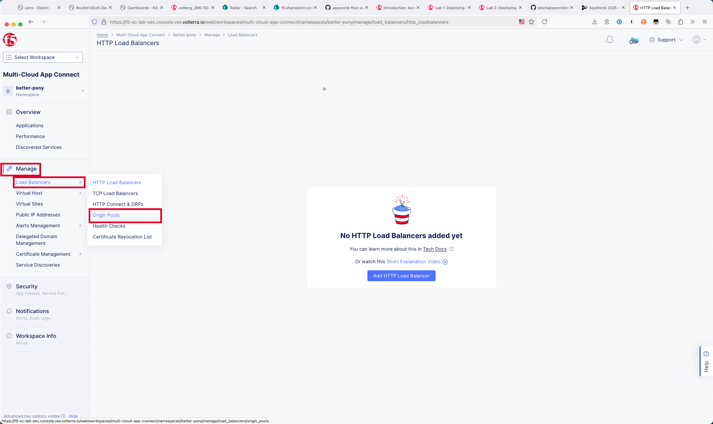
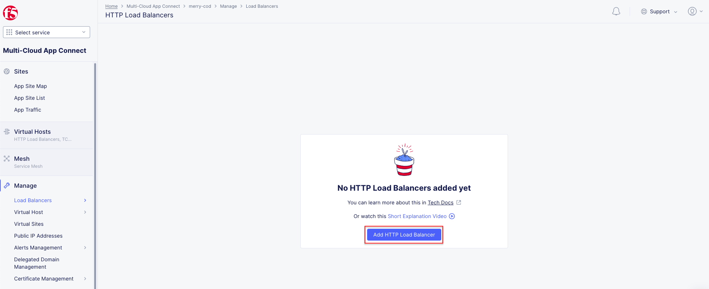
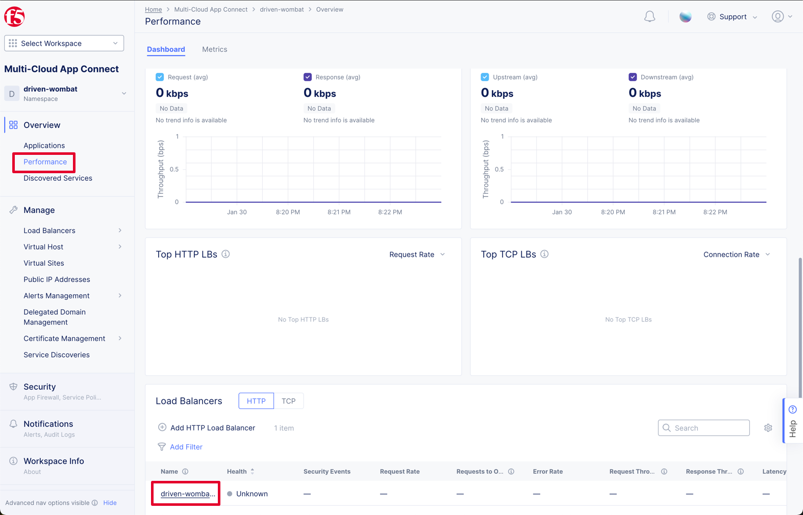
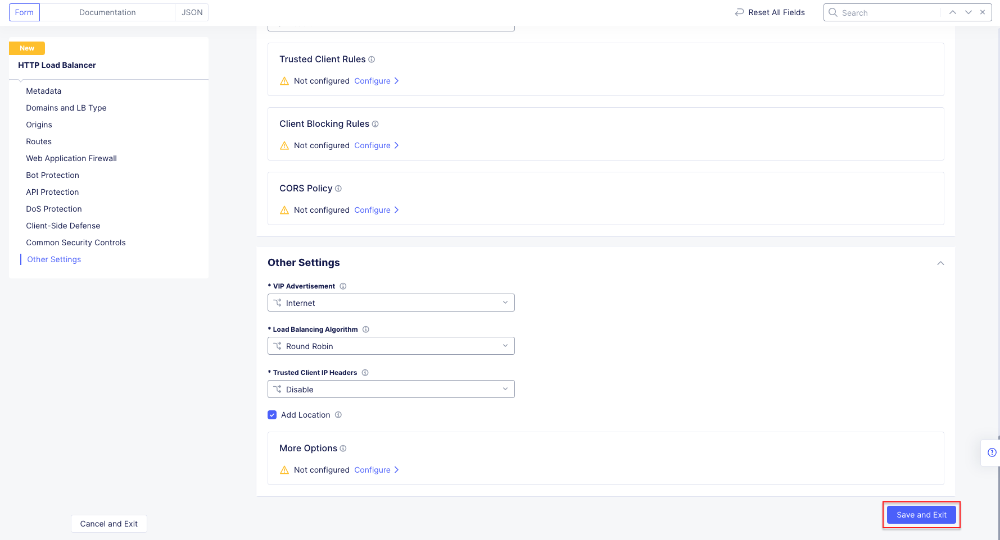
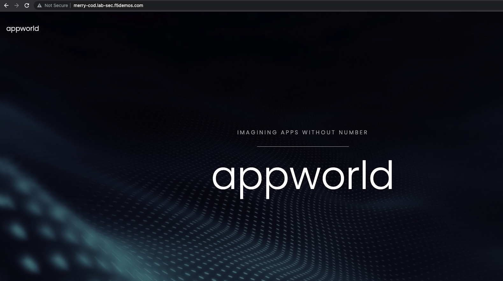
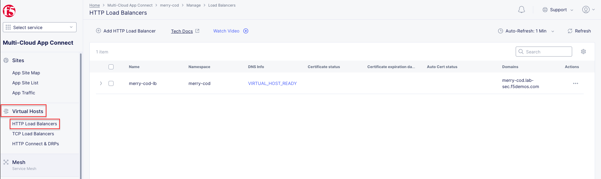
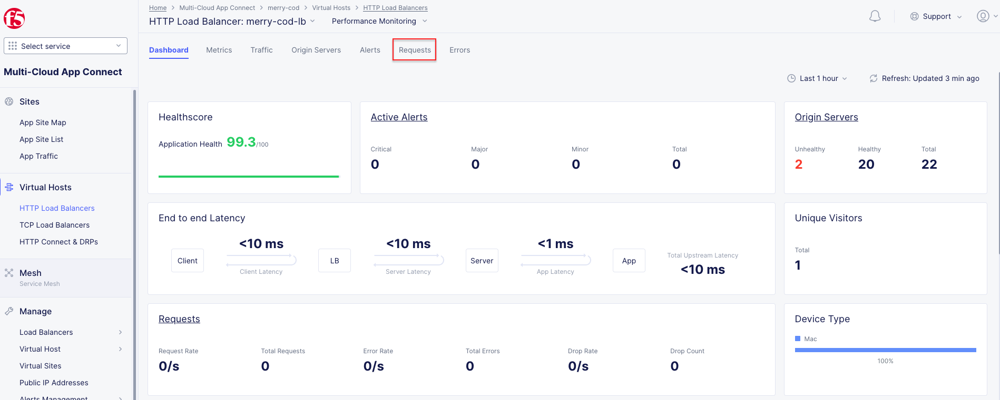

Lab 1: Deploying F5 Distributed Cloud Proxy Services to Securely Deliver a Public Endpoint
==========================================================================================

Lab 1 will focus on the deployment and security of an existing hosted application using F5 
Distributed Cloud Platform and Services.  This lab will be deployed in a SaaS only 
configuration with no on-premises (public or private cloud) elements.  All configuration
will be made via the F5 Distributed Cloud Console and within the F5 Distributed Cloud Global
Network services architecture.

For the tasks that follow, you should have already noted your individual **namespace**. If you
failed to note it, return to the **Introduction** section of this lab, follow the instructions
provided and note your **namespace** accordingly. The **Delegated Domain** and the F5 
Distributed Cloud **Tenant** are listed below for your convenience as they will be the same for
all lab attendees.

* **Delegated Domain:** *.lab-sec.f5demos.com* 
* **F5 Distributed Cloud Tenant:** https://f5-xc-lab-sec.console.ves.volterra.io 

Following the tasks in the prior **Introduction** Section, you should now be able to access the
F5 Distributed Cloud Console, having set your Work Domain Roles and Skill levels. If you have
not done so already, please login to your tenant for this lab and proceed to Task 1.

Task 1: Configure Load Balancer and Origin Pool
~~~~~~~~~~~~~~~~~~~~~~~~~~~~~~~~~~~~~~~~~~~~~~~

The following steps will allow you to deploy and advertise a globally available application.
These steps will create an origin pool, add a health monitor, define an application, register
its DNS, and advertise the application on the Internet using the F5 Distributed Cloud Global
Network.

+----------------------------------------------------------------------------------------------+
| 1. Following the **Introduction** section  instructions, you should now be in the **Load**   |
|                                                                                              |
|    **Balancers** configuration window. If for some reason you are not in the **Load**        |
|                                                                                              |
|    **Balancers** window, use the **Select Service** in the left-hand navigation, and click   |
|                                                                                              |
|    **Load Balancers** as shown in the *Introduction section, Task 2, Step 9*.                |
|                                                                                              |
| 2. In the left-hand navigation expand **Manage** and click **Load Balancers > Origin **      |
|                                                                                              |
|    **Pools**                                                                                 |
|                                                                                              |
| 3. In the resulting screen click the **Add Origin Pool** in the graphic as shown.            |
|                                                                                              |
| .. note::                                                                                    |
|    *You have defaulted to your specific namespace as that is the only namespace to which you*|
|                                                                                              |
|    *have administrative access.*                                                             |
+----------------------------------------------------------------------------------------------+
| |lab001|                                                                                     |
|                                                                                              |
| |lab002|                                                                                     |
+----------------------------------------------------------------------------------------------+

+----------------------------------------------------------------------------------------------+
| 4. In the resulting window, enter **<namespace>-pool** in the **Name** field and click       |
|                                                                                              |
|    **Add Item** under **Origin Servers**                                                     |
+----------------------------------------------------------------------------------------------+
| |lab003|                                                                                     |
+----------------------------------------------------------------------------------------------+

+----------------------------------------------------------------------------------------------+
| 5. In the resulting window, **Public DNS Name of Origin Server** should be selected for      |
|                                                                                              |
|    **Select Type of Origin Server**.                                                         |
|                                                                                              |
| 6. For **DNS Name** enter the following hostname:                                            |
|                                                                                              |
|    **demo-app.amer.myedgedemo.com** and then click **Apply**                                 |
+----------------------------------------------------------------------------------------------+
| |lab004|                                                                                     |
+----------------------------------------------------------------------------------------------+

+----------------------------------------------------------------------------------------------+
| 7. After returning to the prior window, make sure **Port:** under **Basic Configuration**    |
|                                                                                              |
|    is configured for **80**.                                                                 |
+----------------------------------------------------------------------------------------------+
| |lab005|                                                                                     |
+----------------------------------------------------------------------------------------------+

+----------------------------------------------------------------------------------------------+
| 8. In the **Health Checks**, click **Add Item**.                                             |
|                                                                                              |
| 9. From the Healt Check object dropdown select **Add Item**.                                 |
+----------------------------------------------------------------------------------------------+
| |lab006|                                                                                     |
+----------------------------------------------------------------------------------------------+

+----------------------------------------------------------------------------------------------+
| 10. In the resulting window enter **<namespace>-hc** in the **Name** field.                  |
|                                                                                              |
| 11. In the **Health Check Parameters** section click **View Configuration** under the        |
|                                                                                              |
|     **HTTP HealthCheck** section.                                                            |
+----------------------------------------------------------------------------------------------+
| |lab007|                                                                                     |
+----------------------------------------------------------------------------------------------+

+----------------------------------------------------------------------------------------------+
| 12. In the resulting window note the value of the **Path** parameter.                        |
|                                                                                              |
| 13. Also note the value of the **Expected Status Codes** parameter.                          |
|                                                                                              |
| 14. Click **Back** to retain the default settings.                                           |
|                                                                                              |
| .. note::                                                                                    |
|    *The default Health Check makes a request to the root path and expects a return code of*  |
|                                                                                              |
|    *200. These values can be modified to meet the requirements of the application.*          |
+----------------------------------------------------------------------------------------------+
| |lab008|                                                                                     |
+----------------------------------------------------------------------------------------------+

+----------------------------------------------------------------------------------------------+
| 15. After returning to the prior window, note the values of **Timeout(s)**, **Interval(s),   |
|                                                                                              |
|    **Unhealthy Threshold**, and **Healthy Threshold**.                                       |
|                                                                                              |
| 16. Click **Continue**.                                                                      |
+----------------------------------------------------------------------------------------------+
| |lab009|                                                                                     |
+----------------------------------------------------------------------------------------------+

+----------------------------------------------------------------------------------------------+
| 17. In the left-hand navigation expand **Manage** and click **Load Balancers > HTTP Load**   |
|                                                                                              |
|    **Balancers**                                                                             |
|                                                                                              |
| 18. In the resulting screen click the **Add HTTP Load Balancer** in the graphic as shown.    |
+----------------------------------------------------------------------------------------------+
| |lab010|                                                                                     |
|                                                                                              |
| |lab011|                                                                                     |
+----------------------------------------------------------------------------------------------+

+----------------------------------------------------------------------------------------------+
| 19. Using the left-hand navigation and in the sections as shown, enter the following         |
|                                                                                              |
|    data. Values where **<namespace>** is required, use the name of your given namespace.     |
|                                                                                              |
|    * **Metadata:Name ID:**  *<namespace>-lb*                                                 |
|    * **Basic Configuration: List of Domains:** *<namespace>.lab-sec.f5demos.com*             |
|    * **Basic Configuration: Select Type of Load Balancer:** *HTTP*                           |
|    * **Basic Configuration: Automatically Manage DNS Records:** *(Check the checkbox)*       |
|    * **Basic Configuration: HTTP Port:** *80*                                                |
+----------------------------------------------------------------------------------------------+
| |lab012|                                                                                     |
+----------------------------------------------------------------------------------------------+

+----------------------------------------------------------------------------------------------+
| 20. In the current window's left-hand navigation, click **Default Origin Servers**. Next,    |
|                                                                                              |
|    click **Add Item** within the **Origin Pools** section of **Origins**.                    |
+----------------------------------------------------------------------------------------------+
| |lab013|                                                                                     |
+----------------------------------------------------------------------------------------------+

+----------------------------------------------------------------------------------------------+
| 21. In the resulting window, verify **Origin Pool** is selected for **Select Origin Pool**   |
|                                                                                              |
|     **Method**.                                                                              |
|                                                                                              |
| 22. Select the **<namespace>/<namespace>-pool** from the **Origin Pool**  dropdown.          |
|                                                                                              |
| 23. Click **Apply**                                                                          |
+----------------------------------------------------------------------------------------------+
| |lab014|                                                                                     |
+----------------------------------------------------------------------------------------------+

+----------------------------------------------------------------------------------------------+
| 24. In the resulting **HTTP Load Balancer** window, scroll to the **Other Settings** section |
|                                                                                              |
|    and note the **VIP Advertisement** setting.                                               |
|                                                                                              |
| .. note::                                                                                    |
|    *The above selection controls how/where the application is advertised. The "Internet"*    |
|                                                                                              |
|    *setting means that this application will be advertised globally using the F5 Distributed*|
|                                                                                              |
|    *Cloud Global Network utilizing Anycast.*                                                 |
|                                                                                              |
| 10. Click **Save and Exit** at the bottom of the **HTTP Load Balancer** configuration screen.|
+----------------------------------------------------------------------------------------------+
| |lab015|                                                                                     |
+----------------------------------------------------------------------------------------------+

+----------------------------------------------------------------------------------------------+
| 10. In the **HTTP Load Balancers** window, note the application hostname under the           |
|                                                                                              |
|     **Domains** column *(This was done in Task1: Step 19)*.                                  |
|                                                                                              |
+----------------------------------------------------------------------------------------------+
| |lab016|                                                                                     |
+----------------------------------------------------------------------------------------------+

Task 2: Testing the Application and Viewing Telemetry Data
~~~~~~~~~~~~~~~~~~~~~~~~~~~~~~~~~~~~~~~~~~~~~~~~~~~~~~~~~~
The following steps will validate access to the application via web browser, review the Performance Monitoring dashboard, and gather request details.

+----------------------------------------------------------------------------------------------+
| 1. Open another tab in your browser (Chrome shown), navigate to the newly configured Load    |
|                                                                                              |
|    Balancer configuration: **http://<namespace>.lab-sec.f5demos.com**, to confirm it is      |
|                                                                                              |
|    functional.                                                                               |
|                                                                                              |
| 2. Navigate to the **HEADER** section under **Menu** to generate additional traffic.         |
+----------------------------------------------------------------------------------------------+
| |lab017|                                                                                     |
|                                                                                              |
| |lab018|                                                                                     |
+----------------------------------------------------------------------------------------------+

+----------------------------------------------------------------------------------------------+
| 3. Returning to the F5 Distributed Cloud Console, use the left-hand navigation to navigate   |
|                                                                                              |
|    to Load Balancer setion and expand **Virtual Hosts** > **HTTP Load Balancers** and then   |
|                                                                                              |
|    click on **Performance Monitoring** link provided for your respective load balancer.      |
|                                                                                              |
+----------------------------------------------------------------------------------------------+
| |lab019|                                                                                     |
+----------------------------------------------------------------------------------------------+

+----------------------------------------------------------------------------------------------+
| 4. Change the viewable time period from 5 minutes (default) to **1 hour** by selecting the   |
|                                                                                              |
|    dropdown shown, click **Last 1 hour** then clicking **Apply**.                            |
|                                                                                              |
| 5. Note the **End to end Latency** tile.  This shows the average latency for all requests to |
|                                                                                              |
|    this load balancer.                                                                       |
|                                                                                              |
| .. note::                                                                                    |
|    *As you have not run many requests, summary analytics may not be available in the*        |
|                                                                                              |
|    *dashboard view yet.*                                                                     |
+----------------------------------------------------------------------------------------------+
| |lab020|                                                                                     |
|                                                                                              |
| |lab021|                                                                                     |
+----------------------------------------------------------------------------------------------+

+----------------------------------------------------------------------------------------------+
| 6. Click the **Requests** link to see detailed information about individual requests.        |
|                                                                                              |
| 7. Note the **Chart** shows a graphical representation of all of the response codes for the  |
|                                                                                              |
|    selected time frame.                                                                      |
|                                                                                              |
| .. note::                                                                                    |
|    *This data can be filtered to quickly narrow in on points of interest.*                   |
+----------------------------------------------------------------------------------------------+
| |lab022|                                                                                     |
+----------------------------------------------------------------------------------------------+

+----------------------------------------------------------------------------------------------+
| 8. Click the **Hide Chart** link to free up space in the browser window.                     |
|                                                                                              |
| 9. Expand one of the individual requests to view additional details about that request.      |
|                                                                                              |
| 10. Note the **Duration** section.  This shows the latency for this specific request.  These |
|                                                                                              |
|     values can be compared to the average latency data noted in step 5.                      |
+----------------------------------------------------------------------------------------------+
| |lab023|                                                                                     |
|                                                                                              |
| |lab024|                                                                                     |
+----------------------------------------------------------------------------------------------+

Task 3: Configure an Application Firewall Policy to Protect the Application
~~~~~~~~~~~~~~~~~~~~~~~~~~~~~~~~~~~~~~~~~~~~~~~~~~~~~~~~~~~~~~~~~~~~~~~~~~~

The following steps will guide you through adding a Web Application Firewall (WAF) Policy.

These steps will create a WAF Policy and apply the WAF policy to the load balancer created in 

Task 1.

+----------------------------------------------------------------------------------------------+
| 1. Following **Task 2**, you should now be in the **Load Balancers** configuration window.   |
|                                                                                              |
|    If for some reason you are not in the **Load Balancers** window, use the **Select**       |
|                                                                                              |
|    **Service** in the left-hand navigation, and click **Load Balancers** as shown in the     |
|                                                                                              |
|    *Introduction section, Task 2, Step 9*.                                                   |
|                                                                                              |
| 2. In the left-hand navigation expand **Security** and click **App Firewall**.               |
|                                                                                              |
| 3. On the resulting page click **Add App Firewall**                                          | 
+----------------------------------------------------------------------------------------------+
| |lab025|                                                                                     |
|                                                                                              |
| |lab026|                                                                                     |
+----------------------------------------------------------------------------------------------+

+----------------------------------------------------------------------------------------------+
| 4. In the resulting window's **Metadata** section enter **<namespace>-appfw** for the        |
|                                                                                              |
|    **Name**.                                                                                 |
|                                                                                              |
| 5. Under **Enforcement Mode**, change the mode to **Blocking**.                              |
|                                                                                              |
| 6. Leaving all other values as default, scroll to the bottom and click **Save and Exit**.    |
+----------------------------------------------------------------------------------------------+
| |lab027|                                                                                     |
|                                                                                              |
| |lab028|                                                                                     |
+----------------------------------------------------------------------------------------------+

+----------------------------------------------------------------------------------------------+
| 7. In the left-hand navigation expand **Manage** and click **Load Balancers > HTTP **        |
|                                                                                              |
|    **Load Balancers**                                                                        |
|                                                                                              |
| 8. On the resulting page find the HTTP Load Balancer created in **Task 1**                   |
|                                                                                              |
|    *(<namespace>-lb)*.  Click the ellipsis under Actions and select **Manage Configuration**.|
+----------------------------------------------------------------------------------------------+
| |lab029|                                                                                     |
|                                                                                              |
| |lab030|                                                                                     |
+----------------------------------------------------------------------------------------------+

+----------------------------------------------------------------------------------------------+
| 9. On the resulting page click **Edit Configuration**.                                       |
|                                                                                              |
| 10. Click **Web Application Firewall** in the left-hand navigation.                          |  
+----------------------------------------------------------------------------------------------+
| |lab031|                                                                                     |
|                                                                                              |
| |lab032|                                                                                     |
+----------------------------------------------------------------------------------------------+

+----------------------------------------------------------------------------------------------+
| 11. Under the **Web Application Firewall** section select **Enable** from the **Web**
|                                                                                              |
|     **Application Firewall (WAF)** dropdown.                                                 |
|                                                                                              |
| 12. Select the Web Application Firewall name that you created in *Steps 1-6* of this task    |
|                                                                                              |
|     *(<namespace>-appfw)* from the **Enable** dropdown.                                      |
|                                                                                              |
| 13. Scroll to the bottom of the page and click **Save and Exit**                             |
+----------------------------------------------------------------------------------------------+
| |lab033|                                                                                     |
|                                                                                              |
| |lab034|                                                                                     |
+----------------------------------------------------------------------------------------------+

Task 4. Test the Application Firewall and View Security Events
~~~~~~~~~~~~~~~~~~~~~~~~~~~~~~~~~~~~~~~~~~~~~~~~~~~~~~~~~~~~~~

+----------------------------------------------------------------------------------------------+
| 1. Open another tab in your browser (Chrome shown), navigate to the newly configured Load    |
|                                                                                              |
|    Balancer configuration: **http://<namespace>.lab-sec.f5demos.com**, to confirm it is      |
|                                                                                              |
|    functional.                                                                               |
|                                                                                              |
| 2. Using some of the sample attacks below, add the URI path & variables to your application  |
|                                                                                              |
|    to generate security event data.                                                          |
|                                                                                              |
|    * /?cmd=cat%20/etc/passwd                                                                 |
|    * /product?id=4%20OR%201=1                                                                |
|    * /../../../../etc/shadow                                                                 |
|    * /cart?search=aaa'>                |
+----------------------------------------------------------------------------------------------+
| |lab035|                                                                                     |
|                                                                                              |
| |lab036|                                                                                     |
|                                                                                              |
| |lab037|                                                                                     |
+----------------------------------------------------------------------------------------------+

+----------------------------------------------------------------------------------------------+
| 3. Returning to the F5 Distributed Cloud Console, use the left-hand navigation to navigate   |
|                                                                                              |
|    to Load Balancer setion and expand **Virtual Hosts** > **HTTP Load Balancers** and then   |
|                                                                                              |
|    click on **Security Monitoring** link provided for your respective load balancer.         |
|                                                                                              |
| .. note::                                                                                    |
|    *As you have not run many requests, summary analytics may not be available in the*        |
|                                                                                              |
|    *dashboard view yet.*                                                                     |
+----------------------------------------------------------------------------------------------+
| |lab027|                                                                                     |
+----------------------------------------------------------------------------------------------+

+----------------------------------------------------------------------------------------------+
| 4. From the **Dashboard** view, using the horizontal navigation, click **Security Events**.  |
|                                                                                              |
| 5. Expand your latest security event as shown.                                               |
|                                                                                              |
| .. note::                                                                                    |
|    *If you lost your 1 Hour Filter, re-apply using Task 2: Step 4*                           |
+----------------------------------------------------------------------------------------------+
| |lab032|                                                                                     |
|                                                                                              |
| |lab033|                                                                                     |
+----------------------------------------------------------------------------------------------+

+----------------------------------------------------------------------------------------------+
| 6. Note the summary detail provided **Information** link and identify the **Request ID**     |
|                                                                                              |
|    which is synonymous with **Support ID** (filterable) from the Security Event Block Page.  |
|                                                                                              |
| 7. Scroll to the bottom of the information screen to see specific signatures detected and    |
|                                                                                              |
|    actions taken during the security event.                                                  |
|                                                                                              |
| .. note::                                                                                    |
|    *Similar to a Request, Security Events also have additional detail in JSON format.*       |
+----------------------------------------------------------------------------------------------+
| |lab034|                                                                                     |
|                                                                                              |
| |lab035|                                                                                     |
+----------------------------------------------------------------------------------------------+

+----------------------------------------------------------------------------------------------+
| **End of Lab 1:**  This concludes Lab 1.  In this lab you created an origin pool to connect  |
|                                                                                              |
| to the application, you then created a load balancer and associated the origin pool to the   |
|                                                                                              |
| load balancer.  This allowed the application to be advertised via the F5 Distributed Cloud   |
|                                                                                              |
| Global Network.  The Distributed Cloud Console was then used to review telemetry data        |
|                                                                                              |
| gathered for the application.  Next an Application Firewall policy was created and assigned  |
|                                                                                              |
| to protect the application.  Finally a sample attack was run against the application and the |
|                                                                                              |
| security event data was reviewed within the Distributed Cloud Console.                       |
|                                                                                              |
| A brief presentation will be shared prior to the beginning of Lab 2.                         |
+----------------------------------------------------------------------------------------------+
| |labend|                                                                                     |
+----------------------------------------------------------------------------------------------+

.. |lab002| image:: _static/lab1-002.png
   :width: 800px
.. |lab003| image:: _static/lab1-003.png
   :width: 800px

.. |lab006| image:: _static/lab1-006.png
   :width: 800px
.. |lab007| image:: _static/lab1-007.png
   :width: 800px
.. |lab008| image:: _static/lab1-008.png
   :width: 800px
.. |lab009| image:: _static/lab1-009.png
   :width: 800px
.. |lab010| image:: _static/lab1-010.png
   :width: 800px
.. |lab012| image:: _static/lab1-012.png
   :width: 800px

.. |lab014| image:: _static/lab1-014.png
   :width: 800px
.. |lab015| image:: _static/lab1-015.png
   :width: 800px

.. |lab018| image:: _static/lab1-018.png
   :width: 800px

.. |lab020| image:: _static/lab1-020.png
   :width: 800px

.. |lab022| image:: _static/lab1-022.png
   :width: 800px
.. |lab023| image:: _static/lab1-023.png
   :width: 800px
.. |lab024| image:: _static/lab1-024.png
   :width: 800px
