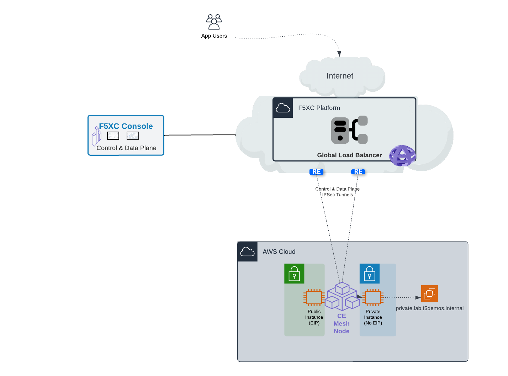
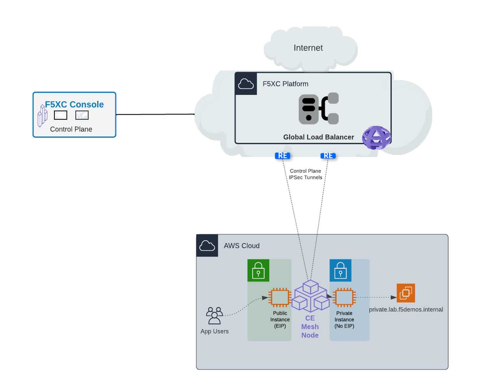
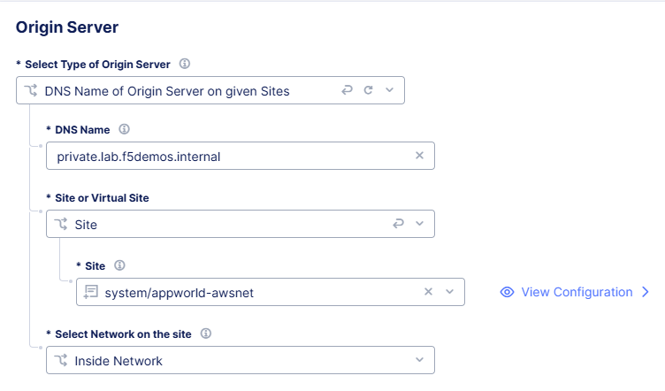
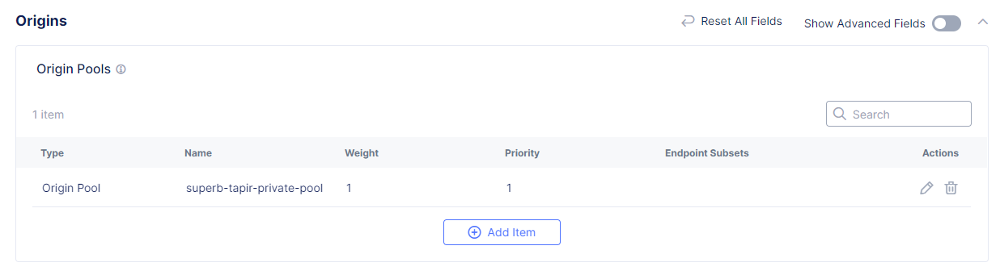
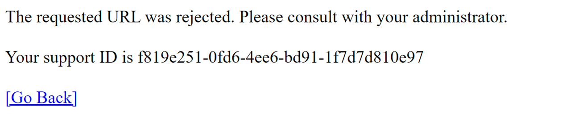
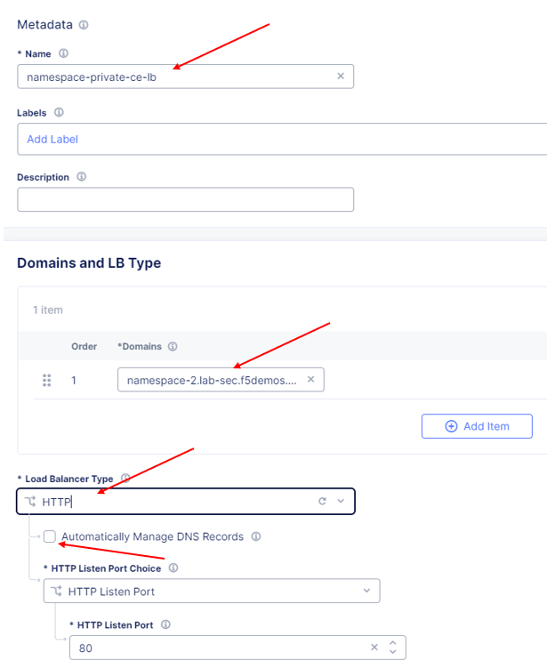
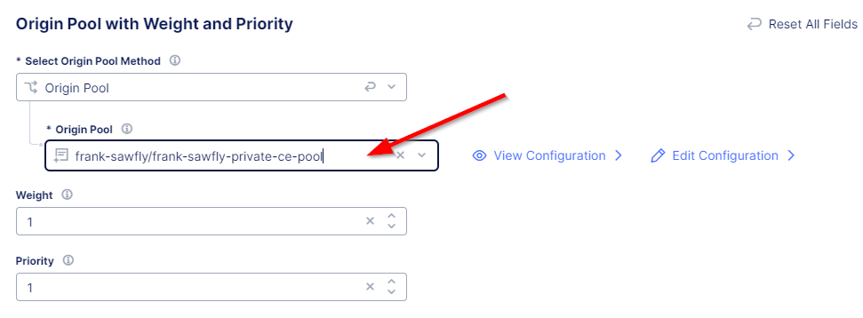

Lab 2: Deploying F5 Distributed Cloud Proxy Services to Securely Deliver a Private Endpoint via Regional Edges
====================================

Your company is about to launch a new application that resides in a public cloud environment.  To avoid having to learn 
yet another public cloud environment for publishing an application, you will use F5 Distributed Cloud for publishing the 
application.  You can do that by deploying a CE node in your public cloud environment, which will allow the data plane to 
run in that environment while having the configuration and observability of the Distributed Cloud console.  In this lab, 
you will configure the deployment in Distributed Cloud where application traffic will pass through Distributed Cloud to 
your application running in the public cloud.  You will use a CE node that has already been deployed in the public cloud
environment. In this example, the application does not have Internet connectivity via the public cloud.

Your design includes the following workflow **Client -> RE -> CE -> Protected application resource**.  Let's get started!

Task 1. Create Private Origin Pool
----------------------------------

In Lab #1 we created an origin pool that was accessible via the Public Internet.
This lab exercise will create an origin pool that is not accessible via the Public Internet; in this case the application is local to the deployed
CE node in the public cloud. The only way the application can be accessed is via the RE nodes of Distributed Cloud.

First, you will create an Origin Pool that refers to the "Private Endpoint" site in our lab environment.

+------------------------------------------------------------------------------------------------------------+
|| 1. Start in F5 Distributed Cloud Console and switch back to the **Multi-Cloud App Connect** workspace.    |
||                                                                                                           |
|| 2. Navigate the menu to go to **Manage->Load Balancers->Origin Pools**. Click on **Add Origin Pool**.     |
||                                                                                                           |
|| 3. Enter the following variables:                                                                         |
||                                                                                                           |
+------------------------------------------------------------------------------------------------------------+
|                                                                                                            |
|   ================================= =======                                                                |
|   *Variable*                        *Value*                                                                |
|   ================================= =======                                                                |
|   Name                              **[NAMESPACE]-private-ce-pool**                                        |
|   ================================= =======                                                                |
|                                                                                                            |
+------------------------------------------------------------------------------------------------------------+
||                                                                                                           |
|| 4. Click on **Add Item** under the **Origin Servers**.                                                    |
||                                                                                                           |
+------------------------------------------------------------------------------------------------------------+
|                                                                                                            |
|   ================================= =======                                                                |
|   *Variable*                        *Value*                                                                |
|   ================================= =======                                                                |
|   Select Type of Origin Server      **DNS Name of Origin Server on given Sites**                           |
|   DNS Name                          **private.lab.f5demos.internal**                                       |
|   Site                              **system/appworld-awsnet**                                             |
|   Select Network on the Site        **Inside Network**                                                     |
|   ================================= =======                                                                |
+------------------------------------------------------------------------------------------------------------+   
|                                                                                                            |
| |lab301|                                                                                                   | 
|                                                                                                            |
||                                                                                                           |
|| 5. Click on **Apply** to return to the previous screen.                                                   |
||                                                                                                           |
|| 6. Below the **Origin Servers** section fill in the Origin Server Port information.                       |     
||                                                                                                           |
+------------------------------------------------------------------------------------------------------------+
|                                                                                                            |
|                                                                                                            |
|   ================================= ========                                                               |
|   *Variable*                        *Value*                                                                |
|   ================================= ========                                                               |
|   Port                              **8080**                                                               |
|   ================================= ========                                                               |
|                                                                                                            |
+------------------------------------------------------------------------------------------------------------+   
||                                                                                                           |
|| 7. Click **Save and Exit**                                                                                |
||                                                                                                           |
+------------------------------------------------------------------------------------------------------------+

Task 2. Create and Deploy a HTTP Load Balancer on F5 Distributed Cloud CE 
---------------------------------------------------------------------------

In the first lab we were connecting to a F5 Distributed Cloud Load Balancer that was deployed in a RE.
Now we will deploy a Load Balancer on the CE node that was deployed in the AWS VPC (CE location).

+-----------------------------------------------------------------------------------------------------------------------------------+
|| 1. Start in F5 Distributed Cloud Console and switch back to the **Multi-Cloud App Connect** context.                             |
||                                                                                                                                  |
|| 2. Navigate the menu to go to **Manage->Load Balancers-> HTTP Load Balancers**.  Click on **Add HTTP Load Balancer**.            |
||                                                                                                                                  |
|| 3. Enter the following variables:                                                                                                |
||                                                                                                                                  |
+-----------------------------------------------------------------------------------------------------------------------------------+
|                                                                                                                                   |
|                                                                                                                                   |
|   ================================= =======                                                                                       |
|   *Variable*                        *Value*                                                                                       |
|   ================================= =======                                                                                       |
|   Name                              **[NAMESPACE]-private-ce-lb**                                                                 |
|   Domains                           **[NAMESPACE]-2.lab-sec.f5demos.com**                                                         |
|   Select type of Load Balancer      **HTTP**                                                                                      |
|   Automatically Manage DNS Records  **No/Unchecked**                                                                              |
|   ================================= =======                                                                                       |
|                                                                                                                                   |
+-----------------------------------------------------------------------------------------------------------------------------------+                                                                                       
|                                                                                                                                   |
|  |lab311|                                                                                                                         |
||                                                                                                                                  |
|| 4. Under **Origin Pools** Click **Add Item**.                                                                                    |
||                                                                                                                                  |
|  |lab302|                                                                                                                         |
||                                                                                                                                  |
|| 5. Select the recently created **[NAMESPACE]-private-ce-pool** under Origin pool and then click **Apply**.                       |
||                                                                                                                                  |
|  |lab314|                                                                                                                         |
||                                                                                                                                  |
|| 6. Now you can see your Origin Pool has been added to the HTTP load balancer configuration.                                      |
||                                                                                                                                  |
|  |lab304|                                                                                                                         |
||                                                                                                                                  |
|| 7. Now we want to confirm how this Load Balancer is advertised, we will select the **Other Settings** on the left hand side.     |
||    This will auto-scroll the configuation towards the bottom of the Load Balancer configuration section labeled                  |
||    **Other Settings**.                                                                                                           |
||                                                                                                                                  |
|| 8. Under **VIP Advertisement** Confirm it is set to **Internet**. This will allow *XC* to advertise the Virtual IP address.      |
||                                                                                                                                  |
|| |lab305|                                                                                                                         |
||                                                                                                                                  |
||                                                                                                                                  |
|                                                                                                                                   |       
+-----------------------------------------------------------------------------------------------------------------------------------+

Task 3: Configure WAF Policy
----------------------------
Now that we have our load balancer and orign server configured we want to make sure we are protecting the origin server.  Here you
can easily applying a pre-existing shared WAF policy to our load balancer.  The shared WAF policy is available for all namespaces
under this tenant.

+-----------------------------------------------------------------------------------------------------------------------------------+
|| 1. Under the **Web Application Firewall** section.                                                                               |
||                                                                                                                                  |
|| 2. Choose the following options:                                                                                                 |
||                                                                                                                                  | 
+-----------------------------------------------------------------------------------------------------------------------------------+
|                                                                                                                                   |
|   =============================== =================================                                                               |
|   *Variable*                      *Value*                                                                                         |
|   =============================== =================================                                                               |
|   Web Application Firewall (WAF)  **Enable**                                                                                      |
|   Select App Firewall             **shared/base-appfw**                                                                           |
|   =============================== =================================                                                               |
|                                                                                                                                   |
+-----------------------------------------------------------------------------------------------------------------------------------+
||                                                                                                                                  |
|| 3.  Scroll to the botton of the screen and click **Save and Exit** to create the HTTP Load Balancer.                             |
||                                                                                                                                  |
||                                                                                                                                  |
+-----------------------------------------------------------------------------------------------------------------------------------+

Task 4: Verify Configuration
-----------------------------

You should now be able to go to the DNS name that you created in this Load Balancer configuration.  
The FQDN we used in our example is http://[NAMESPACE]-2.lab-sec.f5demos.com/.  

+-----------------------------------------------------------------------------------------------------------------------------------+
||  The private demo app should look like the following:                                                                            |
||                                                                                                                                  |
|  |lab312|                                                                                                                         |
|                                                                                                                                   |
|                                                                                                                                   |
+-----------------------------------------------------------------------------------------------------------------------------------+

Task 5: Verify WAF Protection
------------------------------

In this topology we are sending traffic to the application via the public IP advertised on *XC*, which then sends to the application
in AWS via the connection to the CE node in AWS.

+-----------------------------------------------------------------------------------------------------------------------------------+
|                                                                                                                                   |
| Using some of the sample attacks below, add the URI path & variables to your application to generate                              |
| security event data.                                                                                                              |
|                                                                                                                                   |
|    * /?cmd=cat%20/etc/passwd                                                                                                      |
|    * /product?id=4%20OR%201=1                                                                                                     |
|    * /cart?search=aaa'>                                                     |
|                                                                                                                                   |
| Just like in Lab 1, you should see a block page when adding the attacks to the URL.                                               |
|                                                                                                                                   |
|   |lab313|                                                                                                                        |                                      
|                                                                                                                                   |
+-----------------------------------------------------------------------------------------------------------------------------------+

+-----------------------------------------------------------------------------------------------------------------------------------+
| **End of Lab 2**.  In this lab you configured a global load balancer with a WAF policy on a CE node running in AWS for a          |
| private end point. That private end point was only accessible via the global load balancer.                                       |
+-----------------------------------------------------------------------------------------------------------------------------------+
|  |labend|                                                                                                                         |
+-----------------------------------------------------------------------------------------------------------------------------------+

.. |lab302| image:: _static/lab3-appworld2025-task2-lb-add-origin-pool.png
   :width: 800px
.. |lab303| image:: _static/lab3-appworld2025-task2-lb-add-origin-pool2.png
   :width: 800px

.. |lab305| image:: _static/lab3-appworld2025-task2-lb-other-settings.png
   :width: 800px
.. |lab306| image:: _static/lab3-appworld2025-task2-lb-change-vip-advertisement.png
   :width: 800px
.. |lab307| image:: _static/lab3-appworld2025-list-sites-advertise.png
   :width: 800px
.. |lab308| image:: _static/lab3-appworld2025-task2-lb-site-change.png
   :width: 800px
.. |lab309| image:: _static/screenshot-global-vip-private.png
   :width: 800px

.. |lab312| image:: _static/screenshot-global-vip-private.png
   :width: 800px 

.. |labend| image:: _static/labend.png
   :width: 800px
