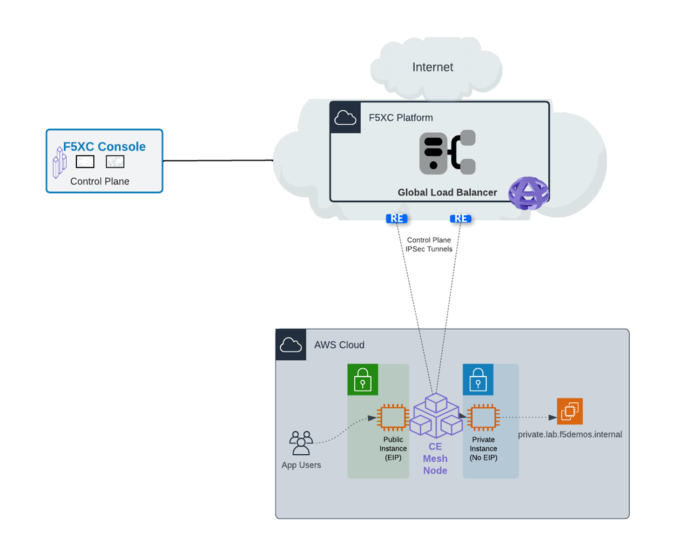
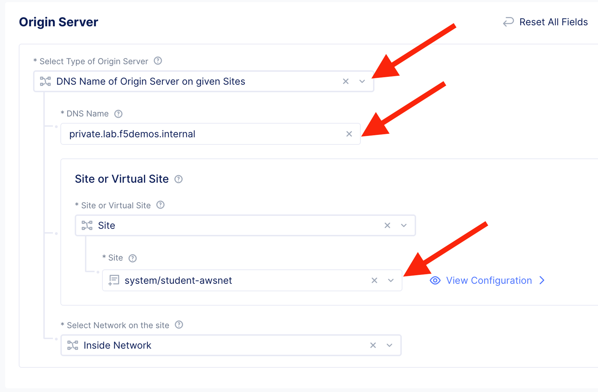
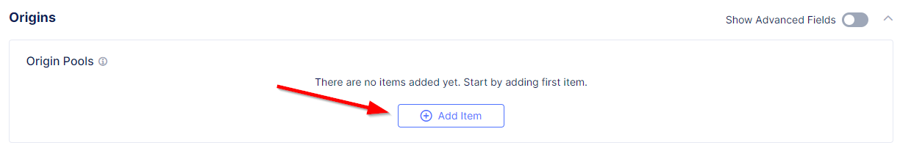
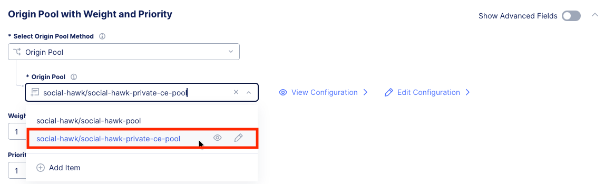
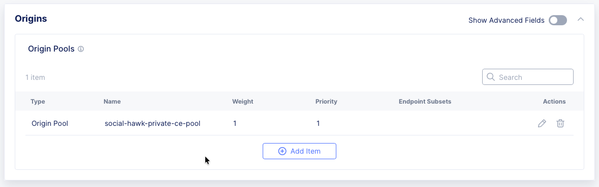
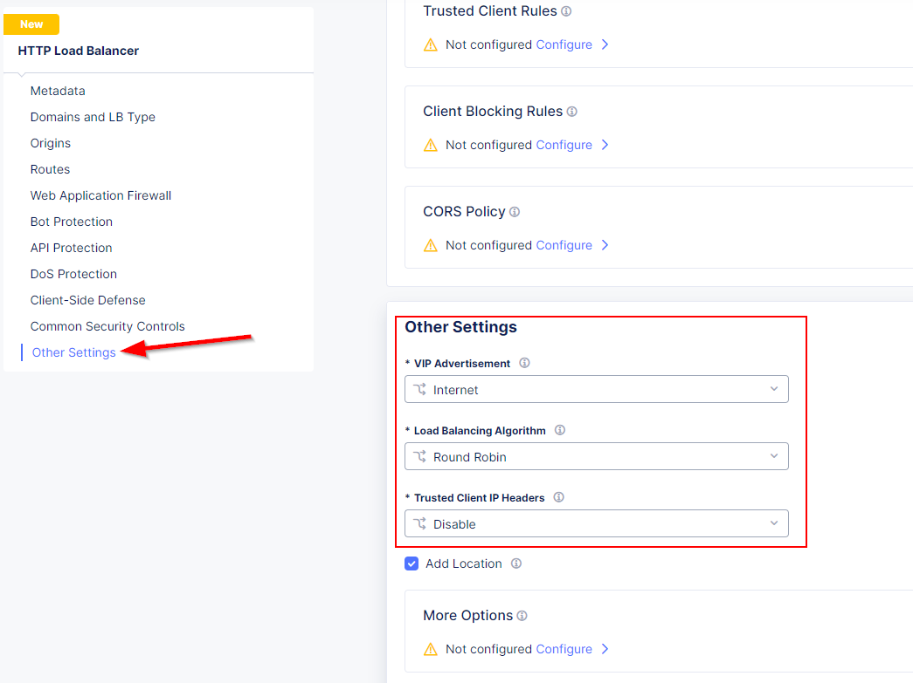
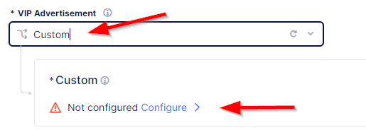
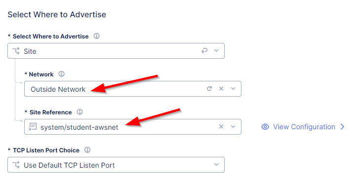
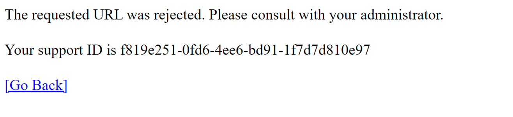
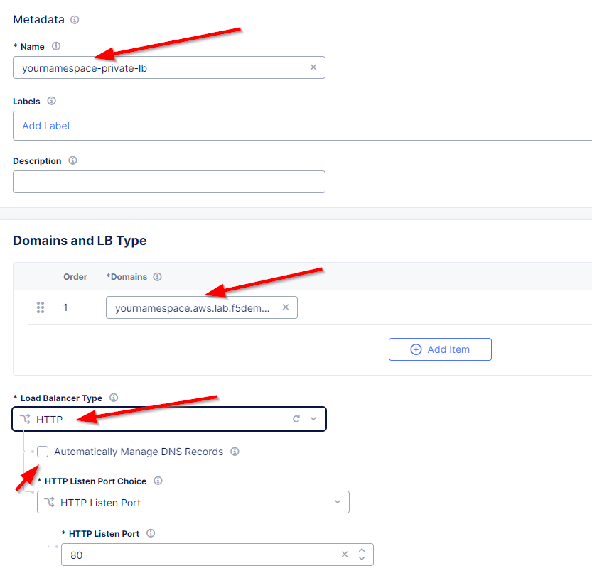

Lab 3: Protecting a Private Endpoint
====================================

The application development team is hard at work at your company and recently deployed an application in AWS.  
They have come to you and asked if you could configure customer access to this application with no exposure 
to the Internet. You have been tasked to design and build this connectivity. You have chosen to leverage the 
Distributed Cloud Customer Edge deployment model to provide secure reliable access to the AWS hosted application. 

Your design includes the following workflow Client -> CE -> Protected application resource.  Let's get started!

F5 Distributed Cloud AWS VPC Site
---------------------------------

In addition to protecting resources using F5 Distributed Cloud WAF/WAAP enforcement at an F5 Regional Edge (RE), you can also deploy a
Customer Edge (CE) that may or may not be exposed to the public Internet. CE nodes may be deployed in physical data centers and/or public 
cloud environments.

Once a CE has been deployed, it unlocks two additional topologies.

**1. Client -> RE -> CE -> Protected resource**

Leveraging F5 Distributed Cloud REs to provide WAF and other services upstream, then proxying the clean traffic to the protected resource via the CE. It is recommended that a firewall rule be placed at the site with the CE to only allow traffic from an RE. This ensures that all traffic is scrubbed upstream before entering the site.

**2. Client -> CE -> Protected resource**

In this scenario, the CE advertises the services directly.  While this topology sacrifices some functionality such as 
volumetric DDoS protection and anycast availability from the Distributed Cloud global network, there are some use cases where it can be beneficial.  
One such example is when clients and protected resources are both local to each other without having to traverse the Internet.

With either toplogy, two encrypted tunnels are automatically created between the CE and the two closest REs.  At a minimum these redundant tunnels provide
control-plane communication to the CE. Through the Distributed Cloud Console or via API your configuraton commands traverse these tunnels.

In the event of an Internet outage at a CE site, local survivability will continue to provide data plane services locally for a period of time.  
During this time, control plane services are suspended and will resume upon Internet connection reestablishment.

While a single CE node may be adequate for non-production environments, a high-availability cluster of at least 3 CE's is highly recommended for production.

This lab has auto deployed an AWS site with a CE node for you. You may walk through this process using the F5 Distributed Cloud Simulator if you wish.

https://simulator.f5.com/s/cloud2cloud_via_sites_brownfield/nav/aws/005/0

Continue with the steps below to allow secure connectivity to the AWS hosted application. 

Task 1. Create Private Origin Pool
---------------------------

In Lab #1 we created an origin pool that was accessible via the Public Internet without using a CE deployment.  In Lab #2 we are still leveraging Internet access via the
RE but now connecting to the origin server throught a CE deployment.  In this topology the CE IPSec tunnels will carry both control-plane and data-plane traffic down to the orgin. 
Now with Lab# 3 we will create an origin pool that will provide internal resources discovered with local DNS by the CE node that is deployed in our lab AWS environment.

We will first create an Origin Pool that refers to the "Private Endpoint" site in our lab environment.

+------------------------------------------------------------------------------------------------------------+
|| 1. Start in F5 Distributed Cloud Console and switch back to the **Multi-Cloud App Connect** context.      |
||                                                                                                           |
|| 2. Navigate the menu to go to **"Manage"->"Load Balancers"->"Origin Pools"**. Click on *Add Origin Pool*. |
||                                                                                                           |
|| 3. Enter the following variables:                                                                         |
||                                                                                                           |
+------------------------------------------------------------------------------------------------------------+
|                                                                                                            |
|   ================================= =====                                                                  |
|   *Variable*                        *Value*                                                                |
|   ================================= =====                                                                  |
|   Name                              **[NAMESPACE]-private-pool**                                           |
|   ================================= =====                                                                  |
|                                                                                                            |
+------------------------------------------------------------------------------------------------------------+
||                                                                                                           |
|| 4. Click on "Add Item" under the section "Origin Servers"                                                 |
||                                                                                                           |
+------------------------------------------------------------------------------------------------------------+
|                                                                                                            |
|   ================================= =====                                                                  |
|   Variable                          Value                                                                  |
|   ================================= =====                                                                  |
|   Select Type of Origin Server      DNS Name of Origin Server on given Sites                               |
|   DNS Name                          private.lab.f5demos.internal                                           |
|   Site                              system/student-awsnet                                                  |
|   ================================= =====                                                                  |
+------------------------------------------------------------------------------------------------------------+   
|                                                                                                            |
| |lab301|                                                                                                   | 
|                                                                                                            |
||                                                                                                           |
|| 5. Click on **"Apply"** to return to the previous screen.                                                 |
||                                                                                                           |
|| 6. Below the "Origin Servers" section fill in the Origin Server Port information                          |     
||                                                                                                           |
+------------------------------------------------------------------------------------------------------------+
|                                                                                                            |
|                                                                                                            |
|   ================================= =====                                                                  |
|   *Variable*                          *Value*                                                              |
|   ================================= =====                                                                  |
|   Port                              **8080**                                                               |
|   ================================= =====                                                                  |
|                                                                                                            |
+------------------------------------------------------------------------------------------------------------+   
||                                                                                                           |
|| 7. Click **Save and Exit**.                                                                               |
||                                                                                                           |
+------------------------------------------------------------------------------------------------------------+

Task 2. Create and Deploy a HTTP Load Balancer on F5 Distributed Cloud CE 
---------------------------------------------------------------------------

In the first lab we were connecting to a F5 Distributed Cloud Load Balancer that was deployed in a RE.
Now we will deploy a Load Balancer on the CE node that was deployed in the AWS VPC (CE location).

+-----------------------------------------------------------------------------------------------------------------------------------+
|| 1. Start in F5 Distributed Cloud Console and switch back to the **Multi-Cloud App Connect** context.                             |
||                                                                                                                                  |
|| 2. Navigate the menu to go to **"Manage"->"Load Balancers"-> "HTTP Loabalancers"**.  Click on *Add HTTP Loadbalancer*.           |
||                                                                                                                                  |
|| 3. Enter the following variables:                                                                                                |
||                                                                                                                                  |
+-----------------------------------------------------------------------------------------------------------------------------------+
|                                                                                                                                   |
|                                                                                                                                   |
|   ================================= =====                                                                                         |
|   Variable                          Value                                                                                         |
|   ================================= =====                                                                                         |
|   Name                              [NAMESPACE]-private-lb                                                                        |
|   Domains                           [NAMESPACE].aws.lab.f5demos.com                                                               |
|   Select type of Load Balancer      HTTP                                                                                          |
|   Automatically Manage DNS Records  No/Unchecked                                                                                  |
|   ================================= =====                                                                                         |
|                                                                                                                                   |
+-----------------------------------------------------------------------------------------------------------------------------------+                                                                                       
|                                                                                                                                   |
|  |lab311|                                                                                                                         |
||                                                                                                                                  |
|| 4. Under Origin Pools Click *"Add Item"*                                                                                         |
||                                                                                                                                  |
|  |lab302|                                                                                                                         |
||                                                                                                                                  |
|| 5. Select the recently created **[NAMESPACE]-private-pool** under Origin pool and then click *"Apply"*                           |
||                                                                                                                                  |
|  |lab303|                                                                                                                         |
||                                                                                                                                  |
|| 6. Now you can see your Origin Pool has been added to the HTTP Loadbalancer Configuration                                        |
||                                                                                                                                  |
|  |lab304|                                                                                                                         |
||                                                                                                                                  |
|| 7. Now we want to control how this Load Balancer is advertised, we will select the "Other Settings" on the left hand side.       |
||    This will auto-scroll the configuations towards the bottom of the Load Balancer configuration section labled "Other Settings" |
||                                                                                                                                  |
|| |lab305|                                                                                                                         |
||                                                                                                                                  |
|| 8. Under *VIP Advertisement* Change it to "Custom"  then select **Configure**                                                    |
||                                                                                                                                  |
|| |lab306|                                                                                                                         |
||                                                                                                                                  |
|| 9. In the List of Sites to Advertise", Click on *"Add Item"*                                                                     |
||                                                                                                                                  |
|| |lab307|                                                                                                                         |
||                                                                                                                                  |
|| 10. For *"Site Network"* select *"Outside Network"*                                                                              |
||                                                                                                                                  |
|| 11. For *"Site Reference"* select **system/student-awsnet**                                                                      |
||                                                                                                                                  |
|| |lab308|                                                                                                                         |
||                                                                                                                                  |
|| 12. Click on *"Apply"* and once again *"Apply"* on the next screen.                                                              |
||                                                                                                                                  |
|                                                                                                                                   |       
+-----------------------------------------------------------------------------------------------------------------------------------+

Task 3: Configure WAF Policy
^^^^^^^^^^^^^^^^^^^^^^^^^^^^^^^^
Now that we have our load balancer and orign server configured we want to make sure we are protecting the origin server.  Here we   
are easily applying a pre-existing shared WAF policy to our loadbalancer.  The shared WAF policy is available for all namespaces
under this tenant.

+-----------------------------------------------------------------------------------------------------------------------------------+
|| 1. Under the *Web Application Firewall* section                                                                                  |
||                                                                                                                                  |
|| 2. Choose the following options:                                                                                                 |
||                                                                                                                                  | 
+-----------------------------------------------------------------------------------------------------------------------------------+
|                                                                                                                                   |
|   =============================== =================================                                                               |
|   Variable                        Value                                                                                           |
|   =============================== =================================                                                               |
|   Web Application Firewall (WAF)  **Enable**                                                                                      |
|   Select App Firewall             **shared/base-appfw**                                                                           |
|   =============================== =================================                                                               |
|                                                                                                                                   |
+-----------------------------------------------------------------------------------------------------------------------------------+
||                                                                                                                                  |
|| 3.  Scroll to the botton of the screen and click "Save and Exit" to create the HTTP Load Balancer.                               |
||                                                                                                                                  |
|      Once the HTTP Load Balancer has been deployed, you should now be able to go to the DNS name that you entered                 |
|      previously in a web browser.  The FQDN we used in our example is http://[NAMESPACE].aws.lab.f5demos.com.                     |
|      This is a wildcard DNS entry that points to the Public IP (AWS Elastic IP) that is attached to the AppMesh node.             |
||                                                                                                                                  |
||  4.  Click on *"Save and Exit"* to complete the Load Balancer configuration                                                      |
||                                                                                                                                  |
+-----------------------------------------------------------------------------------------------------------------------------------+

Task 4: Verify Configuration
^^^^^^^^^^^^^^^^^^^^^^^^^^^^^^^^

You should now be able to go to the DNS name that you created in this Load Balancer configuration.  
The FQDN we used in our example is http://[NAMESPACE].aws.lab.f5demos.com/.  

+-----------------------------------------------------------------------------------------------------------------------------------+
||  The private demo app should look like the following:                                                                            |
||                                                                                                                                  |
|  |lab312|                                                                                                                         |
|                                                                                                                                   |
|                                                                                                                                   |
+-----------------------------------------------------------------------------------------------------------------------------------+

Task 5: Verify DNS
^^^^^^^^^^^^^^^^^^^^^^

You can verify that you are connecting directly to AWS by comparing the DNS of the two hosts.

+-----------------------------------------------------------+
| .. code-block::                                           |
|                                                           |
|   $ dig +short [NAMESPACE].aws.lab.f5demos.com            |
|   52.4.72.136                                             |
|                                                           |
|   $ dig -x 52.4.72.136 +short                             |
|   ec2-52-4-72-136.compute-1.amazonaws.com                 |
+-----------------------------------------------------------+

+-----------------------------------------------------------+
| .. code-block::                                           |
|                                                           |
|   $ nslookup [NAMESPACE].aws.lab.f5demos.com              |
|                                                           |
|   Server:  2a01:cb04:765:e00:a6ce:daff:fe11:96e           |
|   Address: 2a01:cb04:765:e00:a6ce:daff:fe11:96ea#53       |
|                                                           |
|   Non-authoritative answer:                               |
|   Name: [NAMESPACE].aws.lab.f5demos.com                   |
|   Address: 52.4.72.136                                    |
+-----------------------------------------------------------+

Task 6: Verify WAF Protection
^^^^^^^^^^^^^^^^^^^^^^

In this topology we are sending traffic to the AWS EIP that's attached to the CE node in the AWS VPC.

We then connect to the AWS resource via it's Private IP address.  

+-----------------------------------------------------------------------------------------------------------------------------------+
| <! Try adding the following to the URL "?cat%20/etc/passwd".  ###this request hung without providing a blocking page>             |
|                                                                                                                                   |
| Try adding the following to the URL "/cart?search=aaa’>"                    |
|                                                                                                                                   |
| You should see a block page.                                                                                                      |
|                                                                                                                                   |
|   |lab313|                                                                                                                        |                                      
|                                                                                                                                   |
+-----------------------------------------------------------------------------------------------------------------------------------+

This is similar behavior to what we saw in the previous lab,but in this case the enforcement of the WAF policy is occurring on the 
CE nodethat is deployed in the AWS Lab Environment and not in the F5 Distributed Cloud Regional Edge.

Congratulations you have successfully configured and secured application access within AWS! This marks the end of this lab.

.. |lab307| image:: _static/lab3-appworld2025-list-sites-advertise.png
   :width: 800px

.. |lab309| image:: _static/screenshot-global-vip-private.png
   :width: 800px

.. |lab312| image:: _static/screenshot-global-vip-private.png
   :width: 800px 

