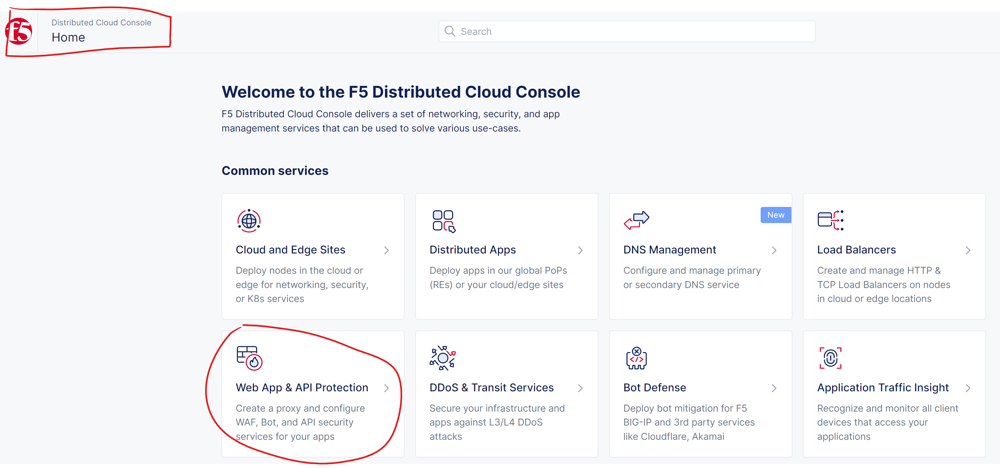
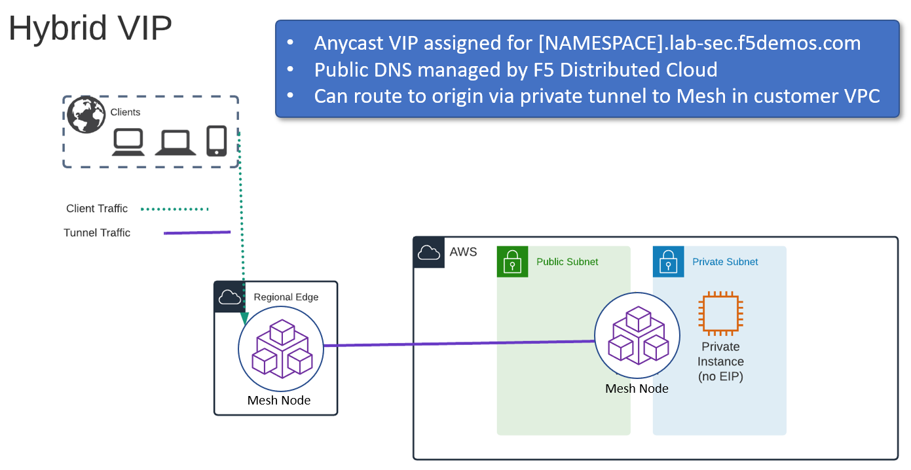

Lab 3: Protecting a Private Endpoint
====================================

In the previous lab you learned how an AppMesh node can be deployed 

In this next lab we will look at two additional topologies of how you can use an "AppMesh" node
to secure traffic that is going to an endpoint that is not directly exposed to the Internet.

Task 1. Create Origin Pools
---------------------------

Previously we created an origin pool that was accessible via the Public Internet.
The next lab exercise will create an origin pool that will provide internal resources discovered with local DNS by the AppMesh node that is deployed in our lab AWS environment. 

Exercise 1: Create Private Origin Pool
^^^^^^^^^^^^^^^^^^^^^^^^^^^^^^^^^^^^^^

We will first create an Origin Pool that refers to the "Private Endpoint" site in our lab environment.

#. Start in F5 Distributed Cloud Console and switch back to the "Web App & API Protection" context.

#. Navigate the menu to go to "Manage"->"Load Balancers"->"Origin Pools". Click on *Add Origin Pool*.

#. Enter the following variables:

   ================================= =====
   Variable                          Value
   ================================= =====
   Name                              private
   ================================= =====

#. Click on "Add Item" under the section "Origin Servers"

   Enter the following variables: 

   ================================= =====
   Variable                          Value
   ================================= =====
   Select Type of Origin Server      DNS Name of Origin Server on given Sites
   DNS Name                          private.lab.f5demos.internal
   Site                              system/student-awsnet
   ================================= =====
    
   |op-pool-basic|

   Click on "Apply" to return to the previous screen.

#. Below the "Origin Servers" section fill in the Port information

   ================================= =====
   Variable                          Value
   ================================= =====
   Port                              8080
   ================================= =====

#. In *Health Check(s)* section, click the *Add Item* button.

#. Click the *Health Check object* dropdown list. Select the *http* monitor that you previously created.

#. Click the *Save and Exit* button to create the Origin Pool.

.. |origin_pools_menu| image:: _static/origin_pools_menu.png
.. |origin_pools_add| image:: _static/origin_pools_add.png
.. |origin_pools_config| image:: _static/origin_pools_config.png
.. |origin_pools_config_api| image:: _static/origin_pools_config_api.png
.. |origin_pools_config_mongodb| image:: _static/origin_pools_config_mongodb.png
.. |origin_pools_show_child_objects| image:: _static/origin_pools_show_child_objects.png
.. |origin_pools_show_child_objects_status| image:: _static/origin_pools_show_child_objects_status.png
.. |http_lb_origin_pool_health_check| image:: _static/http_lb_origin_pool_health_check.png
.. |http_lb_origin_pool_health_check2| image:: _static/http_lb_origin_pool_health_check2.png

.. |op-add-pool| image:: _static/op-add-pool.png
.. |op-api-pool| image:: _static/op-api-pool.png
.. |op-pool-basic| image:: _static/op-pool-basic-private.png
  :width: 75% 
.. |op-spa-check| image:: _static/op-spa-check.png
.. |op-tshoot| image:: _static/op-tshoot.png

Task 2. Update HTTP Load Balancer on F5 Distributed Cloud Regional Edge
-----------------------------------------------------------------------

We will now update the HTTP load balancer that we previously created to connect to
the "Private Endpoint" via the AppMesh node that is deployed in the AWS lab environment.

.. image:: _static/testdrive-volterra-waf-hybrid-vip.png

Exercise 1: HTTP Load Balancer Configuration
^^^^^^^^^^^^^^^^^^^^^^^^^^^^^^^^^^^^^^^^^^^^

#. Start in F5 Distributed Cloud Console and switch to the "Web App & API Protection" context. [You should already be here from previous lab]

#. Navigate the menu to go to "Manage"->"HTTP Load Balancers" and look for the Load Balancer named *global* that you previously created.

#. Click on the three dots "..." to the right of the name of your *global* Load Balancer and select the "Manage Configuration" option.

   .. image:: _static/screenshot-global-vip-actions-manage.png

#. Click on "Edit Configuration" in the upper right of the screen (after your *global* Load Balancer is loaded).

   .. image:: _static/screenshot-global-vip-edit-config.png

#. Under "Origins" find your previous "public" Origin pool and click on the three dots "..." to the right under "Actions" and select "Edit"

   .. image:: _static/screenshot-global-vip-edit-config-pools.png

#. Change the selection of "Origin Pool" to "private" from "public" and click "Apply"

   .. image:: _static/screenshot-global-vip-edit-config-pools-select.png

#. Click "*Save and Exit* to update the HTTP Load Balancer.

You should now be able to go to the DNS name that you entered 
previously in a web browser.  The FQDN we used in our example is http://stable-sheep.lab-sec.f5demos.com/.  

Exercise 2: Verify Configuration
^^^^^^^^^^^^^^^^^^^^^^^^^^^^^^^^

The private demo app should look like the following:

.. image:: _static/screenshot-global-vip-private.png
   :width: 50%

In this topology we are sending traffic to an AnyCast IP that is hosted in F5 Distributed Cloud's Regional Edge.

We then connect to the AWS resource via the AppMesh node that is deployed in the same VPC as the "Private Endpoint".  
The AppMesh is only being used for network connectivity to the Private Endpoint; enforcement of the WAF policy is still
being applied in the Regional Edge.

In the next exercise we will look at a third topology of deploying a WAF policy that will be enforced within the AWS VPC
on the AppMesh node (in the Customer Edge).

.. raw:: html

   <iframe width="560" height="315" src="https://www.youtube.com/embed/s-BHH0Qayfc?start=366" title="YouTube video player" frameborder="0" allow="accelerometer; autoplay; clipboard-write; encrypted-media; gyroscope; picture-in-picture" allowfullscreen></iframe>

Task 3. Creating HTTP Load Balancer on F5 Distributed Cloud Customer Edge
-------------------------------------------------------------------------

In the previous lab exercises we were connecting to a F5 Distributed Cloud Load Balancer that was deployed in a Regional Edge.

In the next lab exercise we will deploy a Load Balancer on the AppMesh node that was deployed in the AWS VPC (Customer Edge location).

Exercise 1: HTTP Load Balancer Configuration
^^^^^^^^^^^^^^^^^^^^^^^^^^^^^^^^^^^^^^^^^^^^

#. Start in F5 Distributed Cloud Console and switch to the "Web App & API Protection" context. [You should already be here from previous lab]

#. Navigate the menu to go to "Manage"->"HTTP Load Balancers" and click on "Add HTTP Load Balancer".

#. Enter the following variables:

   ================================= =====
   Variable                          Value
   ================================= =====
   Name                              local
   Domains                           [NAMESPACE].aws.lab.f5demos.com
   Select type of Load Balancer      HTTP
   Automatically Manage DNS Records  No/Unchecked 
   ================================= =====

Exercise 2: Configure Default Origin Server
^^^^^^^^^^^^^^^^^^^^^^^^^^^^^^^^^^^^^^^^^^^

We'll next configure the "Origin Servers".   
    
#. Click on the *Add Item* button in the the *Origin Pools* section.

#. The "Select Origin Pool Method" will be set to "Origin Pool". Under the "Origin Pool" dropdown menu select the "private" pool you created earlier.
 
#. Click the *Apply* button to exit the "Origin Pool with Weight and Priority" dialogue.

Exercise 3: Configure Local VIP
^^^^^^^^^^^^^^^^^^^^^^^^^^^^^^^

Previously we configured a VIP that was advertised on F5's Regional Edge (PoP) locations.
We will modify this configuration to expose the service on the "Outside" interface of the AppMesh
node that is deployed in AWS.  This will allow us to access the VIP via the Public IP Address (AWS Elastic IP)
that is attached to that interface.  If we wished to only have the service available within the AWS VPC
we could opt to use the "Inside" interface that does not have an AWS EIP attached.

#. Under "Other Settings" set "VIP Advertisement" to "Custom"

   .. image:: _static/screenshot-local-vip-advertise-custom.png
      :width: 50%

#. Click on "Configure" under "Custom"
#. In "List of Sites to Advertise", click on "Add Item"
#. For "Site Network" click on "Outside Network" 
#. For "Site Reference" select `system/student-awsnet`

   .. image:: _static/lb-local-vip-advertise.png
      :width: 60%

#. Click on "Apply" 
#. Click on "Apply" to return to previous screen

Exercise 4: Configure WAF Policy
^^^^^^^^^^^^^^^^^^^^^^^^^^^^^^^^

#. Under the *Web Application Firewall* section 

#. Choose the following options:

   =============================== =================================
   Variable                        Value
   =============================== =================================
   Web Application Firewall (WAF)  Enable
   Select App Firewall             [NAMESPACE]/blocking-app-firewall
   =============================== =================================

#. Click "Save and Exit" to create the HTTP Load Balancer.

Once the HTTP Load Balancer has been deployed, you should now be able to go to the DNS name that you entered 
previously in a web browser.  The FQDN we used in our example is http://stable-sheep.aws.lab.f5demos.com.  
This is a wildcard DNS entry that points to the Public IP (AWS Elastic IP) that is attached to the AppMesh node.

Exercise 5: Verify Configuration
^^^^^^^^^^^^^^^^^^^^^^^^^^^^^^^^

The private demo app should look like the following:

.. image:: _static/screenshot-local-vip-private.png
   :width: 50%

Exercise 6: Verify DNS
^^^^^^^^^^^^^^^^^^^^^^

You can verify that you are connecting directly to AWS by comparing the DNS of the two hosts.

.. code-block:: 

   $ dig +short student001.aws.lab.f5demos.com
   52.4.72.136

   $ dig -x 52.4.72.136 +short
   ec2-52-4-72-136.compute-1.amazonaws.com.

.. code-block:: 

   $ nslookup student001.aws.lab.f5demos.com

   Server:		2a01:cb04:765:e00:a6ce:daff:fe11:96ea
   Address:	2a01:cb04:765:e00:a6ce:daff:fe11:96ea#53

   Non-authoritative answer:
   Name:	student001.aws.lab.f5demos.com
   Address: 52.4.72.136

In this topology we are sending traffic to the AWS EIP that's attached to the AppMesh node in the AWS VPC.

We then connect to the AWS resource via it's Private IP address.  

Try adding the following to the URL "?cat%20/etc/passwd".

You should see a block page.  This is similar behavior to what we saw in the previous lab,
but in this case the enforcement of the WAF policy is occurring on the AppMesh node
that is deployed in the AWS Lab Environment and not in the F5 Distributed Cloud Regional Edge.

In the next lab we will look at how to customize our WAF policy.

Video Walkthrough 
^^^^^^^^^^^^^^^^^

Optional Video you can watch if you get stuck

.. raw:: html

   <iframe width="560" height="315" src="https://www.youtube.com/embed/s-BHH0Qayfc?start=400" title="YouTube video player" frameborder="0" allow="accelerometer; autoplay; clipboard-write; encrypted-media; gyroscope; picture-in-picture" allowfullscreen></iframe>

