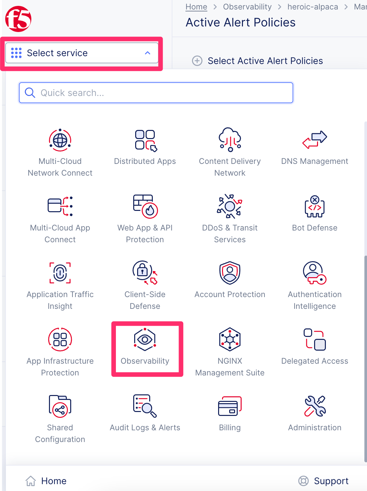
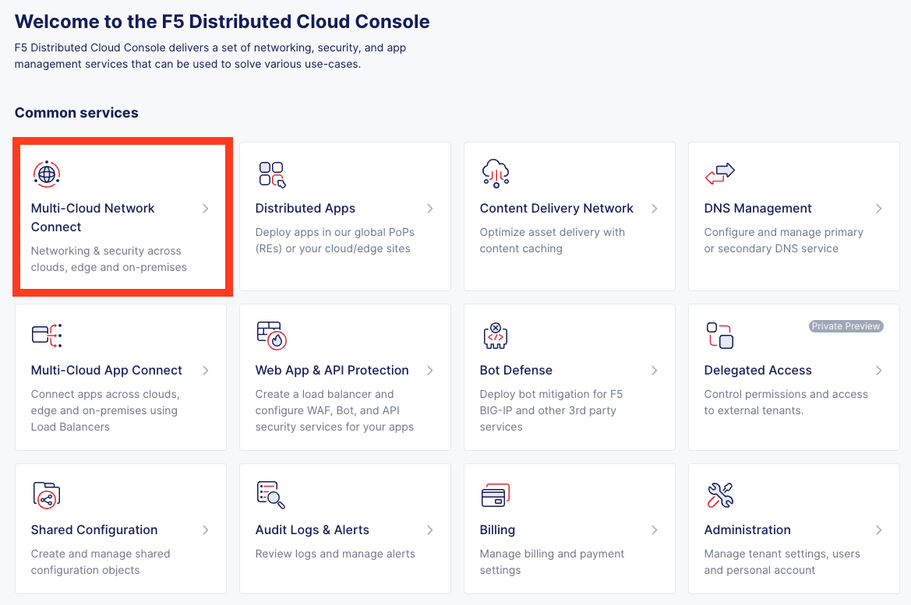

Lab 3: Instructor Walk-through
====================================

Adding onto the previous labs this will be a walkthrough of the further topics available in the full 4 hour lab.

The additional topics to be walked through are below which comprise of the orignal course labs 4-7.

* Lab 4 - Distributed Cloud DNS
* Lab 5 - Distributed Cloud Observability 
* Lab 6 - Distributed Cloud CDN (Content Delivery Network)
* Lab 7 - Distributed Cloud Multi Cloud Network (MCN)

Note Distributed Cloud will be refered to as XC going forward.

Lab 4: XC DNS:
^^^^^^^^^^^^^^^^^^^^^^^^^^^^^^^^^^^^^^

This lab provides an introduction to DNS services available on F5 Distributed Cloud.  This 
lab will demonstrate where to configured Delegated DNS, Primary and Secondary DNS, and DNS
Load Balancing.  All configuration will be made via the F5 Distributed Cloud Console and 
within the F5 Distributed Cloud Global Network services architecture.

Summary of key topics:

* Deligated DNS
* Primary and Secondary DNS
* DNS Load Balancing

`DNS Lab Link <https://clouddocs.f5.com/training/community/f5xc/html/class1/lab4.html>`_ 

|lab004|    

Lab 5: XC Observability:
^^^^^^^^^^^^^^^^^^^^^^^^^^^^^^^^^^^^^^

Observability via the syntehetic monitor tooling and automatically geenrated dashboards with key metrics and cert expiry.
Providing visibility from external sources to mimic the enduser experience accessing your application to provide an early warning of problems.

Summary of topics:

* Setup sythetic monitor
* Review dashboards

`Observability Lab Link <https://clouddocs.f5.com/training/community/f5xc/html/class1/lab5.html>`_ 

|lab005|    

Lab 6: XC CDN:
^^^^^^^^^^^^^^^^^^^^^^^^^^^^^^^^^^^^^^

F5 Distributed Cloud CDN (Content Delivery Network) provides integrated security with support for content caching and containerized edge-based workloads for richer digital experiences. Built on a high-performance, secure global private network, F5 Distributed Cloud CDN enables rich digital experiences for end users. Distributed Cloud CDN integrates with critical app security services to empower your organization as it pursues multi-cloud and edge-based initiatives. 

Summary of topics:

* Basic and adavnaced CDN Setup
* Observability of CDN performance via dashboards 

`CDN Lab Link <https://clouddocs.f5.com/training/community/f5xc/html/class1/lab6.html>`_ 

|lab006|    

Lab 7: XC MCN:
^^^^^^^^^^^^^^^^^^^^^^^^^^^^^^^^^^^^^^

One of the most compelling features of the XC product, this enables the connecting of Cloud and On-prem Data Centers to form a connectivity Mesh at a network and Service level.

Summary of topics:

* Setup of site via SaaS portal to Cloud
* Observability - CE dashboard

`MCN Lab Link <https://clouddocs.f5.com/training/community/f5xc/html/class1/lab7.html>`_ 

|lab007|    

.. |lab004| image:: _static/lab4-001.png
   :width: 800px

.. |lab006| image:: _static/lab6-001.png
   :width: 800px
