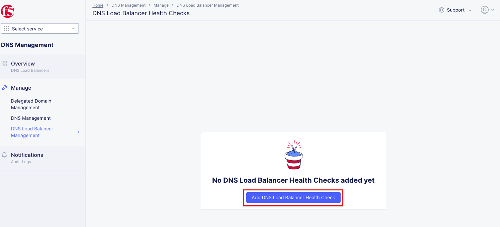
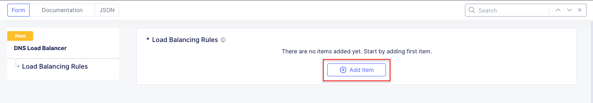

Lab 4: Introduction to Additional F5 Distributed Cloud Services
===============================================================

Lab 4 will provide and introduction to additional F5 Distributed Cloud Services.  This 
lab will focus on DNS, Observability, Content Delivery Netowrk (CDN), Multi Cloud 
Networking, and Managed Kubernetes.  All configuration will be made via the F5 Distributed 
Cloud Console and within the F5 Distributed Cloud Global Network services architecture.

For the tasks that follow, you should have already noted your individual **namespace**. If you
failed to note it, return to the **Introduction** section of this lab, follow the instructions
provided and note your **namespace** accordingly. The **Delegated Domain** and the F5 
Distributed Cloud **Tenant** are listed below for your convenience as they will be the same for
all lab attendees.

* **Delegated Domain:** *.lab-sec.f5demos.com* 
* **F5 Distributed Cloud Tenant:** https://f5-xc-lab-sec.console.ves.volterra.io 

Following the tasks in the prior **Introduction** Section, you should now be able to access the
F5 Distributed Cloud Console, having set your Work Domain Roles and Skill levels. If you have
not done so already, please login to your tenant for this lab and proceed to Task 1.

Task 1: DNS Introduction
~~~~~~~~~~~~~~~~~~~~~~~~

The following steps will demonstrate where DNS features are configured within the F5 Distributed
Cloud Console.  These steps will review where to configure a Delegated DNS Domain, Primary DNS,
Secondary DNS, and DNS Load Balancing.

+----------------------------------------------------------------------------------------------+
| 1. If you are not still logged into the F5 Distributed Console, login.                       |
|                                                                                              |
| 2. If you are on the Main Dashboard Select the DNS Management tile or if you are already in  |
|                                                                                              |
|    one of the services you can select **DNS Management** from the **Select service**         |
|                                                                                              |
|    dropdown.                                                                                 |
+----------------------------------------------------------------------------------------------+
| |lab001|                                                                                     |
|                                                                                              |
| |lab002|                                                                                     |
+----------------------------------------------------------------------------------------------+

**Delegated DNS**

+----------------------------------------------------------------------------------------------+
| 3. In the left-hand navigation menu, expand the **Manage** section and click the             |
|                                                                                              |
|    **Delegated Domain Management** link.                                                     |
|                                                                                              |
| 4. Notice that the *lab-sec.f5demos.com* domain has been delegated to this tenant. Delegated |
|                                                                                              |
|    domains allow Distributed Cloud to automatically create DNS entries for objects configured|
|                                                                                              |
|    within Distributed Cloud.  You utilized this feature to create a DNS entry for your       |
|                                                                                              |
|    application in Lab 1.                                                                     |
+----------------------------------------------------------------------------------------------+
| |lab003|                                                                                     |
+----------------------------------------------------------------------------------------------+

**Primary and Secondary DNS**

+----------------------------------------------------------------------------------------------+
| 5. In the left-hand navigation menu, under the **Manage** section click the **DNS**          |
|                                                                                              |
|    **Management** link.                                                                      |
|                                                                                              |
| 6. Click the **Add DNS Zone** button.                                                        |
+----------------------------------------------------------------------------------------------+
| |lab004|                                                                                     |
|                                                                                              |
| |lab005|                                                                                     |
+----------------------------------------------------------------------------------------------+

+----------------------------------------------------------------------------------------------+
| 7. In the resulting window note the **Domain Name** field.  This is where you enter the      |
|                                                                                              |
|    zone domain name that Distributed Cloud will provide DNS responses for.                   |  
|                                                                                              |
| 8. Note the **Zone Type** dropdown under the **DNS Zone Configuration** section.  This is    |
|                                                                                              |
|    where you select if Distributed Cloud will be a Primary or Secondary DNS server for the   |
|                                                                                              |
|    DNS zone specified.                                                                       |
|                                                                                              |
| 9. Click **Cancel and Exit** to close this window.                                           |
|                                                                                              |
| .. note::                                                                                    |
|    *Your current role does not have permissions to create Primary or Secondary DNS Zones.*   |
|                                                                                              |
|    *If you click Save and Exit you will receive an error message stating you do not have*    |
|                                                                                              |
|    *access with your current role.*                                                          |
+----------------------------------------------------------------------------------------------+
| |lab006|                                                                                     |
|                                                                                              |
| |lab007|                                                                                     |
+----------------------------------------------------------------------------------------------+

**DNS Load Balancers**

+----------------------------------------------------------------------------------------------+
| 10. In the left-hand navigation menu, under the **Manage** section expand the **DNS**        |
|                                                                                              |
|     **Load Balancer Management** section and select **DNS Load Balancer Health Checks.**     |
|                                                                                              |
| 11. Click the **Add DNS Load Balancer Health Check** button.                                 |
+----------------------------------------------------------------------------------------------+
| |lab008|                                                                                     |
|                                                                                              |
| |lab009|                                                                                     |
+----------------------------------------------------------------------------------------------+

+----------------------------------------------------------------------------------------------+
| 12. In the resulting window note the available Health Check Types under the **Health Check** |
|                                                                                              |
|     **Type** dropdown.  This is where you can select the type of health check that will be   |
|                                                                                              |
|     utilized to verify the application is available.                                         |
|                                                                                              |
| 13. Click **Cancel and Exit** to close this window.                                          |
|                                                                                              |
| .. note::                                                                                    |
|    *Your current role does not have permissions to create DNS Load Balancer Health Checks.*  |
|                                                                                              |
|    *If you click Save and Exit you will receive an error message stating you do not have*    |
|                                                                                              |
|    *access with your current role.*                                                          |
+----------------------------------------------------------------------------------------------+
| |lab010|                                                                                     |
|                                                                                              |
| |lab011|                                                                                     |
+----------------------------------------------------------------------------------------------+

+----------------------------------------------------------------------------------------------+
| 14. In the left-hand navigation menu, under the **Manage** section expand the **DNS**        |
|                                                                                              |
|    **Load Balancer Management** section and select **DNS Load Balancer Pools.**              |
|                                                                                              |
| 15. Click the **Add DNS Load Balancer Pool** button.                                         |
+----------------------------------------------------------------------------------------------+
| |lab012|                                                                                     |
|                                                                                              |
| |lab013|                                                                                     |
+----------------------------------------------------------------------------------------------+

+----------------------------------------------------------------------------------------------+
| 16. In the resulting window note the available pool member types by expanding the **Pool**   |
|                                                                                              |
|    **Type** dropdown.  This is where you can select the type of pool member that will be     |
|                                                                                              |
|    DNS load balanced.                                                                        |
|                                                                                              |
| 17. Select **A** from the **Pool Type** dropdown.                                            |
|                                                                                              |
| 18. Click **Add Item** in the **Pool Members** section.                                      |
|                                                                                              |
| 19. In the resulting window note the **Public IP** field.  This is where you specify the     |
|                                                                                              |
|     the public IP of the pool member.                                                        |
|                                                                                              |
| 20. Also note the **Load Balancing Ration** and **Load Balancing Priority** fields.  These   |
|                                                                                              |
|     values control how the pool member will be load balanced.                                |
|                                                                                              |
| 21. Click **Cancel and Exit**                                                                |
|                                                                                              |
| .. note::                                                                                    |
|    *Your current role does not have permissions to create DNS Load Balancer Pools.*          |
|                                                                                              |
|    *If you click Save and Exit you will receive an error message stating you do not have*    |
|                                                                                              |
|    *access with your current role.*                                                          |
+----------------------------------------------------------------------------------------------+
| |lab014|                                                                                     |
|                                                                                              |
| |lab015|                                                                                     |
|                                                                                              |
| |lab016|                                                                                     |
|                                                                                              |
| |lab017|                                                                                     |
+----------------------------------------------------------------------------------------------+

+----------------------------------------------------------------------------------------------+
| 22. In the left-hand navigation menu, under the **Manage** section expand the **DNS**        |
|                                                                                              |
|    **Load Balancer Management** section and select **DNS Load Balancers.**                   |
|                                                                                              |
| 23. Click the **Add DNS Load Balancer** button.                                              |
+----------------------------------------------------------------------------------------------+
| |lab018|                                                                                     |
|                                                                                              |
| |lab019|                                                                                     |
+----------------------------------------------------------------------------------------------+

+----------------------------------------------------------------------------------------------+
| 24. In the resulting window note the available record types by expanding the **Record Type** |
|                                                                                              |
|    dropdown.  This is where you can select the type of DNS record to provide by the DNS load |
|                                                                                              |
|    balancer.                                                                                 |
|                                                                                              |
| 25. Select **Configure** from the **Load Balancing Rule List** section.                      |
|                                                                                              |
| 26. In the resulting window click the **Add Item** Button.                                   |
|                                                                                              |
| 27. In the resulting window click **Add Label** under the **Selector Expression.**  Note the |
|                                                                                              |
|     available Geo Location Selectors.                                                        |
|                                                                                              |
| 28. Click outside the dropdown to close the dropdown.                                        |
|                                                                                              |
| 29. Note the **Use DNS Load Balancer pool** dropdown.  This is where you select the pool to  |
|                                                                                              |
|     to be used with this Load Balancing Rule.                                                |
|                                                                                              |
| 30. Click **Cancel and Exit**                                                                |
|                                                                                              |
| .. note::                                                                                    |
|    *Your current role does not have permissions to create DNS Load Balancers.*               |
|                                                                                              |
|    *If you click Save and Exit you will receive an error message stating you do not have*    |
|                                                                                              |
|    *access with your current role.*                                                          |
+----------------------------------------------------------------------------------------------+
| |lab020|                                                                                     |
|                                                                                              |
| |lab021|                                                                                     |
|                                                                                              |
| |lab022|                                                                                     |
|                                                                                              |
| |lab023|                                                                                     |
|                                                                                              |
| |lab024|                                                                                     |
|                                                                                              |
| |lab025|                                                                                     |
+----------------------------------------------------------------------------------------------+

.. |lab004| image:: _static/lab4-004.png
   :width: 800px

.. |lab020| image:: _static/lab4-020.png
   :width: 800px
.. |lab021| image:: _static/lab4-021.png
   :width: 800px

