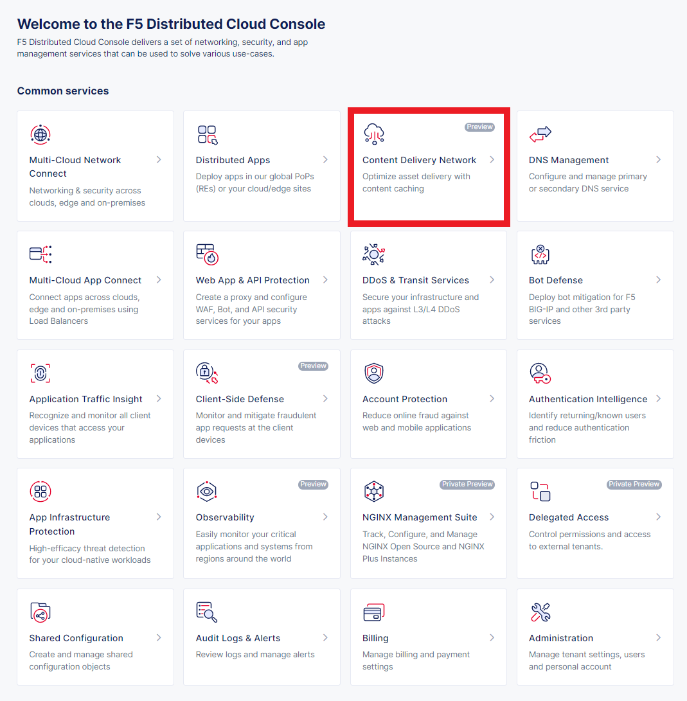

Lab 6: Introduction to Content Delivery Networks (CDN) 

=====================================================

F5 Distributed Cloud CDN (Content Delivery Network) provides integrated security with support for content caching and containerized edge-based workloads for richer digital experiences. Built on a high-performance, secure global private network, F5 Distributed Cloud CDN enables rich digital experiences for end users. Distributed Cloud CDN integrates with critical app security services to empower your organization as it pursues multi-cloud and edge-based initiatives. 

=====================================================

This lab provides an introduction to CDN services available within Distributed Cloud. The following steps will demonstrate the process of configuring CDN features within F5 Distributed Cloud Console. These steps will outline the process of creating CDN Distribution, and the steps involved for CDN Verification & viewing the Dashboard.

=====================================================

Task 1: Create CDN Distribution
~~~~~~~~~~~~~~~~~~~~~~~~

Step 1.1: Login as SecOps, NetOps, or DevOps User
============================
Step 1.2: Select ‘Content Delivery Network’ from Common Services
============================

|lab006-1|
|lab006-2|

============================
Step 1.3: Select Manage > Distributions > Add Distribution

|lab006-3|

============================
Step 1.4: Enter the following variables:
============================

Name: <namespace-cdn>
Domains: <namespace-cdn.lab-sec.f5demos.com (Note: We will use the same Delegated Domain as used in previous labs)

|lab006-4|

Type of CDN Distribution: HTTP

|lab006-5|

Automatically Manage DNS Records: Enabled/Checked

|lab006-6|

============================

Step 1.5: Under 'CDN Origin Pool' select 'Configure'. 

|lab006-7|

============================
Step 1.6: Enter the following variables under 'Origin Host Header'
============================

Note: We will use the same DNS info of the origin server the previous labs (demo-app.amer.myedgedemo.com)

DNS Name: demo-app.amer.myedgedemo.com
Enable TLS for Origin Servers: No TLS

|lab006-8|

Step 1.7: Select 'Add Item' under the 'List of Origin Servers'. 

|lab006-9|

Type of Origin Server: Public DNS Name of Origin Server
DNS Name: demo-app.amer.myedgedemo.com

|lab006-10|

Select 'Apply' > 'Apply' > 'Save and Exit'

============================
The CDN Distribution will take a few moments to deploy. You can click the 'Refresh' button to monitor the status as it goes from ‘Pending’ to ‘Active’.

|lab006-11|
|lab006-12|

============================

Step 1.8: Once the CDN Distribution is active you can launch a new browser window and navigate to <namespace-cdn.lab-sec.f5demos.com

Note: It may take 1-2 minutes before the site loads

|lab006-13|

============================
Step 1.9: In chrome, right click on the screen and navigate to developer tools (Inspect). Then click on the "Network' tab before refreshing the page a few times. You can see that the static content is being presented from cache.

Select the upper lefthand menu and navigate to the various sub-pages to generate some traffic. 

|lab006-14|

============================
Congratuations!! You successfully deployed a CDN Distribution within F5XC.

============================

Now you will see monitoring/performance statistics within the F5XC dashboard. 

Step 1.10: Naviate to the Monitoring > Performance section within the CDN configuration. Then select the CDN Distribution you just created (namespace-cdn).

|lab006-15|

Click around to review to the dashboard statistics. 
|lab006-16|

============================

Step 1.11: On the main dashboard, you will see various statitics including total requests, hits, misses

.. |lab006-2| image:: _static/lab6-002.png
.. |lab006-3| image:: _static/lab6-003.png
.. |lab006-4| image:: _static/lab6-004.png
.. |lab006-5| image:: _static/lab6-005.png
.. |lab006-6| image:: _static/lab6-006.png
.. |lab006-7| image:: _static/lab6-007.png
.. |lab006-8| image:: _static/lab6-008.png
.. |lab006-9| image:: _static/lab6-009.png
.. |lab006-10| image:: _static/lab6-010.png
.. |lab006-11| image:: _static/lab6-011.png
.. |lab006-12| image:: _static/lab6-012.png
.. |lab006-12| image:: _static/lab6-013.png
.. |lab006-12| image:: _static/lab6-014.png
.. |lab006-12| image:: _static/lab6-015.png
.. |lab006-12| image:: _static/lab6-016.png
