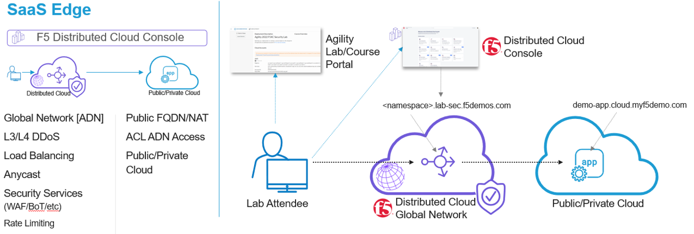
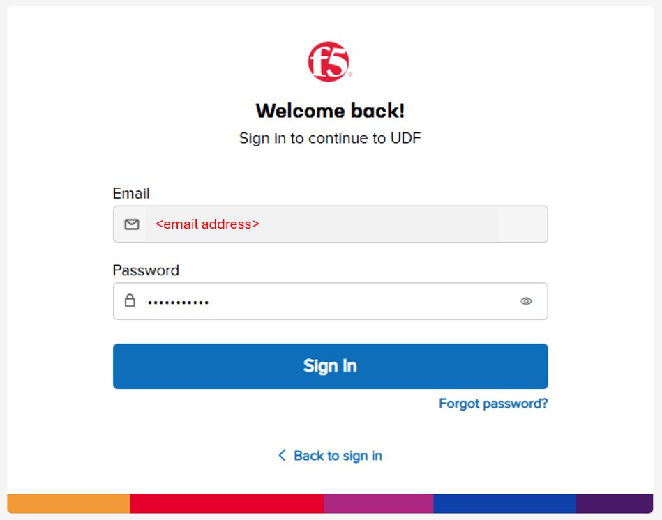
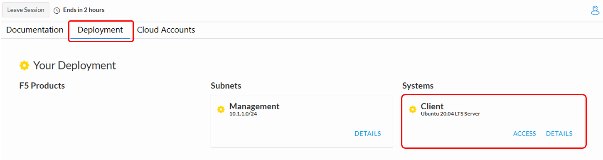
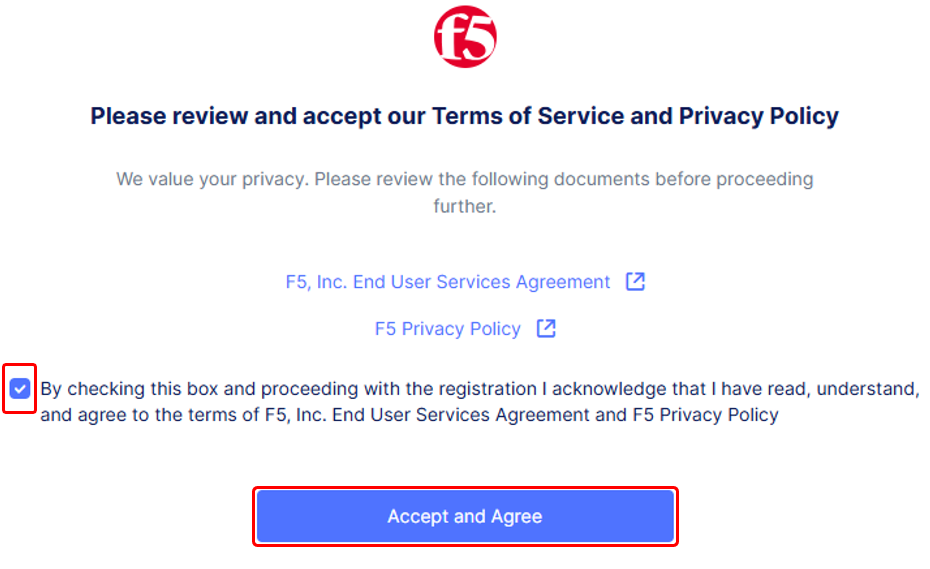

Introduction to the Lab
====================================================

**Narrative:**

Congratulations! You are a Network Security Engineer at ACME Corp. 

ACME has an Application Team that supports internally developed traditional and 
modern apps, vendor provided and SaaS applications. As security threats are becoming 
more prevalant, the ACME's Risk and Compliance organization has mandated that Web 
Application Firewalls be deployed across all public facing applications within the next 30 days.  

As the Network Security Engineer, you are tasked with evaluating how to securely 
deploy a WAF across your entire public application environment. At first you consider 
the traditional methods of deploying and managing your native WAFs in the Data Center, AWS, Azure, 
GCP but quickly realize that learning and managing multiple WAF technologies would be time-consuming 
and difficult to operate.

You recently saw a post on LinkedIn about a SaaS product that F5 has, claiming to solve multi-cloud 
appplication security complexities. Given your current timeline and industry knowledge of F5 being a 
leader for decades, you decide to check it out and end up in the chair you are sitting in today: 
Taking a first-hand look at how F5 makes WAAP (Web Application and API Protection) simple, quick to deploy,
and secure. 

|intro000a|

Task 1: Lab Environment
~~~~~~~~~~~~~~~~~~~~~~~

The image below represents an overview of the lab environment. F5 Distributed
Cloud Services will be configured as a SaaS Edge delivery and security service
tier to a publicly hosted web application. The first application you will be protecting 
is deployed in Azure. The key elements you will interact with are as follows:

* F5 Distributed Cloud Console
* F5 Distributed Cloud Global Network / Application Delivery Network (ADN)
* Publicly hosted application (Azure Public Cloud)

|intro000b|

Task 2: Accessing F5 Distributed Cloud Console
~~~~~~~~~~~~~~~~~~~~~~~~~~~~~~~~~~~~~~~~~~~~~~

The following tasks will guide you through the initial access requirements for the associated lab environment.  
Lab attendees should have received an invitation email to the lab environment based on the submitted 
registration email.  Please check email and spam folders if it has not been received.  If you have 
not received an email, please contact a member of the lab team.
 
F5 Distributed Cloud Console, where this lab will be conducted, is a SaaS control-plane for 
services that provides a UI and API for managing network, security, and compute services. The F5
Distributed Cloud Console can manage "sites" in existing on-premises data centers and sites in
AWS, Azure, and GCP cloud environments.

Course/Lab Invitation
~~~~~~~~~~~~~~~~~~~~~

+----------------------------------------------------------------------------------------------+
| Course/Lab Attendees will receive an email similar to the graphic displayed in this section. |
| The email will come from courses@notify.udf.f5.com.                                          |
|                                                                                              |
| As attendees maybe registered for several lab/courses, ensure the correctly identified course|
| is selected.  Use either the first or second link position (indicated by arrows) based on    |
| the attendee's F5 UDF (Unified Demo Framework) Account Status.                               |
|                                                                                              |
| #. **New UDF Users**                                                                         |
| #. **Returning UDF Users going directly to Course**                                          |
+----------------------------------------------------------------------------------------------+
| |intro001|                                                                                   |
+----------------------------------------------------------------------------------------------+

Accessing UDF (F5 Unified Demo Framework)
~~~~~~~~~~~~~~~~~~~~~~~~~~~~~~~~~~~~~~~~~

+----------------------------------------------------------------------------------------------+
| The following will guide attendees through the initial Lab environment access within F5 UDF. |
| Following the instructions from the Course/Lab invitation above, attendees will be prompted  |
| to login at  https://udf.f5.com                                                              |
|                                                                                              |
| .. note::                                                                                    |
|    *The steps for new UDF Users or the steps for resetting UDF User account passwords are*   |
|    *not shown. Please contact a member of the lab team if further assistance is needed.*     |
+----------------------------------------------------------------------------------------------+
| |intro002|                                                                                   |
+----------------------------------------------------------------------------------------------+

+----------------------------------------------------------------------------------------------+
| Attendees will be prompted to enter their UDF account, password and complete MFA as shown.   |
| MFA must be completed by either selecting **Send Push** or **Enter Code**.                   |
|                                                                                              |
| .. note::                                                                                    |
|    *MFA process will very based on the MFA integration selected for the UDF Account. OKTA*   |
|    *Verify is shown.*                                                                        |
+----------------------------------------------------------------------------------------------+
| |intro003|                                                                                   |
|                                                                                              |
| |intro004|                                                                                   |
|                                                                                              |
| |intro005|                                                                                   |
+----------------------------------------------------------------------------------------------+

+----------------------------------------------------------------------------------------------+
| Attendees will then be presented their scheduled course sessions. Locate the course/lab with |
| the appropriate **Date**, **Time** and **Name** and then click **Launch**.                   |
+----------------------------------------------------------------------------------------------+
| |intro006|                                                                                   |
+----------------------------------------------------------------------------------------------+

+----------------------------------------------------------------------------------------------+
| Once redirected to the selected Course/Lab, click the **Join** button.                       |
+----------------------------------------------------------------------------------------------+
| |intro007|                                                                                   |
+----------------------------------------------------------------------------------------------+

+----------------------------------------------------------------------------------------------+
| The Lab environment window will now be displayed.  Click on the **Documentation** tab in the |
| horizontal navigation links.  Locate and observe the state of **Client** system.             |
|                                                                                              |
| In approximately 5-7 minutes the associated **yellow gear** starting icon will change to a   |
| **green arrow** (running) icon and attendees will proceed to the next section of steps.      |
|                                                                                              |
| .. note::                                                                                    |
|    *Your specific lab environment may vary from the graphics shown below. The **Client***    |
|    *will, however, be consistent.*                                                           |
+----------------------------------------------------------------------------------------------+
| |intro008|                                                                                   |
|                                                                                              |
| |intro009|                                                                                   |
+----------------------------------------------------------------------------------------------+

Accessing F5 Distributed Cloud
~~~~~~~~~~~~~~~~~~~~~~~~~~~~~~

+----------------------------------------------------------------------------------------------+
| Following the state change of the **Client System** to a **green arrow** (running) icon,     |
| attendees will receive a second email.  This email will come from no-reply@cloud.f5.com.     |
| Click the **Accept invitation** with in the email.                                           |
|                                                                                              |
| .. note::                                                                                    |
|    *This link should be accessed in the same browser session as UDF was accessed for*        |
|    *seamless experience.*                                                                    |
|                                                                                              |
| .. warning::                                                                                 |
|    *Attendess should not attempt access to F5 Distributed Cloud tenant prior to receiving*   |
|    *email. Lab permissions may need to be re-applied.*                                       |
+----------------------------------------------------------------------------------------------+
| |intro010|                                                                                   |
+----------------------------------------------------------------------------------------------+

+----------------------------------------------------------------------------------------------+
| The initial logon prompt will be presented.  Click **Sign on with Okta** to proceed.  SSO    |
| will process and onboarding to the tenant will proceed.                                      |
+----------------------------------------------------------------------------------------------+
| |intro011|                                                                                   |
+----------------------------------------------------------------------------------------------+

+----------------------------------------------------------------------------------------------+
| Next the **Terms of Service and Privacy Policy** will display, check the box and then click  |
| **Accept and Agree**.                                                                        |
|                                                                                              |
| In the following screen, Select all persona roles and click **Next**. This allows attendees  |
| to see all the various configurations. Personas can be changed anytime later within the      |
| console if desired.                                                                          |
|                                                                                              |
| In the next screen, click **Advanced** to expose more menu options and then **Get Started**  |
| to begin. You can change this setting after logging in as well.                              |
|                                                                                              |
| .. note::                                                                                    |
|    *Several Guidance ToolTips or Notices may appear.  Attendees can safely close these out*  |
|    *in order to begin the lab.*                                                              |
+----------------------------------------------------------------------------------------------+
| |intro012|                                                                                   |
|                                                                                              |
| |intro013|                                                                                   |
|                                                                                              |
| |intro014|                                                                                   |
+----------------------------------------------------------------------------------------------+

+----------------------------------------------------------------------------------------------+
| Attendees will now be presented the Home page of the F5 Distributed Cloud Console with all   |
| the workspaces, features and services available.                                             |
+----------------------------------------------------------------------------------------------+
| |intro015|                                                                                   |
+----------------------------------------------------------------------------------------------+

+----------------------------------------------------------------------------------------------+
| **Beginning of Lab:**  You are now ready to begin the lab, Enjoy! Ask questions as needed.   |
+----------------------------------------------------------------------------------------------+
| |labbgn|                                                                                     |
+----------------------------------------------------------------------------------------------+

.. |intro001| image:: _static/intro-01.png
   :width: 800px
.. |intro002| image:: _static/intro-02.png
   :width: 800px
.. |intro003| image:: _static/intro-03.png
   :width: 800px

.. |intro005| image:: _static/intro-05.png
   :width: 800px
.. |intro006| image:: _static/intro-06.png
   :width: 800px
.. |intro007| image:: _static/intro-07.png
   :width: 800px

.. |intro009| image:: _static/intro-09.png
   :width: 800px
.. |intro010| image:: _static/intro-10.png
   :width: 800px
.. |intro011| image:: _static/intro-11.png
   :width: 800px

.. |intro013| image:: _static/intro-13.png
   :width: 800px
.. |intro014| image:: _static/intro-14.png
   :width: 800px
.. |intro015| image:: _static/intro-15.png
   :width: 800px
.. |labbgn| image:: _static/labbgn.png
   :width: 800px

