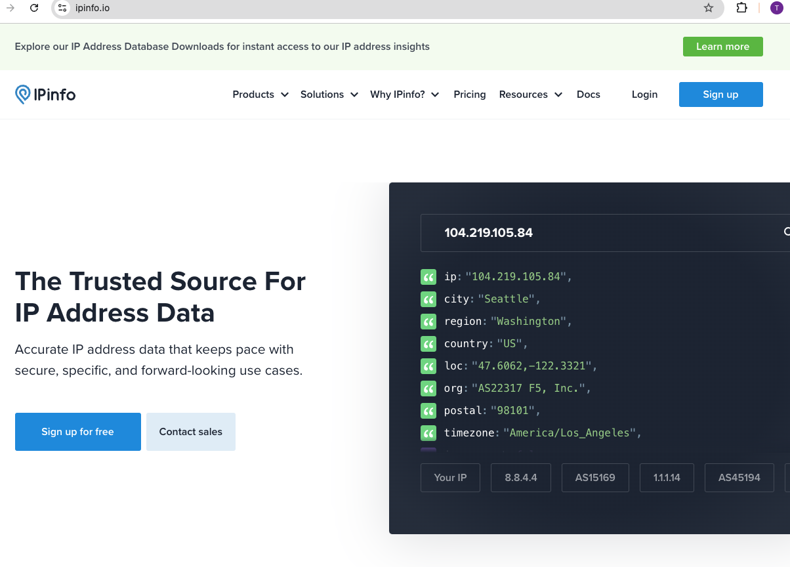
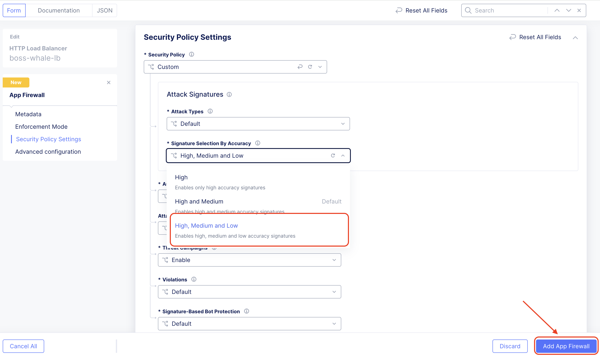
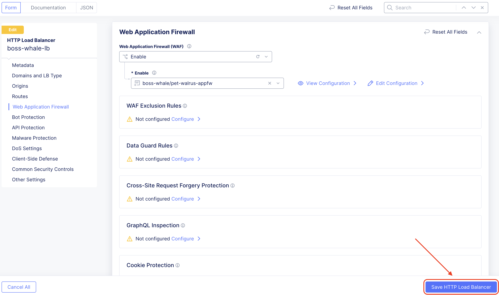
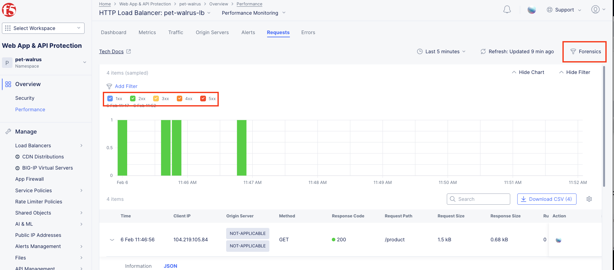
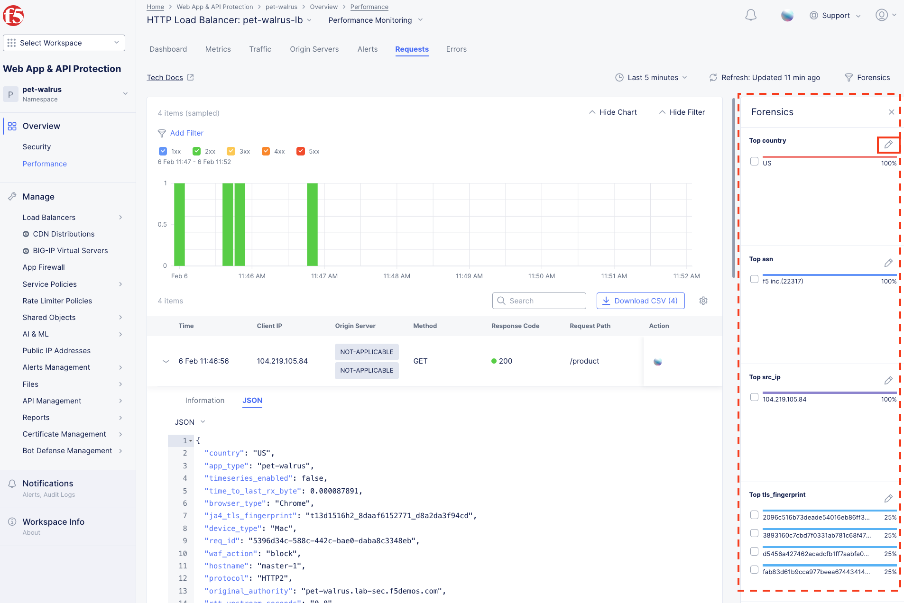
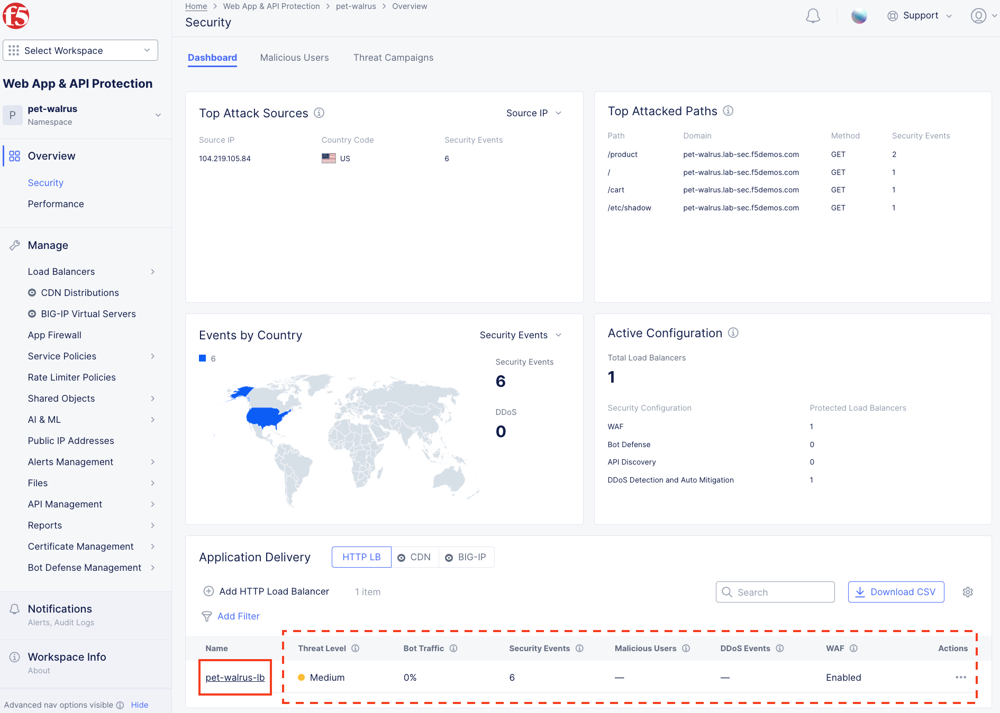
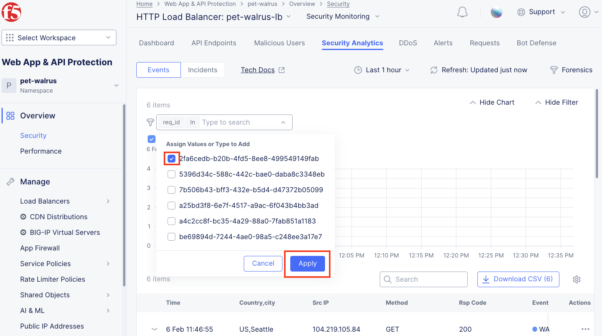
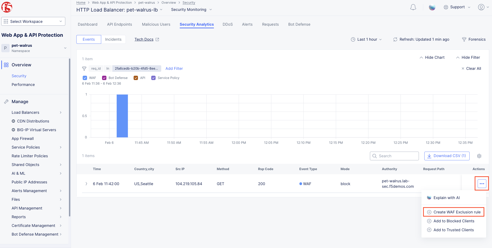
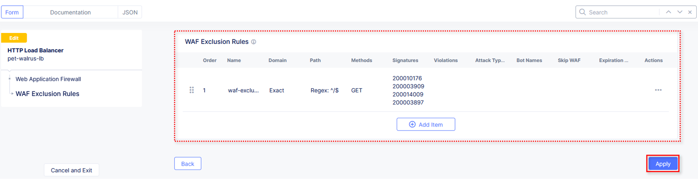
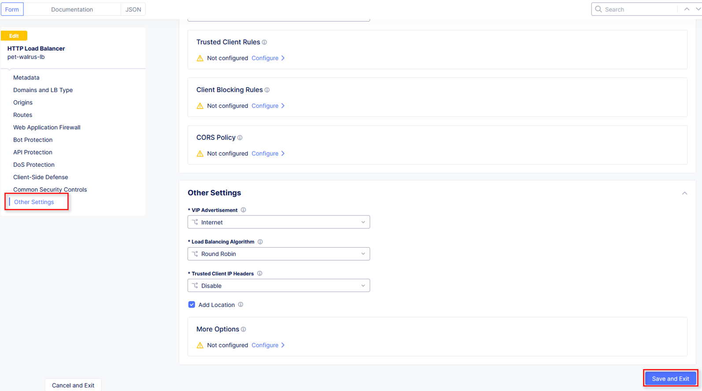

Lab 1: Deploying and Managing F5 Distributed Cloud Web Application Firewall Configuration
=========================================================================================

**Objective:**

* Explore and become familiar with the Distributed Cloud Console

* Review the F5 Distributed Cloud (XC) Load Balancer that has been provisioned

* Create a Web Application Firewall policy and attach to the F5 XC Load Balancer

**Narrative:** 

After consulting with your trusty F5 Solutions Engineer, you decide to adopt security services from 
F5 Distributed Cloud Web Application and API Protection (WAAP) suite. The lab provisioned for you 
has already deployed a F5 XC load balancer and been setup to route to your Azure application.  The 
F5 Distributed Cloud Application Delivery Network (ADN) will provide network connectivity for clients 
to first route to F5's nearest Regional Edge(RE) location on the ADN utilizing IP Anycast.  Once 
the client is connected to the their nearest F5 RE, security controls can now be applied so that 
malicous traffic can be dropped at the F5 RE and valid traffic can than be passed to ACME Azure environment.  
This lab will be deployed in a SaaS only configuration with no on-premises (public or private cloud) elements. 

.. NOTE:: You will not have direct access to the Azure environment where the application is hosted.

.. warning :: If you are using multiple labs in one course, understand that
   some steps below may be redundant depending on labs deployed. To gain full
   benefits from this lab, please delete any objects created in your prior lab
   and continue with this lab as all necessary objects will be recreated.

Following the tasks in the prior **Introduction** Section, you should now be
able to access the F5 Distributed Cloud Console, having set your Work Domain
Roles and Skill levels. If you have not done so already, please login to your
tenant for this lab using the **Accept Inivitation** link from your second email 
and proceed to Task 1.

**Expected Lab Time: 25 minutes**

Task 1: Exploring the F5 Distributed Console
~~~~~~~~~~~~~~~~~~~~~~~~~~~~~~~~~~~~~~~~~~~~

The following steps will allow you to review the XC Load Balancer that was 
deployed and is currently advertising a globally available application. These steps 
will allow you to review the application, its DNS entry and the Azure target that is 
configured as the origin.

#. Following the **Introduction** section instructions, you should now be the Home page
   of the F5 Distributed Cloud Console.  Let's first review the F5 Distributed Load Balancer
   that was configured for you via automation.  Select **Web App & API Protection**. 

#. On the **Web App & API Protection** page, note the identifier of your namespace.  The namespace
   will be follow a format of *adjective-animal*.  In this guide, the namespace is pet-walrus is an 
   example.  Your namespace will be different.  In the left-hand navigation expand **Manage** and 
   click **Load Balancers >  Origin Pools**

   |lab001| 

   |lab002| 

#. In the resulting screen expand the Actions Menu and click **Manage Configuration** for 
   the origin pool configured in your namespace. Here you will see the origin server public
   FQDN of the application running in ACME's Azure environment.  Copy the domain name so you 
   can visit the site directly from your web browser.  Click  **Cancel and Exit** to return 
   to the Origin Pools page since you will not need to make any updates to the configuration.

   |lab003| 

   |lab004|

#. Using your browser, visit this application directly utilizing its public FQDN. Select the 
   **Menu** on the top right-hand side and select **Header**.  
   
#. Note the Remote Address field. This will match the IP address of your endpoint.  You can verify 
   that it matches by looking up your IP address at https://ipinfo.io/.  

   |lab005|

   |lab006|

   |lab007|

   |lab008|

#. Next, let's return to the F5 Distributed Cloud console and take a look at the F5 XC load balancer 
   configured for you. In the left-hand navigation expand **Manage** and click **Load Balancers > HTTP Load Balancers**

#. In the resulting screen expand the Actions Menu and click **Manage Configuration** for 
   the load balancer configured in your namespace. The graphic below is an example.  Your environment 
   will have a different load balancer name but it should follow a similar naming convention 
   *adjective-animal*.

   |lab009|

   |lab010|

#. Using the left-hand navigation and in the sections as shown, review the
   following data. Values where **<namespace>** *adjective-animal* is represented, the configuration
   will be the name of your provisioned namespace.  Note the FQDN of the F5 XC load balancer.  

   * **Metadata**  *<namespace>-lb*
   * **Domains and LB Type**  *<namespace>.lab-sec.f5demos.com*
   * **Other Settings** VIP Advertisement

   .. note::
      *The VIP Advertisement selection controls how/where the application is advertised. The "Internet"*
      *setting means that this application will be advertised globally from the F5*
      *Distributed Cloud Global Network utilizing Anycast.*

   |lab011| 
  

#. Using your web browser, access the application via the F5 XC FQDN.  Click on **Menu > Header**

#. Note that the Remote Address has changed as well as the presence of a new X-Forwarded-For header.  
   The client information should have changed as you are now connecting first through the F5 ADN Regional Edge 
   before being proxied the the application running the ACME Corp Azure environment.  X-Forwarded-For details should 
   match your client IP address.  

   |lab012| 

   |lab013| 

Task 2: Configure WAF Policy on the Load Balancer
~~~~~~~~~~~~~~~~~~~~~~~~~~~~~~~~~~~~~~~~~~~~~~~~~

The following steps will guide you through adding a Web Application Firewall
(WAF) Policy. These steps will demonstrate various aspects of the
configuration.

#. Returning back to the F5 XC console and continuing in the **HTTP Load Balancer** section, 
   in the upper right hand corner select **Edit Configuration** and then in the left hand 
   menu click on the **Web Application Firewall (WAF)** drop down and select **Enable**.

   |lab014| ''
   |lab015| 

#. In the resulting **Enable** field drop down, select **Add Item**.

   |lab016|

   .. note::
      *The "shared/base-appfw" policy is in the "shared namespace" which can be
      applied to* *multiple Load Balancer configurations across namespaces,
      reducing policy sprawl.*

#. In the new window's **Metadata** section enter **<namespace>-appfw** for the
   **Name**.

#. Under **Enforcement Mode**, change the mode to **Blocking**.

#. In the **Detection Settings** section, click the **Security Policy**
   dropdown.

#. Select **Custom** from the dropdown menu. Additional configurations will
   become available

   |lab017|

   |lab018|

#. In the expanded configuration, in the **Attack Signatures** section use the
   dropdown for **Signature Selection by Accuracy** and select **High, Medium,
   and Low**.

   |lab019|

#. Leaving all other values as default, scroll to the bottom and click
   **Continue**.

   |lab020|

   .. note::
      *Automatic Attack Signatures Tuning is enabled which engages an automatic
      False Positive* *suppression engine.  Any suppressed events are logged
      within Security Events.*

   .. note::
      *Attack Signatures Staging is disabled.  This can be enabled should an
      Application* *Firewall with new or updated attack signatures be staged
      (monitored) for a period of* *prior to enforcement (blocking).*

#. Returning to the **HTTP Load Balancer** window, scroll to the bottom and click
   click **Save and Exit** at the bottom of the **HTTP Load Balancer** configuration screen.

   |lab021|

Narrative Check
---------------

You've built your first WAF policy on F5 Distributed Cloud.  This WAF policy can be applied
to any additional load balancers deployed in this namespace.  The F5 XC WAAP suite can be 
configured to protect applications across your on-prem data center, Azure, AWS, GCP and SAAS 
environments.  This allows your team to uniformly manage application security across all of your 
public, private and SAAS applications.  Now that you are familiar with how to build WAF policies 
on F5 Distributed Cloud, we can start getting our hands dirty with testing to ensure the ACME 
Azure application is protected.  

Task 3: Testing the WAF Policy & Reviewing Event Data
~~~~~~~~~~~~~~~~~~~~~~~~~~~~~~~~~~~~~~~~~~~~~~~~~~~~~

You will now perform basic testing of the Web Application Firewall (WAF)
Policy. You will also review the generated event data to make additional
configuration changes.

#. Open another tab in your browser (Chrome shown), navigate to the newly
   configured Load  Balancer configuration: **http://<namespace>.lab-sec.f5demos.com**, to confirm
   it is functional.

#. Using some of the sample attacks below, add the URI path & variables to your
   application to generate security event data.

   * ``/?cmd=cat%20/etc/passwd``
   * ``/product?id=4%20OR%201=1``
   * ``/../../../../etc/shadow``
   * ``/product?code=echo%20shell_exec(%27/sbin/ifconfig%20eth0%27);``
   * ``/cart?search=aaa'>``

#. In the resulting block screens, note the **URL** and the **Support ID**.
   (copy and paste to a notepad or note resource).

   |lab022|

   |lab023|

   |lab024|

Narrative Check
-----------------

The ACME Azure application is now being successfully protected by F5 Distributed Cloud.

#. Returning to the F5 Distributed Cloud Console, use the left-hand menu to
   select **Overview > Performance** section.  This dashboard will provide a summary 
   view for all of the configured Load Balancers.

   |lab025|

   .. note::
      *As you have not run many requests, summary analytics may not be
      available in the dashboard view yet.*

#. Scroll to the bottom and select your load balancer.

   |lab026|

#. From the **Performance Dashboard** view, using the horizontal navigation,
   click **Requests**.

#. Change the viewable time period from 5 minutes (default) to **1 hour** by
   selecting the dropdown shown, click **Last 1 hour** then click **Apply**.

   |lab027|

   .. note::
      *Security Event data may take 15-20 seconds to populate in the Console. Please force a
      refresh using the Refresh icon next to the Time Period selection in step 6.*

#. Expand one of the requests and note the **Information** tab link. This
   summarizes request details and provides request duration timing.

   |lab028|

#. Click on the **JSON** link to get more data about the request.

#. Click **Add Filter** as shown to see how you can filter by key identifiers.

   |lab029|

#. The resulting **Search** input field and listed **Keys**, can be used to
   filter requests in this view.

   |lab030|

   .. note::
      *The available Key list to search is dynamically updated based on the requests in the*
      *selected time view.*

#. Closing the filters view, note the available **Quick Filters** for Response
   Codes which allows quickly filtering the requests by toggling **on** or
   **off** each response code category.

#. Click the **Forensics** tab on the right side of the view as shown.

   |lab031|

#. The *Forensics* Filter  provides summarized top categories which provides
   quicker analysis of the request log data.  Collapse the **Forensics** view
   when done using the indicated arrow.

   |lab032|

   .. note::
      *Individual forensic categories can be changed using the noted pencil
      icon to surface additional top data details.*

#. Using the left-hand navigation, under **Overview** select
   **Security**.

   |lab033|

#. Review the **Security Dashboard** display (you may have limited data). NOTE: you may need
   to update the variable time period

   |lab034|

#. Scroll to **Load Balancers** section and click the **<namespace>-lb**  object.

   |lab035|

   .. note::
      *This is a multi-application view. Here you could get the summary security status of*
      *each application (iw Threat Level, WAF Mode, etc)* and then click into one for more*
      *specific details.*

#. From the **Security Dashboard** view, using the horizontal navigation, click
   **Security Analytics**.

   |lab036|

#. Expand your latest security event as shown.

   |lab037|

   .. note::
      *If you lost your 1 Hour Filter, re-apply using following the method described in the earlier task*

#. Note the summary detail provided **Information** link and identify the
   **Request ID** which is synonymous with **Support ID** (filterable) from the
   Security Event Block Page.

   |lab038|

#. Scroll to the bottom of the information screen to see specific signatures
   detected and actions taken during the security event.

   |lab039|

#. Next, click on the **Add Filter** link just under the **Security
   Analytics** title near the top of the **Security Analytics** window.
   
#. Type **req** in the open dialogue window and select **req_id** from the
   dropdown.

   |lab039a|

   |lab039b|
#. Next, select **In** from the **Select Operator** dropdown.

#. Finally, select/assign a value that matches one of your copied **Support
   IDs** from Task 3, Step 3 as shown.  You can also optionally just paste the
   Support ID in the value field and click **Apply**.

   |lab040|

   |lab041|

Narrative Check
-----------------

Upon foresnic review, your application team has told you that last request from 
**Support IDs** from the testing performed in Task 3, Step 2 as shown is actually a valid request. 
You will need to create an exception for this so that traffic can successfully pass.  This task
can be quickly accomplished in the XC console.  

#. In the XC console, you should now be filtered to a single "Security Event", as shown 
   with your selected filter. You can expand and review the request as desired using the
   **arrow** icon.

#. Under the **Actions** column, click on the three Action dots (Scroll to
   right).

#. Select **Create WAF Exclusion rule** from the dropdown that appears.

   |lab042|

   .. note::
      *Adding requestor/client to "Blocked or Trusted Clients" is also available.*

#. In the subsequent **Simple WAF Exclusion Rule** window, review the settings
   (which are editable) by scrolling through the window.  The values have been
   auto-populated based on the selected event to be excluded. Note the various
   sections and possible controls.

#. In the **Expiration Timestamp** field enter a timestamp 10 minutes from now
   at which the exclusion should expire. (helpful when testing/validating). the
   format should be as shown *YYYY-MM-DD HH:MM:SS+00:00
   (2025-02-06T11:21:00+00:00)*. **HH** must be in 24 hour format (there is no
   AM/PM).

   .. note::
      *Timestamps are in GMT*

#. Click **Apply** when complete.

   |lab043|

   |lab044|

   |lab045|
   
   .. note::
      If you get an error, you may need to add a Path RegEx **^/$**

#. Click **Apply** on the **WAF Exclusion Rules** summary screen.

   |lab046|

#. Scroll in the HTTP Load Balancer Configuration and note the
   added **WAF Exclusion Rules** configuration.

#. Scroll to the bottom of the **HTTP Load Balancer** configuration window and
   click the **Save and Exit** button.

   .. note::
      *Rerunning the attack you just excluded, you will see that it is no longer blocked*.

   |lab047|

   |lab048|

Task 4: Understanding Exclusions and Customizing WAF Policy
~~~~~~~~~~~~~~~~~~~~~~~~~~~~~~~~~~~~~~~~~~~~~~~~~~~~~~~~~~~

In this task you will come to understand how exclusions are applied. You will
also further customize the WAF policy just built to add a custom block response page.

#. In the **HTTP Load Balancers** window **(Manage > Load Balancers > HTTP Load
   Balancers)** Click on the three action dots in the **Actions** column then
   **Manage Configuration** from the dropdown menu.

   |lab049|

#. Click on the **JSON** tab in the horizontal navigation as shown and scroll
   to find the **waf_exclusion_rule** section. Observe that the exclusion rule
   is associated with the Load Balancer configuration and not the WAF Policy.

   .. note::
      *This allows for policy reuse and reduces the need for specific application WAF Policies*.

#. Click on the **Cancel and Exit** to return to the prior window.

   |lab050|

#. In the left-hand navigation menu, navigate to **Manage** section and click
   the **App Firewall** link.

#. On your App Firewall policy **<namespace>-appfw**, click the three dots
   in the **Actions** column and then click **Manage Configuration**.

   |lab051|

#. Click **Edit Configuration** in the top right corner.

   |lab052|

#. Use the left-hand navigation and click on **Advanced Configuration**.

#. Click the drop down menu for **Blocking Response Page** in the **Advanced
   Configuration** section.

   |lab053|

#. Click the dropdown on **Blocking Response Page** and select **Custom** from
   the dropdown.

   |lab054|

#. In the **Blocking Response Page Body** replace the existing text with the
   text provided below. Click **Save and Exit** when completed.

   |lab055|

   Sample Blocking Response Page to be copied:

   .. code:: HTML

      
      <html style="margin: 0;"><head><title>Rejected Request</title></head>
      <body style="margin : 0;">
      

      

      

      

      <table width="100%"><tr><td style="text-align: center;">
      

      
 
      Rejected Request
      

      
The requested URL was rejected. Please consult with your administrator.

      
Your Support ID is: {{request_id}}

      
<a href="javascript:history.back()">[Go Back]</a>

      

</td></tr></table>

      

      </body></html>

#. You can rerun an attack that was not excluded from Task 3: Step 2 to see the new custom block
   page.

   |lab056|

Narrative Check
-----------------
You have now completed your first WAF policy deployment on F5 XC.  This policy can be re-used for
other applications in the ACME environment and the exclusions you configured are only applied to this specific 
Azure application.  New applications that utilize the WAF policy configured will not have these exclusions
allowing you to quickly scale and manage exlusions on a per application basis while the policy can stay the same.

**End of Lab 1:**  This concludes Lab 1, feel free to review and test the
configuration.

A brief presentation will be shared prior to the beginning of Lab 2.

|labend|

.. |lab001| image:: _static/lab1-001.png
   :width: 800px

.. |lab003| image:: _static/lab1-003.png
   :width: 800px
.. |lab004| image:: _static/lab1-004.png
   :width: 800px
.. |lab005| image:: _static/lab1-005.png
   :width: 800px

.. |lab007| image:: _static/lab1-007.png
   :width: 800px

.. |lab009| image:: _static/lab1-009.png
   :width: 800px
.. |lab010| image:: _static/lab1-010.png
   :width: 800px
.. |lab011| image:: _static/lab1-011.png
   :width: 800px
.. |lab012| image:: _static/lab1-012.png
   :width: 800px
.. |lab013| image:: _static/lab1-013.png
   :width: 800px

.. |lab016| image:: _static/lab1-016.png
   :width: 800px

.. |lab018| image:: _static/lab1-018.png
   :width: 800px

.. |lab020| image:: _static/lab1-020.png
   :width: 800px

.. |lab025| image:: _static/lab1-025.png
   :width: 800px
.. |lab026| image:: _static/lab1-026.png
   :width: 800px
.. |lab027| image:: _static/lab1-027.png
   :width: 800px
.. |lab028| image:: _static/lab1-028.png
   :width: 800px
.. |lab029| image:: _static/lab1-029.png
   :width: 800px
.. |lab030| image:: _static/lab1-030.png
   :width: 800px

.. |lab033| image:: _static/lab1-033.png
   :width: 800px
.. |lab034| image:: _static/lab1-034.png
   :width: 800px

.. |lab036| image:: _static/lab1-036.png
   :width: 800px
.. |lab037| image:: _static/lab1-037.png
   :width: 800px
.. |lab038| image:: _static/lab1-038.png
   :width: 800px
.. |lab039| image:: _static/lab1-039.png
   :width: 800px

.. |lab040| image:: _static/lab1-040.png
   :width: 800px

.. |lab043| image:: _static/lab1-043.png
   :width: 800px
.. |lab044| image:: _static/lab1-044.png
   :width: 800px
.. |lab045| image:: _static/lab1-045.png
   :width: 800px

.. |lab047| image:: _static/lab1-047.png
   :width: 800px

.. |lab049| image:: _static/lab1-049.png
   :width: 800px
.. |lab050| image:: _static/lab1-050.png
   :width: 800px
.. |lab051| image:: _static/lab1-051.png
   :width: 800px
.. |lab052| image:: _static/lab1-052.png
   :width: 800px
.. |lab053| image:: _static/lab1-053.png
   :width: 800px
.. |lab054| image:: _static/lab1-054.png
   :width: 800px
.. |lab055| image:: _static/lab1-055.png
   :width: 800px

.. |labend| image:: _static/labend.png
   :width: 800px
