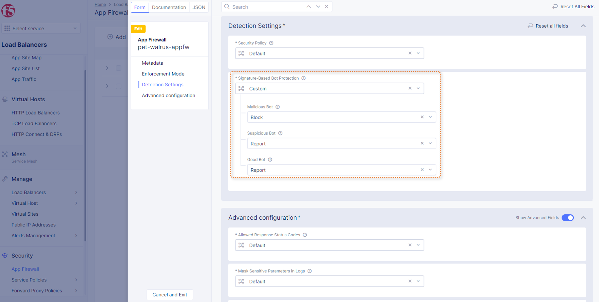
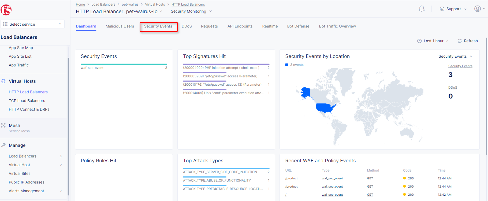
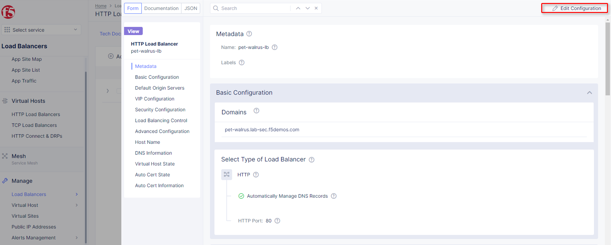

BotDefense
==========

`F5 Distributed Cloud Bot-Defense <https://www.f5.com/cloud/products/bot-defense>`_ protect against a broad set of bot-based attacks including credential stuffing, account takeover, fraud, and account abuse. This guided lab will step through the concepts found in the `How to guide <https://docs.cloud.f5.com/docs/how-to/advanced-security/bot-defense>`_. For additional review see the `Simulator <https://simulator.f5.com/s/bot_protect>`_.

Signature-based Bot protection   
~~~~~~~~~~~~~~~~~~~~~~~~~~~~~~

Review the Bot signature configuration and view logged security events.

#. In the left-hand navigation menu, expand the ``Security`` section, click ``App Firewall``. Towards the right side of the **blocking-app-firewall**, click the three dots in the ``Actions`` column, click ``Manage Configuration``, 

   |lab001|

#. Click ``Edit Configuration`` in the top right corner.

   |lab002|

#. On the left-side navigation, click ``Detection Settings`` and the in the ``Detection Settings`` section, select ``Signature-Based Bot Protection`` from the dropdown menu, and select ``Custom``.

   |lab003|

#. In the expanded configuration window, observe the three Bot signature categories; ``Malicious, Suspicious,`` and ``Good``. Also observe the actions ``Block, Ignore``, and ``Report`` which can be reviewed by selecting one of the dropdowns.

   |lab004|

#. Click ``Cancel and Exit`` to leave this window.

   |lab005|

#. Open a terminal window or DOS prompt on your respective client and issue the following command: **curl -v http://<namespace>lab-sec.f5demos.com**. Observe the ``User Agent`` and response content.

   |lab006|

#. Return to the F5 Distributed Cloud Console, in the left-hand navigation menu, expand the ``Virtual Hosts`` section, click ``HTTP Load Balancers``, select the http-load-balancer object, and select the ``Security Monitoring``.

   |lab007|

#. Select ``Security Monitoring``, and click ``Security Events``.

   |lab008|

#. Locate the security event, which was triggered by the curl request, expand the security event, and observe the "Suspicious" Bot reporting. The setting for Suspicious Bot was set to *Report*.

   |lab009|

AI-Driven BotDefense
~~~~~~~~~~~~~~~~~~~~

#. Open another tab in a browser (Chrome shown), navigate to the application/Load Balancer configuration: http://<namespace>.lab-sec.f5demos.com

   |lab010|

#. Enable developer tools (Chrome shown (use F12)) and click on the ``Network`` tab, click the 3 bars/menu icon (top right browser), navigate to ``Access`` link. Login to the website using the following credentials.

   - Identity: **user@f5.com**
   - Token: **password**

   |lab011|

#. In the Developer window, locate the **POST** request that was made to the **auth.php** page. You may use the filter to find auth.php.

   |lab012|

#. Select the ``Request`` tab in the payload window that appears and observe only a limited form POST data (identity, token, & submit).

   |lab013|

#. Navigate to: ``Manage`` > ``Load Balancer`` > ``HTTP Load Balancers``, click the **Action Dots** and click ``Manage Configuration``

   |lab014|

#. Click ``Edit Configuration`` in the top right-hand corner.

   |lab015|

#. Click ``Security Configuration`` in the left-hand navigation, on the ``Bot Defense Config`` dropdown.

   |lab016|

#. Select ``Specify Bot Defense Configuration``

   |lab017|

#. In the flyout click ``Configure``

   |lab018|

#. Locate the additional positioning options in the ``JavaScript Insertion`` section., click ``Configure`` in the ``Protected Endpoints Section``

   |lab019|

#. In the new ``App Endpoint Type`` click |add-item|

   |lab020|

#. In the ``Application Endpoint`` section supply the following values:

   * Metadata\\Name: *auth-bot*
   * HTTP Methods: *POST*
   * Protocol: *BOTH*
   * Path\\Path Match: *Prefix*
   * Prefix: */auth.php*
   * Bot Traffic Mitigation\Select Bot Mitigation Action: *Block*

   |lab021|

#. Scroll to the bottom and click |add-item|

   |lab022|

#. Click |apply| on the ``App Endpoint Type`` screen

   |lab023|

#. Click |apply| on ``Protected App Endpoints``

   |lab024|

#. Scroll to the bottom on the ``HTTP Load Balancer`` screen, and click |save-and-exit|

   |lab026|

#. Observe now that there is additional telemetry being passed in the POST request.  This telemetry will be used to determine if the connecting client is an Automated Bot.

   |lab027|

.. |save-and-exit| image:: images/save-and-exit.png
   :height: 24px

.. |lab001| image:: images/lab2-001.png
   :width: 800px
.. |lab002| image:: images/lab2-002.png
   :width: 800px
.. |lab003| image:: images/lab2-003.png
   :width: 800px

.. |lab005| image:: images/lab2-005.png
   :width: 800px
.. |lab006| image:: images/lab2-006.png
   :width: 800px
.. |lab007| image:: images/lab2-007.png
   :width: 800px

.. |lab009| image:: images/lab2-009.png
   :width: 800px
.. |lab010| image:: images/lab2-010.png
   :width: 800px
.. |lab011| image:: images/lab2-011.png
   :width: 800px
.. |lab012| image:: images/lab2-012.png
   :width: 800px
.. |lab013| image:: images/lab2-013.png
   :width: 800px
.. |lab014| image:: images/lab2-014.png
   :width: 800px

.. |lab016| image:: images/lab2-016.png
   :width: 800px
.. |lab017| image:: images/lab2-017.png
   :width: 800px
.. |lab018| image:: images/lab2-018.png
   :width: 800px
.. |lab019| image:: images/lab2-019.png
   :width: 800px
.. |lab020| image:: images/lab2-020.png
   :width: 800px
.. |lab021| image:: images/lab2-021.png
   :width: 800px
.. |lab022| image:: images/lab2-022.png
   :width: 800px
.. |lab023| image:: images/lab2-023.png
   :width: 800px
.. |lab024| image:: images/lab2-024.png
   :width: 800px
.. |lab025| image:: images/lab2-025.png
   :width: 800px
.. |lab026| image:: images/lab2-026.png
   :width: 800px
.. |lab027| image:: images/lab2-027.png
   :width: 800px
.. |labend| image:: images/labend.png
   :width: 800px
