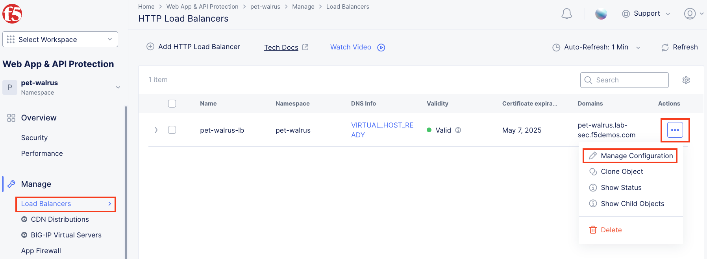
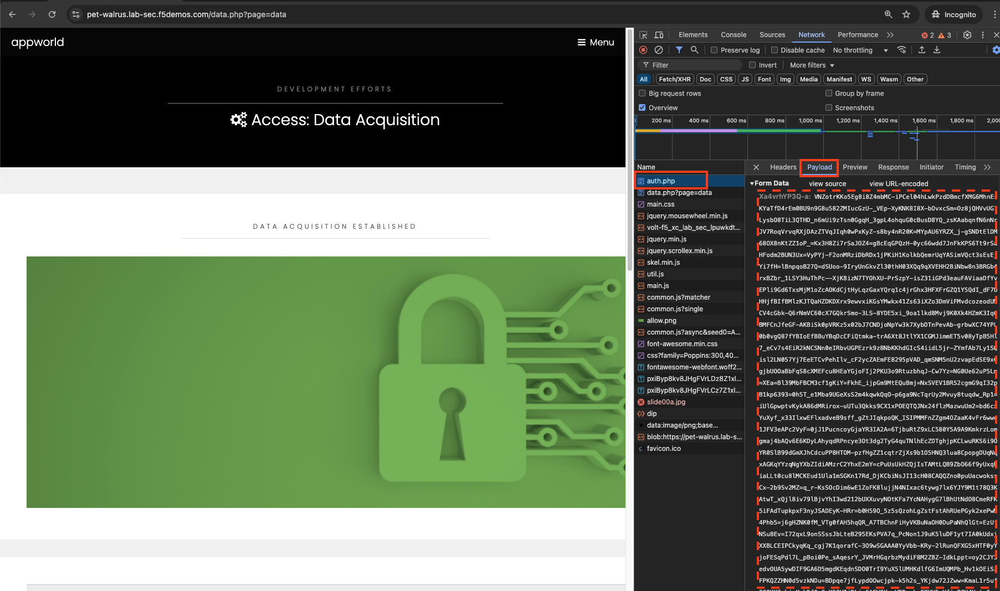

Lab 2: Reviewing Signature-based Bot Strategies and enabling F5 Distributed Cloud Bot Defense
=============================================================================================

The following lab tasks will guide you through a review of signature-based
Bot protections already available via the Web Application Firewall
configuration. The security configuration will then be extended through F5
Distributed Bot Defense, an AI-driven, behavioral security feature set to
protect the previously configured application from advanced Bot threats.

**Expected Lab Time: 25 minutes**

Task 1: Reviewing Signature-based Bot protection
~~~~~~~~~~~~~~~~~~~~~~~~~~~~~~~~~~~~~~~~~~~~~~~~

In this task you will review the Bot signature configuration and view
logged security events. This lab will begin back in the F5 Distributed
Cloud Console.

#. Return to **Web App & API Protection**, in the left-hand navigation menu,
   click on **App Firewall**, under **Manage**.

#. On your App Firewall policy **<namespace>-appfw**, click the three dots in
   the **Actions** column and then click **Manage Configuration**.

#. Click **Edit Configuration** in the top right corner.

   |lab001|

   |lab002|

#. Using the left-hand navigation, click **Detection Settings**.  In the
   **Detection** **Settings** section, click the **Signature-Based Bot
   Protection** dropdown menu.

#. From the **Signature-Based Bot Protection** dropdown menu, select **Custom**

   |lab003|

#. In the expanded configuration window, observe the three Bot signature
   categories:

   **Malicious, Suspicious,** and **Good**. Also observe the actions
   **Block, Ignore**, and **Report** which can be reviewed by selecting
   one of the dropdowns.

#. Click **Cancel and Exit** to leave this window.

   |lab004|

   |lab005|

#. Open a terminal window or DOS prompt on your respective client and issue the
   following **curl** command.

   .. code:: BASH

      curl -v http://<namespace>.lab-sec.f5demos.com

#. Observe the **User Agent** and response content.

   .. note:: *curl is installed on Windows10+, and is available on most Linux or
      MAC platforms*.

#. Return to the F5 Distributed Cloud Console, within **Web App & API
   Protection** in the left-hand navigation menu, under **Overview** click on **Security**

   |lab007|

#. Within the **Security** dashboard, scroll down to the **Load Balancer**
   section and click the configured Load Balancer **<namespace>-lb**.

   |lab008|

#. Select **Security Analytics** from the horizontal navigation.

#. Locate the most recent security event, which should be your curl request.
   Expand the security event as you have done in prior exercises to observe
   the "Suspicious" Bot reporting. Remember the setting for Suspicious Bot was
   set to *Report* from Step 6 above.

   .. note:: *You can review the steps of Lab1, Task 3, Step 8 to locate the
      information detail*.

   |lab009|

   **Task 1: Optional Advanced Topic**

   Signature based Bot detection can be easily bypassed. By simply presenting a
   less suspicious user-agent string, a threat actor can easily bypass the
   signature-based detection algorithm.

   For example, if you repeat the curl request and with a less suspicious
   user-agent, you will skip signature-based bot detection. For example, if you
   run the following command:

   .. code:: BASH

      curl -v http://<namespace>.lab-sec.f5demos.com --user-agent "Mozilla/5.0 (Macintosh; Intel Mac OS X 10_15_7) AppleWebKit/605.1.15 (KHTML, like Gecko) Version/17.2.1 Safari/605.1.15"

   This HTTP request will not show up in the Security Analytics however you
   will find it in Request logging.

Task 2: Enabling F5 Distributed Cloud Bot Defense
~~~~~~~~~~~~~~~~~~~~~~~~~~~~~~~~~~~~~~~~~~~~~~~~~

The following steps will enable you to deploy F5 Distributed Cloud Bot Defense
and understand its implementation.

#. Open another tab in your browser (Chrome shown), navigate to your
   application/Load Balancer configuration:
   **http://<namespace>.lab-sec.f5demos.com**.

#. Enable developer tools (Chrome shown (use F12)) and click on the **Network**
   tab.

#. Using the 3 bars/menu icon (top right), navigate to **Access** link.

#. In the resulting login screen use the following values to login and click
   **Submit**

   - **Identity:** **user@f5.com**
   - **Token:** **password**

   |lab010|

   |lab011|

#. In the Developer window, find the **POST** to **auth.php**. **You can also
   use the filter** to find **auth.php**. Select the respective line as shown.

#. Select the **Request** tab in the payload window that appears and observe
   that you only see limited form POST data (identity, token, & submit).

   |lab012|

   |lab013|

   .. warning:: *Make sure to logoff using the menu on the right of the web
      application you just accessed*

   **Task 2: Optional Advanced Topics - Part 1**

   Let’s explore how an attacker could perform credential stuffing attacks by
   using the curl command:

   .. code:: BASH

      curl -v http://<namespace>.lab-sec.f5demos.com/auth.php -H "Content-Type: application/x-www-form-urlencoded" --user-agent "Mozilla/5.0 (Macintosh; Intel Mac OS X 10_15_7) AppleWebKit/605.1.15 (KHTML, like Gecko) Version/17.2.1 Safari/605.1.15" --data-raw "identity=user%40f5.com&token=password&submit=Submit"

   For this application, a successful logon will have a 302 response to the
   location ./data.php?page=data

   If we try an invalid password (password2 instead of password) for the same
   request, we will also get a 302 response to the location
   ./index.php?page=access&err=02

   With this knowledge, we could use curl to perform a credential stuffing
   attack and potentially avoid detection.

   |lab013a|

   *Note the return location of a successful logon above*

   |lab013b|

   *Note the return location of a failed logon above*

#. Return to the Load Balancer in the F5 Distributed Cloud Console, **Manage >
   Load Balancer > HTTP Load Balancers** and use the **Action Dots** and
   click **Manage Configuration**

#. Click **Edit Configuration** in the top right-hand corner.

   |lab014|

   |lab015|

#. Click **Bot Protection** in the left-hand navigation.

#. In the **Bot Protection** section, use the drop down under **Bot Defense**
   and select **Enable Bot Defense Standard**.

   |lab016|

#. In the new **Bot Defense Policy** section, click **Configure**.

#. In the new **Protected App Endpoints** window, under **App Endpoint Type**,
   click **Configure**.

#. In the new **App Endpoint Type** window, click  **Add Item**.

   |lab017|

   |lab018|

   |lab019|

#. In the **Application Endpoint** input the following values in the fields
   identified:

   - **Name:** *auth-bot*
   - **HTTP Methods:** *POST*
   - **Protocol:** *BOTH*
   - **Path\\Path Match:** *Prefix*
   - **Path\\Prefix:** */auth.php*
   - **Bot Traffic Mitigation\\Select Bot Mitigation Action:** *Block*

   |lab020|

   |lab021|

#. Scroll to the bottom and click **Apply**.

#. Click **Apply** on the **App Endpoint Type** window.

#. Observe the additional positioning options in the **JavaScript Insertion**
   section of the **Protected App Endpoints** window, then click **Apply**.

   |lab022|

   |lab023|

#. Observe that the **Bot Defense Policy** is now configured.

#. Click **Other Settings** in the left-hand navigation or scroll to the
   bottom on the **HTTP Load Balancer** screen, and click **Save and Exit**.

   |lab024|

   |lab025|

#. Repeat Task 2 Steps 1-6.  Note you many need to close your browser and clear
   cookies

#. Observe now that there is additional telemetry being passed in the POST
   request. This telemetry will be used to determine if the connecting client
   is an Automated Bot.

   |lab027|

   **Task 2: Optional Advanced Topics - Part 2**

   Will F5 Distributed Cloud Bot Defense will prevent curl initiated logon
   requests and its ability to perform credential stuffing attacks. Let’s find
   out. Re-run our previously successful logon attempt:

   .. code:: BASH

      curl -v http://<namespace>.lab-sec.f5demos.com/auth.php -H "Content-Type: application/x-www-form-urlencoded" --user-agent "Mozilla/5.0 (Macintosh; Intel Mac OS X 10_15_7) AppleWebKit/605.1.15 (KHTML, like Gecko) Version/17.2.1 Safari/605.1.15" --data-raw "identity=user%40f5.com&token=password&submit=Submit"

   As you can see, instead of signaling to a potential attacker that they have
   a good or bad password, we have prevented the would-be attacker from
   programmatically testing accounts.

   F5 Distributed Cloud Bot Defense can protect against basic attacks performed
   with commands like curl to the most advanced attacks.

   |lab027a|

**End of Lab 2:**  This concludes Lab 2, feel free to review and test the
configuration. A brief presentation will be shared prior to the beginning of
Lab 3.

|labend|

.. |lab001| image:: _static/lab2-001.png
   :width: 800px
.. |lab002| image:: _static/lab2-002.png
   :width: 800px

.. |lab004| image:: _static/lab2-004.png
   :width: 800px

.. |lab006| image:: _static/lab2-006.png
   :width: 800px

.. |lab008| image:: _static/lab2-008.png
   :width: 800px
.. |lab009| image:: _static/lab2-009.png
   :width: 800px
.. |lab010| image:: _static/lab2-010.png
   :width: 800px
.. |lab011| image:: _static/lab2-011.png
   :width: 800px
.. |lab012| image:: _static/lab2-012.png
   :width: 800px
.. |lab013| image:: _static/lab2-013.png
   :width: 800px
.. |lab013a| image:: _static/lab2-013a.png
   :width: 800px
.. |lab013b| image:: _static/lab2-013b.png
   :width: 800px

.. |lab017| image:: _static/lab2-017.png
   :width: 800px
.. |lab018| image:: _static/lab2-018.png
   :width: 800px
.. |lab019| image:: _static/lab2-019.png
   :width: 800px

.. |lab021| image:: _static/lab2-021.png
   :width: 800px
.. |lab022| image:: _static/lab2-022.png
   :width: 800px
.. |lab023| image:: _static/lab2-023.png
   :width: 800px
.. |lab024| image:: _static/lab2-024.png
   :width: 800px
.. |lab025| image:: _static/lab2-025.png
   :width: 800px

.. |lab027| image:: _static/lab2-027.png
   :width: 800px
.. |lab027a| image:: _static/lab2-027a.png
   :width: 800px
.. |labend| image:: _static/labend.png
   :width: 800px
