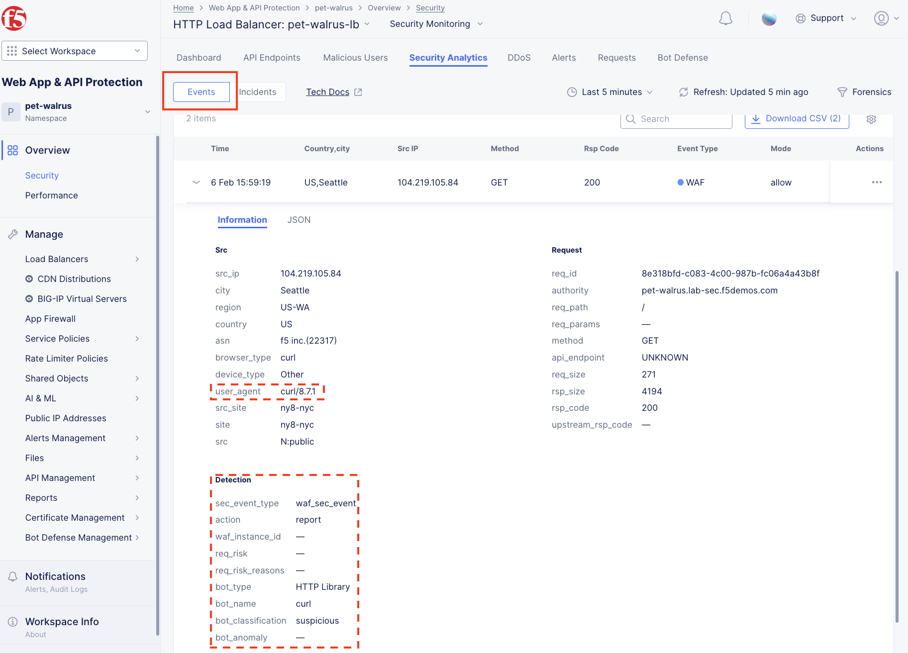
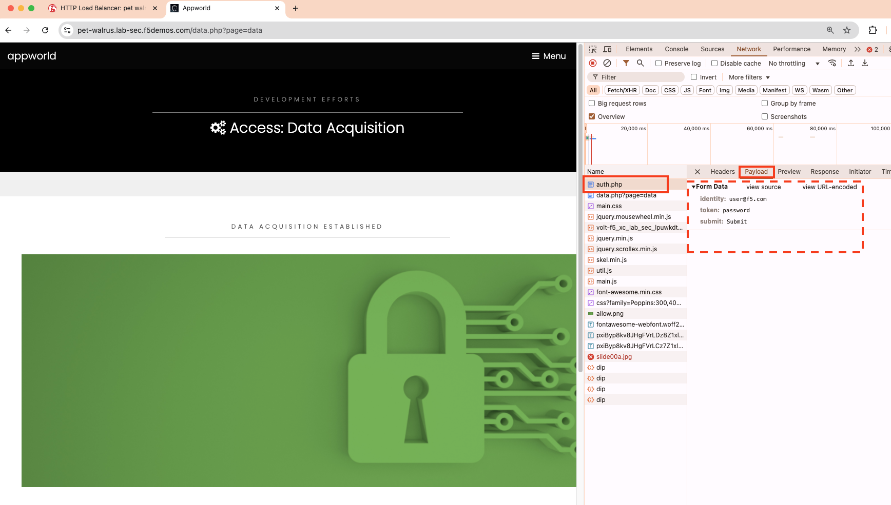

Lab 2: Reviewing Signature-based Bot Strategies and enabling F5 Distributed Cloud BotDefense
============================================================================================

The following lab tasks will guide you through a review of signature-based Bot protections
already available via the Web Application Firewall configuration. The security configuration
will then be extended through F5 Distributed Bot Defense, an AI-driven, behavioral security 
feature set to protect the previously configured application from advanced Bot threats. 

Task 1: Reviewing Signature-based Bot protection   
~~~~~~~~~~~~~~~~~~~~~~~~~~~~~~~~~~~~~~~~~~~~~~~~
In this task you will review the Bot signature configuration and view logged security events.
This lab will begin back in the F5 Distributed Cloud Console.

+----------------------------------------------------------------------------------------------+
| 1. In the left-hand navigation menu, expand the **Security** section and click the **App**   |
|                                                                                              |
|    **Firewall** link.                                                                        |
|                                                                                              |
| 2. On your App Firewall policy **<namespace>-appfw**, click the three dots in the **Actions**|
|                                                                                              |
|    column and then click **Manage Configuration**.                                           |
|                                                                                              |
| 3. Click **Edit Configuration** in the top right corner.                                     |
+----------------------------------------------------------------------------------------------+
| |lab001|                                                                                     |
|                                                                                              |
| |lab002|                                                                                     |
+----------------------------------------------------------------------------------------------+

+----------------------------------------------------------------------------------------------+
| 4. Using the left-hand navigation, click **Detection Settings** and the in the **Detection** |
|                                                                                              |
|    **Settings** section, click the **Signature-Based Bot Protection** dropdown menu.         |
|                                                                                              |
| 5. From the **Signature-Based Bot Protection** dropdown menu, select **Custom**.             |
+----------------------------------------------------------------------------------------------+
| |lab003|                                                                                     |
+----------------------------------------------------------------------------------------------+

+----------------------------------------------------------------------------------------------+
| 6. In the expanded configuration window, observe the three Bot signature categories;         |
|                                                                                              |
|    **Malicious, Suspicious,** and **Good**. Also observe the actions **Block, Ignore**, and  |
|                                                                                              |
|    **Report** which can be reviewed by selecting one of the dropdowns.                       |
|                                                                                              |
| 7. Click **Cancel and Exit** to leave this window.                                           |
+----------------------------------------------------------------------------------------------+
| |lab004|                                                                                     |
|                                                                                              |
| |lab005|                                                                                     |
+----------------------------------------------------------------------------------------------+

+----------------------------------------------------------------------------------------------+
| 8. Open a terminal window or DOS prompt on your respective client and issue the following    |
|                                                                                              |
|    **curl** command: *curl -v http://<namespace>lab-sec.f5demos.com*.                        |
|                                                                                              |
| 9. Observe the **User Agent** and response content.                                          |
|                                                                                              |
| .. note::                                                                                    |
|    *curl is installed on Windows10+, and is available on most Linux or MAC platforms*.       |
+----------------------------------------------------------------------------------------------+
| |lab006|                                                                                     |
+----------------------------------------------------------------------------------------------+

+----------------------------------------------------------------------------------------------+
| 10. Return to the F5 Distributed Cloud Console, in the left-hand navigation menu, expand the |
|                                                                                              |
|     **Virtual Hosts** section and click the **HTTP Load Balancers** link.                    |
|                                                                                              |
| 11. On your named Load Balancer, select the **Security Monitoring**, link as shown.          |
+----------------------------------------------------------------------------------------------+
| |lab007|                                                                                     |
+----------------------------------------------------------------------------------------------+

+----------------------------------------------------------------------------------------------+
| 12. From the **Security Monitoring** Dashboard, select **Security Events**.                  |
+----------------------------------------------------------------------------------------------+
| |lab008|                                                                                     |
+----------------------------------------------------------------------------------------------+

+----------------------------------------------------------------------------------------------+
| 13. Locate your most recent security event, which should be your curl request. Expand the    |
|                                                                                              |
|     security event as you have done in prior exercises to observe the "Suspicious" Bot       |
|                                                                                              |
|     reporting. Remember the setting for Suspicious Bot was set to *Report* from Step 5 above.|
+----------------------------------------------------------------------------------------------+
| |lab009|                                                                                     |
+----------------------------------------------------------------------------------------------+

Task 2: Enabling AI-Driven F5 Distributed Cloud BotDefense
~~~~~~~~~~~~~~~~~~~~~~~~~~~~~~~~~~~~~~~~~~~~~~~~~~~~~~~~~~

The following steps will enable you to deploy F5 Distributed Cloud BotDefense and understand its
implementation.

+----------------------------------------------------------------------------------------------+
| 1. Open another tab in your browser (Chrome shown), navigate to your application/Load        |
|                                                                                              |
|    Balancer configuration: **http://<namespace>.lab-sec.f5demos.com**.                       |
|                                                                                              |
| 2. Enable developer tools (Chrome shown (use F12)) and click on the **Network** tab.         |
|                                                                                              |
| 3. Using the 3 bars/menu icon (top right), navigate to **Access** link.                      |
|                                                                                              |
| 4. In the resulting login screen use the following values to login and click **Submit**      |
|                                                                                              |
|    - **Identity:** **user@f5.com**                                                           |
|    - **Token:** **password**                                                                 |
+----------------------------------------------------------------------------------------------+
| |lab010|                                                                                     |
|                                                                                              |
| |lab011|                                                                                     |
+----------------------------------------------------------------------------------------------+

+----------------------------------------------------------------------------------------------+
| 5. In the Developer window, find the **POST** to **auth.php**. *You can also use the filter* |
|                                                                                              |
|    *to find auth.php*. Select the respective line as shown.                                  |
|                                                                                              |
| 6. Select the **Request** tab in the payload window that appears and observe that you only   |
|                                                                                              |
|    see limited form POST data (identity, token, & submit).                                   |
+----------------------------------------------------------------------------------------------+
| |lab012|                                                                                     |
|                                                                                              |
| |lab013|                                                                                     |
+----------------------------------------------------------------------------------------------+

+----------------------------------------------------------------------------------------------+
| 7. Return to the Load Balancer in the F5 Distributed Cloud Console, *Manage > Load Balancer* |
|                                                                                              |
|    *> HTTP Load Balancers* and use the **Action Dots** and click **Manage Configuration**    |
|                                                                                              |
| 8. Click **Edit Configuration** in the top right-hand corner.                                |
+----------------------------------------------------------------------------------------------+
| |lab014|                                                                                     |
|                                                                                              |
| |lab015|                                                                                     |
+----------------------------------------------------------------------------------------------+

+----------------------------------------------------------------------------------------------+
| 9. Click **Security Configuration** in the left-hand navigation.                             |
|                                                                                              |
| 10. From the **Bot Defense Config** dropdown, select **Specify Bot Defense Configuration**.  |
|                                                                                              |
| 11. In the added menu option, click **Configure**.                                           |
+----------------------------------------------------------------------------------------------+
| |lab016|                                                                                     |
|                                                                                              |
| |lab017|                                                                                     |
|                                                                                              |
| |lab018|                                                                                     |
+----------------------------------------------------------------------------------------------+

+----------------------------------------------------------------------------------------------+
| 12. Observe the additional positioning options in the **JavaScript Insertion** section.      |
|                                                                                              |
| 13. Click **Configure** in the **Protected Endpoints Section**                               |
|                                                                                              |
| 14. In the new **App Endpoint Type** click **Add Item**                                      |
+----------------------------------------------------------------------------------------------+
| |lab019|                                                                                     |
|                                                                                              |
| |lab020|                                                                                     |
+----------------------------------------------------------------------------------------------+

+----------------------------------------------------------------------------------------------+
| 15. In the **Application Endpoint** scroll through the section use the following values:     |
|                                                                                              |
|     * **Metadata\\Name:** *auth-bot*                                                         |
|     * **HTTP Methods:** *POST*                                                               |
|     * **Protocol:** *BOTH*                                                                   |
|     * **Path\\Path Match:** *Prefix*                                                         |
|     * **Prefix:** */auth.php*                                                                |
|     * **Bot Traffic Mitigation\Select Bot Mitigation Action:** *Block*                       |
|                                                                                              |
| 16. Scroll to the bottom and click **Add Item**                                              |
+----------------------------------------------------------------------------------------------+
| |lab021|                                                                                     |
|                                                                                              |
| |lab022|                                                                                     |
+----------------------------------------------------------------------------------------------+

+----------------------------------------------------------------------------------------------+
| 17. Then click **Apply** on the **App Endpoint Type** screen                                 |
|                                                                                              |
| 18. Then click **Apply** on the **Protected App Endpoints** screen                           |
|                                                                                              |
| 19. Then scroll to the bottom on the **HTTP Load Balancer** screen, and click **Save and**   |
|     **Exit**.                                                                                |
+----------------------------------------------------------------------------------------------+
| |lab023|                                                                                     |
|                                                                                              |
| |lab024|                                                                                     |
|                                                                                              |
| |lab025|                                                                                     |
|                                                                                              |
| |lab026|                                                                                     |
+----------------------------------------------------------------------------------------------+

+----------------------------------------------------------------------------------------------+
| 20. Repeat Task 2 Steps 1-6.  Note you many need to close your browser and clean cookies     |
|                                                                                              |
| 21. Observe now that there is additional telemetry being passed in the POST request.  This   |
|                                                                                              |
|     telemetry will be used to determine if the connecting client is an Automated Bot.        |
+----------------------------------------------------------------------------------------------+
| |lab027|                                                                                     |
+----------------------------------------------------------------------------------------------+

+----------------------------------------------------------------------------------------------+
| **End of Lab 2:**  This concludes Lab 2, feel free to review and test the configuration.     |
|                                                                                              |
| A brief presentation will be shared prior to the beginning of Lab 3.                         |
+----------------------------------------------------------------------------------------------+
| |labend|                                                                                     |
+----------------------------------------------------------------------------------------------+

.. |lab001| image:: _static/lab2-001.png
   :width: 800px

.. |lab003| image:: _static/lab2-003.png
   :width: 800px

.. |lab005| image:: _static/lab2-005.png
   :width: 800px
.. |lab006| image:: _static/lab2-006.png
   :width: 800px
.. |lab007| image:: _static/lab2-007.png
   :width: 800px

.. |lab014| image:: _static/lab2-014.png
   :width: 800px
.. |lab015| image:: _static/lab2-015.png
   :width: 800px
.. |lab016| image:: _static/lab2-016.png
   :width: 800px
.. |lab017| image:: _static/lab2-017.png
   :width: 800px

.. |lab020| image:: _static/lab2-020.png
   :width: 800px
.. |lab021| image:: _static/lab2-021.png
   :width: 800px

.. |lab025| image:: _static/lab2-025.png
   :width: 800px
.. |lab026| image:: _static/lab2-026.png
   :width: 800px

.. |labend| image:: _static/labend.png
   :width: 800px
