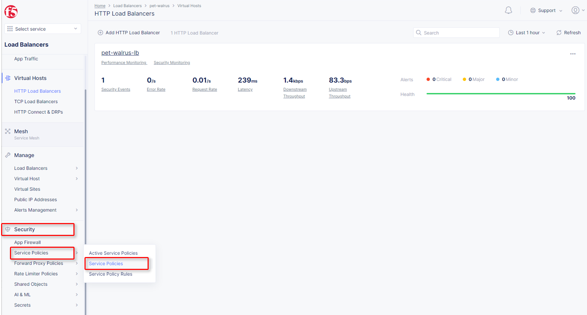
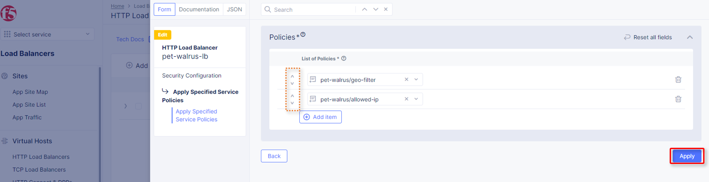

Service Policies 
================

This guided lab is used to configure service policies which are used in conjuntion with WAF policies to add additional security controls to an application. The steps in this guide are based on the `Service Policy How To <https://docs.cloud.f5.com/docs/how-to/app-security/service-policy>`_ guide, as well as the `IP Reputation How to <https://docs.cloud.f5.com/docs/how-to/advanced-security/configure-ip-reputation>`_

Namespace Service Policies  
~~~~~~~~~~~~~~~~~~~~~~~~~~

This section of the guided lab will Add geo-filter and allowed-ip based service policies.

#. In the left-hand navigation menu, expand the ``Security`` section and click ``Service Policies``. In the flyout menu, click the ``Service Policies`` link.

   |lab001|

#. Click ``Add Service Policy`` in the top left area as shown.

   |lab002|

#. In the ``Metadata`` section enter ``geo-filter`` for the ``Name`` and then click ``Rules`` in the left-hand navigation.

   |lab003|

#. Select ``Denied Sources`` from the dropdown for ``Select Policy Rules``.

   |lab004|

#. Locate the ``Country List`` input field, and begin typing ``Fiji``, and then select it from the list that appears.

   |lab005|

#. Click the dropdown for ``Default Action``. Observe the available options and select

   ``Next Policy`` then click ``Save and Exit``

   |lab006|

#. Observe the resulting added ``geo-filter`` Service Policy added in your namespace.

   |lab007|

#. Open another tab in your browser (Chrome shown), navigate to https://ipinfo.io and note your IP address as shown. (example provided)

   |lab008|

#. Return to the ``Service Policies`` window and click ``Add Service Policy``.

   |lab009|

#. In the ``Metadata`` section enter ``allowed-ip`` for the ``Name`` and then click ``Rules`` in the left-hand navigation.

   |lab010|

#. Select ``Allowed Sources`` from the dropdown for ``Select Policy Rules``

   |lab011|

#. locate the ``IPv4 Prefix List`` configuration section and click ``Configure``

   |lab012|

#. Enter your IP address with mask notation (/32), then click ``Apply``

   |lab013|

#. Click the dropdown for ``Default Action``, select ``Deny``, and click ``Save and Exit``.

   |lab014|

#. Observe the resulting added ``allowed-ip`` Service Policy added in your namespace.

   |lab015|

   |lab016|

IP Reputation
~~~~~~~~~~~~~

Attach Service Policies to your configured Load Balancer.

#. Return to the Load Balancer in the F5 Distributed Cloud Console, ``Manage`` > ``Load Balancer`` > ``HTTP Load Balancers``

   |lab017|

#. Click ``Manage Configuration``

   |lab018|

#. Click ``Edit Configuration`` in the top right-hand corner.

   |lab019|

#. Click ``Security Configuration`` in the left-hand navigation.

   |lab020|

#. From the ``Service Policies`` dropdown, select ``Apply Specified Service Policies``.

   |lab021|

#. In the added menu for ``Apply Specified Service Policies``, click ``Configure``.

   |lab022|

#. In the resulting ``Policies`` window, use the ``List of Policies`` dropdown to select your ``<namespace>/geo-filter`` Service Policy. Then click ``Apply``.

   |lab023|

#. Returning to the Load Balancer dialogue, note the changes shown in the ``Service Policies`` section.

#. As we are already in this section, we will go ahead and add IP reputation filtering. This can be added as a Service Policy (shared or local namespace) or as a direct configuration.

#. To start, the IP Reputation configuration, locate the IP Reputation section and click the dropdown menu, then select ``Enable``.

   |lab025|

#. Using the ``List of IP Threat Categories to choose`` add any of the configured Threat categories.

   |lab026|

#. Select ``Spam Sources`` and ``Tor Proxy``, then scroll to the bottom of the window and click the ``Save and Exit`` button.

   |lab027|

#. In your browser (Chrome shown), navigate to your application/Load Balancer configuration: ``http://<namespace>.lab-sec.f5demos.com``

   |lab029|

#. You should receive a 403 Forbidden error.  This is due to a Service Policy configuration error.  Because we only attached the ``geo-filter`` Service Policy and the ``Default Action`` was ``Next Policy``, there is no other or next policy to "Allow" traffic, therefore, all other traffic is disallowed producing the 403.  This is will also show in the ``Security Events`` window.

   |lab028|

#. Return to the Load Balancer in the F5 Distributed Cloud Console, *Manage > Load Balancer* *> HTTP Load Balancers* and use the ``Action Dots`` and click ``Manage Configuration``

   |lab030|

#. Click ``Edit Configuration`` in the top right-hand corner.

   |lab031|

#. Click ``Security Configuration`` in the left-hand navigation.

#. From the ``Service Policies`` section, click ``Edit Configuration``.

   |lab032|

#. In the resulting window click ``Add Item`` and from the dropdown select you allow-ip Service Policy ``<namespace>/allowed-ip``.

   |lab033|

#. Observe the order. Service Policies must be ordered correctly in a order to process traffic as intended.  Click ``Apply`` when completed.

   .. note:: The **allowed-ip** begins with an allowed ip (yours) and ends in a "Deny" a positive security model will be applied (denying all other traffic).  Similar positive or negative service policies can be created and applied (Headers, methods, file types, etc)

   |lab034|

#. Scroll to the bottom of the HTTP Load Balancer configuration and click ``Save and Exit``.

   |lab035|

#. In your browser, navigate to the application/Load Balancer URL: ``http://<namespace>.lab-sec.f5demos.com`` and successfully log in.

   |lab036|

Routes
~~~~~~

Attach Service Policies to the configured Load Balancer.

#. Navigate to ``Manage`` > ``Load Balancer`` > ``HTTP Load Balancers``, click the **Action Dots**, and click ``Manage Configuration``

   |lab037|

#. Click ``Routes Configuration`` in the left-hand navigation, and select ``Edit Configuration``

   |lab038|

#. Toggle the ``Show Advanced Fields`` button to the **On** position, and Under the ``Routes`` section, click ``Configure``.

   |lab039|

#. In ``Routes``, click the ``Add Item`` link.

   |lab040|

#. In the resulting menu, toggle the ``Show Advanced Fields`` button to the **On** position.

   |lab041|

#. Observe the various route types and matching criteria controls that can be leveraged to securely control access, perform pool targeting, make path responses or develop custom control to secure protected applications.

.. |save-and-exit| image:: images/save-and-exit.png
   :height: 24px

.. |add-item| image:: images/add-item.png
   :height: 24px

.. |apply| image:: images/apply.png
   :height: 24px

.. |lab002| image:: images/lab3-002.png
   :width: 800px
.. |lab003| image:: images/lab3-003.png
   :width: 800px
.. |lab004| image:: images/lab3-004.png
   :width: 800px
.. |lab005| image:: images/lab3-005.png
   :width: 800px
.. |lab006| image:: images/lab3-006.png
   :width: 800px
.. |lab007| image:: images/lab3-007.png
   :width: 800px
.. |lab008| image:: images/lab3-008.png
   :width: 800px
.. |lab009| image:: images/lab3-009.png
   :width: 800px
.. |lab010| image:: images/lab3-010.png
   :width: 800px
.. |lab011| image:: images/lab3-011.png
   :width: 800px
.. |lab012| image:: images/lab3-012.png
   :width: 800px
.. |lab013| image:: images/lab3-013.png
   :width: 800px
.. |lab014| image:: images/lab3-014.png
   :width: 800px
.. |lab015| image:: images/lab3-015.png
   :width: 800px
.. |lab016| image:: images/lab3-016.png
   :width: 800px
.. |lab017| image:: images/lab3-017.png
   :width: 800px
.. |lab018| image:: images/lab3-018.png
   :width: 800px
.. |lab019| image:: images/lab3-019.png
   :width: 800px
.. |lab020| image:: images/lab3-020.png
   :width: 800px
.. |lab021| image:: images/lab3-021.png
   :width: 800px
.. |lab022| image:: images/lab3-022.png
   :width: 800px
.. |lab023| image:: images/lab3-023.png
   :width: 800px
.. |lab024| image:: images/lab3-024.png
   :width: 800px
.. |lab025| image:: images/lab3-025.png
   :width: 800px
.. |lab026| image:: images/lab3-026.png
   :width: 800px
.. |lab027| image:: images/lab3-027.png
   :width: 800px
.. |lab028| image:: images/lab3-028.png
   :width: 800px
.. |lab029| image:: images/lab3-029.png
   :width: 800px
.. |lab030| image:: images/lab3-030.png
   :width: 800px
.. |lab031| image:: images/lab3-031.png
   :width: 800px
.. |lab032| image:: images/lab3-032.png
   :width: 800px
.. |lab033| image:: images/lab3-033.png
   :width: 800px

.. |lab035| image:: images/lab3-035.png
   :width: 800px
.. |lab036| image:: images/lab3-036.png
   :width: 800px
.. |lab037| image:: images/lab3-037.png
   :width: 800px
.. |lab038| image:: images/lab3-038.png
   :width: 800px
.. |lab039| image:: images/lab3-039.png
   :width: 800px
.. |lab040| image:: images/lab3-040.png
   :width: 800px
.. |lab041| image:: images/lab3-041.png
   :width: 800px
.. |labend| image:: images/labend.png
   :width: 800px
