Lab 3: Exploring Service Policies 
=================================

The following lab tasks will guide you the configuration of various Service Policies 
which can be used to implement a variety of security controls. 

Task 1: Creating Local Namespace Service Policies  
~~~~~~~~~~~~~~~~~~~~~~~~~~~~~~~~~~~~~~~~~~~~~~~~~

In this task you will add geo-filter and allowed-ip based service policies.

+----------------------------------------------------------------------------------------------+
| 1. In the left-hand navigation menu, expand the **Security** section and click **Service**   |
|    **Policies**. In the flyout menu, click the **Service Policies** link.                    |
|                                                                                              |
| 2. Observe the existing Service Policies and note they are source from the **shared**        |
|    namespace which means they could be used within any other namespace.                      |
|                                                                                              |
| 3. Click **Add Service Policy** in the top left area as shown.                               |
|                                                                                              |
| .. note::                                                                                    |
|    *Using shared namespace Service Policies provides the ability to use API-updated*         |
|    *policy controls to implement common service security across multiple resources.*         |
+----------------------------------------------------------------------------------------------+
| |lab001|                                                                                     |
|                                                                                              |
| |lab002|                                                                                     |
+----------------------------------------------------------------------------------------------+

+----------------------------------------------------------------------------------------------+
| 4. In the **Metadata** section enter **geo-filter** for the **Name** and then click **Rules**|
|    in the left-hand navigation.                                                              |
+----------------------------------------------------------------------------------------------+
| |lab003|                                                                                     |
+----------------------------------------------------------------------------------------------+

+----------------------------------------------------------------------------------------------+
| 5. Select **Denied Sources** from the dropdown for **Select Policy Rules**, then locate the  |
|    **Country List** input field.                                                             |
|                                                                                              |
| 6. Begin typing **Fiji** and then select it from the list that appears.                      |
|                                                                                              |
| 7. Click the dropdown for **Default Action**. Observe the available options and select       |
|    **Next Policy** then click **Save and Exit**.                                             |
+----------------------------------------------------------------------------------------------+
| |lab004|                                                                                     |
|                                                                                              |
| |lab005|                                                                                     |
|                                                                                              |
| |lab006|                                                                                     |
+----------------------------------------------------------------------------------------------+

+----------------------------------------------------------------------------------------------+
| 8. Observe the resulting added **geo-filter** Service Policy added in your namespace.        |
+----------------------------------------------------------------------------------------------+
| |lab007|                                                                                     |
+----------------------------------------------------------------------------------------------+

+----------------------------------------------------------------------------------------------+
| 9. Open another tab in your browser (Chrome shown), navigate to https://ipinfo.io and note   |
|    your IP address as shown. (example provided)                                              |
+----------------------------------------------------------------------------------------------+
| |lab008|                                                                                     |
+----------------------------------------------------------------------------------------------+

+----------------------------------------------------------------------------------------------+
| 10. Return to the **Service Policies** window and click **Add Service Policy**.              |
+----------------------------------------------------------------------------------------------+
| |lab009|                                                                                     |
+----------------------------------------------------------------------------------------------+

+----------------------------------------------------------------------------------------------+
| 11. In the **Metadata** section enter **allowed-ip** for the **Name** and then click         |
|     **Rules** in the left-hand navigation.                                                   |
+----------------------------------------------------------------------------------------------+
| |lab010|                                                                                     |
+----------------------------------------------------------------------------------------------+

+----------------------------------------------------------------------------------------------+
| 12. Select **Allowed Sources** from the dropdown for **Select Policy Rules**, then locate the|
|     **IPv4 Prefix List** configuration section and click **Configure**.                      |
|                                                                                              |
| .. note::                                                                                    |
|    *The section just below "List of IP Prefix Set" allows you to build a collection of*      |
|    *of various IP lists which can be maintained through API controls.*                       |
+----------------------------------------------------------------------------------------------+
| |lab011|                                                                                     |
+----------------------------------------------------------------------------------------------+

+----------------------------------------------------------------------------------------------+
| 13. Enter your IP address captured in Step 9 above with mask notation (**/32**) as shown then|
|     click the **Apply** button.                                                              |
+----------------------------------------------------------------------------------------------+
| |lab012|                                                                                     |
+----------------------------------------------------------------------------------------------+

+----------------------------------------------------------------------------------------------+
| 14. In the resulting window, click the dropdown for **Default Action**, and select **Deny**  |
|     then click **Save and Exit**.                                                            |
+----------------------------------------------------------------------------------------------+
| |lab013|                                                                                     |
|                                                                                              |
| |lab014|                                                                                     |
|                                                                                              |
| |lab015|                                                                                     |
+----------------------------------------------------------------------------------------------+

+----------------------------------------------------------------------------------------------+
| 15. Observe the resulting added **allowed-ip** Service Policy added in your namespace.       |
+----------------------------------------------------------------------------------------------+
| |lab016|                                                                                     |
+----------------------------------------------------------------------------------------------+

Task 2: Attaching Service Policies and configuring IP Reputation
~~~~~~~~~~~~~~~~~~~~~~~~~~~~~~~~~~~~~~~~~~~~~~~~~~~~~~~~~~~~~~~~

The following steps will enable you to attach Service Policies to your configured Load Balancer.
It will also help you understand additional approaches for Service Policies.

+----------------------------------------------------------------------------------------------+
| 1. Return to the Load Balancer in the F5 Distributed Cloud Console, *Manage > Load Balancer* |
|    *> HTTP Load Balancers* and use the **Action Dots** and click **Manage Configuration**    |
|                                                                                              |
| 2. Click **Edit Configuration** in the top right-hand corner.                                |
+----------------------------------------------------------------------------------------------+
| |lab016|                                                                                     |
|                                                                                              |
| |lab017|                                                                                     |
|                                                                                              |
| |lab018|                                                                                     |
+----------------------------------------------------------------------------------------------+

+----------------------------------------------------------------------------------------------+
| 3. Click **Security Configuration** in the left-hand navigation.                             |
|                                                                                              |
| 4. From the **Service Policies** dropdown, select **Apply Specified Service Policies**.      |
|                                                                                              |
| 5. In the added menu for **Apply Specified Service Policies**, click **Configure**.          |
+----------------------------------------------------------------------------------------------+
| |lab019|                                                                                     |
|                                                                                              |
| |lab020|                                                                                     |
|                                                                                              |
| |lab021|                                                                                     |
+----------------------------------------------------------------------------------------------+

+----------------------------------------------------------------------------------------------+
| 6. In the resulting **Policies** window, use the **List of Policies** dropdown to select     |
|    your **<namespace>/geo-filter** Service Policy. Then click **Apply**.                     |
+----------------------------------------------------------------------------------------------+
| |lab022|                                                                                     |
+----------------------------------------------------------------------------------------------+

+----------------------------------------------------------------------------------------------+
| 7. Returning to the Load Balancer window, you will note the changes shown in your            |
|    **Service Policies** section.                                                             |
|                                                                                              |
| 8. As we are already in this section, we will go ahead and add IP reputation filtering. This |
|    can be added as a Service Policy (shared or local namespace) or as a direct configuration.|
|                                                                                              |
| 9. To start, the IP Reputation configuration, locate the IP Reputation section and click the |
|    dropdown menu, then select **Enable**.                                                    |
+----------------------------------------------------------------------------------------------+
| |lab023|                                                                                     |
|                                                                                              |
| |lab024|                                                                                     |
+----------------------------------------------------------------------------------------------+

+----------------------------------------------------------------------------------------------+
| 10. Using the **List of IP Threat Categories to choose** you may add any of the configured   |
|     Threat categories.                                                                       |
|                                                                                              |
| 11. Select **Spam Sources** and **Tor Proxy**, then scroll to the bottom of the window and   |
|     click the **Save and Exit** button.                                                      |
+----------------------------------------------------------------------------------------------+
| |lab025|                                                                                     |
|                                                                                              |
| |lab026|                                                                                     |
|                                                                                              |
| |lab027|                                                                                     |
|                                                                                              |
| |lab028|                                                                                     |
+----------------------------------------------------------------------------------------------+

+----------------------------------------------------------------------------------------------+
| 12. In your browser (Chrome shown), navigate to your application/Load Balancer configuration:|
|     **http://<namespace>.lab-sec.f5demos.com**.                                              |
|                                                                                              |
| 13. You should receive a 403 Forbidden error.  This is due to a Service Policy configuration |
|     error.  Because we only attached the **geo-filter** Service Policy and the **Default**   |
|     **Action** was **Next Policy**, there is no other or next policy to "Allow" traffic,     |
|     therefore, all other traffic is disallowed producing the 403.  This is will also show in |
|     the **Security Events** window.                                                          |
+----------------------------------------------------------------------------------------------+
| |lab029|                                                                                     |
+----------------------------------------------------------------------------------------------+

+----------------------------------------------------------------------------------------------+
| 14. Return to the Load Balancer in the F5 Distributed Cloud Console, *Manage > Load Balancer*|
|     *> HTTP Load Balancers* and use the **Action Dots** and click **Manage Configuration**   |
|                                                                                              |
| 15. Click **Edit Configuration** in the top right-hand corner.                               |
+----------------------------------------------------------------------------------------------+
| |lab030|                                                                                     |
+----------------------------------------------------------------------------------------------+

+----------------------------------------------------------------------------------------------+
| 16. Click **Security Configuration** in the left-hand navigation.                            |
|                                                                                              |
| 17. From the **Service Policies** section, click **Edit Configuration**.                     |
+----------------------------------------------------------------------------------------------+
| |lab031|                                                                                     |
+----------------------------------------------------------------------------------------------+

+----------------------------------------------------------------------------------------------+
| 18. In the resulting window click **Add Item** and from the dropdown select you allow-ip     |
|     Service Policy **<namespace>/allowed-ip**.                                               |
|                                                                                              |
| 19. Observe the order. Service Policies must be ordered correctly in a order to process      |
|     traffic as intended.  Click **Apply** when completed.                                    |
|                                                                                              |
| .. note::                                                                                    |
|   *Because the "allowed-ip" begins with an allowed ip (yours) and ends in a "Deny" a*        |
|   *positive security model will be applied (denying all other traffic).  Similar positive or*|
|   *negative service policies can be created and applied (Headers, methods, file types, etc)* |
|                                                                                              |
| 20. Scroll to the bottom of the HTTP Load Balancer configuration and click **Save and Exit**.|
+----------------------------------------------------------------------------------------------+
| |lab032|                                                                                     |
|                                                                                              |
| |lab033|                                                                                     |
|                                                                                              |
| |lab034|                                                                                     |
|                                                                                              |
| |lab035|                                                                                     |
+----------------------------------------------------------------------------------------------+

+----------------------------------------------------------------------------------------------+
| 21. In your browser (Chrome shown), navigate to your application/Load Balancer configuration:|
|     **http://<namespace>.lab-sec.f5demos.com**. You should now be able to successfully       |
|     access the application.                                                                  |
+----------------------------------------------------------------------------------------------+
| |lab036|                                                                                     |
+----------------------------------------------------------------------------------------------+

Task 3: Create, assign and test Custom Policy
~~~~~~~~~~~~~~~~~~~~~~~~~~~~~~~~~~~~~~~~~~~~~
In this task you will add Custom Policy and assign to your Load Balancer.

+----------------------------------------------------------------------------------------------+
| 1. In the left-hand navigation menu, expand the **Security** section and click **Service**   |
|    **Policies**. In the flyout menu, click the **Service Policies** link.                    |
|                                                                                              |
| 2. Observe the existing Service Policies and note they are source from the **shared**        |
|    namespace which means they could be used within any other namespace.                      |
|                                                                                              |
| 3. Click **Add Service Policy** in the top left area as shown.                               |
+----------------------------------------------------------------------------------------------+
| |lab001|                                                                                     |
|                                                                                              |
| |lab002|                                                                                     |
+----------------------------------------------------------------------------------------------+

+----------------------------------------------------------------------------------------------+
| 4. In the **Metadata** section enter **custom-allow-rule** for the **Name** and then click   |
|    **Rules** in the left-hand navigation.                                                    |
|                                                                                              |
| 5. Then select **Custom Rule List** from the dropdown for **Select Policy Rules**.           |
|    Locate **Rules** configuration section and click **Configure**.                           |
+----------------------------------------------------------------------------------------------+
| |lab057|                                                                                     |
+----------------------------------------------------------------------------------------------+

+----------------------------------------------------------------------------------------------+
| 6. In the **Metadata** name new rule **custom-allow-rule** and toggle ***Show Advanced**     |
|    to see extra features in **Action** section.                                              |
|                                                                                              |
| 7. In **Action** select **Allow** and from **App Firewall Action Type** clink drop-down menu |
|    and select **App Firewall Detection Control**                                             |
+----------------------------------------------------------------------------------------------+
| |lab058|                                                                                     |
+----------------------------------------------------------------------------------------------+

+----------------------------------------------------------------------------------------------+
| 8. Scroll down to **Attack Types** and select **Non-Browser Client**                         |
|    In section **Bot Names**  type Bot name **curl**                                          |
|                                                                                              |
| .. note::                                                                                    |
|    *The selection will allow curl command to go through this Policy*                         |
+----------------------------------------------------------------------------------------------+
| |lab059|                                                                                     |
+----------------------------------------------------------------------------------------------+

+----------------------------------------------------------------------------------------------+
| 9. In the section **Clients** toggle **Show Advanced Fields** switch                         |
|     Select **IPv4Prefix List** from **Source IPv4 Match**                                    |
|                                                                                              |
| 10. In **IP Prefix List** type your **IP Address/32** you already know from steps above      |
|                                                                                              |
| .. note::                                                                                    |
|    *You can see your current IP address here (open in new browser tab): https://ipinfo.io*   |
+----------------------------------------------------------------------------------------------+
| |lab060|                                                                                     |
|                                                                                              |
| |lab061|                                                                                     |
+----------------------------------------------------------------------------------------------+

+----------------------------------------------------------------------------------------------+
| 11. In section **Request Match**  click on  **Method List** and select method **GET**        |
+----------------------------------------------------------------------------------------------+
| |lab062|                                                                                     |
+----------------------------------------------------------------------------------------------+

+----------------------------------------------------------------------------------------------+
| 12. In section **HTTP Path** click **Configure**                                             |
|                                                                                              |
| 13. In field **Prefix Values** type "/index.php" and hit **Apply**                           |
|                                                                                              |
+----------------------------------------------------------------------------------------------+
| |lab063|                                                                                     |
|                                                                                              |
| |lab064|                                                                                     |
+----------------------------------------------------------------------------------------------+

+----------------------------------------------------------------------------------------------+
| 14. In section **HTTP Query Parameters** click **Add Item**                                  |
|                                                                                              |
|     In field **Query Parameter Name** input "page"                                           |
|                                                                                              |
|     and in **Match Options** select **Match Values**  with **Exact Value**: "access"         |
|                                                                                              |
|     Hit **Apply** to save new item.                                                          |
|                                                                                              |
|     Review your recent changes in **HTTP Query Parameters** abd press **Apply**  twice.      |
|                                                                                              |
|     Press **Save and Exit** to complete new **Service Policy** configuration.                |
|                                                                                              |
+----------------------------------------------------------------------------------------------+
| |lab065|                                                                                     |
|                                                                                              |
| |lab066|                                                                                     |
|                                                                                              |
| |lab067|                                                                                     |
|                                                                                              |
| |lab068|                                                                                     |
|                                                                                              |
| |lab069|                                                                                     |
+----------------------------------------------------------------------------------------------+

+----------------------------------------------------------------------------------------------+
| 15. Return to the Load Balancer in the F5 Distributed Cloud Console, *Manage > Load Balancer*|
|                                                                                              |
|    *> HTTP Load Balancers* and use the **Action Dots** and click **Manage Configuration**    |
|                                                                                              |
| 16. Click **Edit Configuration** in the top right-hand corner.                               |
+----------------------------------------------------------------------------------------------+
| |lab070|                                                                                     |
|                                                                                              |
| |lab071|                                                                                     |
+----------------------------------------------------------------------------------------------+

+----------------------------------------------------------------------------------------------+
| 17. Select **Common Security Controls** on the left panel.                                   |
|                                                                                              |
| 18. Select **Apply Specified Service Policies** from drop down menu and click **Configure**  |
|                                                                                              |
+----------------------------------------------------------------------------------------------+
| |lab072|                                                                                     |
+----------------------------------------------------------------------------------------------+

+----------------------------------------------------------------------------------------------+
| 19. From **Policies** drop down menu select your **custom-allow-rule**                       |
|                                                                                              |
| 20. Hit **Apply** to save your changes                                                       |
+----------------------------------------------------------------------------------------------+
| |lab073|                                                                                     |
+----------------------------------------------------------------------------------------------+

+----------------------------------------------------------------------------------------------+
| 21. From **Policies** drop down menu select your **custom-allow-rule**                       |
|                                                                                              |
| 22. Hit **Apply** to save your changes  and following **Save and Exit**                      |
+----------------------------------------------------------------------------------------------+
| |lab073|                                                                                     |
|                                                                                              |
| |lab074|                                                                                     |
+----------------------------------------------------------------------------------------------+

+----------------------------------------------------------------------------------------------+
| 23. Try to access your website following URL                                                 |
| ** http://<namespace>.lab-sec.f5demos.com/index.php?page=access**                            |
|                                                                                              |
| .. note::                                                                                    |
|     *you should be able to successfully open website*                                        |
+----------------------------------------------------------------------------------------------+
| |lab077|                                                                                     |
+----------------------------------------------------------------------------------------------+

+----------------------------------------------------------------------------------------------+
| 16. Now try to manipulate with parameters for example make "**page**" value **"accessss""**  |
|     Example url: **http://<namespace>.lab-sec.f5demos.com\/index.php\?page=accesss**         |
|                                                                                              |
| .. note::                                                                                    |
|    *You should see **403 Forbidden** message from Application Firewall.                      |
+----------------------------------------------------------------------------------------------+
| |lab075|                                                                                     |
+----------------------------------------------------------------------------------------------+

+----------------------------------------------------------------------------------------------+
| 17. Navigate to your **HTTP Balancer**  and From **Dashboard**                               |
|     select **Security Evenets** to see more details about blocked request by App Firewall    |
|                                                                                              |
|     Example url: **http://<namespace>.lab-sec.f5demos.com\/index.php\?page=access**          |
+----------------------------------------------------------------------------------------------+
| |lab076|                                                                                     |
+----------------------------------------------------------------------------------------------+

Task 4: Observing Route Configurations
~~~~~~~~~~~~~~~~~~~~~~~~~~~~~~~~~~~~~~

The following steps will enable you to attach Service Policies to your configured Load Balancer.
It will also help you understand additional approaches for Service Policies.

+----------------------------------------------------------------------------------------------+
| 1. Return to the Load Balancer in the F5 Distributed Cloud Console, *Manage > Load Balancer* |
|    *> HTTP Load Balancers* and use the **Action Dots** and click **Manage Configuration**    |
|                                                                                              |
| 2. Click **Edit Configuration** in the top right-hand corner.                                |
+----------------------------------------------------------------------------------------------+
| |lab037|                                                                                     |
+----------------------------------------------------------------------------------------------+

+----------------------------------------------------------------------------------------------+
| 3. Click **Routes Configuration** in the left-hand navigation.                               |
|                                                                                              |
| 4. Toggle the **Show Advanced Fields** button to the **On** position.                        |
|                                                                                              |
| 5. Under the **Routes** section, click **Configure**.                                        |
+----------------------------------------------------------------------------------------------+
| |lab038|                                                                                     |
+----------------------------------------------------------------------------------------------+

+----------------------------------------------------------------------------------------------+
| 6. In **Routes**, click the **Add Item** link.                                               |
|                                                                                              |
| 7. In the resulting menu, toggle the **Show Advanced Fields** button to the **On** position. |
|                                                                                              |
| 8. Observe the various route types and matching criteria controls that can be leveraged to   |
|    securely control access, perform pool targeting, make path responses or develop custom    |
|    control to secure protected applications.                                                 |
+----------------------------------------------------------------------------------------------+
| |lab039|                                                                                     |
|                                                                                              |
| |lab040|                                                                                     |
|                                                                                              |
| |lab041|                                                                                     |
+----------------------------------------------------------------------------------------------+

+----------------------------------------------------------------------------------------------+
| **End of Lab 3:**  This concludes Lab 3, feel free to review and test the configuration.     |
|                                                                                              |
| A Q&A session will begin shortly to conclude the overall lab.                                |
+----------------------------------------------------------------------------------------------+
| |labend|                                                                                     |
+----------------------------------------------------------------------------------------------+

.. |lab001| image:: _static/lab3-001.png
   :width: 800px
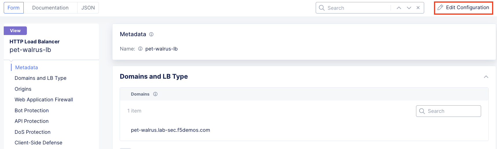
.. |lab003| image:: _static/lab3-003.png
   :width: 800px
.. |lab004| image:: _static/lab3-004.png
   :width: 800px
.. |lab005| image:: _static/lab3-005.png
   :width: 800px
.. |lab006| image:: _static/lab3-006.png
   :width: 800px
.. |lab007| image:: _static/lab3-007.png
   :width: 800px
.. |lab008| image:: _static/lab3-008.png
   :width: 800px
.. |lab009| image:: _static/lab3-009.png
   :width: 800px
.. |lab010| image:: _static/lab3-010.png
   :width: 800px
.. |lab011| image:: _static/lab3-011.png
   :width: 800px
.. |lab012| image:: _static/lab3-012.png
   :width: 800px
.. |lab013| image:: _static/lab3-013.png
   :width: 800px
.. |lab014| image:: _static/lab3-014.png
   :width: 800px
.. |lab015| image:: _static/lab3-015.png
   :width: 800px
.. |lab016| image:: _static/lab3-016.png
   :width: 800px
.. |lab017| image:: _static/lab3-017.png
   :width: 800px
.. |lab018| image:: _static/lab3-018.png
   :width: 800px
.. |lab019| image:: _static/lab3-019.png
   :width: 800px
.. |lab020| image:: _static/lab3-020.png
   :width: 800px
.. |lab021| image:: _static/lab3-021.png
   :width: 800px
.. |lab022| image:: _static/lab3-022.png
   :width: 800px
.. |lab023| image:: _static/lab3-023.png
   :width: 800px
.. |lab024| image:: _static/lab3-024.png
   :width: 800px
.. |lab025| image:: _static/lab3-025.png
   :width: 800px
.. |lab026| image:: _static/lab3-026.png
   :width: 800px
.. |lab027| image:: _static/lab3-027.png
   :width: 800px
.. |lab028| image:: _static/lab3-028.png
   :width: 800px
.. |lab029| image:: _static/lab3-029.png
   :width: 800px
.. |lab030| image:: _static/lab3-030.png
   :width: 800px
.. |lab031| image:: _static/lab3-031.png
   :width: 800px
.. |lab032| image:: _static/lab3-032.png
   :width: 800px
.. |lab033| image:: _static/lab3-033.png
   :width: 800px
.. |lab034| image:: _static/lab3-034.png
   :width: 800px
.. |lab035| image:: _static/lab3-035.png
   :width: 800px
.. |lab036| image:: _static/lab3-036.png
   :width: 800px
.. |lab037| image:: _static/lab3-037.png
   :width: 800px
.. |lab038| image:: _static/lab3-038.png
   :width: 800px
.. |lab039| image:: _static/lab3-039.png
   :width: 800px
.. |lab040| image:: _static/lab3-040.png
   :width: 800px
.. |lab041| image:: _static/lab3-041.png
   :width: 800px
.. |labend| image:: _static/labend.png
   :width: 800px

.. |lab058| image:: _static/lab3-058.png
   :width: 800px   

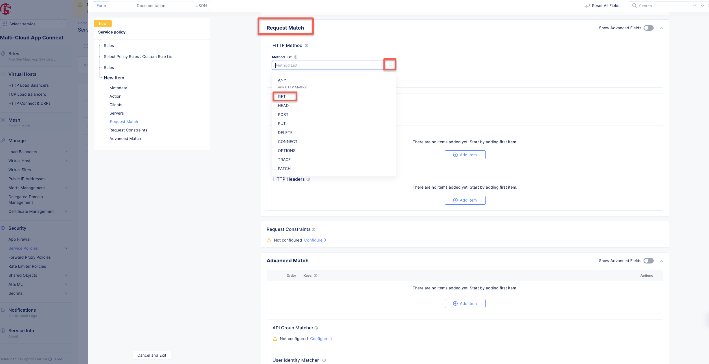
.. |lab063| image:: _static/lab3-063.png
   :width: 800px   
.. |lab064| image:: _static/lab3-064.png
   :width: 800px   
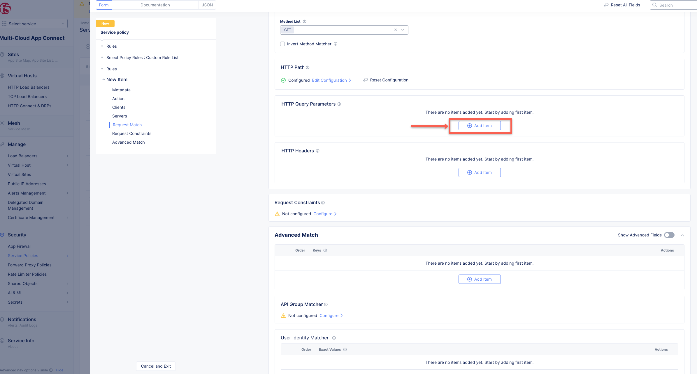
.. |lab066| image:: _static/lab3-066.png
   :width: 800px   
.. |lab067| image:: _static/lab3-067.png
   :width: 800px   
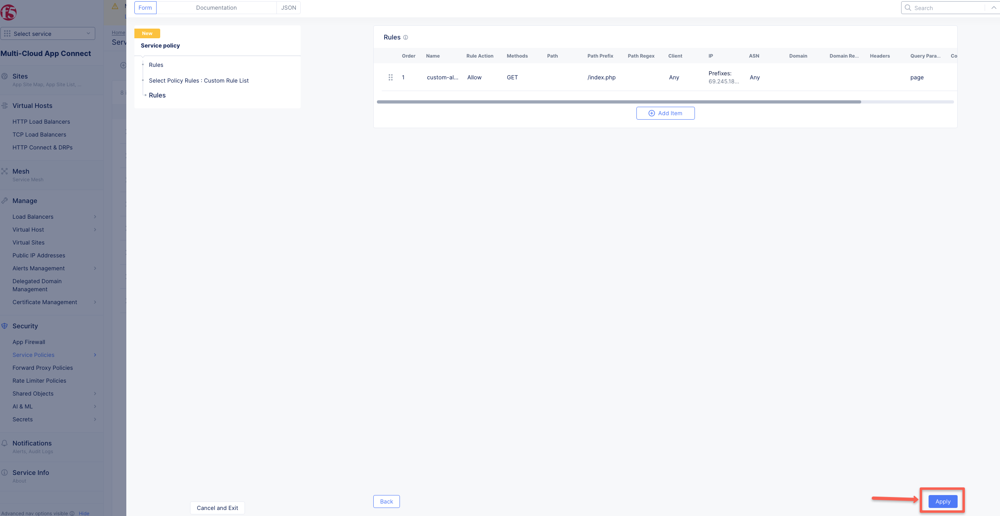
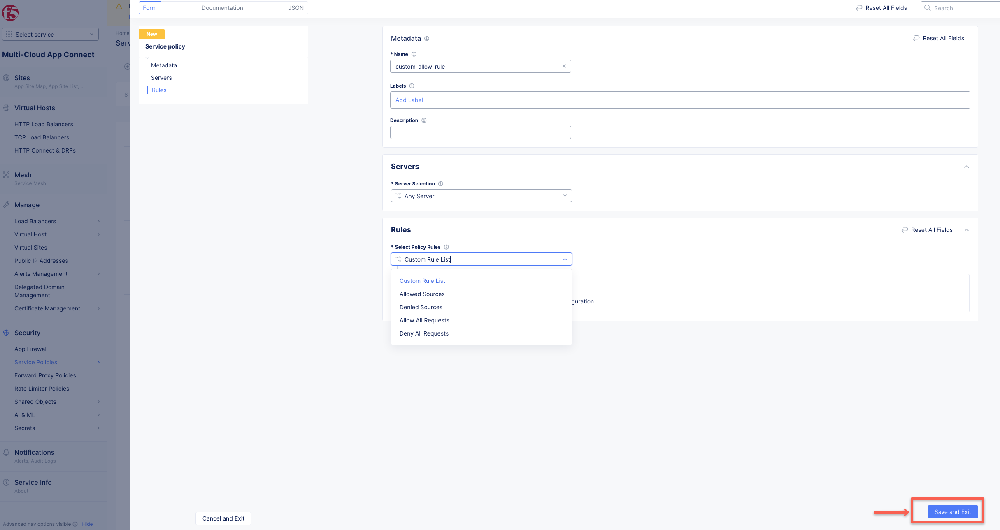
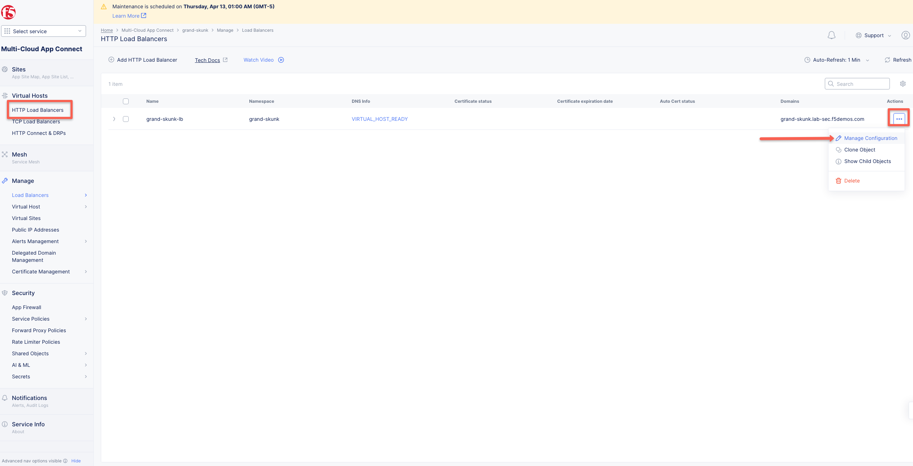
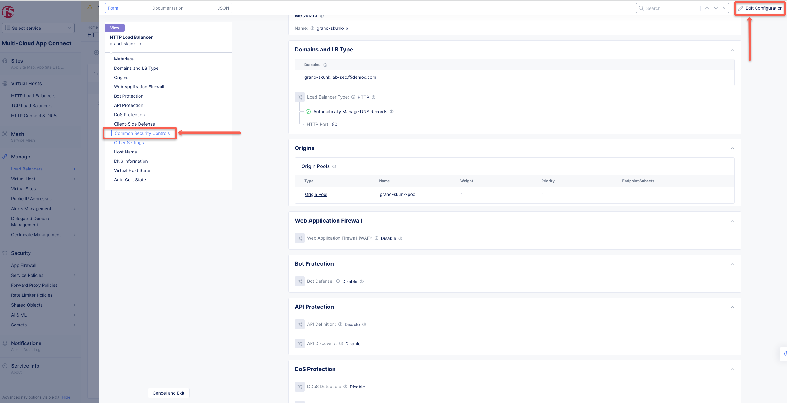
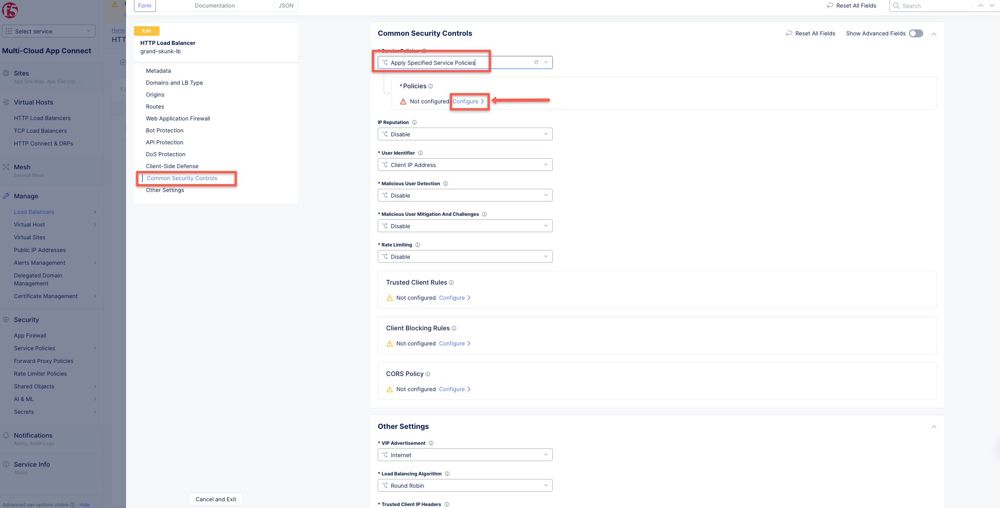
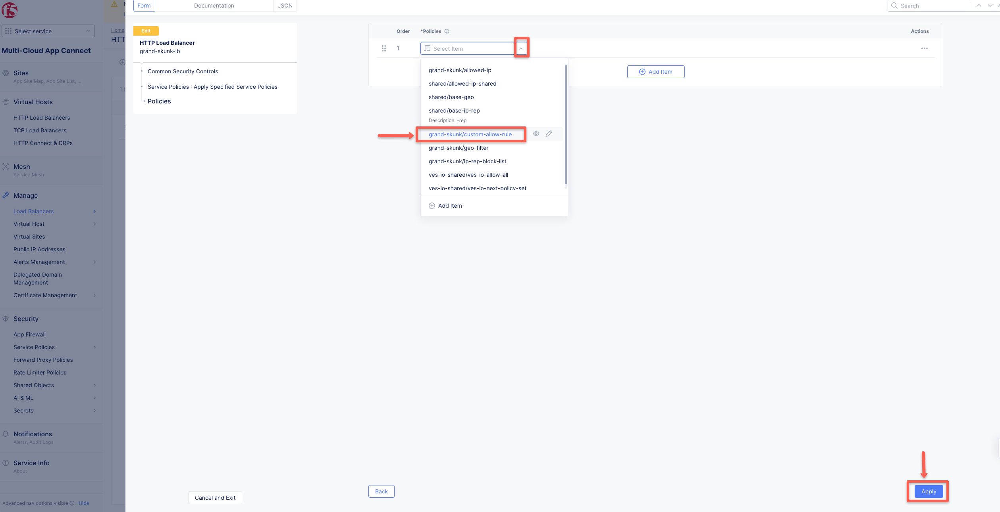
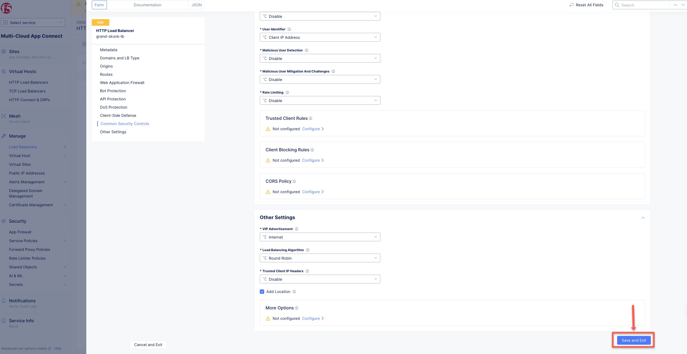
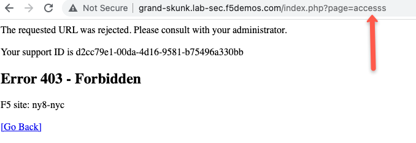
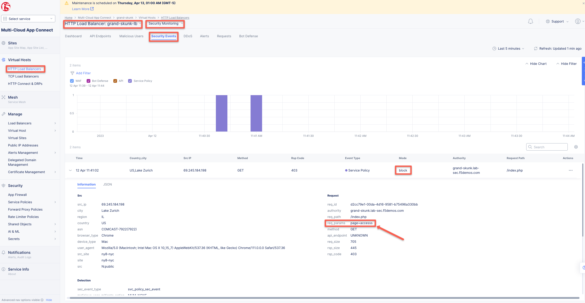
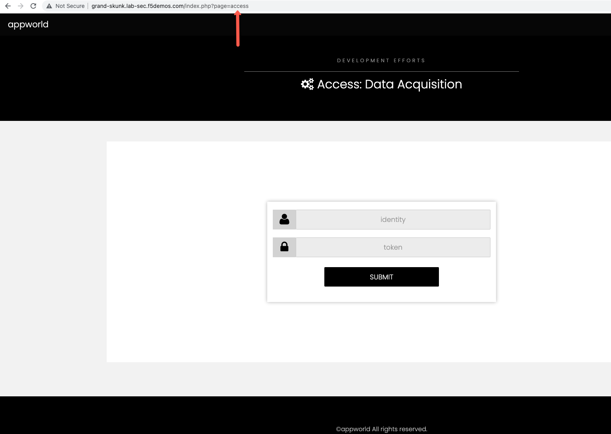
      
