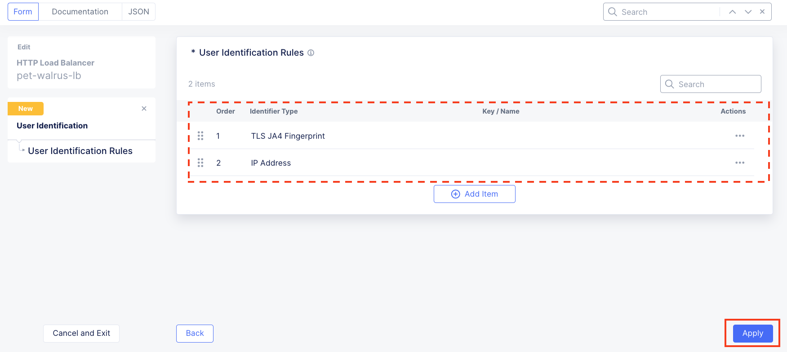
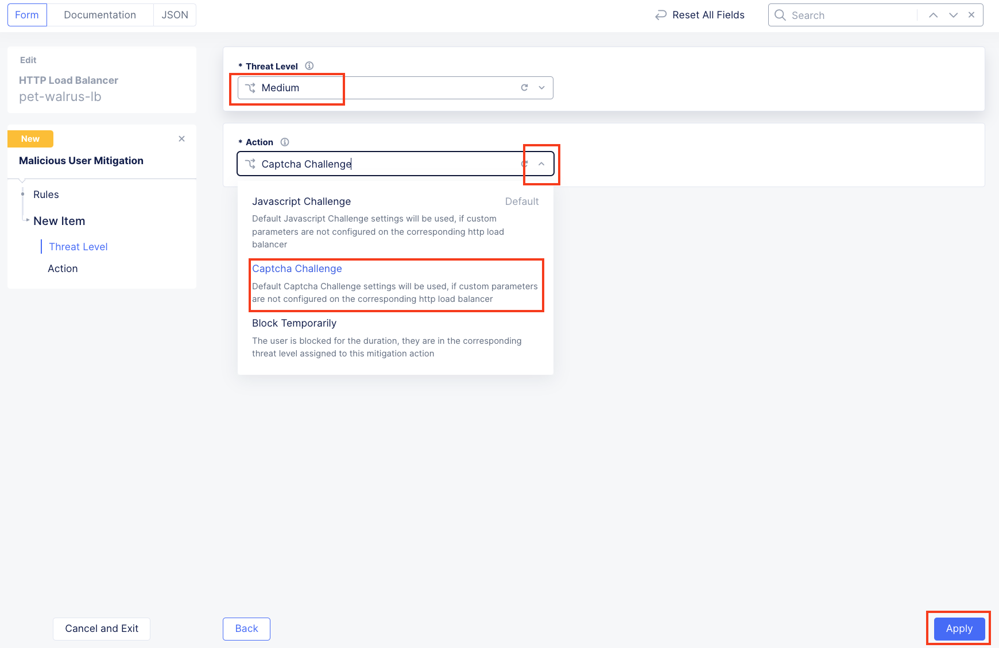
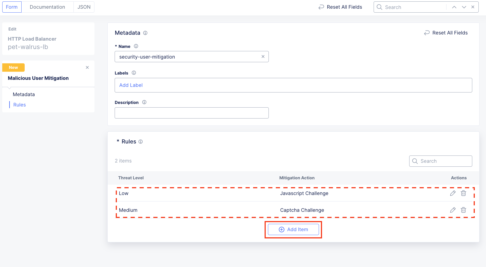
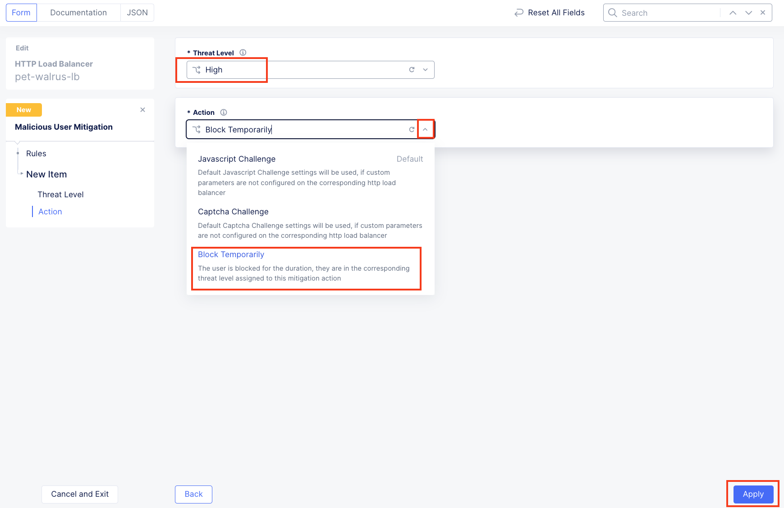
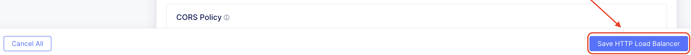

Lab 3: Malicious Users
======================

**Objective:**

* Leverage User Identification Policies to isolate individual users
  
* Utilize F5 Distributed Cloud's native AI technologies to block malicious users

**Narrative:** 

A recent security request came into your queue where multiple WAF violations and 403 http response codes 
were originating from the same public IP address.  ACME's security incident response team has asked you 
to block all requests coming from that public IP address as they are concerned about potential attackers 
successfully accessing the application and then trying to move laterally to access sensitive portions of the 
application without authorization.  Before blocking the public IP, a conversation with the application team 
uncovered that the public IP address maps the headquarters of ACME's largest sand supplier.  Since not 
all of the requests coming from that public IP address are attacks, your goal is to leverage F5 Distributed 
Cloud to identify only the specific attackers and stop their probing activities but still maintain a 
low-friction experience for the rest of the valid users.  

**Expected Lab Time: 15 minutes**

Task 1: Creating a User Identification Policy
~~~~~~~~~~~~~~~~~~~~~~~~~~~~~~~~~~~~~~~~~~~~~

In this task you will build a user identification policy which will be the
basis of identifying clients/users for machine learning driven analysis for
malicious user mitigation and actions.

#. Within **Web App & API Protection** in the F5 Distributed Cloud Console,
   **Manage > Load Balancer > HTTP Load Balancers** and use the **Action Dots**
   and click **Manage Configuration**.

#. Click **Edit Configuration** in the top right-hand corner.

   |lab001|

   |lab002|

#. Click **Common Security Controls** in the left-hand navigation and locate
   **User Identification**.

#. Click the drop-down under **User Identifier** and select **User
   Identification Policy** from the list.

   |lab003|

#. Click the dropdown for **User Identification Policy** and select
   **Add Item**.

   |lab004|

#. In the **User Identification** window, in the **Metadata** section enter
   **user-id** for the **Name** and then click **configure** under **User
   Identification Rules**.

   |lab005|

#. In the resulting window for **User Identification Rules**, click **Add
   Item**.

   |lab006|

#. In the **User Identification Rule** window click the drop-down for
   **Identifier Type**.

   Select **JA4 TLS Fingerprint** and click **Apply**.

   |lab007|

#. Returning to the window for **User Identification Rules**, observe the prior
   selection and click **Add Item**.

   |lab008|

#. In the **User Identification Rule** window click the drop-down for
   **Identifier Type**. Select **Client IP Address** and click **Apply**. (*It
   should be already selected*)

   |lab009|

#. Review the two **User Identification Rules** and click **Apply**.

#. Returning to the **User Identification** window, note that **User
   Identification Rules** are now **Configured** and click **Continue**.

   |lab010|

   |lab011|

Narrative Check
---------------

With User Identification Rules, F5 Distributed Cloud can pull in multiple data points
as unique indicators to identify an individual user.  In addition to the IP address and
TLS fingerprint of the browser, Cookies and HTTP Headers can also be leveraged to specifically
build policies around the individual users.  Now that the users are more specifically identified,
let's move on to how to block malicious users.  

Task 2: Enable Malicious User Detection and Mitigation Actions
~~~~~~~~~~~~~~~~~~~~~~~~~~~~~~~~~~~~~~~~~~~~~~~~~~~~~~~~~~~~~~

In this task you will leverage the user identification policy just built and
then enable malicious user detection and create a malicious user mitigation and
challenge.

#. Click **Common Security Controls** in the left-hand navigation.

#. Click the dropdown for **Malicious User Detection** and select **Enable**.

   |lab012|

#. Click the dropdown for **Malicious User Mitigation And Challenges** and
   select **Enable**.

   |lab013|

#. Click the dropdown for **Malicious User Mitigation Settings** and select
   **Custom**.

   |lab014|

#. Click the dropdown for **Custom**. Observe the existing other shared policies.

   **shared/lab-sec-user-mitigation**

   **ves-io-shared/ves-io-default-malicious-user-mitigation**

   .. note::

      *Using shared namespace Malicious User Mitigation provides the ability
      to use API-updated mitigation controls to implement common service
      security across multiple resources.*

#. Select **Add Item**.

   |lab015|

#. In the **Metadata** section enter **security-user-mitigation** for the
   **Name** and then click **Add Item** under **Rules**.

   |lab016|

#. In the resulting window, click the dropdown for **Threat Level** and select
   **Low**.

#. Click the dropdown for **Action** and select **Java Script Challenge**.

#. Select **Apply**.

   |lab017|

#. In the **Malicious User Mitigation** window review the rule just created and
   click **Add Item** again.

   |lab018|

#. In the resulting window, click the dropdown for **Threat Level** and select
   **Medium**.

#. Click the dropdown for **Action** and select **Captcha Challenge**.

#. Select **Apply**.

   |lab019|

#. In the **Malicious User Mitigation** window review the rules just created
   and click **Add Item** again.

   |lab020|

#. In the resulting window, click the dropdown for **Threat Level** and select
   **High**.

#. Click the dropdown for **Action** and select **Block Temporarily**.

#. Select **Apply**.

   |lab021|

#. Observe the three Rules created and select **Continue**.

   |lab022|

#. Note the updated **Malicious User Mitigation and Challenges** section and
   click on **Other Settings** in the left-hand navigation or scroll to the
   bottom of the window and click the **Save and Exit** button.

   |lab023|

   |lab024|

Narrative Check
-----------------

With a combination of user identification and malicious user policies, ACME Corp
can now detect malicious activities and apply mitigation steps. The mitigation steps include 
issuing JavaScript Challenge or Captcha Challenge or temporary blocking of the user. Malicious 
User capabilities from F5 Distributed Cloud leverages AI/ML techniques to correlate multiple suspicious
user actions together in order to build a risk score around the user.  As the risk score goes up,
users who are violating the ACME's security policies can be stopped from accessing the site while other 
users who are coming from the same public IP can still access the site without issue.  

**End of Lab 3:**  This concludes Lab 3, feel free to review and test the
configuration.  A brief presentation will be shared prior to the beginning of Lab 4.

|labend|

.. |lab001| image:: _static/lab3-001.png
   :width: 800px
.. |lab002| image:: _static/lab3-002.png
   :width: 800px
.. |lab003| image:: _static/lab3-003.png
   :width: 800px
.. |lab004| image:: _static/lab3-004.png
   :width: 800px
.. |lab005| image:: _static/lab3-005.png
   :width: 800px
.. |lab006| image:: _static/lab3-006.png
   :width: 800px
.. |lab007| image:: _static/lab3-007.png
   :width: 800px
.. |lab008| image:: _static/lab3-008.png
   :width: 800px
.. |lab009| image:: _static/lab3-009.png
   :width: 800px

.. |lab011| image:: _static/lab3-011.png
   :width: 800px
.. |lab012| image:: _static/lab3-012.png
   :width: 800px
.. |lab013| image:: _static/lab3-013.png
   :width: 800px
.. |lab014| image:: _static/lab3-014.png
   :width: 800px
.. |lab015| image:: _static/lab3-015.png
   :width: 800px

.. |lab017| image:: _static/lab3-017.png
   :width: 800px

.. |lab022| image:: _static/lab3-022.png
   :width: 800px
.. |lab023| image:: _static/lab3-023.png
   :width: 800px

.. |labend| image:: _static/labend.png
   :width: 800px
