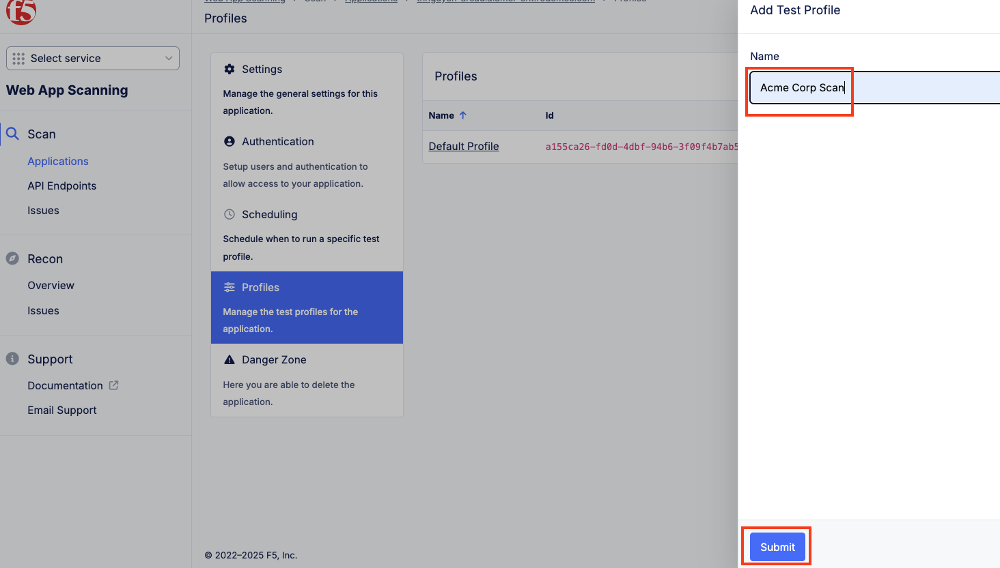
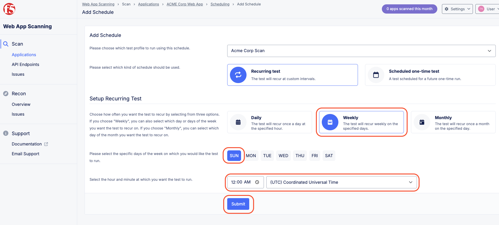
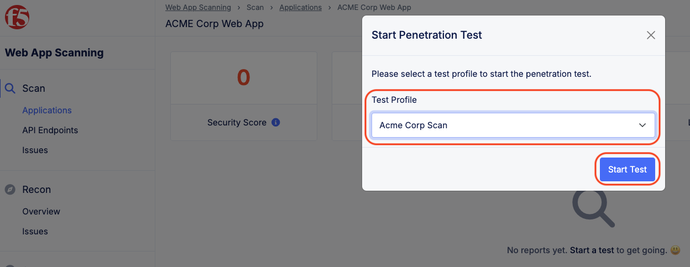
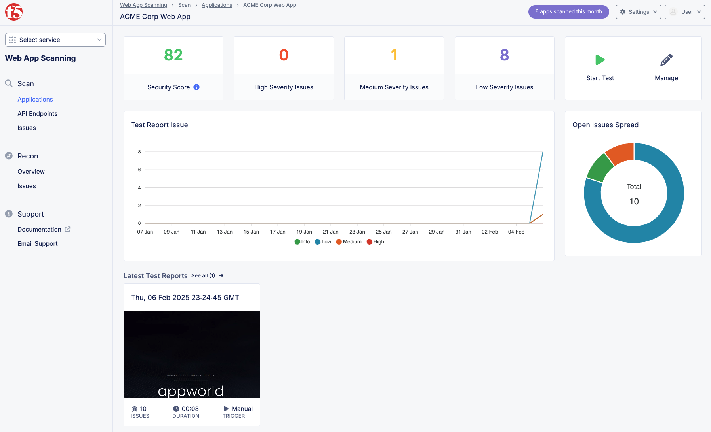
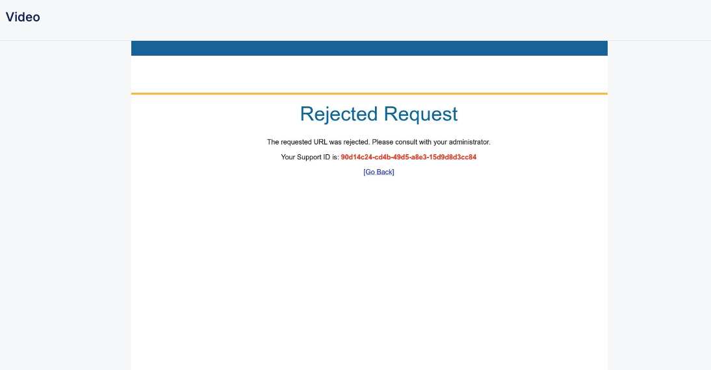

Lab 4: Malicious Users 
=================================

The following lab tasks will guide you the configuration of the Malicious User Configuration
which can be used to implement a variety of security controls. 

Task 1: Creating a User Identification Policy 
~~~~~~~~~~~~~~~~~~~~~~~~~~~~~~~~~~~~~~~~~~~~~~~~~

In this task you will add malicious user detection and create a malicious user mitigation and challenge.

+----------------------------------------------------------------------------------------------+
| 1. In the left-hand navigation menu, click the **Select service** dropdown and click         |
|                                                                                              |
|    the **Multi-Cloud App Connect** tile.                                                     |
|                                                                                              |
| 2. In the left-hand navigation menu, Return to the Load Balancer under Virtual Hosts,        |
|                                                                                              |
|    click the **HTTP Load Balancers** link.                                                   |
+----------------------------------------------------------------------------------------------+
| |lab001|                                                                                     |
|                                                                                              |
| |lab002|                                                                                     |
+----------------------------------------------------------------------------------------------+

+----------------------------------------------------------------------------------------------+
| 3. Use the **Action Dots** and click **Manage Configuration**                                |
|                                                                                              |
| 4. Click **Edit Configuration** in the top right-hand corner.                                |
+----------------------------------------------------------------------------------------------+
| |lab003|                                                                                     |
|                                                                                              |
| |lab004|                                                                                     |
+----------------------------------------------------------------------------------------------+

+----------------------------------------------------------------------------------------------+
| 5. Click **Common Security Controls** in the left-hand navigation.                           |
|                                                                                              |
| 6. Click the dropdown for **User Identifier** and select **User Identification Policy**.     |
+----------------------------------------------------------------------------------------------+
| |lab005|                                                                                     |
+----------------------------------------------------------------------------------------------+

+----------------------------------------------------------------------------------------------+
| 7. Click the dropdown for **User Identification Policy** and select **Add Item**.            |
|                                                                                              |
| 8. In the **Metadata** section enter **user-id** for the **Name** and then click             |
|                                                                                              |
|    **configure** under **User Identification Rules**.                                       |
+----------------------------------------------------------------------------------------------+
| |lab006|                                                                                     |
|                                                                                              |
| |lab007|                                                                                     |
+----------------------------------------------------------------------------------------------+

+----------------------------------------------------------------------------------------------+
| 9. In the resulting window click **Add Item** and from the dropdown select                   |
|                                                                                              |
|    **TLS Fingerprint** and click **Apply**.                                                  |
+----------------------------------------------------------------------------------------------+
| |lab008|                                                                                     |
|                                                                                              |
| |lab009|                                                                                     |
+----------------------------------------------------------------------------------------------+

+----------------------------------------------------------------------------------------------+
| 10. In the resulting window click **Add Item** again and from the dropdown select            |
|                                                                                              |
|     **Client IP Address** and click **Apply**.                                               |
+----------------------------------------------------------------------------------------------+
| |lab010|                                                                                     |
|                                                                                              |
| |lab011|                                                                                     |
+----------------------------------------------------------------------------------------------+

+----------------------------------------------------------------------------------------------+
| 11. Observe the two User Identification Rules and click **Apply**.                           |
|                                                                                              |
| 12. Leaving other values as default, click **Continue**.                                     |
+----------------------------------------------------------------------------------------------+
| |lab012|                                                                                     |
|                                                                                              |
| |lab013|                                                                                     |
+----------------------------------------------------------------------------------------------+

+----------------------------------------------------------------------------------------------+
| 13. Click **Common Security Controls** in the left-hand navigation.                          |
|                                                                                              |
| 14. Click the dropdown for **Malicious User Detection** and select **Enable**.               |
|                                                                                              |
| 15. Click the dropdown for **Malicious User Mitigation And Challenges** and select           |
|                                                                                              |
|     **Enable**.                                                                              |
|                                                                                              |
| 16. Click the dropdown for **Malicious User Mitigation Settings** and select **Custom**.     |
+----------------------------------------------------------------------------------------------+
| |lab014|                                                                                     |
+----------------------------------------------------------------------------------------------+

+----------------------------------------------------------------------------------------------+
| 17. Click the dropdown for **Custom**.  Observe the two other policies.                      |
|                                                                                              |
|     **shared/lab-sec-user-mitigation**                                                       |
|                                                                                              |
|     **ves-io-shared/ves-io-default-malicious-user-mitigation**                               |
|                                                                                              |
| .. note::                                                                                    |
|                                                                                              |
| *Using shared namespace Malicious User Mitigation provides the ability to use API-updated*   |
|                                                                                              |
| *mitigation controls to implement common service security across multiple resources.*        |
|                                                                                              |
| 18. Select **Add Item**.                                                                     |
|                                                                                              |
| 19. In the **Metadata** section enter **security-user-mitigation** for the **Name** and      |
|                                                                                              |
|     then click **Add Item** under **Rules**.                                                 |
+----------------------------------------------------------------------------------------------+
| |lab015|                                                                                     |
|                                                                                              |
| |lab016|                                                                                     |
+----------------------------------------------------------------------------------------------+

+----------------------------------------------------------------------------------------------+
| 20. Click the dropdown for **Threat Level** and select **Low**.                              |
|                                                                                              |
| 21. Click the dropdown for **Action** and select **Java Script Challenge**.                  |
|                                                                                              |
| 22. Select **Apply**.                                                                        |
+----------------------------------------------------------------------------------------------+
| |lab017|                                                                                     |
+----------------------------------------------------------------------------------------------+

+----------------------------------------------------------------------------------------------+
| 23. In the resulting window, click **Add Item** again.                                       |
|                                                                                              |
| 24. Click the dropdown for **Threat Level** and select **Medium**.                           |
|                                                                                              |
| 25. Click the dropdown for **Action** and select **Captcha Challenge**.                      |
|                                                                                              |
| 26. Select **Apply**.                                                                        |
+----------------------------------------------------------------------------------------------+
| |lab018|                                                                                     |
|                                                                                              |
| |lab019|                                                                                     |
+----------------------------------------------------------------------------------------------+

+----------------------------------------------------------------------------------------------+
| 27. In the resulting window, click **Add Item** again.                                       |
|                                                                                              |
| 28. Click the dropdown for **Threat Level** and select **High**.                             |
|                                                                                              |
| 29. Click the dropdown for **Action** and select **Block Temporarily**.                      |
|                                                                                              |
| 30. Select **Apply**.                                                                        |
+----------------------------------------------------------------------------------------------+
| |lab020|                                                                                     |
|                                                                                              |
| |lab021|                                                                                     |
+----------------------------------------------------------------------------------------------+

+----------------------------------------------------------------------------------------------+
| 31. Observe the three Rules created and select **Continue**.                                 |
+----------------------------------------------------------------------------------------------+
| |lab022|                                                                                     |
+----------------------------------------------------------------------------------------------+

+----------------------------------------------------------------------------------------------+
| 32. Scroll to the bottom of the window and click the **Save and Exit** button.               |
+----------------------------------------------------------------------------------------------+
| |lab023|                                                                                     |
+----------------------------------------------------------------------------------------------+

+----------------------------------------------------------------------------------------------+
| **End of Lab 4:**  This concludes Lab 4, feel free to review and test the configuration.     |
|                                                                                              |
| A Q&A session will begin shortly to conclude the overall lab.                                |
+----------------------------------------------------------------------------------------------+
| |labend|                                                                                     |
+----------------------------------------------------------------------------------------------+

.. |lab001| image:: _static/lab4-001.png
   :width: 800px
.. |lab002| image:: _static/lab4-002.png
   :width: 800px
.. |lab003| image:: _static/lab4-003.png
   :width: 800px
.. |lab004| image:: _static/lab4-004.png
   :width: 800px
.. |lab005| image:: _static/lab4-005.png
   :width: 800px
.. |lab006| image:: _static/lab4-006.png
   :width: 800px
.. |lab007| image:: _static/lab4-007.png
   :width: 800px

.. |lab009| image:: _static/lab4-009.png
   :width: 800px
.. |lab010| image:: _static/lab4-010.png
   :width: 800px
.. |lab011| image:: _static/lab4-011.png
   :width: 800px
.. |lab012| image:: _static/lab4-012.png
   :width: 800px

.. |lab014| image:: _static/lab4-014.png
   :width: 800px

.. |lab016| image:: _static/lab4-016.png
   :width: 800px

.. |lab018| image:: _static/lab4-018.png
   :width: 800px
.. |lab019| image:: _static/lab4-019.png
   :width: 800px

.. |lab021| image:: _static/lab4-021.png
   :width: 800px

.. |lab023| image:: _static/lab4-023.png
   :width: 800px
.. |labend| image:: _static/labend.png
   :width: 800px