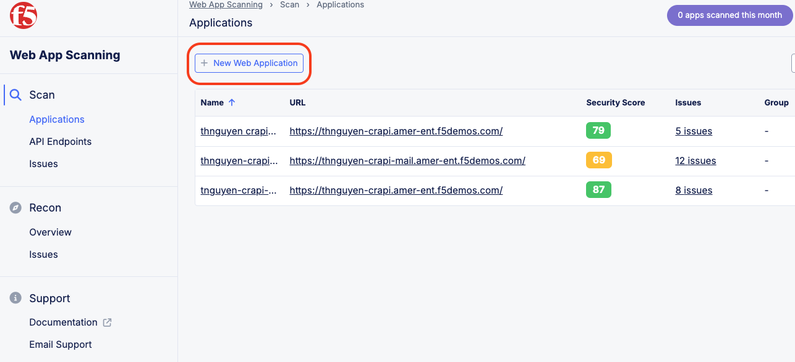
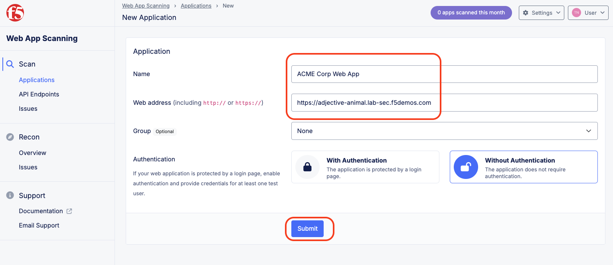
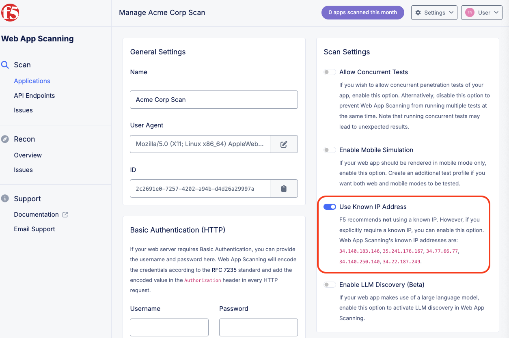
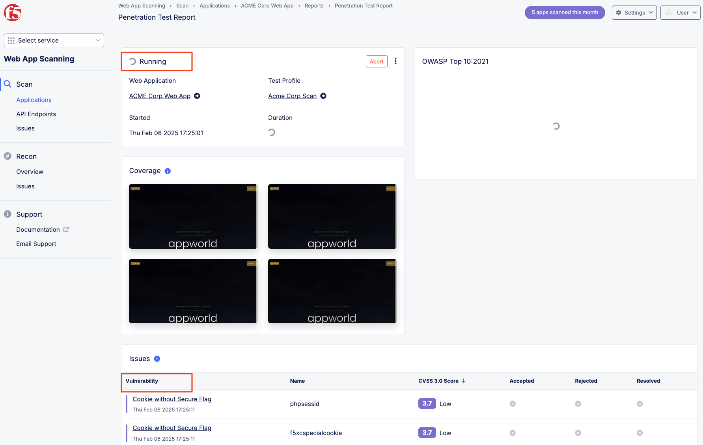
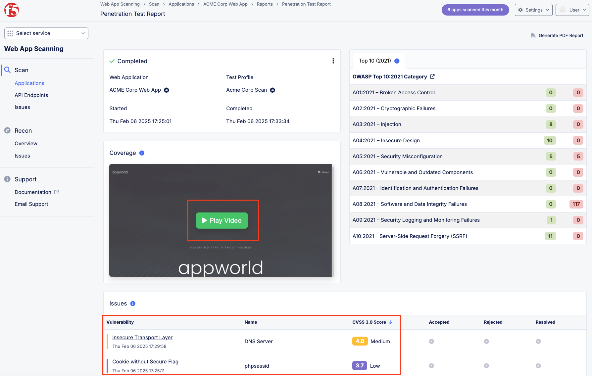

Lab 4: Malicious Users 
=================================

The following lab tasks will guide you the configuration of the Malicious User Configuration
which can be used to implement a variety of security controls. 

Task 1: Creating a User Identification Policy 
~~~~~~~~~~~~~~~~~~~~~~~~~~~~~~~~~~~~~~~~~~~~~

In this task you will build a user identification policy which will be the basis of identifying 
clients/users for machine learning driven analysis for malicious user mitigation and actions.

+----------------------------------------------------------------------------------------------+
| 1. Within **Web App & API Protection** in the F5 Distributed Cloud Console, **Manage >**     |
|                                                                                              |
|    **Load Balancer > HTTP Load Balancers** and use the **Action Dots** and click **Manage**  |
|                                                                                              |
|    **Configuration**.                                                                        |
|                                                                                              |
| 2. Click **Edit Configuration** in the top right-hand corner.                                |
+----------------------------------------------------------------------------------------------+
| |lab001|                                                                                     |
|                                                                                              |
| |lab002|                                                                                     |
+----------------------------------------------------------------------------------------------+

+----------------------------------------------------------------------------------------------+
| 3. Click **Common Security Controls** in the left-hand navigation and locate **User**        |
|                                                                                              |
|    **Identification**.                                                                       |
|                                                                                              |
| 4. Click the drop-down under **User Identification** and select **User Identification**      |
|                                                                                              |
|    **Policy** from the list.                                                                 |
+----------------------------------------------------------------------------------------------+
| |lab003|                                                                                     |
+----------------------------------------------------------------------------------------------+

+----------------------------------------------------------------------------------------------+
| 5. Click the dropdown for **User Identification Policy** and select **Add Item**.            |
+----------------------------------------------------------------------------------------------+
| |lab004|                                                                                     |
+----------------------------------------------------------------------------------------------+

+----------------------------------------------------------------------------------------------+
| 6. In the **User Identification** window, in the **Metadata** section enter **user-id**      |
|                                                                                              |
|    for the **Name** and then click **configure** under **User Identification Rules**.        |
+----------------------------------------------------------------------------------------------+
| |lab005|                                                                                     |
+----------------------------------------------------------------------------------------------+

+----------------------------------------------------------------------------------------------+
| 7. In the resulting window for **User Identification Rules**, click **Add Item**.            |
+----------------------------------------------------------------------------------------------+
| |lab006|                                                                                     |
+----------------------------------------------------------------------------------------------+

+----------------------------------------------------------------------------------------------+
| 8. In the **User Identification Rule** window click the drop-down for **Identifier Type**.   |
|                                                                                              |
|    Select **TLS Fingerprint** and click **Apply**.                                           |
+----------------------------------------------------------------------------------------------+
| |lab007|                                                                                     |
+----------------------------------------------------------------------------------------------+

+----------------------------------------------------------------------------------------------+
| 9. Returning to the window for **User Identification Rules**, observe the prior selection    |
|                                                                                              |
|    and click **Add Item**.                                                                   |
+----------------------------------------------------------------------------------------------+
| |lab008|                                                                                     |
+----------------------------------------------------------------------------------------------+

+----------------------------------------------------------------------------------------------+
| 10. In the **User Identification Rule** window click the drop-down for **Identifier Type**.  |
|                                                                                              |
|     Select **Client IP Address** and click **Apply**. (*It should be already selected*)      |
+----------------------------------------------------------------------------------------------+
| |lab009|                                                                                     |
+----------------------------------------------------------------------------------------------+

+----------------------------------------------------------------------------------------------+
| 11. Review the two **User Identification Rules** and click **Apply**.                        |
|                                                                                              |
| 12. Returning to the **User Identification** window, note that **User Identification Rules** |
|                                                                                              |
|     are now **Configured** and click **Continue**.                                           |
+----------------------------------------------------------------------------------------------+
| |lab010|                                                                                     |
|                                                                                              |
| |lab011|                                                                                     |
+----------------------------------------------------------------------------------------------+

Task 2: Enable Malicious User Detection and Mitigation Actions 
~~~~~~~~~~~~~~~~~~~~~~~~~~~~~~~~~~~~~~~~~~~~~~~~~~~~~~~~~~~~~~

In this task you will leverage the user identification policy just built and then enable malicious
user detection and create a malicious user mitigation and challenge.

+----------------------------------------------------------------------------------------------+
| 13. Click **Common Security Controls** in the left-hand navigation.                          |
|                                                                                              |
| 14. Click the dropdown for **Malicious User Detection** and select **Enable**.               |
+----------------------------------------------------------------------------------------------+
| |lab012|                                                                                     |
+----------------------------------------------------------------------------------------------+

+----------------------------------------------------------------------------------------------+
| 15. Click the dropdown for **Malicious User Mitigation And Challenges** and select           |
|                                                                                              |
|     **Enable**.                                                                              |
+----------------------------------------------------------------------------------------------+
| |lab013|                                                                                     |
+----------------------------------------------------------------------------------------------+

+----------------------------------------------------------------------------------------------+
| 16. Click the dropdown for **Malicious User Mitigation Settings** and select **Custom**.     |
+----------------------------------------------------------------------------------------------+
| |lab014|                                                                                     |
+----------------------------------------------------------------------------------------------+

+----------------------------------------------------------------------------------------------+
| 17. Click the dropdown for **Custom**.  Observe the two other policies.                      |
|                                                                                              |
|     **shared/lab-sec-user-mitigation**                                                       |
|                                                                                              |
|     **ves-io-shared/ves-io-default-malicious-user-mitigation**                               |
|                                                                                              |
| .. note::                                                                                    |
|                                                                                              |
| *Using shared namespace Malicious User Mitigation provides the ability to use API-updated*   |
|                                                                                              |
| *mitigation controls to implement common service security across multiple resources.*        |
|                                                                                              |
| 18. Select **Add Item**.                                                                     |
+----------------------------------------------------------------------------------------------+
| |lab015|                                                                                     |
+----------------------------------------------------------------------------------------------+

+----------------------------------------------------------------------------------------------+
| 19. In the **Metadata** section enter **security-user-mitigation** for the **Name** and      |
|                                                                                              |
|     then click **Add Item** under **Rules**.                                                 |
+----------------------------------------------------------------------------------------------+
| |lab016|                                                                                     |
+----------------------------------------------------------------------------------------------+

+----------------------------------------------------------------------------------------------+
| 20. In the resulting window, click the dropdown for **Threat Level** and select **Low**.     |
|                                                                                              |
| 21. Click the dropdown for **Action** and select **Java Script Challenge**.                  |
|                                                                                              |
| 22. Select **Apply**.                                                                        |
+----------------------------------------------------------------------------------------------+
| |lab017|                                                                                     |
+----------------------------------------------------------------------------------------------+

+----------------------------------------------------------------------------------------------+
| 23. In the **Malicious User Mitigation** window review the rule just created and click       |
|                                                                                              |
|     **Add Item** again.                                                                      |
+----------------------------------------------------------------------------------------------+
| |lab018|                                                                                     |
+----------------------------------------------------------------------------------------------+

+----------------------------------------------------------------------------------------------+
| 24. In the resulting window, click the dropdown for **Threat Level** and select **Medium**.  |
|                                                                                              |
| 25. Click the dropdown for **Action** and select **Captcha Challenge**.                      |
|                                                                                              |
| 26. Select **Apply**.                                                                        |
+----------------------------------------------------------------------------------------------+
| |lab019|                                                                                     |
+----------------------------------------------------------------------------------------------+

+----------------------------------------------------------------------------------------------+
| 27. In the **Malicious User Mitigation** window review the rules just created and click      |
|                                                                                              |
|     **Add Item** again.                                                                      |
+----------------------------------------------------------------------------------------------+
| |lab020|                                                                                     |
+----------------------------------------------------------------------------------------------+

+----------------------------------------------------------------------------------------------+
| 28. In the resulting window, click the dropdown for **Threat Level** and select **High**.    |
|                                                                                              |
| 29. Click the dropdown for **Action** and select **Block Temporarily**.                      |
|                                                                                              |
| 30. Select **Apply**.                                                                        |
+----------------------------------------------------------------------------------------------+
| |lab021|                                                                                     |
+----------------------------------------------------------------------------------------------+

+----------------------------------------------------------------------------------------------+
| 31. Observe the three Rules created and select **Continue**.                                 |
+----------------------------------------------------------------------------------------------+
| |lab022|                                                                                     |
+----------------------------------------------------------------------------------------------+

+----------------------------------------------------------------------------------------------+
| 31. Note the updated **Malicious User Mitigation and Challenges** section and click on       |
|                                                                                              |
|     **Other Settings** in the left-hand navigation or scroll to the bottom of the window and |
|                                                                                              |
|     click the **Save and Exit** button.                                                      |
+----------------------------------------------------------------------------------------------+
| |lab023|                                                                                     |
|                                                                                              |
| |lab024|                                                                                     |
+----------------------------------------------------------------------------------------------+

+----------------------------------------------------------------------------------------------+
| **End of Lab 4:**  This concludes Lab 4, feel free to review and test the configuration.     |
|                                                                                              |
| A Q&A session will begin shortly to conclude the overall lab.                                |
+----------------------------------------------------------------------------------------------+
| |labend|                                                                                     |
+----------------------------------------------------------------------------------------------+

.. |lab001| image:: _static/lab4-001.png
   :width: 800px
.. |lab002| image:: _static/lab4-002.png
   :width: 800px
.. |lab003| image:: _static/lab4-003.png
   :width: 800px

.. |lab006| image:: _static/lab4-006.png
   :width: 800px
.. |lab007| image:: _static/lab4-007.png
   :width: 800px
.. |lab008| image:: _static/lab4-008.png
   :width: 800px

.. |lab010| image:: _static/lab4-010.png
   :width: 800px

.. |lab012| image:: _static/lab4-012.png
   :width: 800px
.. |lab013| image:: _static/lab4-013.png
   :width: 800px
.. |lab014| image:: _static/lab4-014.png
   :width: 800px
.. |lab015| image:: _static/lab4-015.png
   :width: 800px
.. |lab016| image:: _static/lab4-016.png
   :width: 800px
.. |lab017| image:: _static/lab4-017.png
   :width: 800px
.. |lab018| image:: _static/lab4-018.png
   :width: 800px

.. |lab020| image:: _static/lab4-020.png
   :width: 800px

.. |lab022| image:: _static/lab4-022.png
   :width: 800px
.. |lab023| image:: _static/lab4-023.png
   :width: 800px
.. |lab024| image:: _static/lab4-024.png
   :width: 800px
.. |labend| image:: _static/labend.png
   :width: 800px