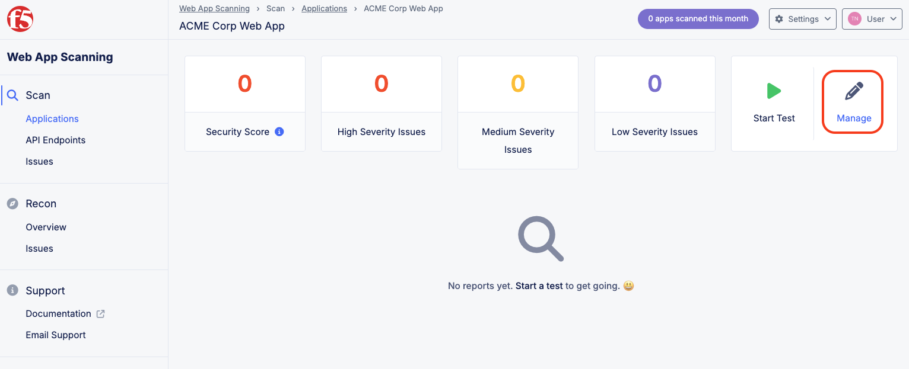
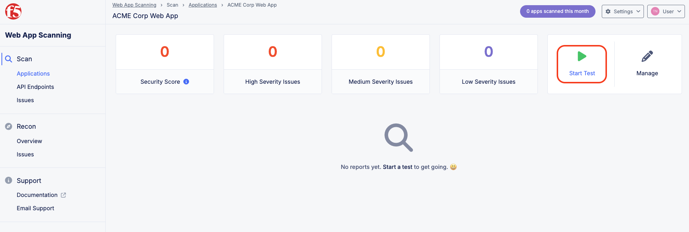
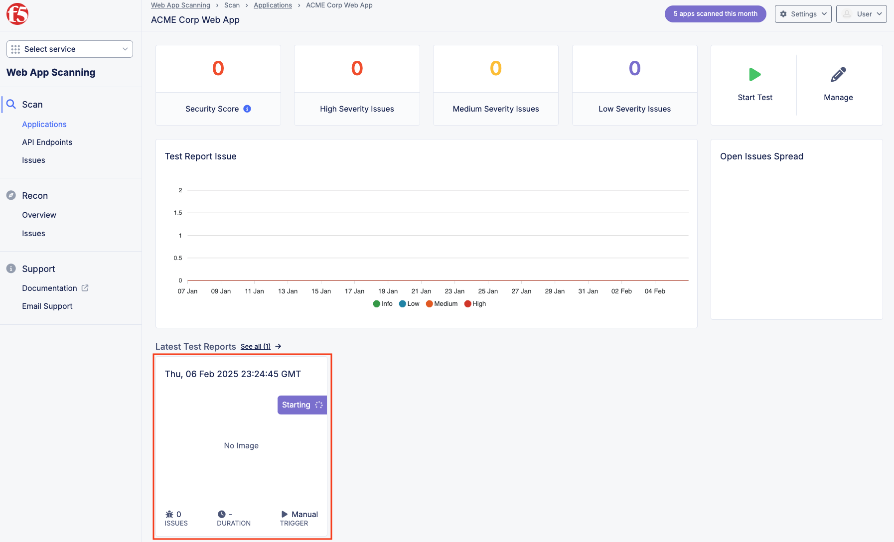

Lab 4: Web App Scanning
=======================

**Objective:**

* Setup continuous web application security testing
  
**Narrative:** 

Following the successful rollout of the F5 Web Application Security policies, there is a request to setup 
OWASP Top 10 Web Vulnerability Scanning of the application and measure the security posture of the application 
over time.  Currently ACME Corp does a penetration test every six months which requires an external vendor and 
lots of effort. ACME Corp would like to move to weekly scans with more automation and less effort.  
There is also a requirementto run the scan from a specifically allowed known IP addresses so the security team 
can setup specific rules to identify and allow the scans to come in from the the internet.  
After reviewing this requirement, ACME decides to evaluate F5 Distributed Cloud Web App Scanning.

F5 Distributed Cloud Web App Scanning is an offering that lets you discover exposed assets 
and run automated penetration tests of your web applications and APIs. 

https://docs.cloud.f5.com/docs-v2/web-app-scanning/concepts/web-app-scanning/web-app-scanning-overview

**Expected Lab Time: 15 minutes**

Task 1: Configure a Web Application Scan
~~~~~~~~~~~~~~~~~~~~~~~~~~~~~~~~~~~~~~~~

In this task, you will setup a penetration test of your internet facing application
to report on OWASP Top 10 for Web Applications.  Below are some of the tests conducted by the Scan:

* Broken Access Control: Tests for issues related to the violation of the principle of least privilege, 
  bypassing access control checks, accessing/editing other users' data, and more.

* Business Logic Attacks: Leverages multiple test users and AI to learn the functionality of the app and 
  actively attempts to break it to find vulnerabilities associated with the logic and rules defined in the app.

* SQL Injection (incl. Blind SQL Injection): Intelligent testing for a wide variety of SQL injection issues.
  
* Cross-Site Request Forgery (CSRF): This is an attack that forces an end user to execute unwanted actions 
  on a web application in which they're currently authenticated.

* Cross-Site Scripting (XSS) (Stored, Reflected, DOM-based): Comprehensive tests for HTML rendering/execution 
  of JavaScript.

* Insecure Direct Object References (IDOR): This is when an application exposes a reference to an internal 
  implementation object, such as a file, directory, or database key.

* Security Misconfiguration: This is a general term for when applications and systems are not properly 
  configured for security.

* Vulnerable and Outdated Components: This is when applications and systems use components with known 
  vulnerabilities.

* Identification and Authentication Failures: This is when applications and systems fail to properly 
  identify and authenticate users.

* Software and Data Integrity Failures: This is when applications and systems fail to protect the 
  integrity of software and data.

* Security Logging and Monitoring Failures: This is when applications and systems fail to properly log 
  and monitor security events.

* Server-Side Request Forgery (SSRF): This is an attack that allows an attacker to send crafted requests 
  from the vulnerable server to other internal systems.

#. Within the Home page in the F5 Distributed Cloud Console, click
   **Web App Scanning** and then click **Visit Service**. 

   |lab001|

   |lab002|

#. From the Web App Scanning page, click on **Applications** in the top left-hand corner.

#. Click on **New Web Application**.  

   |lab003|

   |lab004|

#. Add a name for the application.  *ACME Corp Web App*

#. Add the Web Address of the application that was built as part of this lab.  It will match your namespace 
   following the pattern https://adjective-animal.lab-sec.f5demos.com.  Ensure to replace the adjective-animal
   to match your environment. 

   |lab005|

#. Once the application has been added, the scan can be configured to add additional options.  In this lab, you
   will be modifying the scan profile and setting up a schedule. Click on **Manage** to access the configuration 
   options.
   
   |lab006|

#. Select **Profiles** and click **New** to add a new scanning profile that will be customized for ACME corp's need.
   Name the profile **Acme Corp Scan** and Click **Submit**. 

   |lab007|

   |lab008|

#. On the new profile page, additional settings can be configured such as changing the User Agent of the scan, adding 
   basic authentication with username password as an encoded value in the *Authorization* header of the HTTP requests of 
   the scans.  To meet the requirement of ensuring that the penetration tests come from pre-approved ip addresses, select
   the scan settings to restrict scans to originate from only a subset of IPs.  *NOTE* F5 recommends not using a known IP, 
   in order to more closely simulate attackers coming from unknown IPs.

   |lab009|
   
#. Return to the ACME Corp Web App by clicking on **Applications** on selecting the **ACME Corp Web App**.  Next click
   **Manage** then **Scheduling** then **New**.   

   |lab010|

   |lab011|

   |lab012|

   |lab013|

#. Lets set up a new Recurring Test. Select the **Acme Corp Scan** and **Recurring Test**.  Define a schedule (Daily, 
   Weekly, and Monthly) and set the start time for the scan.  Click **Submit** when finished.

   |lab014|

   |lab015|

#. In additional to scheduled scans, Web App Scanning allows for on demand testing. Return back to the ACME Corp Web App.
   Click **Start** to begin an ad-hoc test.  Select **Acme Corp Scan** as the scanning profile. Click **Start Test**.  
   You can click on the test while it's running to see data being populated live during the test.  

   |lab016|

   |lab017|

   |lab018|

   |lab019|

#. After the Scan completes, results will be displayed on the homepage dashboard and also the page of the individual 
   application.  Click on **Applications - Acme Corp Web App**.  Review the data from the latest scan at a high level.
   Click on Scan that just completed.  From the Report page, review the which OWASP Top 10 vulnerabilities were uncovered.
   There is also a video that replays the penetration testing scan interacting with the website.  Note the different colors
   as they relate to vulnerabilities uncovered and which portion of the application had the issue.  While watching the video,
   note if you can identify the custom block page you configured earlier in the lab.  This video can be downloaded as well 
   a PDF of the test results.  

   |lab020|

   |lab021|
   
   |lab022|

Narrative Check
---------------

By leveraging F5 Distributed Cloud Web App Scanning, organizations can have an ongoing view of the security posture of
their web applications and track the issues over time. The Web App Scanning solution can also discover API endpoints and 
LLM models that make up a Web Application and even provide reports against the OWASP Top 10 for LLMs.  So as ACME Corp 
continues to add new applications, F5 Distributed Web App Scanning can continue to maintain consistent visibility for 
those web assets. 

**End of Lab 4:**  This concludes Lab 4, feel free to wait for the scan to complete and review the
results and playback the recorded video.

|labend|

.. |lab002| image:: _static/lab4-002.png
   :width: 800px

.. |lab004| image:: _static/lab4-004.png
   :width: 800px
.. |lab005| image:: _static/lab4-005.png
   :width: 800px

.. |lab007| image:: _static/lab4-007.png
   :width: 800px
.. |lab008| image:: _static/lab4-008.png
   :width: 800px
.. |lab009| image:: _static/lab4-009.png
   :width: 800px

.. |lab011| image:: _static/lab4-011.png
   :width: 800px
.. |lab012| image:: _static/lab4-012.png
   :width: 800px
.. |lab013| image:: _static/lab4-013.png
   :width: 800px

.. |lab015| image:: _static/lab4-015.png
   :width: 800px

.. |lab017| image:: _static/lab4-017.png
   :width: 800px

.. |lab019| image:: _static/lab4-019.png
   :width: 800px
.. |lab020| image:: _static/lab4-020.png
   :width: 800px
.. |lab021| image:: _static/lab4-021.png
   :width: 800px
.. |lab022| image:: _static/lab4-022.png
   :width: 800px
.. |labend| image:: _static/labend.png
   :width: 800px
