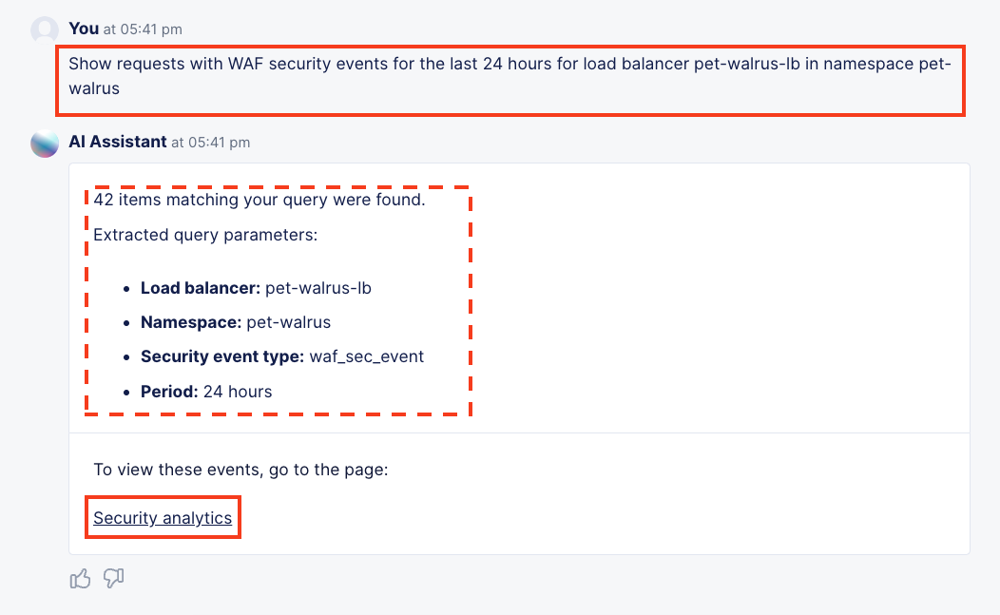

Lab 5: Rate Limiting
====================

The following lab tasks will guide you the configuration of Rate Limiting feature sets.
Rate Limiting can be used to implement a variety of L7 security controls; assisting in L7 DDoS, 
protecting heavy URLs (service process impactful) or mitigating impacts to other controlled endpoints.  

Task 1: Establishing a Baseline
~~~~~~~~~~~~~~~~~~~~~~~~~~~~~~~

In this task you will access a test website/webpage to experience access without a Rate Limiting Policy
engaged.  Following completion of Task1, you will build a Rate Limit Policy (Task2) and the test the 
Rate Limited experience

+----------------------------------------------------------------------------------------------+
| 1. In your local web browser access the following link, replacing namespace with your own:   |
|                                                                                              |
|    **http://<namespace>.lab-sec.f5demos.com/ratelimit.php**                                  |
|                                                                                              |
| 2. Refresh the page multiple times and notice you do not receive any errors nor blocked      |
|                                                                                              |
|    messages. You can also open your browser's developers to observe requests receiving 200Ks.|
|                                                                                              |
|    Let's change that behavior.                                                               |
+----------------------------------------------------------------------------------------------+
| |lab000|                                                                                     |
+----------------------------------------------------------------------------------------------+

Task 2: Creating a Rate Limiting Policy 
~~~~~~~~~~~~~~~~~~~~~~~~~~~~~~~~~~~~~~~~~~~~~~~~~

In this task you will add a Rate Limiting Policy to the application Load Balancer previously created.

+----------------------------------------------------------------------------------------------+
| 1. Return to the **Web App & API Protection** configuration window. In the left-hand         |
|                                                                                              |
|    navigation, expand **Manage** and click **Load Balancers > HTTP Load Balancers**.         |
|                                                                                              |
| 2. In the resulting screen click the **Add HTTP Load Balancer** in the graphic as shown.     |
|                                                                                              |
| 3. Use the **Action Dots** and click **Manage Configuration**                                |
|                                                                                              |
| 4. Click **Edit Configuration** in the top right-hand corner.                                |
+----------------------------------------------------------------------------------------------+
| |lab001|                                                                                     |
|                                                                                              |
| |lab002|                                                                                     |
+----------------------------------------------------------------------------------------------+

+----------------------------------------------------------------------------------------------+
| 5. Click **Common Security Controls** in the left-hand navigation & locate **Rate Limiting**.|
|                                                                                              |
| 6. Click the dropdown for **Rate Limiting** and select **Custom Rate Limiting Parameters**.  |
+----------------------------------------------------------------------------------------------+
| |lab003|                                                                                     |
+----------------------------------------------------------------------------------------------+

+----------------------------------------------------------------------------------------------+
| 7. In the expanded **Custom Rate Limiting Parameters** click the **View Configuration** Link.|
+----------------------------------------------------------------------------------------------+
| |lab004|                                                                                     |
+----------------------------------------------------------------------------------------------+

+----------------------------------------------------------------------------------------------+
| 8. In the resulting **Rate Limit Configuration** window, in the **Request Rate Limiter**     |
|                                                                                              |
|    section set the following values as shown:                                                |
|                                                                                              |
|    * **Number:** 2                                                                           |
|    * **Per Period:** Minute                                                                  |
|    * **Burst Multiplier:** 1                                                                 |
|                                                                                              |
| 9. Click the drop-down for **Rate Limiter Policies** and select **Rate Limiter Policies**.   |
+----------------------------------------------------------------------------------------------+
| |lab005|                                                                                     |
+----------------------------------------------------------------------------------------------+

+----------------------------------------------------------------------------------------------+
| 10. In the new row for **Rate Limiter Policies**, click the dropdown an then select **Add**  |
|                                                                                              |
|     **Item** from the list as shown.                                                         |
+----------------------------------------------------------------------------------------------+
| |lab006|                                                                                     |
+----------------------------------------------------------------------------------------------+

+----------------------------------------------------------------------------------------------+
| 11. In the **Rate Limiter Policy** window, enter **rate-limit** in the **Name** field in     |
|                                                                                              |
|     **Metadata** section and then click **Configure** within the **Rules** section.          |
|                                                                                              |
| 12. In the resulting **Rules** window, click **Add Item**.                                   |
+----------------------------------------------------------------------------------------------+
| |lab007|                                                                                     |
|                                                                                              |
| |lab008|                                                                                     |
+----------------------------------------------------------------------------------------------+

+----------------------------------------------------------------------------------------------+
| 13. In the **Rate Limiter Policy** window within the **Metadata** section input              |
|                                                                                              |
|     **rate-limit-auth** into the **Name** field.                                             |
|                                                                                              |
| 14. Using the **Actions** drop-down select, **Apply Rate Limiter**.                          |
|                                                                                              |
| 15. In the left-hand navigation, click on **Request Match**.                                 |
+----------------------------------------------------------------------------------------------+
| |lab009|                                                                                     |
+----------------------------------------------------------------------------------------------+

+----------------------------------------------------------------------------------------------+
| 16. In the **Request Match** section and select the **Configure** link in the **HTTP Method**|
|                                                                                              |
|     section as shown.                                                                        |
|                                                                                              |
| 17. In the resulting **HTTP Method** window under **Method List**, select **POST** then      |
|                                                                                              |
|     click **Apply**.                                                                         |
+----------------------------------------------------------------------------------------------+
| |lab010|                                                                                     |
|                                                                                              |
| |lab011|                                                                                     |
+----------------------------------------------------------------------------------------------+

+----------------------------------------------------------------------------------------------+
| 18. Observe that **HTTP Method** now appears **Configured**.                                 |
|                                                                                              |
| 19. Further down in the **Request Match** section, select the **Configure** link in the      |
|                                                                                              |
|     **HTTP Path** section as shown.                                                          |
|                                                                                              |
| 20. Observe the various Path definition options, click **Add Item** in the **Prefix Values** |
|                                                                                              |
|     section the input **/auth.php** as shown and then click **Apply**.                       |
|                                                                                              |
| .. note::                                                                                    |
|                                                                                              |
|    *Although its already protect by Bot Defense, we can also control the rate at which the*  |
|                                                                                              |
|    *specific authentication page can be POSTed to (or any other page).*                      |
+----------------------------------------------------------------------------------------------+
| |lab012|                                                                                     |
|                                                                                              |
| |lab013|                                                                                     |
+----------------------------------------------------------------------------------------------+

+----------------------------------------------------------------------------------------------+
| 21. Observe that **HTTP Path** now also appears **Configured**. Click **Apply** on the       |
|                                                                                              |
|     **Rate Limiter Policy** window.                                                          |
|                                                                                              |
| 22. Observe the rate limit rule just created and click **Add Item** to build another rule.   |
+----------------------------------------------------------------------------------------------+
| |lab014|                                                                                     |
|                                                                                              |
| |lab015|                                                                                     |
+----------------------------------------------------------------------------------------------+

+----------------------------------------------------------------------------------------------+
| 23. In the **Rate Limiter Policy** window within the **Metadata** section input              |
|                                                                                              |
|     **rate-limit-page** into the **Name** field.                                             |
|                                                                                              |
| 24. Using the **Actions** drop-down select, **Apply Rate Limiter**.                          |
|                                                                                              |
| 25. In the left-hand navigation, click on **Request Match**.                                 |
+----------------------------------------------------------------------------------------------+
| |lab016|                                                                                     |
+----------------------------------------------------------------------------------------------+

+----------------------------------------------------------------------------------------------+
| 26. In the **Request Match** section and select the **Configure** link in the **HTTP Method**|
|                                                                                              |
|     section as shown.                                                                        |
|                                                                                              |
| 27. In the resulting **HTTP Method** window under **Method List**, select **GET** then       |
|                                                                                              |
|     click **Apply**.                                                                         |
+----------------------------------------------------------------------------------------------+
| |lab017|                                                                                     |
|                                                                                              |
| |lab018|                                                                                     |
+----------------------------------------------------------------------------------------------+

+----------------------------------------------------------------------------------------------+
| 28. Observe that **HTTP Method** now appears **Configured**.                                 |
|                                                                                              |
| 29. Further down in the **Request Match** section, select the **Configure** link in the      |
|                                                                                              |
|     **HTTP Path** section as shown.                                                          |
|                                                                                              |
| 30. Observe the various Path definition options, click **Add Item** in the **Prefix Values** |
|                                                                                              |
|     section the input **/ratelimit.php** as shown and then click **Apply**.                  |
+----------------------------------------------------------------------------------------------+
| |lab019|                                                                                     |
|                                                                                              |
| |lab020|                                                                                     |
+----------------------------------------------------------------------------------------------+

+----------------------------------------------------------------------------------------------+
| 31. Observe that **HTTP Path** now also appears **Configured**. Click **Apply** on the       |
|                                                                                              |
|     **Rate Limiter Policy** window.                                                          |
|                                                                                              |
| 32. Observe the added rate limit rule and click **Add Item** to build another rule.          |
+----------------------------------------------------------------------------------------------+
| |lab021|                                                                                     |
|                                                                                              |
| |lab022|                                                                                     |
+----------------------------------------------------------------------------------------------+

+----------------------------------------------------------------------------------------------+
| 33. In the **Rate Limiter Policy** window within the **Metadata** section input              |
|                                                                                              |
|     **bypass** into the **Name** field.                                                      |
|                                                                                              |
| 34. Using the **Actions** drop-down select, **Bypass Rate Limiter**.                         |
|                                                                                              |
| 35. In the left-hand navigation, click on **Request Match**.                                 |
+----------------------------------------------------------------------------------------------+
| |lab023|                                                                                     |
+----------------------------------------------------------------------------------------------+

+----------------------------------------------------------------------------------------------+
| 36. In the **Request Match** section and select the **Configure** link in the **HTTP Method**|
|                                                                                              |
|     section as shown.                                                                        |
|                                                                                              |
| 37. In the resulting **HTTP Method** window under **Method List**, select **ANY** then       |
|                                                                                              |
|     click **Apply**.                                                                         |
+----------------------------------------------------------------------------------------------+
| |lab024|                                                                                     |
|                                                                                              |
| |lab025|                                                                                     |
+----------------------------------------------------------------------------------------------+

+----------------------------------------------------------------------------------------------+
| 38. Observe that **HTTP Method** now appears **Configured**.                                 |
|                                                                                              |
| 39. Further down in the **Request Match** section, select the **Configure** link in the      |
|                                                                                              |
|     **HTTP Path** section as shown.                                                          |
|                                                                                              |
| 40. Observe the various Path definition options, click **Add Item** in the **Prefix Values** |
|                                                                                              |
|     section the input **/** as shown and then click **Apply**.                               |
+----------------------------------------------------------------------------------------------+
| |lab026|                                                                                     |
|                                                                                              |
| |lab027|                                                                                     |
+----------------------------------------------------------------------------------------------+

+----------------------------------------------------------------------------------------------+
| 41. Observe that **HTTP Path** now also appears **Configured**. Click **Apply** on the       |
|                                                                                              |
|     **Rate Limiter Policy** window.                                                          |
|                                                                                              |
| 42. Observe the three created rate limit rules and click **Apply**.                          |
+----------------------------------------------------------------------------------------------+
| |lab028|                                                                                     |
|                                                                                              |
| |lab029|                                                                                     |
+----------------------------------------------------------------------------------------------+

+----------------------------------------------------------------------------------------------+
| 43. Observe that rules are now **Configured**. Complete the custom **Rate Limiter Policy** by|
|                                                                                              |
|     clicking **Continue**.                                                                   |
+----------------------------------------------------------------------------------------------+
| |lab030|                                                                                     |
+----------------------------------------------------------------------------------------------+

+----------------------------------------------------------------------------------------------+
| 44. Observe the **Request Rate Limiter** options for number of requests, the Per Period      |
|                                                                                              |
|     interval and the Burst Multiplier.                                                       |
|                                                                                              |
| 45. Also observe that IPs can be allowed without Rate Limiting policies being applied        |
|                                                                                              |
| 46. Click **Apply** to add the **Rate Limit Configuration** to the application Load Balancer.|
|                                                                                              |
| .. note::                                                                                    |
|                                                                                              |
|    *Although only one policy is being added, multiple Rate Limit policies can be attached.*  |
+----------------------------------------------------------------------------------------------+
| |lab031|                                                                                     |
+----------------------------------------------------------------------------------------------+

+----------------------------------------------------------------------------------------------+
| 47. Observe that the **Custom Rate Limiting Parameters** now show **Configured** and then    |
|                                                                                              |
|     click on **Other Settings** in the left-hand navigation.                                 |
|                                                                                              |
| 48. Once at the bottom of the **HTTP Load Balancer** configuration, click **Save and Exit**. |
+----------------------------------------------------------------------------------------------+
| |lab032|                                                                                     |
|                                                                                              |
| |lab033|                                                                                     |
+----------------------------------------------------------------------------------------------+

Task 3: Testing Rate Limiting
~~~~~~~~~~~~~~~~~~~~~~~~~~~~~

Now we will retest access to our website and see if our experience has indeed changed.

+----------------------------------------------------------------------------------------------+
| 1. In your local web browser access the following link, replacing namespace with your own:   |
|                                                                                              |
|    **http://<namespace>.lab-sec.f5demos.com/ratelimit.php**                                  |
|                                                                                              |
| 2. Refresh the page multiple times and quickly... did you experience a different result?     |
|                                                                                              |
|    Rate Limited responses receive **429** response codes and block pages as shown in the     |
|                                                                                              |
|    image below.                                                                              |
+----------------------------------------------------------------------------------------------+
| |lab034|                                                                                     |
+----------------------------------------------------------------------------------------------+

+----------------------------------------------------------------------------------------------+
| 3. Rate Limited requests can also be seen in **Security Events** as Service Policy blocks.   |
|                                                                                              |
| 4. Review your Security Events by navigating back to the Security Dashboard to see the 429   |
|                                                                                              |
|    blocks.                                                                                   |
|                                                                                              |
| .. note::                                                                                    |
|                                                                                              |
|    *Review Lab1/Task3 to find Security Events. You can copy you support ID to search with!*  |
+----------------------------------------------------------------------------------------------+
| |lab035|                                                                                     |
+----------------------------------------------------------------------------------------------+

+----------------------------------------------------------------------------------------------+
| **End of Lab 5:**  This concludes Lab 5, feel free to review and test the configuration.     |
|                                                                                              |
| A Q&A session will begin shortly to conclude the overall lab.                                |
+----------------------------------------------------------------------------------------------+
| |labend|                                                                                     |
+----------------------------------------------------------------------------------------------+

.. |lab000| image:: _static/lab5-000.png
   :width: 800px
.. |lab001| image:: _static/lab5-001.png
   :width: 800px
.. |lab002| image:: _static/lab5-002.png
   :width: 800px
.. |lab003| image:: _static/lab5-003.png
   :width: 800px
.. |lab004| image:: _static/lab5-004.png
   :width: 800px

.. |lab008| image:: _static/lab5-008.png
   :width: 800px
.. |lab009| image:: _static/lab5-009.png
   :width: 800px
.. |lab010| image:: _static/lab5-010.png
   :width: 800px
.. |lab011| image:: _static/lab5-011.png
   :width: 800px
.. |lab012| image:: _static/lab5-012.png
   :width: 800px
.. |lab013| image:: _static/lab5-013.png
   :width: 800px
.. |lab014| image:: _static/lab5-014.png
   :width: 800px
.. |lab015| image:: _static/lab5-015.png
   :width: 800px
.. |lab016| image:: _static/lab5-016.png
   :width: 800px
.. |lab017| image:: _static/lab5-017.png
   :width: 800px
.. |lab018| image:: _static/lab5-018.png
   :width: 800px
.. |lab019| image:: _static/lab5-019.png
   :width: 800px
.. |lab020| image:: _static/lab5-020.png
   :width: 800px
.. |lab021| image:: _static/lab5-021.png
   :width: 800px
.. |lab022| image:: _static/lab5-022.png
   :width: 800px
.. |lab023| image:: _static/lab5-023.png
   :width: 800px
.. |lab024| image:: _static/lab5-024.png
   :width: 800px
.. |lab025| image:: _static/lab5-025.png
   :width: 800px
.. |lab026| image:: _static/lab5-026.png
   :width: 800px
.. |lab027| image:: _static/lab5-027.png
   :width: 800px
.. |lab028| image:: _static/lab5-028.png
   :width: 800px
.. |lab029| image:: _static/lab5-029.png
   :width: 800px
.. |lab030| image:: _static/lab5-030.png
   :width: 800px
.. |lab031| image:: _static/lab5-031.png
   :width: 800px
.. |lab032| image:: _static/lab5-032.png
   :width: 800px
.. |lab033| image:: _static/lab5-033.png
   :width: 800px
.. |lab034| image:: _static/lab5-034.png
   :width: 800px
.. |lab035| image:: _static/lab5-035.png
   :width: 800px
.. |labend| image:: _static/labend.png
   :width: 800px