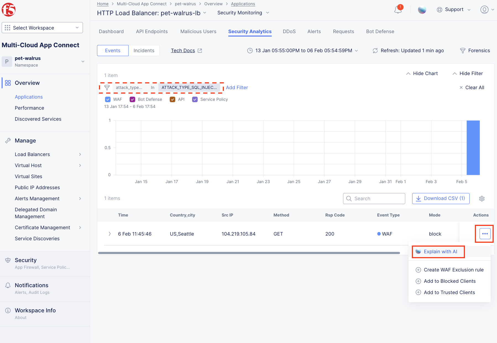

Lab 5: Rate Limiting
====================

The following lab tasks will guide you the configuration of Rate Limiting feature sets.
Rate Limiting can be used to implement a variety of L7 security controls; assisting in L7 DDoS, 
protecting heavy URLs (service process impactful) or mitigating impacts to other controlled endpoints.  

Task 1: Creating a Rate Limiting Policy 
~~~~~~~~~~~~~~~~~~~~~~~~~~~~~~~~~~~~~~~~~~~~~~~~~

In this task you will add a Rate Limiting Policy to the application Load Balancer previously created.

+----------------------------------------------------------------------------------------------+
| 1. Return to the **Web App & API Protection** configuration window. In the left-hand         |
|                                                                                              |
|    navigation, expand **Manage** and click **Load Balancers > HTTP Load Balancers**.         |
|                                                                                              |
| 2. In the resulting screen click the **Add HTTP Load Balancer** in the graphic as shown.     |
|                                                                                              |
| 3. Use the **Action Dots** and click **Manage Configuration**                                |
|                                                                                              |
| 4. Click **Edit Configuration** in the top right-hand corner.                                |
+----------------------------------------------------------------------------------------------+
| |lab001|                                                                                     |
|                                                                                              |
| |lab002|                                                                                     |
+----------------------------------------------------------------------------------------------+

+----------------------------------------------------------------------------------------------+
| 5. Click **Common Security Controls** in the left-hand navigation & locate **Rate Limiting**.|
|                                                                                              |
| 6. Click the dropdown for **Rate Limiting** and select **Custom Rate Limiting Parameters**.  |
+----------------------------------------------------------------------------------------------+
| |lab003|                                                                                     |
+----------------------------------------------------------------------------------------------+

+----------------------------------------------------------------------------------------------+
| 7. In the expanded **Custom Rate Limiting Parameters** click the **View Configuration** Link.|
+----------------------------------------------------------------------------------------------+
| |lab004|                                                                                     |
+----------------------------------------------------------------------------------------------+

+----------------------------------------------------------------------------------------------+
| 8. In the resulting **Rate Limit Configuration** window, click the drop-down for **Rate**    |
|                                                                                              |
|    **Limiter Policies** and select **Rate Limiter Policies**.                                |
+----------------------------------------------------------------------------------------------+
| |lab005|                                                                                     |
+----------------------------------------------------------------------------------------------+

+----------------------------------------------------------------------------------------------+
| 9. In the new row, click **Add Item** dropdown select menu as shown.                         |
+----------------------------------------------------------------------------------------------+
| |lab006|                                                                                     |
+----------------------------------------------------------------------------------------------+

+----------------------------------------------------------------------------------------------+
| 10. In the **Metadata** section **Name** field input **rate-limit**.                         |
|                                                                                              |
| 11. In the **Rules** section, click the **Configure** link.                                  |
|                                                                                              |
| 12. In the resulting **Rules** window, click the **Add Item** button.                        |
+----------------------------------------------------------------------------------------------+
| |lab007|                                                                                     |
|                                                                                              |
| |lab008|                                                                                     |
+----------------------------------------------------------------------------------------------+

+----------------------------------------------------------------------------------------------+
| 13. In the **Rate Limiter Policy** window within the **Metadata** section input              |
|                                                                                              |
|     **rate-limit-rule** into the **Name** field input .                                      |
|                                                                                              |
| 14. For the **Actions** drop-down select, **Apply Custom Rate Limiter**.                     |
+----------------------------------------------------------------------------------------------+
| |lab009|                                                                                     |
+----------------------------------------------------------------------------------------------+

+----------------------------------------------------------------------------------------------+
| 15. Scroll down to the **Request Match** section and select the **Configure** link in the    |
|                                                                                              |
|     **HTTP Method** section as shown.                                                        |
|                                                                                              |
| 16. In the resulting **HTTP Method** window under **Method List**, select **POST** then      |
|                                                                                              |
|     click **Apply**.                                                                         |
+----------------------------------------------------------------------------------------------+
| |lab010|                                                                                     |
|                                                                                              |
| |lab011|                                                                                     |
+----------------------------------------------------------------------------------------------+

+----------------------------------------------------------------------------------------------+
| 17. Observe that **HTTP Method** now appears **Configured**.                                 |
|                                                                                              |
| 18. Further down in the **Request Match** section, select the **Configure** link in the      |
|                                                                                              |
|     **HTTP Path** section as shown.                                                          |
|                                                                                              |
| 19. Observe the various Path definition options, click **Add Item** in the **Prefix Values** |
|                                                                                              |
|     section the input **/auth.php** as shown and then click **Apply**.                       |
|                                                                                              |
| .. note::                                                                                    |
|                                                                                              |
|    *Although its already protect by Bot Defense, we can also control the rate at which the*  |
|                                                                                              |
|    *specific authentication page can be POSTed to (or any other page).*                      |
+----------------------------------------------------------------------------------------------+
| |lab012|                                                                                     |
|                                                                                              |
| |lab013|                                                                                     |
+----------------------------------------------------------------------------------------------+

+----------------------------------------------------------------------------------------------+
| 20. Observe that **HTTP Path** now also appears **Configured**. Click **Apply** on the       |
|                                                                                              |
|     **Rate Limiter Policy** window.                                                          |
|                                                                                              |
| 21. Observe the added rule in the **Rule** window and then click **Apply**.                  |
|                                                                                              |
| 22. Complete the custom **Rate Limiter Policy** by clicking **Continue**.                    |
+----------------------------------------------------------------------------------------------+
| |lab014|                                                                                     |
|                                                                                              |
| |lab015|                                                                                     |
|                                                                                              |
| |lab016|                                                                                     |
+----------------------------------------------------------------------------------------------+

+----------------------------------------------------------------------------------------------+
| 23. Observe the **Request Rate Limiter** options for number of requests, the Per Period      |
|                                                                                              |
|     interval and the Burst Multiplier.                                                       |
|                                                                                              |
| 24. Also observe that IPs can be allowed without Rate Limiting policies being applied        |
|                                                                                              |
| 25. Click **Apply** to add the **Rate Limit Configuration** to the application Load Balancer.|
|                                                                                              |
| .. note::                                                                                    |
|                                                                                              |
|    *Although only one rule is being added, multiple Rate Limit rules can be attached.*       |
+----------------------------------------------------------------------------------------------+
| |lab017|                                                                                     |
+----------------------------------------------------------------------------------------------+

+----------------------------------------------------------------------------------------------+
| 26. Observe that the **Custom Rate Limiting Parameters** now show **Configured** and then    |
|                                                                                              |
|     click on **Other Settings** in the left-hand navigation.                                 |
|                                                                                              |
| 27. Once at the bottom of the **HTTP Load Balancer** configuration, click **Save and Exit**. |
+----------------------------------------------------------------------------------------------+
| |lab018|                                                                                     |
|                                                                                              |
| |lab019|                                                                                     |
+----------------------------------------------------------------------------------------------+

+----------------------------------------------------------------------------------------------+
| **End of Lab 5:**  This concludes Lab 5, feel free to review and test the configuration.     |
|                                                                                              |
| A Q&A session will begin shortly to conclude the overall lab.                                |
+----------------------------------------------------------------------------------------------+
| |labend|                                                                                     |
+----------------------------------------------------------------------------------------------+

.. |lab002| image:: _static/lab5-002.png
   :width: 800px
.. |lab003| image:: _static/lab5-003.png
   :width: 800px
.. |lab004| image:: _static/lab5-004.png
   :width: 800px
.. |lab005| image:: _static/lab5-005.png
   :width: 800px
.. |lab006| image:: _static/lab5-006.png
   :width: 800px
.. |lab007| image:: _static/lab5-007.png
   :width: 800px

.. |lab009| image:: _static/lab5-009.png
   :width: 800px
.. |lab010| image:: _static/lab5-010.png
   :width: 800px
.. |lab011| image:: _static/lab5-011.png
   :width: 800px
.. |lab012| image:: _static/lab5-012.png
   :width: 800px
.. |lab013| image:: _static/lab5-013.png
   :width: 800px
.. |lab014| image:: _static/lab5-014.png
   :width: 800px
.. |lab015| image:: _static/lab5-015.png
   :width: 800px
.. |lab016| image:: _static/lab5-016.png
   :width: 800px
.. |lab017| image:: _static/lab5-017.png
   :width: 800px
.. |lab018| image:: _static/lab5-018.png
   :width: 800px
.. |lab019| image:: _static/lab5-019.png
   :width: 800px
.. |labend| image:: _static/labend.png
   :width: 800px