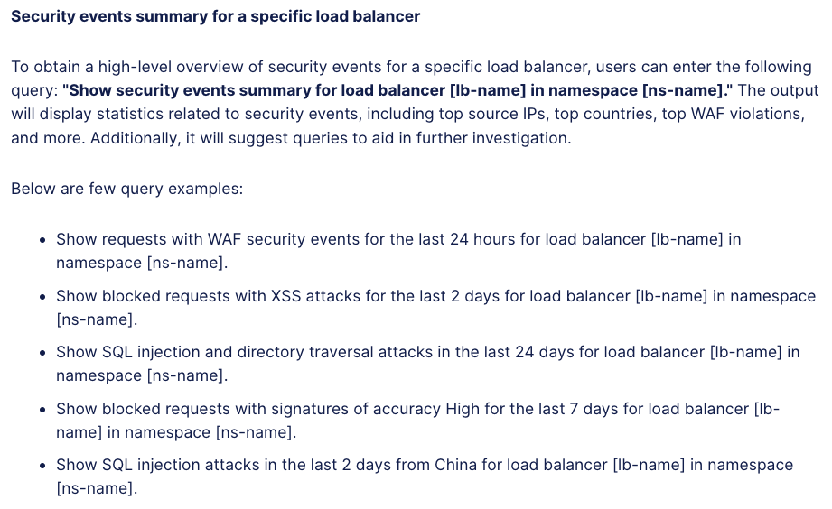

Lab 5: AI Assistant and Security Operations
===========================================

**Objective:**

* Provide summarization of security events
* Quickly provide details on how many attacks have happened and mitigation techniques applied
  
**Narrative:** 

As ACME corp has continued to protect their web applications, leaders within the organization 
has made requests for summaries of how ACME's security investments are protecting the environment.
ACME corp has made investments in SIEM technologies and F5 Distributed Cloud can export logs to external
SIEMs.  However not everyone in the ACME organization has experience building dashboards and running complex queries.
After speaking with ACME corp's F5 SE, F5 Distributed Console has an AI assistant in the SaaS console that can 
provide answers quickly using natural language.   

**Expected Lab Time: 5 minutes**

Task 1: Exploring AI Assistant
~~~~~~~~~~~~~~~~~~~~~~~~~~~~~~

In this task you will utilize the AI assistant to explore security events.  The AI assistant brings several intelligent 
capabilities to simplify management and security of apps and APIs using a natural language interface, including:

* Real-time insights: Promote application security and site health with up-to-the-minute visibility of hybrid, multicloud
sites, ensuring security and networking practitioners can quickly detect and respond to emerging threats, maintaining
a robust security posture.

* Summarization: Leverage advanced summarization capabilities to distill large volumes of data into clear, concise
reports. This allows teams to better understand complex information and advanced security events to make more
informed decisions without sifting through overwhelming amounts of data.

* Actionable recommendations: Deliver actionable recommendations, enabling users to swiftly address identified
threats, performance issues, network health status, and vulnerabilities. By guiding users through necessary steps, the
AI assistant helps enhance overall security and streamline incident response operations.

* Improved operations and efficiency: Automate and simplify complex security and networking tasks to significantly
improve operational efficiency. This allows SecOps and NetOps teams to focus on strategic initiatives, reducing workload 
and optimizing resource allocation. 

#. From the F5 Distributed Cloud Home Page, click the AI Assistant icon in the top right hand corner.
   |lab001|

#. The AI Assistant can help administrators start their security investigation be suggesting some queries.
   Click into the prompt field and a list of suggested queries will pop up.  Select **How to investigate security events**. 
   Select **Enter** to proceed.

   |lab002|

#. The AI Assistant will then detail its capabilities to assist with Security Investigations.  The AI Assistant can provide
   detailed explanation on a specific event by utilizing the query **"Explain security event [request-id]".**

   |lab003|

#. The AI Assistant can also provide a summary and high-level overview of security events for a specific application.

   |lab004|

#. Lets start with getting a total number of the security events in your namespace for your application.  

   .. code:: BASH

      Show requests with WAF security events for the last 24 hours for load balancer [lb-name] in namespace [ns-name]
   
   .. NOTE:: Be sure to replace the [lb-name] with your adjective-animal-lb and [namespace] with adjective-animal of your lab
   
#. In this example the AI Assistant has notified us that there are 42 security events that were detected for our application.
   The AI Assistant also provides us a link to go directly to the Security Analytics Dashboard page. 

   |lab005|

#. You can also query the AI Assistant for specific types of attacks like SQL injections.

   .. code:: BASH

      Show SQL injection and directory traversal attacks in the last 24 days for load balancer [lb-name] in namespace [ns-name].
   
   .. NOTE:: Be sure to replace the [lb-name] with your adjective-animal-lb and [namespace] with adjective-animal of your lab

#. In this example the AI Assistant has notified us that there was 1 security event that was a SQL injection or Path traversal
   type of attack. Click on the link to go directly to the Security Analytics. 

   |lab006|

#. The AI Assistant will take you directly to the event and build the filters directly for you.  This reduces the manual operations 
   that were done in Lab 1.  Note: You may need to minimize the AI Assistant by clicking the Hide button in the upper-right hand corner.

   |lab007|

#. In the actions button of the security event, select **Explain with AI**.  This button will generate a query for you and the
   AI Assistant will give you a detailed summary of the attack along with suggested Follow-up actions.  You can gather
   more information by clicking on **Detection Details**.

   |lab008|

   |lab009|

Narrative Check
---------------
By leveraging AI Assistant, network security operators can quickly investigate security events.  The AI Assistant can also 
provide summary details natively in platform without requiring a third party visibility platform as observability is native
to Distributed Cloud.  

**End of Lab 5:**  This concludes Lab 5, feel free to review and the following video for more information about AI Assistant.
https://www.youtube.com/watch?v=vaGygSkQOso 

A Q&A session will begin shortly to conclude the overall lab.

|labend|

.. |lab001| image:: _static/lab5-001.png
   :width: 800px
.. |lab002| image:: _static/lab5-002.png
   :width: 800px
.. |lab003| image:: _static/lab5-003.png
   :width: 800px

.. |lab005| image:: _static/lab5-005.png
   :width: 800px
.. |lab006| image:: _static/lab5-006.png
   :width: 800px
.. |lab007| image:: _static/lab5-007.png
   :width: 800px
.. |lab008| image:: _static/lab5-008.png
   :width: 800px

.. |lab010| image:: _static/lab5-010.png
   :width: 800px
.. |lab011| image:: _static/lab5-011.png
   :width: 800px
.. |lab012| image:: _static/lab5-012.png
   :width: 800px
.. |lab013| image:: _static/lab5-013.png
   :width: 800px
.. |lab014| image:: _static/lab5-014.png
   :width: 800px
.. |lab015| image:: _static/lab5-015.png
   :width: 800px
.. |lab016| image:: _static/lab5-016.png
   :width: 800px
.. |lab017| image:: _static/lab5-017.png
   :width: 800px
.. |lab018| image:: _static/lab5-018.png
   :width: 800px
.. |lab019| image:: _static/lab5-019.png
   :width: 800px
.. |lab020| image:: _static/lab5-020.png
   :width: 800px
.. |labend| image:: _static/labend.png
   :width: 800px
