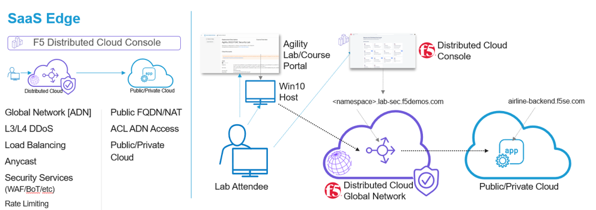
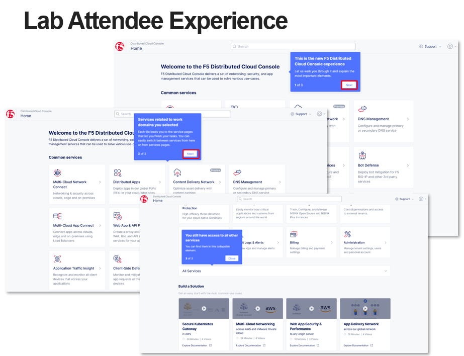
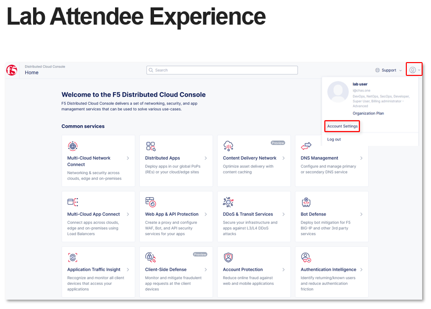
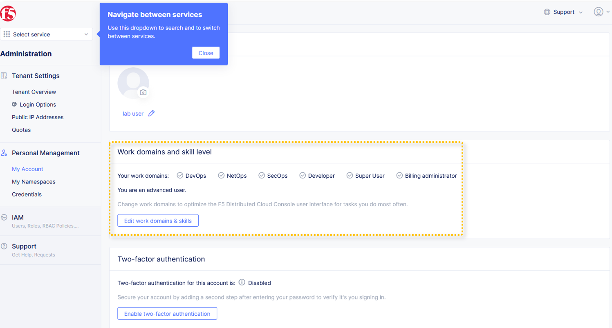
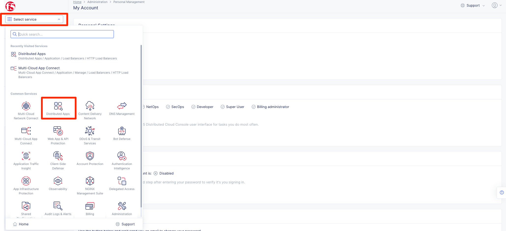
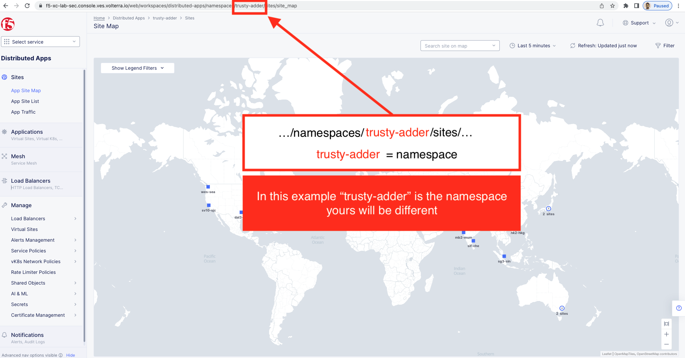
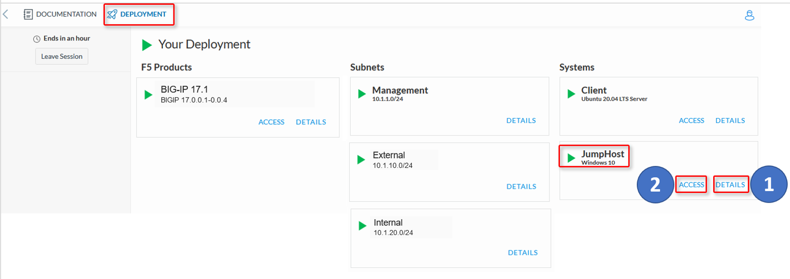
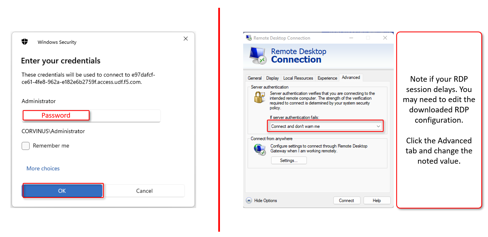

Introduction: Accessing Lab Resources
=====================================

Welcome to this F5 Distributed Cloud Lab. The following tasks will guide you through the initial 
access requirements for this multi-part lab.  Lab attendees should have received an invitation 
(which requests you update your password for access) email to the lab environment. Please check 
the email address used for course registration and its associated spam folders to see if the
invitation email has been received.  If you have not received an email, please contact a member
of the lab team.
 
The F5 Distributed Cloud Console, where a majority of all lab tasks will be conducted, is a SaaS
based control-plane for services which provides a GUI and API for managing network, security, and
compute services. The F5 Distributed Cloud Console can manage "sites" in existing on-premises,
private data centers and sites within AWS, Azure, and GCP public cloud environments.

Task 1: Lab Environment
~~~~~~~~~~~~~~~~~~~~~~~

+----------------------------------------------------------------------------------------------+
| The image below represents an overview of the lab environment. F5 Distributed Cloud Services |
|                                                                                              |
| will be configured as a SaaS Edge delivery and security service tier to a publicly hosted web|
|                                                                                              |
| application. The key elements lab attendees will interact with are as follows:               |
|                                                                                              |
| * **F5 Distributed Cloud Console**                                                           |
| * **F5 Distributed Cloud Global Network / Application Delivery Network (ADN)**               |
| * **Publicly hosted application (Public Cloud)**                                             |
+----------------------------------------------------------------------------------------------+
| |intro001|                                                                                   |
+----------------------------------------------------------------------------------------------+

Task 2: F5 Distributed Cloud Console Login
~~~~~~~~~~~~~~~~~~~~~~~~~~~~~~~~~~~~~~~~~~

The following will guide you through the initial Lab environment access within the F5 Distributed
Cloud Console.  You should have received an email with an invitation to access a F5 Distributed
Cloud Tenant. The email will come from **no-reply@volterramails.io**.

The name of the F5 Distributed Cloud tenant that we will be using for this lab is **f5-xc-lab-sec**
Additionally, the following are key configuration elements for this lab and will be used
throughout the lab tasks that follow.

* F5 Distributed Cloud Console: https://f5-xc-lab-sec.console.ves.volterra.io/
* Delegated Domain: **lab-sec.f5demos.com**

After following the invitation email's instructions to **Update Password**, proceed to the first
step below to access the F5 Distributed Cloud Lab Tenant. 

+----------------------------------------------------------------------------------------------+
| 1. Please log into the F5 Distributed Cloud Lab Tenant with your user ID (email) & password. |
|                                                                                              |
|    https://f5-xc-lab-sec.console.ves.volterra.io/                                            |
|                                                                                              |
| 2. When you first login, accept the Lab tenant EULA. Click the check box and then click      |
|                                                                                              |
|    **Accept and Agree**.                                                                     |
|                                                                                              |
| 3. Select all work domain roles and click **Next** to see various configuration options.     |
|                                                                                              |
|    Roles can be changed any time later if desired.                                           |
|                                                                                              |
| 4. Click the **Advanced** skill level to expose more menu options and then click **Get**     |
|                                                                                              |
|    **Started** to begin. You can change this setting after logging in as well.               |
|                                                                                              |
| 5. Several **Guidance ToolTips** will appear, you can safely close these as they appear.     |
+----------------------------------------------------------------------------------------------+
| |intro002|                                                                                   |
|                                                                                              |
| |intro003|                                                                                   |
|                                                                                              |
| |intro004|                                                                                   |
|                                                                                              |
| |intro005|                                                                                   |
+----------------------------------------------------------------------------------------------+

+----------------------------------------------------------------------------------------------+
| 6. You can adjust your work domains and skill level (not required) by clicking on the        |
|                                                                                              |
|    **Account** icon in the top right of the screen and then clicking on **Account Settings**.|
|                                                                                              |
| 7. In the resulting window you can observe the **Work domains and skill level** section and  |
|                                                                                              |
|    other administrative functions.                                                           |
|                                                                                              |
| .. note::                                                                                    |
|    *For the purposes of this lab, permissions have been restricted to lab operations.  As a* |
|                                                                                              |
|    *some menus will be locked and not visible.*                                              |
+----------------------------------------------------------------------------------------------+
| |intro006|                                                                                   |
|                                                                                              |
| |intro007|                                                                                   |
+----------------------------------------------------------------------------------------------+

+----------------------------------------------------------------------------------------------+
| 8. Namespaces, which provide an environment for isolating configured applications or         |
|                                                                                              |
|    enforcing role-based access controls, are leveraged within the F5 Distributed Cloud       |
|                                                                                              |
|    Console.  For the purposes of this lab, each lab attendee has been provided a unique      |
|                                                                                              |
|    **namespace** which you will defaulted to (in terms of GUI navigation) for all tasks      |
|                                                                                              |
|    performed through the course of this lab.                                                 |
|                                                                                              |
| 9. Click on the **Select Service** in the left-hand navigation. In the resulting fly out     |
|                                                                                              |
|    navigation, click **Load Balancers**.                                                     |
|                                                                                              |
| 10. In the **Load Balancers** configuration screen observe the URL. In the URI path, locate  |
|                                                                                              |
|     the **<adjective-animal>** namespace that you have been assigned. It will be located in  |
|                                                                                              |
|     the portion of the URI path between */namespaces/* and */sites/* as shown in this        |
|                                                                                              |
|     example **…/namespaces/<namespace>/sites/…**. Note the namespace as it will be used      |
|                                                                                              |
|     throughout the lab tasks that follow.                                                    |
|                                                                                              |
| .. note::                                                                                    |
|    *Administratively, there are other ways to find namespaces. Due to access and permission* |
|                                                                                              |
|    *restrictions for this particular lab, those menus are not available.*                    |
+----------------------------------------------------------------------------------------------+
| |intro008|                                                                                   |
|                                                                                              |
| |intro009|                                                                                   |
+----------------------------------------------------------------------------------------------+

Task 3: Accessing your Lab Jumphost
~~~~~~~~~~~~~~~~~~~~~~~~~~~~~~~~~~~

The following will guide you through accessing your Lab Jumphost.  Subsequent tasks will require
you to use the Jumphost for access to the OpenBullet tool and other associated resources available
only on the Jumphost. 

+----------------------------------------------------------------------------------------------+
| 1. Returning to the UDF Course screen in your browser, click on the **Deployment** tab and   |
|                                                                                              |
|    then observer the **JumpHost** and its two options; **Access** and **Details**. You will  |
|                                                                                              |
|    first click on the **Details** link.                                                      |
+----------------------------------------------------------------------------------------------+
| |intro010|                                                                                   |
+----------------------------------------------------------------------------------------------+

+----------------------------------------------------------------------------------------------+
| 2. In the resulting window note the **Administrator** password which you will use shortly    |
|                                                                                              |
|    and then click **Done** in the bottom right-hand corner of the window.                    |
|                                                                                              |
|    .. warning::                                                                              |
|                                                                                              |
|       **DO NOT CLICK STOP**. If you do so you will have to wait till it stops then restart   |
|                                                                                              |
|       your JumpHost for this lab.                                                            |
+----------------------------------------------------------------------------------------------+
| |intro011|                                                                                   |
+----------------------------------------------------------------------------------------------+

+----------------------------------------------------------------------------------------------+
| 3. Returning to the UDF Course screen in your browser and the **Deployment** tab and click   |
|                                                                                              |
|    on the **Access** link. From the resulting dropdown, click on the resolution you prefer.  |
+----------------------------------------------------------------------------------------------+
| |intro012|                                                                                   |
+----------------------------------------------------------------------------------------------+

+----------------------------------------------------------------------------------------------+
| 4. A RDP file will download which you will need to open.  Note different browsers will render|
|                                                                                              |
|    the download differently.  Your OS platform must have an application which supports       |
|                                                                                              |
|    opening RDP files in order to access the JumpHost.                                        |
+----------------------------------------------------------------------------------------------+
| |intro013|                                                                                   |
+----------------------------------------------------------------------------------------------+

+----------------------------------------------------------------------------------------------+
| 5. You will then be prompted to log in as Administrator to the JumpHost.  Note the prompt    |
|                                                                                              |
|    may render differently for other RDP clients. If you expereince an abnormally long delay  |
|                                                                                              |
|    in accessing the JumpHost, changing the **If server authentication fails** setting to     |
|                                                                                              |
|    **Connect and dont warn me**.  If you cannot connect, please alert a lab team member.     |
|                                                                                              |
|    Anti-virus configurations, VPN or conflicting applications can also complicate access.    |
+----------------------------------------------------------------------------------------------+
| |intro014|                                                                                   |
+----------------------------------------------------------------------------------------------+

+----------------------------------------------------------------------------------------------+
| **Beginning of Lab:**  You are now ready to begin the lab, Enjoy! Ask questions as needed.   |
+----------------------------------------------------------------------------------------------+
| |labbgn|                                                                                     |
+----------------------------------------------------------------------------------------------+

.. |intro002| image:: _static/intro-002.png
   :width: 800px
.. |intro003| image:: _static/intro-003.png
   :width: 800px
.. |intro004| image:: _static/intro-004.png
   :width: 800px

.. |intro011| image:: _static/intro-011.png
   :width: 800px
.. |intro012| image:: _static/intro-012.png
   :width: 800px
.. |intro013| image:: _static/intro-013.png
   :width: 800px

.. |labbgn| image:: _static/labbgn.png
   :width: 800px
