Lab 1 Service Policy
====================

In this lab, you will implement a simple service policy for a web application. The service policy will define how the application 
should handle incoming requests based on certain criteria, such as the user's role or the time of day.

F5 Distributed Cloud Service Policies are part of a unified, SaaS-based security framework that allows, denies, or rate-limits traffic to
applications across multi-cloud, edge, and on-premises environments. These policies offer granular control (via headers, IP, TLSfingerprint,or path) and
are enforced through a central console to protect against Layer 7 attacks, WAF, bot threats, and API misuse.

These service policies, are the "iRules" of the Distributed Cloud world, and they are what allow you to create custom security policies that fit your specific use case.

Common use cases:

* Allow for public certs, DNS to be established for the application, but only allow traffic from certain IPs, or that include specific headers and values.

* Allow for traffic to bypass WAF

* Geo blocking

* Ja4+ fingerprinting

In this lab, we will following the first use case allowing the application team to deploy a new application with public certs and DNS, but only 
allow traffic that includes a specific header and value. This is a common use case for app teams that want to have the flexibility to 
manage their own applications, but still want to have some control over the security of their applications.

For the scope of this lab, we will apply service policies to a specific server in the namespace. You *could* however, strategically apply 
service policies to specific applications by host header or label selectors.

Lab Environment:

Your lab environment should already be deployed. In the steps below you'll navigate user interface to discover the load balancer and assigned
origin pool. 

.. image:: _images/lab1/multi-app-conn.png
   :scale: 30%
   :alt: multi app conn
   :align: center

You'll now navigate to review the load balancer configuration as shown below.

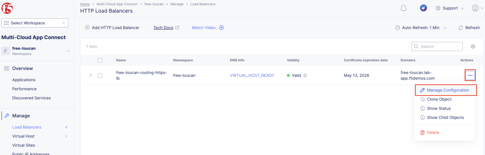

Make note of the name of the load balancer for your deployment as it will be different than the one shown below. It should be in the format
of *<adjective-animal>*-routing-https-lb. 

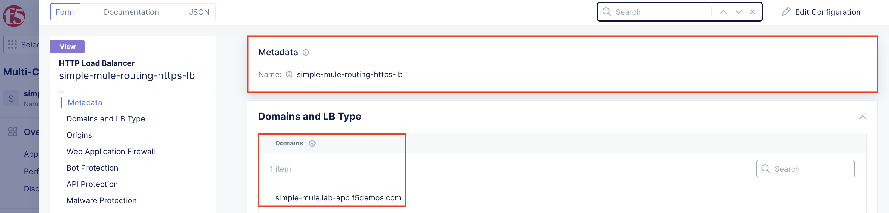

And verify that the blue pool is is your active pool.

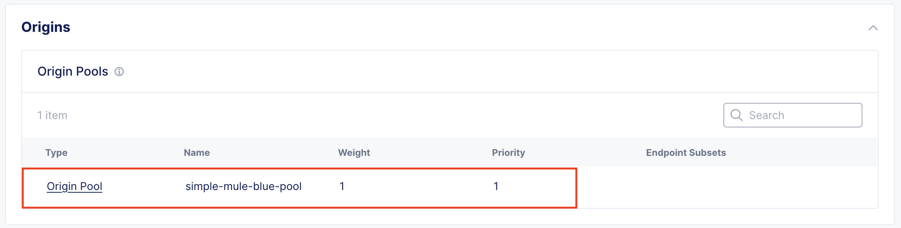

And scroll down to *Common Security Controls* section and notice the section below:

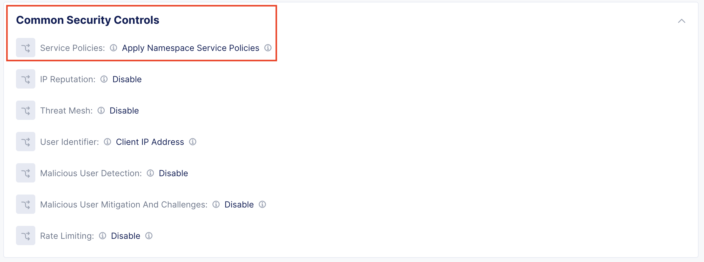

This means that any service policy we create **AND** make active in the namespace will be applied to this load balancer.

Your review of the load balancer configuration is now complete. Please click *Close* in the bottom right to return to the main page.

You should now be back to the main page for load balancers. Please make note of the domain name for your load balancer as you 
will need this to access the application. It should be in the format of *<your-namespace>*-lab-app.f5demos.com. Like below:

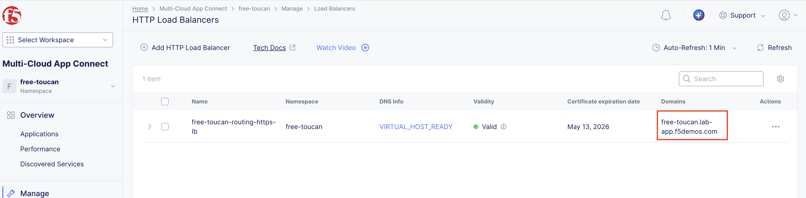

You should now see the blue application when navigating to the domain name from your browser. Please make note of the domain or leave a tab open
as you'll need this for further configuration in the next steps.

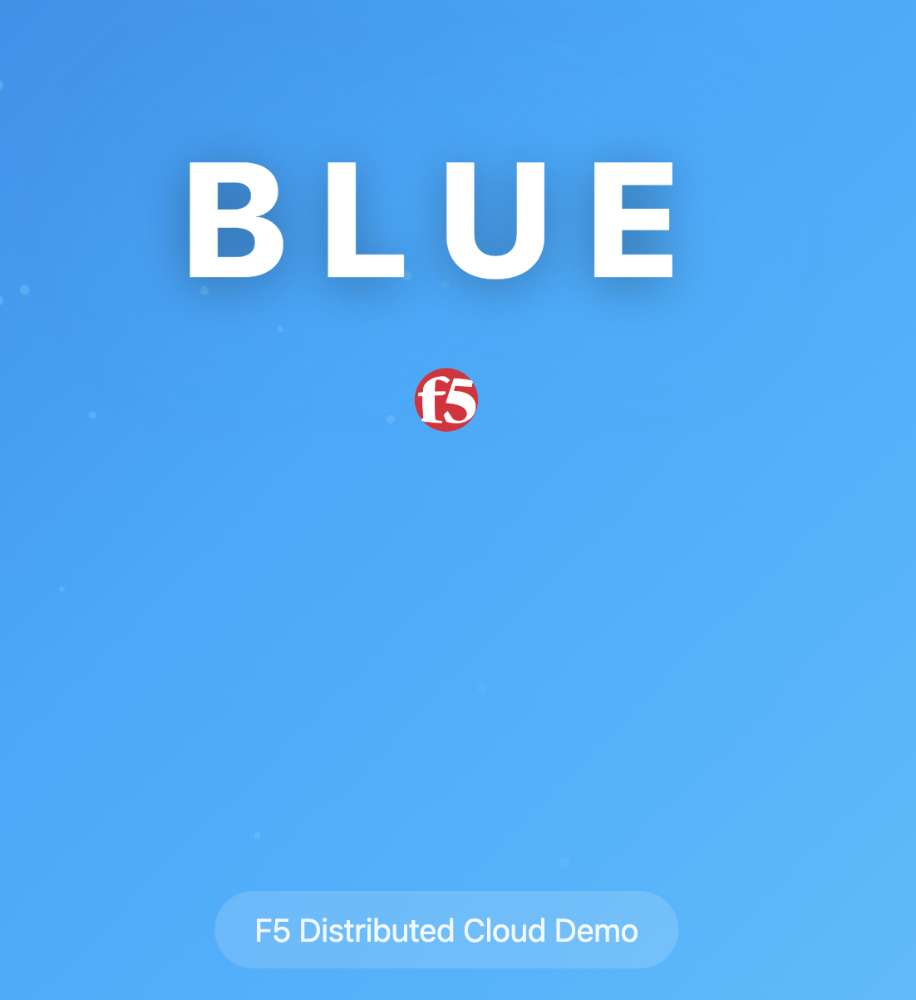

Now we will create our first service policy. On the left navigation menu, click on *Security* > *Service Policies* > *Service Policies*

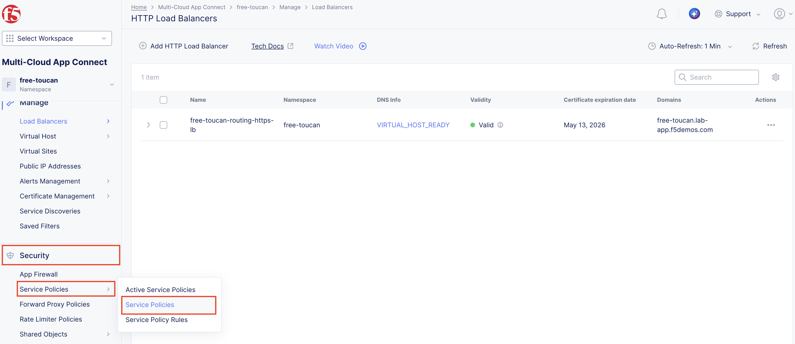

Click on *Add Service Policy*, notice the two existing policies that are already in place. These are applied by Distributed Cloud
and in a namespace you do not control so you cannot remove them.  Let's build our first service policy:

.. image:: _images/lab1/add-svc-pol.png
   :scale: 30%
   :alt: add
   :align: center

Please name the service policy *custom-header*, take note of the Server Selections. You can make a policies based on all servers, host headers, or tags.
Notice the options in the drop down, but for the lab you will use **Server Name**. Please add your unique load balancer name.We will select *Custom Rule List*

.. image:: _images/lab1/svc-pol-custom.png
   :scale: 30%
   :alt: custom
   :align: center 

After selecting *Custom Rule List* (default) you will next click on *Configure* which will take you to where we will build and add rules.

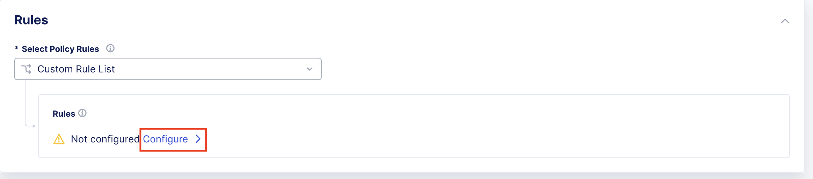

Click on *Add Item*, once you click this you will see the options for the different types of rules you can create. For this lab, 
we will be creating a simple rule that only allows traffic to the application if it contains a specific header with a specific value. You can build 
multiple rule sets to be applied.

.. image:: _images/lab1/svc-pol-custom-add-rule.png
   :scale: 30%
   :alt: add rule
   :align: center

Time to start building the **real** rule. You can title the specific rule whatever you like, but for this lab we will call it *appworld-header*. 
Please make sure to toggle *Show Advanced Fields* to the right so that you can see all of the options available to you. You'll set the 
action to **Allow**.

.. image:: _images/lab1/custom-rule-appworld.png
   :scale: 30%
   :alt: appworld
   :align: center 

Now scroll down or use the link on left to navigate to the *Request Match* section. This is where you will define the actual criteria 
that will be used to match our custom header/value. Click **Add Item** under the HTTP Headers section. 

.. image:: _images/lab1/svc-req-match.png
   :scale: 30%
   :alt: match
   :align: center

In this step you'll configure the actual header and value that you want to require for traffic to be allowed to the application. 
For this lab, we will be creating a rule that only allows traffic that contains the header of:

 header = *x-f5-appworld*

 value  = *RjUtQXBwd29ybGQ=*

How did we get this value? If you decode the value from base64, you will see that it decodes to *F5-Appworld*. This is just an extra 
step to make sure that the value is not easily guessable.

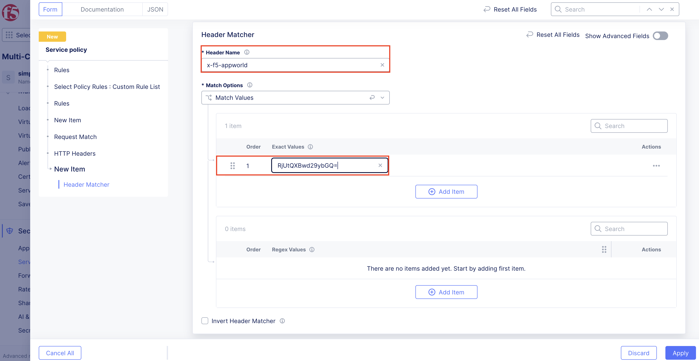

Now to save all your work. On the bottom right, click **Apply**, then **Apply**, and finally **Add Service Policy**.

Congratulations, you have now built your first service policy. However, it is not active yet, so let's make it active so that it can 
start enforcing the rules. To make the service policy active, navigate back to *Security* > *Service Policies* > *Active Service Policies*

.. image:: _images/lab1/add-to-active.png
   :scale: 30%
   :alt: active
   :align: center

From this page, you can select service policies that have been created and make them active. You can have multiple active service policies at a time, 
and they will be enforced in the order that they are in the list. 

You can also have different active service policies for different server selections, such as specific host headers or tags.

.. image:: _images/lab1/sel-active.png
   :scale: 30%
   :alt: select
   :align: center 

Click **Add Item** to add the previously created service policy, from drop down, to the active policies and make sure to click the bottom right **Add Select Active Service Policies**

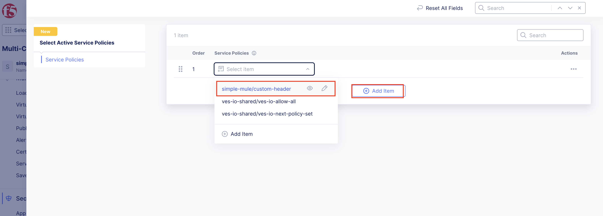

Now try to navigate to your domain again, you should now see a 403 error. This is because the service policy is blocking all 
traffic that does not have the header/value of *x-f5-appworld: RjUtQXBwd29ybGQ=*

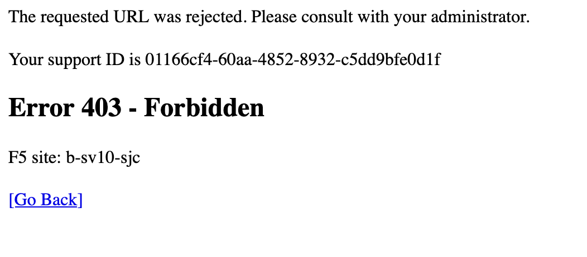

You should now also see this reflected in the analytics for the load balancer. You can navigate to the analytics by clicking:

Overview > Performance ; then scroll down to the name of your load balancer and click on it. 

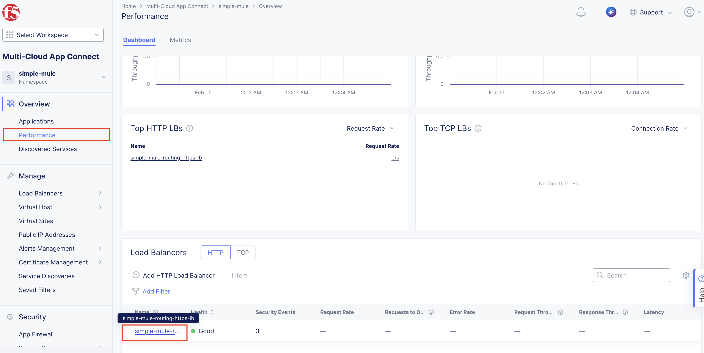

You are now at the *Dashboard* view. Here you can see various statistics about the traffic to your load balancer. But to see our custom
header in action, click on the *Requests* tab. You may also need to adjust the time frame to see your traffic and refresh.

At the bottom of the page, you should now see your 403 error request. You can click on the down arrow to see more details about the request 
and see that it is being blocked by the service policy we just created.

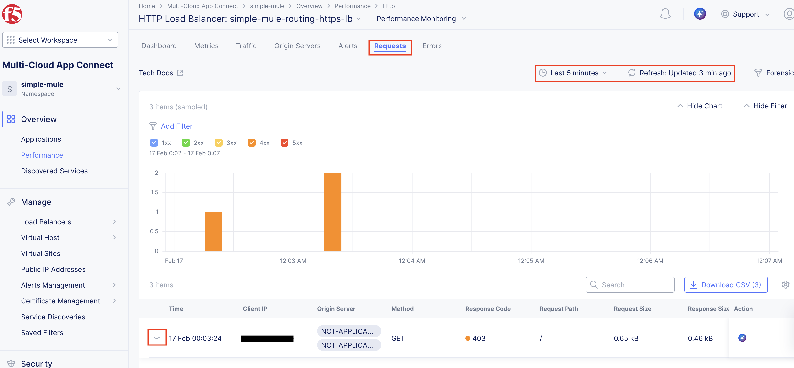

If you scroll down just a little, you can see the *Policy Hits* section. 

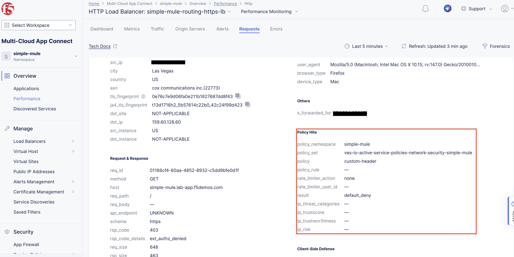

Let's now run a couple of tests from the command line to see the service policy in action. First, let's run a curl command without the 
header to see that it is being blocked. And then we will run a curl command with the header to see that it is being allowed. Make sure 
to replace the domain name in the command with your own. 

.. code-block:: bash

   curl -I https://simple-mule.lab-app.f5demos.com/

.. code-block:: bash

   curl -I https://simple-mule.lab-app.f5demos.com/ -H "x-f5-appworld: RjUtQXBwd29ybGQ="

Please alternate these commands several times to populate your dashboard.

You should see similar results to below.     

.. image:: _images/lab1/test-curl.png
   :scale: 30%
   :alt: curl test
   :align: center

You can now see the results of the curl commands in the analytics dashboard.

.. image:: _images/lab1/post-curl.png
   :scale: 30%
   :alt: post curl
   :align: center

We will now remove the service polices that have been built. 

When deleting the active service policy, make sure after you delete it to click the bottom right **Add Select Active Service Policies** to 
update the active policies for the load balancer.

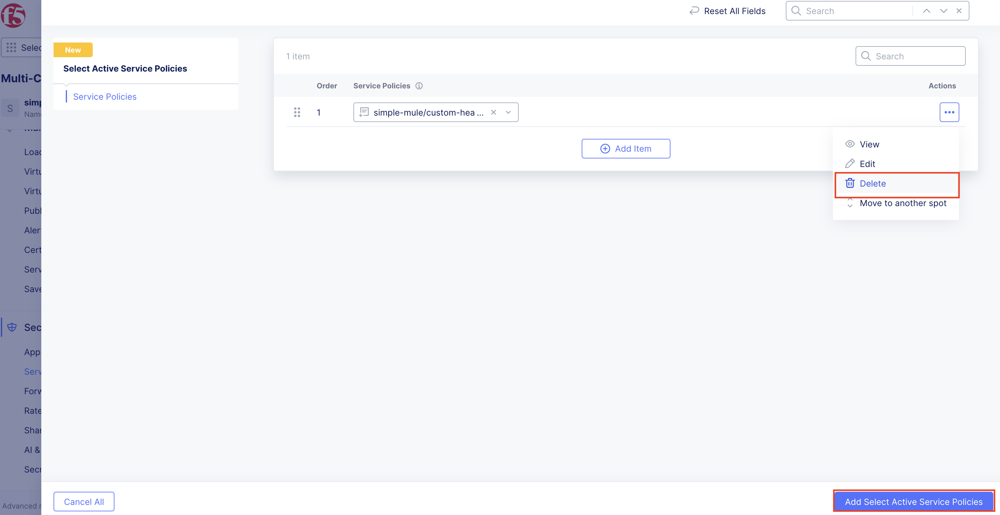
   
   +----------------------------------------------------------------------------------------------+ 
 **End of Lab 1**  

This concludes Lab 1. In this lab, you learned how to:  

- Create a Distributed Cloud Service Policy with a custom rule to control application access based on a specific HTTP header and value.

- Activate the service policy and observe how it enforces access control by blocking requests that do not meet the defined criteria.

- Validate policy behavior using curl and analyze the resulting allowed and blocked requests using the Distributed Cloud Performance Dashboard.
                            
+----------------------------------------------------------------------------------------------+
    |labend|                                                                                     
+----------------------------------------------------------------------------------------------+

.. |labend| image:: _static/labend.png
   :width: 800px