Lab 1 Service Policy
====================

In this lab, you will implement a simple service policy for a web application. The service policy will define how the application 
should handle incoming requests based on certain criteria, such as the user's role or the time of day.

F5 Distributed Cloud Service Policies are part of a unified, SaaS-based security framework that allows, denies, or rate-limits traffic to
applications across multi-cloud, edge, and on-premises environments. These policies offer granular control (via headers, IP, TLSfingerprint,or path) and
are enforced through a central console to protect against Layer 7 attacks, WAF, bot threats, and API misuse.

comparason to traffic policies from BIG-IP 

Common use cases:

- Allow for public certs, DNS to be established for the app, but only allow traffic from certain IPs, or that include specific headers and values.

- Allow for traffic to bypass WAF

- Geo blocking

List features of service policies in relation to ui 

For the scope of this lab, we will apply service policies to *Any Server* in the namespace. You *could* however, strategically apply 
service policies to specific applications by host header or label selectors.

Lab:

by default blue pool is active, we will see this when we go to add a new origin pool.

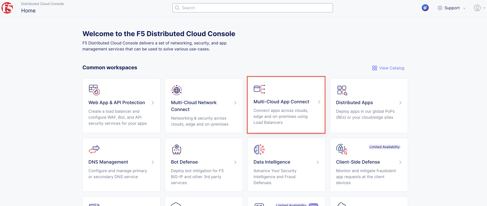

You'll now navigate to review the lb configuration as shown below.

.. image:: _static/lb-manage-conf.png

Make note of the name of the load balancer for your deployment as it will be different than the one shown below. It should be in the format
of *<adjective-animal>>*-routing-https-lb. 

.. image:: _static/lb-name.png

And verify that the blue pool is is your active pool.

.. image:: _static/lb-blue-pool.png 

And scroll down to *Common Security Controls* section and notice the section below:

.. image:: _static/lb-csc.png

This means that any service policy we create **AND** make active in the namespace will be applied to this load balancer.

Your review of the load balancer configuration is now complete. Please click *Close* in the bottom right to return to the main page.

You should now be back to the main page for load balancers. Please make note of the domain name for your load balancer as you 
will need this to access the app. It should be in the format of *<adjective-animal>>*-lab-app.f5demos.com. Like below:

.. image:: _static/lb-domain.png 

You should now see the blue app when navigating to the domain name from your browser. Plese make note of the domain or leave a tab open
as you'll need this for further configuration in the next steps.

.. image:: _static/blue-app.png

Now we will create our first service policy. On the left navigation menu, click on *Service Policies*

.. image:: _static/svc-pol-create.png 

Now you will click on *Add Service Policy*, Notice the two existing policies that are already in place. These are applied by Distributed Cloud
and in a namespace you do not control so you cannot remove them.  Let's build our first service policy:

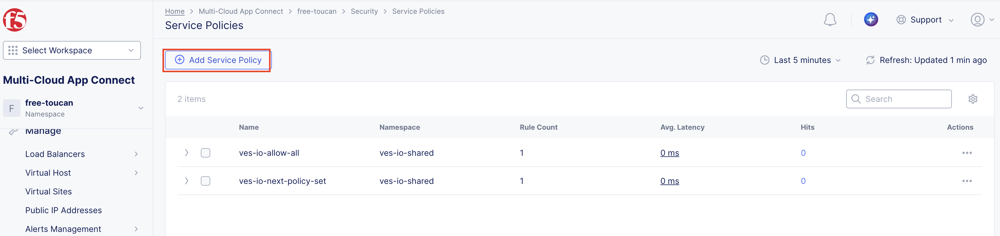

Please name the service policy *custom-header*, take note of the Server options. You can make a policies based on all servers, host headers, or tags.
Notice the options in the dropdown. (add link for options) We will select *Custom Rule List*

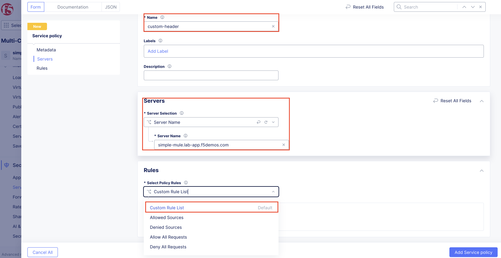

.. image:: _static/svc-pol-custom-conf.png

Click on *Add Item* 

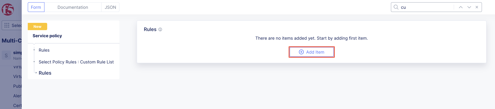

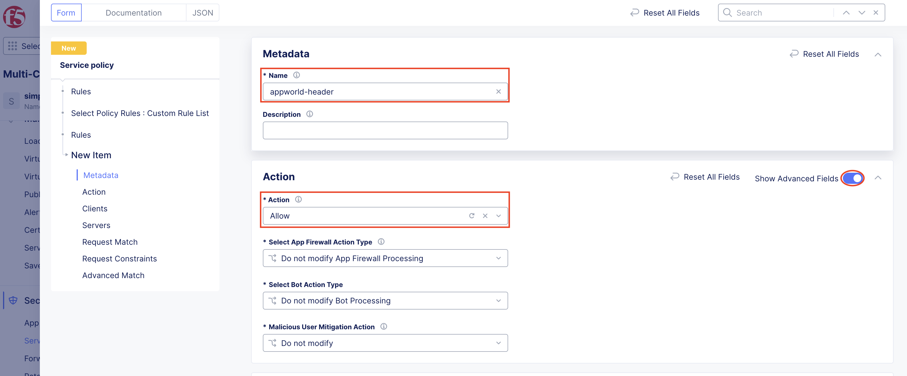

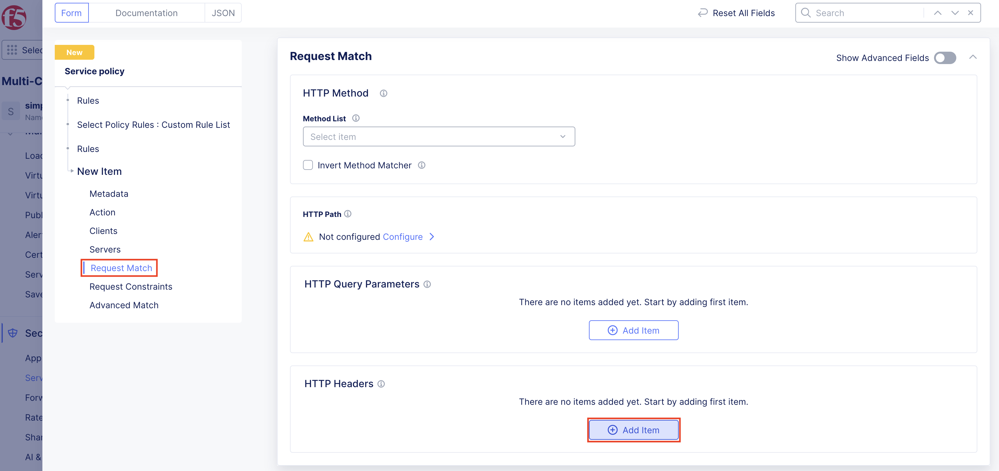

.. image:: _static/svc-header-match.png

apply; apply; add service policy  

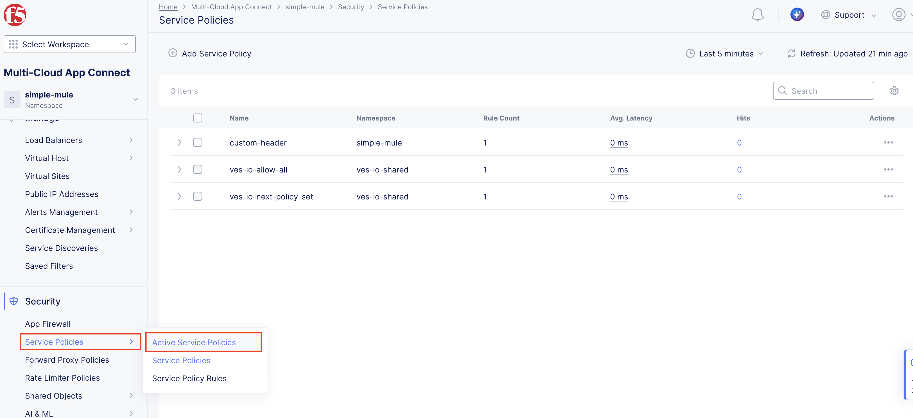

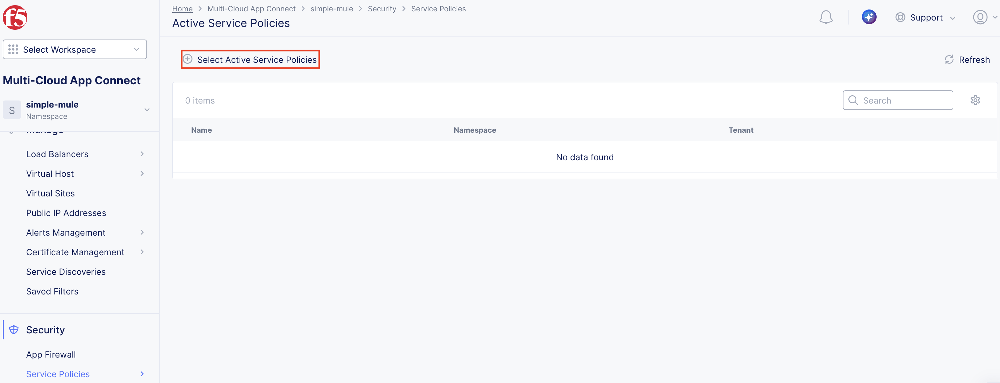

Add the previously created service policy to the active policies and make sure to click the bottom right **Add Select Active Service Policies **

.. image:: _static/act-custom-header.png 

Now try to navigate to your domain again, you should now see a 403 error. This is because the service policy is blocking all 
traffic that does not have the header of *x-app-world: f5*.

.. image:: _static/403-error.png

You should now also see this reflected in the analytics for the load balancer. You can navigate to the analytics by clicking on the load balancer name from the main load balancer page, and then clicking on the *Analytics* tab at the top.

.. image::_static/observe.png

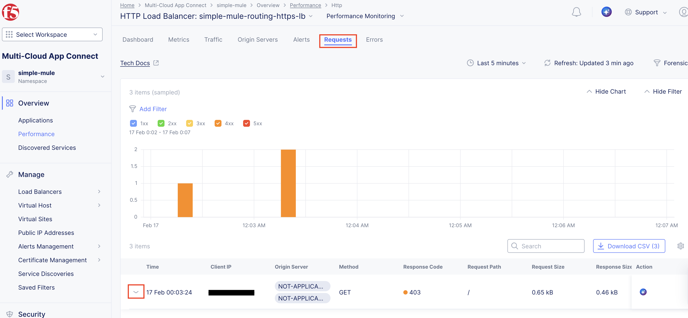

.. image:: _static/obs-hit.png 

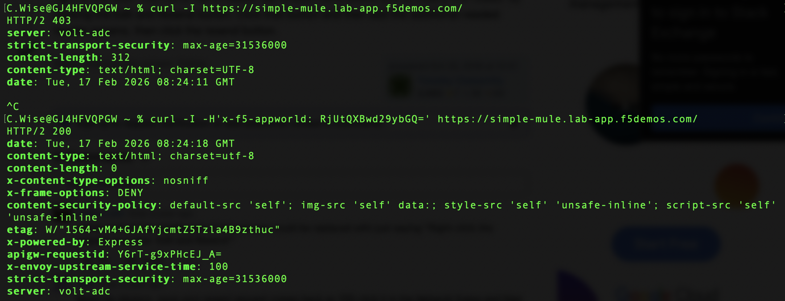

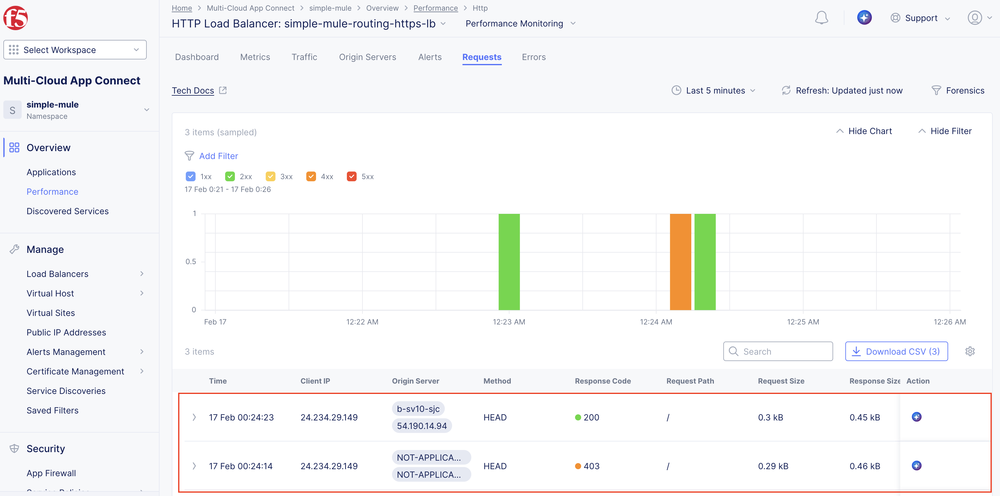

Ending

We will now remove the service polices that have been built. 

When deleting the active service policy, make sure after you delete it to click the bottom right **Add Select Active Service Policies** to 
update the active policies for the load balancer.

_static/del-custom-header.png 