Lab 1: Building a Service Policy for Negative Enforcement 
=========================================================

**Objective:**

* Explore and become familiar with the Distributed Cloud Console

* Review the F5 Distributed Cloud (XC) Load Balancer that has been provisioned

* Create a negative enforcement policy to provide initial protection for your application

**Narrative:** 

After consulting with your trusty F5 Solutions Engineer, you decide to adopt security services from 
F5 Distributed Cloud Web by leveraging service policies. The lab provisioned for you 
has already deployed a F5 XC load balancer and been setup to route to your Azure application.  The 
F5 Distributed Cloud Application Delivery Network (ADN) will provide network connectivity for clients 
to first route to F5's nearest Regional Edge(RE) location on the ADN utilizing IP Anycast.  Once 
the client is connected to the their nearest F5 RE, security controls can now be applied so that 
unwanted traffic can be dropped at the F5 RE and valid traffic can than be passed to ACME Azure environment.  
This lab will be deployed in a SaaS only configuration with no on-premises (public or private cloud) elements. 

.. NOTE:: You will not have direct access to the Azure environment where the application is hosted.

.. warning :: If you are using multiple labs in one course, understand that
   some steps below may be redundant depending on labs deployed. To gain full
   benefits from this lab, please delete any objects created in your prior lab
   and continue with this lab as all necessary objects will be recreated.

Following the tasks in the prior **Introduction** Section, you should now be
able to access the F5 Distributed Cloud Console, having set your Work Domain
Roles and Skill levels. If you have not done so already, please login to your
tenant for this lab using the **Accept Inivitation** link from your second email 
and proceed to Task 1.

**Expected Lab Time: 40 minutes**

Task 1: Exploring the F5 Distributed Console
~~~~~~~~~~~~~~~~~~~~~~~~~~~~~~~~~~~~~~~~~~~~

The following steps will allow you to review the XC Load Balancer that was 
deployed and is currently advertising a globally available application. These steps 
will allow you to review the application, its DNS entry and the Azure target that is 
configured as the origin.

#. Following the **Introduction** section instructions, you should now be the Home page
   of the F5 Distributed Cloud Console.  Let's first review the F5 Distributed Load Balancer
   that was configured for you via automation.  Select **Web App & API Protection**. 

#. On the **Web App & API Protection** page, note the identifier of your namespace.  The namespace
   will be follow a format of *adjective-animal*.  In this guide, the namespace is pet-walrus is an 
   example.  Your namespace will be different.  In the left-hand navigation expand **Manage** and 
   click **Load Balancers >  Origin Pools**

   |lab001| 

   |lab002| 

#. In the resulting screen expand the Actions Menu and click **Manage Configuration** for 
   the origin pool configured in your namespace. Here you will see the origin server public
   FQDN of the application running in ACME's Azure environment.  Copy the domain name so you 
   can visit the site directly from your web browser.  Click  **Cancel and Exit** to return 
   to the Origin Pools page since you will not need to make any updates to the configuration.

   |lab003| 

   |lab004|

#. Using your browser, visit this application directly utilizing its public FQDN. Select the 
   **Menu** on the top right-hand side and select **Header**.  
   
#. Note the Remote Address field. This will match the IP address of your endpoint.  You can verify 
   that it matches by looking up your IP address at https://ipinfo.io/.  

   |lab005|

   |lab006|

   |lab007|

   |lab008|

#. Next, let's return to the F5 Distributed Cloud console and take a look at the F5 XC load balancer 
   configured for you. In the left-hand navigation expand **Manage** and click **Load Balancers > HTTP Load Balancers**

#. In the resulting screen expand the Actions Menu and click **Manage Configuration** for 
   the load balancer configured in your namespace. The graphic below is an example.  Your environment 
   will have a different load balancer name but it should follow a similar naming convention 
   *adjective-animal*.

   |lab009|

   |lab010|

#. Using the left-hand navigation and in the sections as shown, review the
   following data. Values where **<namespace>** *adjective-animal* is represented, the configuration
   will be the name of your provisioned namespace.  Note the FQDN of the F5 XC load balancer.  

   * **Metadata**  *<namespace>-lb*
   * **Domains and LB Type**  *<namespace>.lab-sec.f5demos.com*
   * **Other Settings** VIP Advertisement

   .. note::
      *The VIP Advertisement selection controls how/where the application is advertised. The "Internet"*
      *setting means that this application will be advertised globally from the F5*
      *Distributed Cloud Global Network utilizing Anycast.*

   |lab011| 
  

#. Using your web browser, access the application via the F5 XC FQDN.  Click on **Menu > Header**

#. Note that the Remote Address has changed as well as the presence of a new X-Forwarded-For header.  
   The client information should have changed as you are now connecting first through the F5 ADN Regional Edge 
   before being proxied the the application running the ACME Corp Azure environment.  X-Forwarded-For details should 
   match your client IP address.  

   |lab012| 

   |lab013| 

Narrative Check
---------------

With your application now proxied through the F5 Distributed Cloud Regional Edge, ACME Corp's security edge for this application
can now be extended globally across F5's ADN and be used to scrub unwanted traffic before reaching ACME Corp's environment.  
The Application and Security teams have requested that some geo-fencing rules be put in place to decrease the application's attack surface.
ACME Corp would like to block all traffic coming from Fiji since ACME Corp has a subsidary with exclusive rights locally.  ACME Corp
would also like to block known bad IP address coming from TOR Networks and Spam Networks from accessing the application.  

Task 2: Negative Enforcement  
~~~~~~~~~~~~~~~~~~~~~~~~~~~~
The following lab tasks will guide you through the configuration of various The following lab tasks will guide you the 
configuration of various Service Policies which can be used to implement a variety of security controls. The goals of 
this section of the lab will be to create specific policies to enforce negative enforcement rules based on geo-location, 
IP addresses, and known bad IP ranges.

#. Returning to the F5 Distributed Cloud Console, you will edit the F5 HTTP Load Balancer for your application.  From the
   **Web App & API Protection** workspace, Click **Load Balancers > HTTP Load Balancers**.

#. In the resulting screen expand the Actions Menu and click **Manage Configuration** for 
   the load balancer configured in your namespace. 

   |lab014|

#. Select **Common Security Controls** in the left hand menu, and then click **Edit Configuration**.  This will enable you
   to enable IP Reputation controls.  The IP reputation service analyzies IP threats and publishes a dynamic data set of
   millions of high-risk IP address to protect inbound traffic from malicious IPs.

   |lab015|

#. Click the dropdown for **IP Reputation** and select **Enable**.

#. From the IP Threat Categories, select **Spam Sources** and **Tor Proxy**.  

   |lab016|

   |lab017|

#. Next, click the dropdown for **Threat Mesh** and select **Enable**.  **Threat Mesh** provide F5 
   Distributed Cloud applications and additional layer of protection against web application attacks.
   Threat Mesh leverages cross-customer correlation to identify malicious intent of a client.   Whenever
   a client is flagged due to malicious entent by F5 Distributed Cloud decision engines, that client will 
   be added to the the ThreatDB.  Enabling **Threat Mesh** means that requests that come to an application 
   from an IP in the ThreatDB will be automatically blocked.

   |lab018|

#. Note that **Service Policies** is set to *Apply Namespace Service Policies*.  This means that this 
   application load balancer will follow the active service policies defined for the namespace.  By default,
   all new HTTP load balancers built in the namespace will follow the same set of rules.  This shared set
   of policies assist with the rapid deploment of security updates for incidence response since the ruleset
   can be updated in one spot and all applications in the namespace will be updated.  Scroll down and click
   **Save and Exit**.

   |lab019|
 
   |lab020|

Narrative Check
---------------

ACME Corps' application is now protected against known bad IPs based on threat categories and also with F5 Distributed 
Cloud Threat Mesh solution.  Your task will now be to proceed to block traffic coming from Fiji.

#. Within Web App & API Protection, under the Manage section in the left-hand navigation menu, click Service Policies. 
   In the flyout menu, click the Service Policies link.

   |lab021|

#. Observe the existing Service Policies and note they are source from the shared namespace which means they could be used 
   within any other namespace.

#. Click **Add Service Policy** in the top left area as shown.                               
                                                                                              
   .. note::                                                                                    
      *Using shared namespace Service Policies provides the ability to use API-updated policy controls to implement common 
      service security across multiple resources in multiple namespaces.*       

   |lab021a|

#. In the **Metadata** section enter **geo-filter** for the **Name** and then click **Rules** in the left-hand navigation. 

#. Select **Denied Sources** from the dropdown for **Select Policy Rules**.  

   |lab022|

#. Locate the **Country List** input field and begin typing **Fiji** and then select it from the list that appears.

#. Click the dropdown for **Default Action**. Observe the available options and select **Next Policy** then click **Save and Exit**.       

   |lab022a|

#. Observe the resulting added **geo-filter** Service Policy added in your namespace and note the Rule Count of 1
   for the block of Fiji.

   |lab022b|

#. Under **Manage**, click **Service Policies > Active Service Policies**.

   |lab022c|

#. Click **Select Active Service Policies** in the upper-left hand area to add the geo-filter service policy you just created.

   |lab022d|

#. Select the geo-filter service policy just created.  It will be placed in your namespace (adjective-animal).  Click
   **Save and Exit**

   |lab023|

#. Let's test access to the website.  The access failed with a 403 Forbidden error.  Copy the support ID to a notepad for 
   future reference.  The reason the access failed is because we only attached the **geo-filter** Service Policy and the 
   **Default Action** was **Next Policy**.  In our namespace, there is no other or next policy to "Allow" traffic, therefore, 
   all other traffic is denied producing the 403.  Let's review F5 Distributed Cloud to review the observability capabilities.

   |lab024|

Task 3: Observability  
~~~~~~~~~~~~~~~~~~~~~

You will review the performance and security observability capabilities of the F5 Distributed Cloud platform.

#. Returning to the F5 Distributed Cloud Console, use the left-hand menu to
   select **Overview > Performance** section.  This dashboard will provide a summary 
   view for all of the configured Load Balancers.

   |lab025|

   .. note::
      *As you have not run many requests, summary analytics may not be
      available in the dashboard view yet.*

#. Scroll to the bottom and select your load balancer.

   |lab026|

#. From the **Performance Dashboard** view, using the horizontal navigation,
   click **Requests**.

#. Change the viewable time period from 5 minutes (default) to **1 hour** by
   selecting the dropdown shown, click **Last 1 hour** then click **Apply**.

   |lab027|

   .. note::
      *Security Event data may take 15-20 seconds to populate in the Console. Please force a
      refresh using the Refresh icon next to the Time Period selection in step 6.*

#. Expand one of the requests and note the **Information** tab link. This
   summarizes request details and provides request duration timing.

   |lab028|

#. Click on the **JSON** link to get more data about the request.

#. Click **Add Filter** as shown to see how you can filter by key identifiers.

   |lab029|

#. The resulting **Search** input field and listed **Keys**, can be used to
   filter requests in this view.

   |lab030|

   .. note::
      *The available Key list to search is dynamically updated based on the requests in the*
      *selected time view.*

#. Closing the filters view, note the available **Quick Filters** for Response
   Codes which allows quickly filtering the requests by toggling **on** or
   **off** each response code category.

#. Click the **Forensics** tab on the right side of the view as shown.

   |lab031|

#. The *Forensics* Filter  provides summarized top categories which provides
   quicker analysis of the request log data.  Collapse the **Forensics** view
   when done using the indicated arrow.

   |lab032|

   .. note::
      *Individual forensic categories can be changed using the noted pencil
      icon to surface additional top data details.*

#. Using the left-hand navigation, under **Overview** select
   **Security**.

   |lab033|

#. Review the **Security Dashboard** display (you may have limited data) and identify that Service Policy events have increased.
   NOTE: you may need to update the variable time period,

   |lab034|

#. Scroll to **Load Balancers** section and click the **<namespace>-lb**  object.

   |lab035|

   .. note::
      *This is a multi-application view. Here you could get the summary security status of*
      *each application (iw Threat Level, WAF Mode, etc)* and then click into one for more*
      *specific details.*

#. From the **Security Dashboard** view, using the horizontal navigation, click
   **Security Analytics**.

   |lab036|

#. Expand your latest security event as shown.  

   .. note::
      *If you lost your 1 Hour Filter, re-apply using following the method described in the earlier task*

#. The summary detail provided **Information** link and identify the **Request ID** which is synonymous with 
   **Support ID** (filterable) from the Security Event Block Page.  You will also notice that the result of the 
   service policy event was a *default_deny*.

   |lab037|

#. For more information, select the Actions menu and click **Explain with AI**.  This enables the F5 Distributed
   Cloud AI Assistant.  The AI assistant brings several intelligent capabilities to simplify management and security 
   of apps and APIs using a natural language interface, including summaries to allow teams to better understand complex 
   information and advanced security events to make more informed decisions without sifting through overwhelming 
   amounts of data.

   |lab038|

#. Review the last statement from the AI Assistant.  *It is necessary to establish an explicit "allow all" 
   rule that should be positioned as the last rule of the service policy sequence*.  Let's return back to the 
   Active Service Policies in the namespace.  Note: you may need to hide the AI Assistant.

   |lab039|

   |lab040|

#. Click **Select Active Service Policies**.

#. Click **Add item** to add a new Service Policy as the last rule in the sequence.

#. Click **Add item** to create a new Service Policy definition.  

#. Name the rule **allow-all** and select **Allow All Requests**.  Click **Continue** when complete. 

#. Click **Save and Exit**.  

   |lab041|

   |lab042|

   |lab043|

   |lab044|

   |lab045|

#. Reload your web browser accessing *<namespace>.lab-sec.f5demos.com*  It should now successfully load.

   |lab046|

Narrative Check
-----------------
You have now completed your first service policy deployment on F5 XC.  This policy can be re-used for
other applications in the ACME environment as all new load balancers deployed in this namespace will by default be 
blocking traffic to Fiji. IP address blocking performed based on categories or from the F5 ThreatMesh database 
can be configured on a per application basis.  You also interacted with the F5 Distributed Cloud AI Assistant to help 
simplify troubleshooting. 

+----------------------------------------------------------------------------------------------+
| **End of Lab 1:**  This concludes Lab 1, feel free to review and test the configuration.     |
|                                                                                              |
| A brief presentation will be shared prior to the beginning of Lab 2.                         |
+----------------------------------------------------------------------------------------------+
| |labend|                                                                                     |
+----------------------------------------------------------------------------------------------+

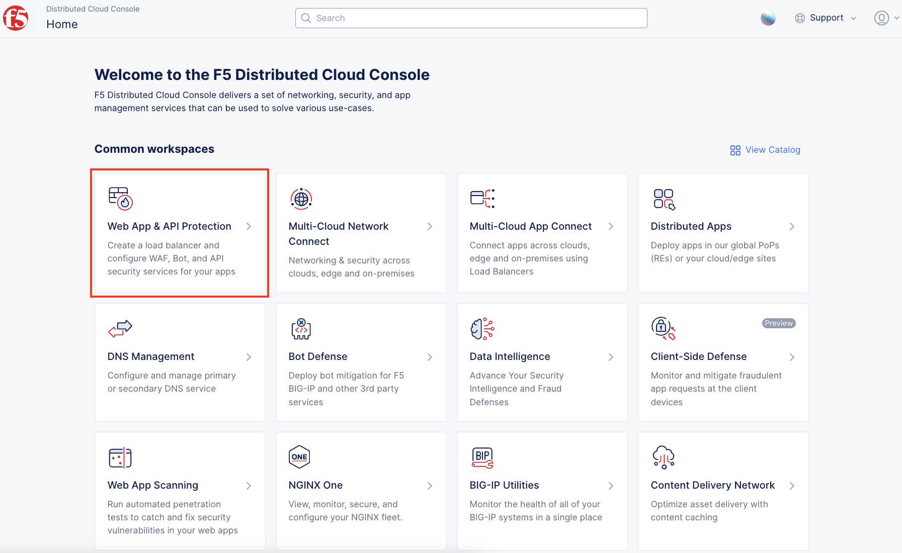
.. |lab002| image:: _static/lab1-002.png
   :width: 800px
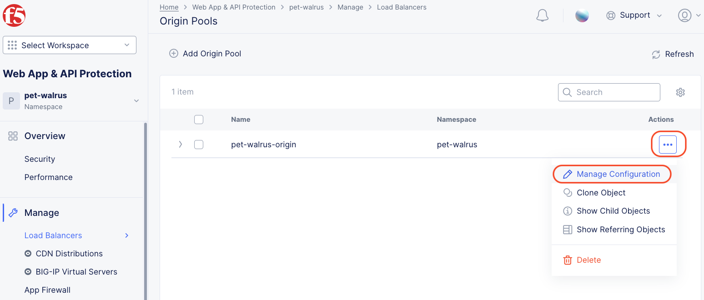
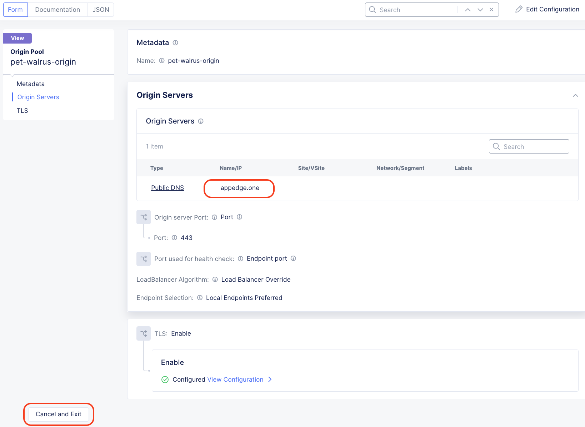
.. |lab005| image:: _static/lab1-005.png
   :width: 800px
.. |lab006| image:: _static/lab1-006.png
   :width: 800px
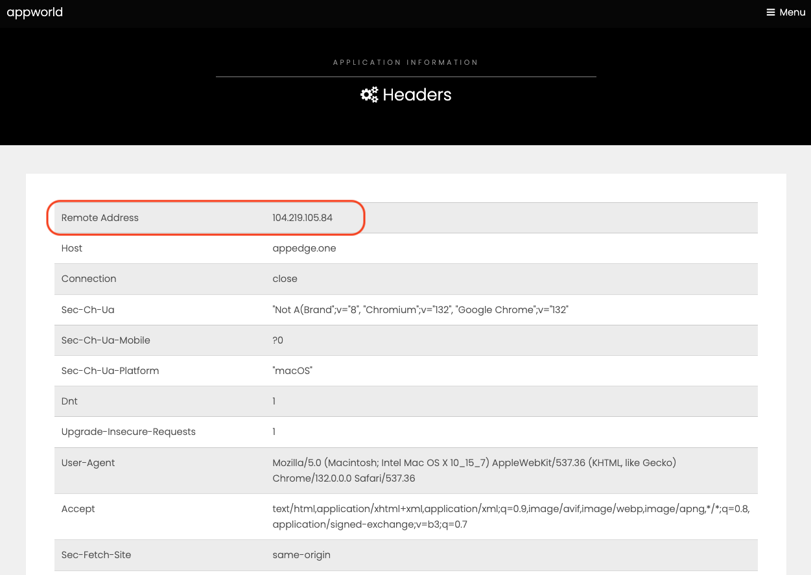
.. |lab008| image:: _static/lab1-008.png
   :width: 800px
.. |lab009| image:: _static/lab1-009.png
   :width: 800px
.. |lab010| image:: _static/lab1-010.png
   :width: 800px

.. |lab012| image:: _static/lab1-012.png
   :width: 800px
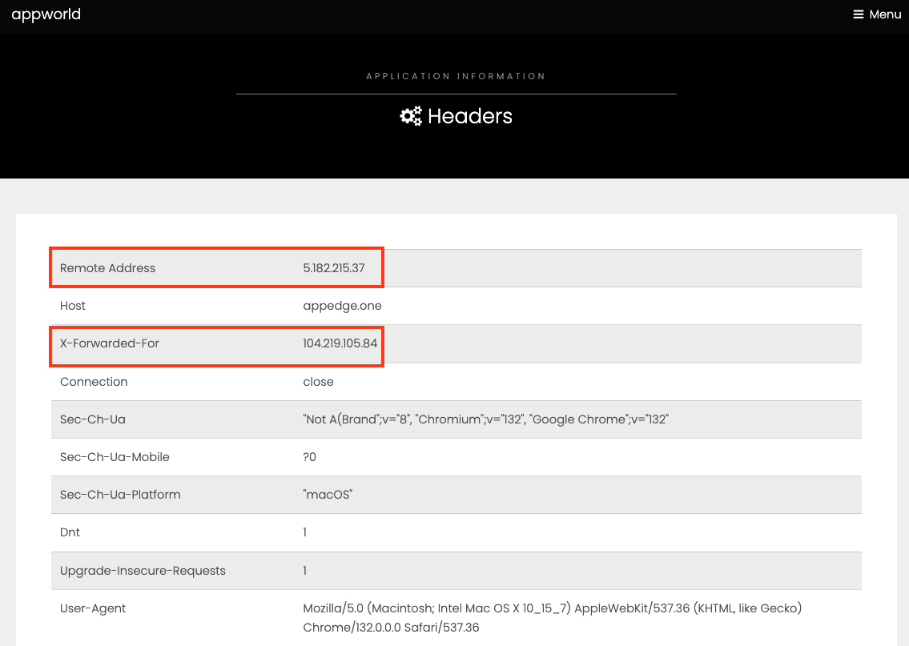
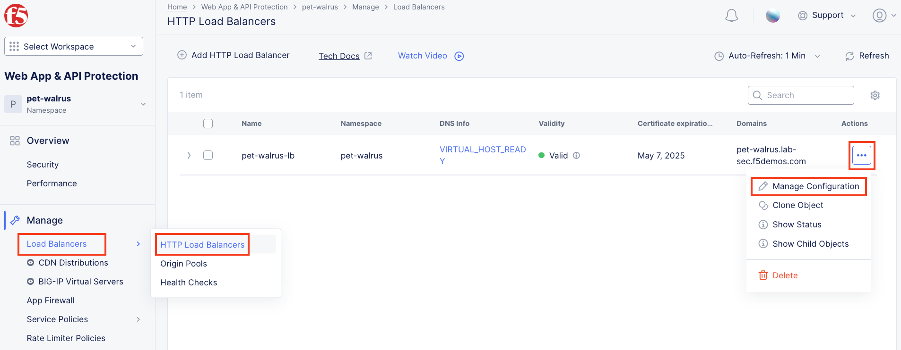
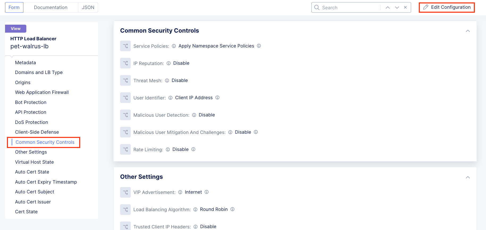

.. |lab017| image:: _static/lab1-017.png
   :width: 800px
.. |lab018| image:: _static/lab1-018.png
   :width: 800px
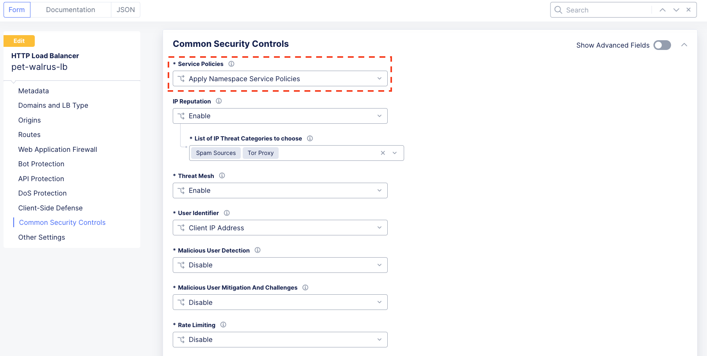
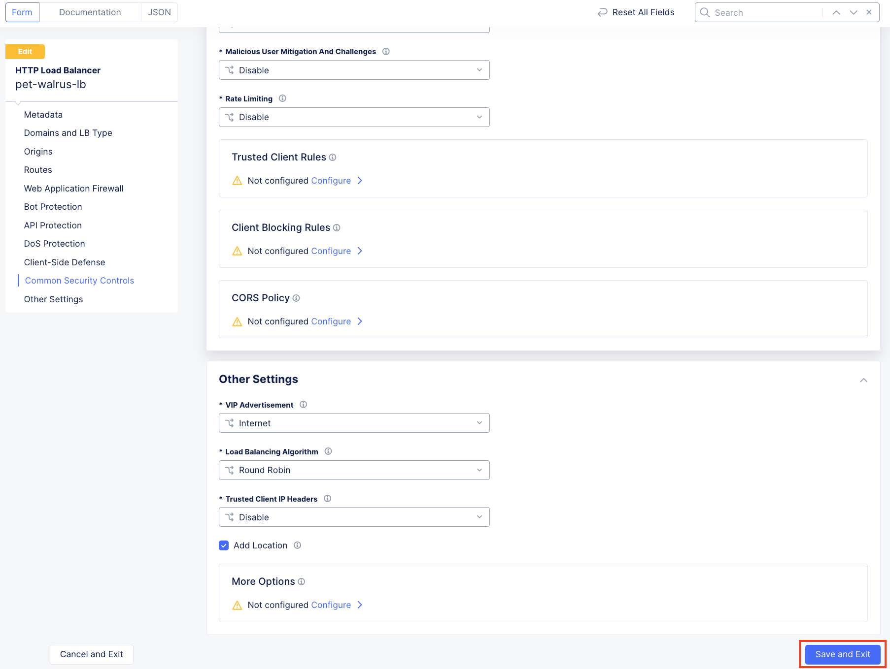
.. |lab021| image:: _static/lab1-021.png
   :width: 800px

.. |lab022| image:: _static/lab1-022.png
   :width: 800px

.. |lab023| image:: _static/lab1-023.png
   :width: 800px
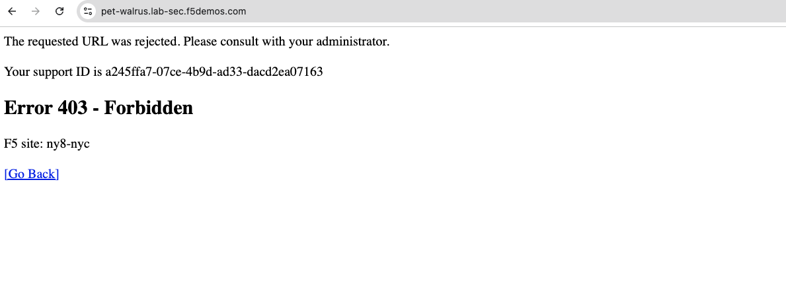
.. |lab025| image:: _static/lab1-025.png
   :width: 800px
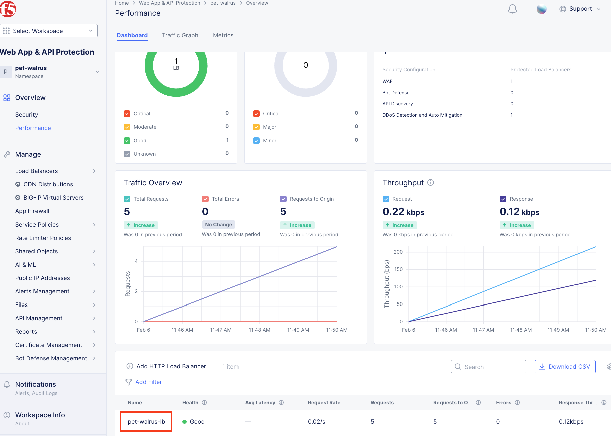
.. |lab027| image:: _static/lab1-027.png
   :width: 800px
.. |lab028| image:: _static/lab1-028.png
   :width: 800px
.. |lab029| image:: _static/lab1-029.png
   :width: 800px
.. |lab030| image:: _static/lab1-030.png
   :width: 800px
.. |lab031| image:: _static/lab1-031.png
   :width: 800px
.. |lab032| image:: _static/lab1-032.png
   :width: 800px
.. |lab033| image:: _static/lab1-033.png
   :width: 800px

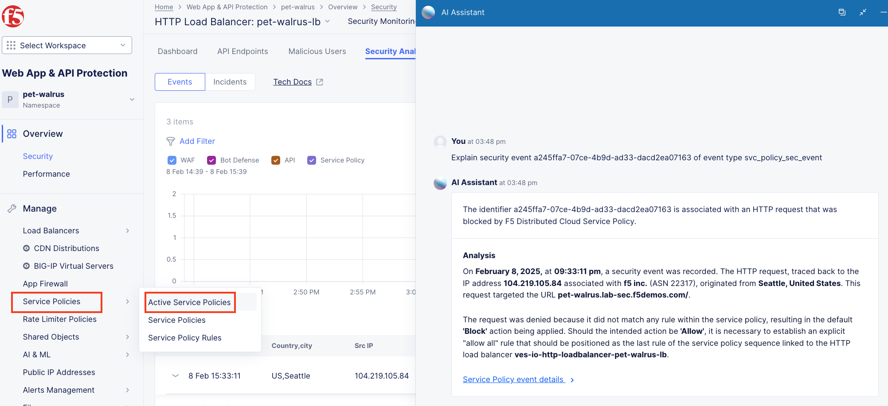

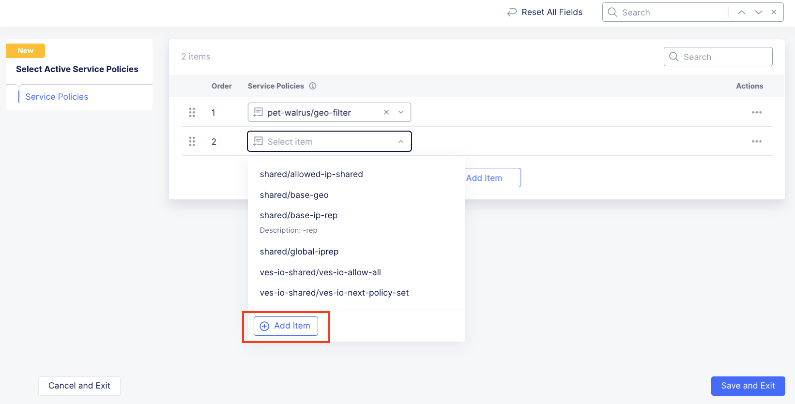

.. |labend| image:: _static/labend.png
   :width: 800px
