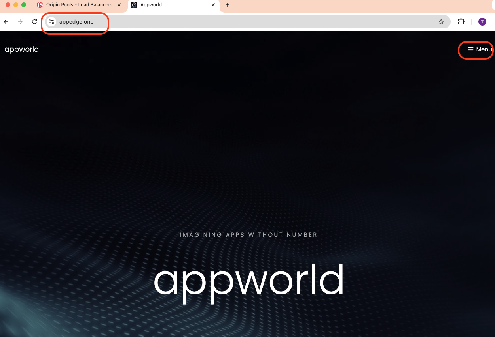
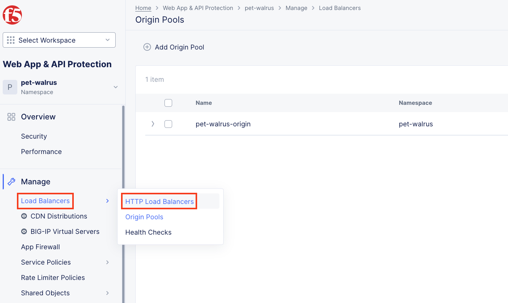
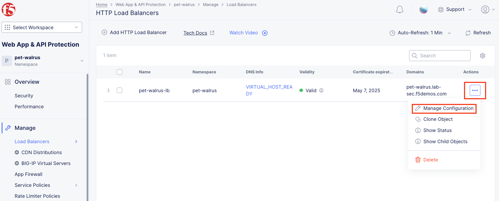
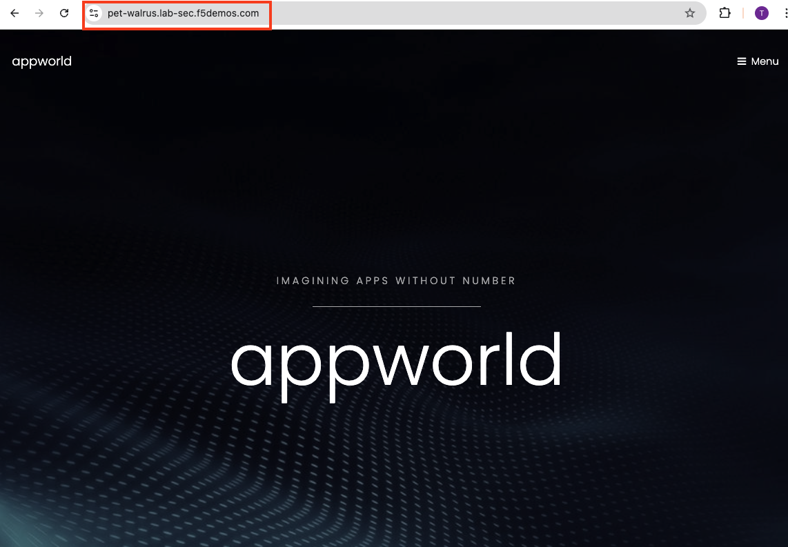
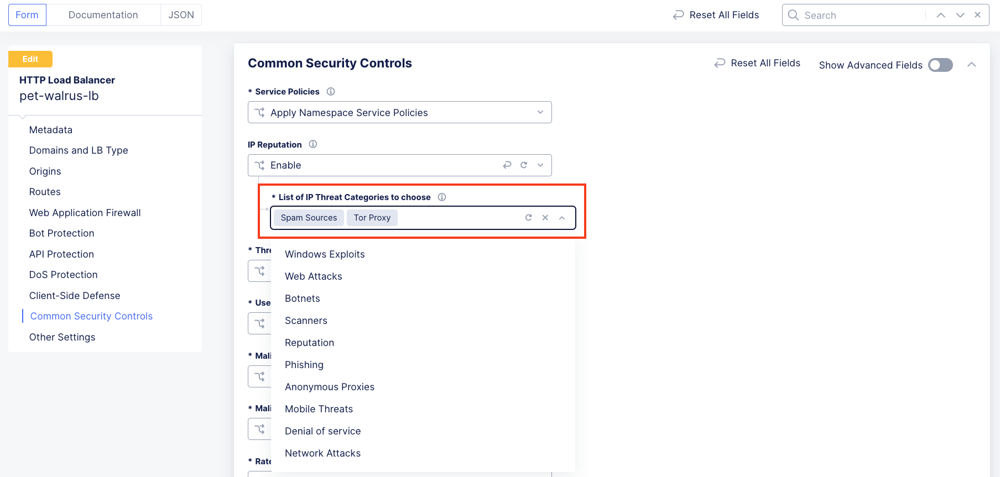
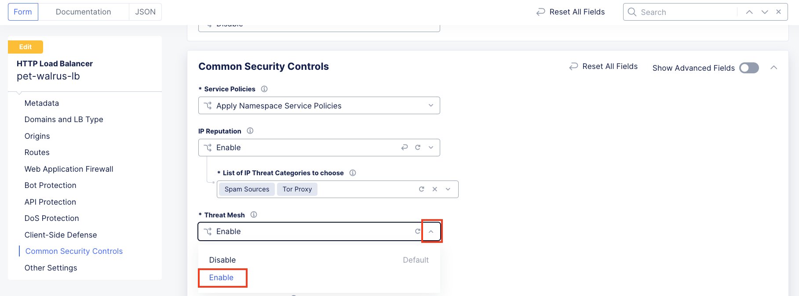
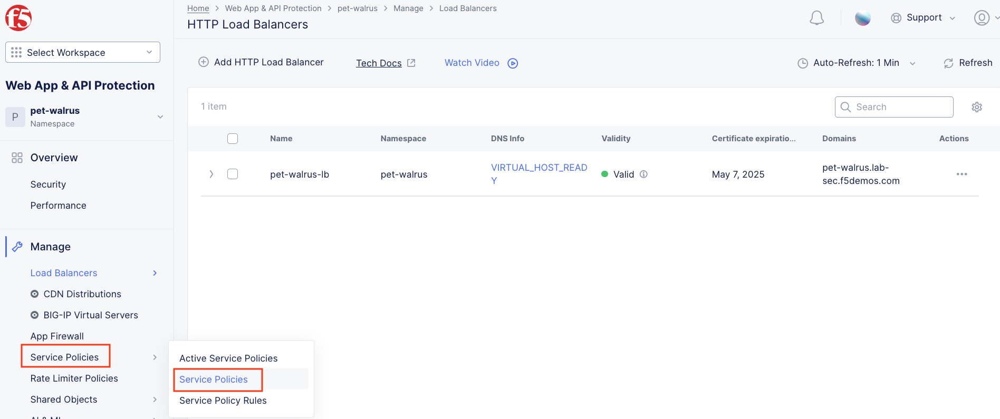
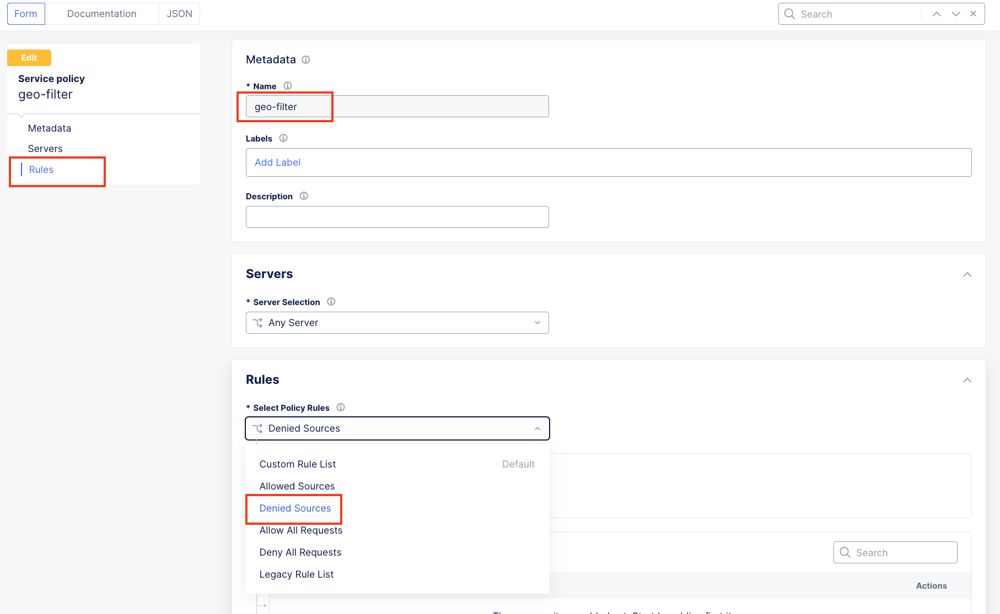
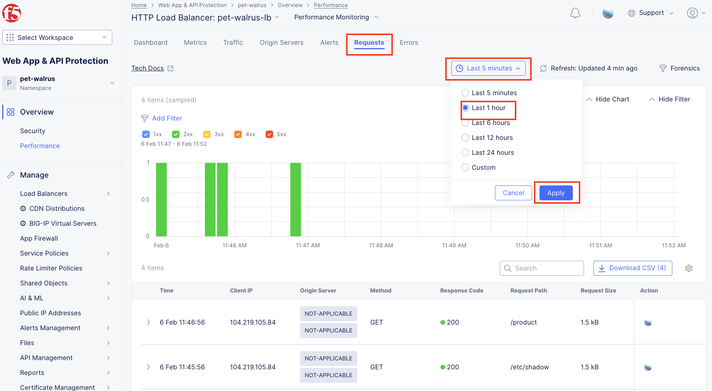

Lab 1: Deploying Load Balancer, Configuring F5 Distributed Cloud BotDefense
===========================================================================

Lab 1 will focus on the deployment and security of an existing hosted application using F5 
Distributed Cloud Platform and Services. This lab will be deployed in a SaaS only configuration 
with no on-premises (public or private cloud) elements.  All configurations will be made via 
the F5 Distributed Cloud Console and within the F5 Distributed Cloud Global Network services architecture.

For the tasks that follow, you should have already noted your individual **namespace**. If you 
failed to note it, return to the **Introduction** section of this lab, follow the instructions
provided and note your **namespace** accordingly. The **Delegated Domain** and the F5 Distributed Cloud 
**Tenant** are listed below for your convenience as they will be the same for all lab attendees.

* **Delegated Domain:** *.lab-sec.f5demos.com* 
* **F5 Distributed Cloud Tenant:** *https://f5-xc-lab-sec.console.ves.volterra.io* 

Following the tasks in the prior **Introduction** Section, you should now be able to access the
F5 Distributed Cloud Console, having set your Persona and View levels. If you have not done so 
already, please login to your tenant for this lab and proceed to Task 1.

Task 1: Configure Load Balancer, Origin Pool, WAF and BotDefense
~~~~~~~~~~~~~~~~~~~~~~~~~~~~~~~~~~~~~~~~~~~~~~~~~~~~~~~~~~~~~~~~

The following steps will allow you to deploy and advertise a globally available application.  These
steps will define an application, register its DNS and assign a target as an origin.

 1. In the left-hand navigation expand **Manage** and click **Load Balancers > HTTP Load Balancers**
 2. In the resulting screen click the **Add HTTP Load Balancer** in the graphic as shown.

 .. note::
    *You have defaulted to your specific namespace as that is the only namespace to which you*
    *have administrative access.*                                                             

 |lab001|
 
 |lab002|

 3. Using the left-hand navigation and in the sections as shown, enter the following data. Values where **<namespace>** is required, use the name of your given namespace.

    * **Metadata:Name ID:**  *<namespace>-lb*
    * **Basic Configuration: List of Domains:** *<namespace>.lab-sec.f5demos.com*
    * **Basic Configuration: Select Type of Load Balancer:** *HTTP*
    * **Basic Configuration: Automatically Manage DNS Records:** *(Check the checkbox)*
    * **Basic Configuration: HTTP Port:** *80*
 |lab003|

 4. In the current window's left-hand navigation, click **Default Origin Servers**. Next, click **Add Item** within the **Origin Pools** section of **Default Origin Servers**.

 |lab004|

 5. In the resulting window, use the drop down as shown and click **Create new Origin Pool**.

 |lab005|

 6. In the resulting window, enter **<namespace>-pool** in the **Name** field and click **Add Item** under **Basic Configuration: Origin Servers**.

 |lab006|

 7. In the resulting window, **Public DNS Name of Origin Server** should be selected for **Select Type of Origin Server**.
 8. For **DNS Name** enter the following hostname: **airline-backend.f5se.com** and then click **Add Item**

 |lab007|

 9. After returning to the prior window, make sure **Port:** under **Basic Configuration** is configured for **80**.
 10. Leave all other values as shown while scrolling to the bottom and click, **Continue**.
 11. After returning to the next window and confirming the content, click **Add Item**.

 |lab008|
 
 |lab009|
 
 |lab010|

 12. In the left-hand navigation of the main window, click **VIP Configuration** and note the **Where to Advertise the VIP** setting.

 .. note::                                                                                    
    *The above selection controls how/where the application is advertised. The "Advertise On Internet" setting means that this application will be advertised globally using the F5 Distributed Cloud Global Network utilizing Anycast.*
 
 |lab011|

 13. Continuing in the **Security Configuration** section, click on the **Select Web Application Firewall (WAF Config)** and select **App Firewall**.

 |lab012|

 |lab013|

 14. In the resulting **App Firewall** drop down select **Create new App Firewall**.

 .. note::
    *The "shared/base-appfw" policy is in the "shared namespace" which can be applied to multiple Load Balancer configurations across namespaces, reducing policy sprawl.*

 |lab014|

 15. In the resulting window's **Metadata** section enter **<namespace>-appfw** for the **Name**.

 16. Leaving all other values as default, scroll to the bottom and click **Continue**.

 |lab015|

 |lab016|

 17. Back in the HTTP Load Balancer configuration, click **Security Configuration** in the left-hand navigation.

 18. From the **Bot Defense Config** dropdown, select **Specify Bot Defense Configuration**.

 19. In the added menu option, click **Configure**.

 |lab017|

 |lab018|

 |lab019|

 20. Observe the additional positioning options in the **JavaScript Insertion** section.

 21. Click **Configure** in the **Protected Endpoints Section**

 22. In the new **App Endpoint Type** click **Add Item**

 |lab020|

 |lab021|

 23. In the **Application Endpoint** scroll through the section use the following values:

     * **Metadata\Name:** *auth-bot*
     * **HTTP Methods:** *POST*
     * **Protocol:** *BOTH*
     * **Path\Path Match:** *Prefix*
     * **Prefix:** */user/vipsignin*
     * **Bot Traffic Mitigation\Select Bot Mitigation Action:** *Flag*

 24. Scroll to the bottom and click **Add Item**

 |lab022|

 |lab023|

 25. Then click **Apply** on the **App Endpoint Type** screen

 26. Then click **Apply** on the **Protected App Endpoints** screen

 27. Observe the changes, then scroll to the bottom on the **HTTP Load Balancer** screen, and click **Save and Exit**.

 28. You will then be returned to the HTTP Load Balancer summary screen.

 |lab024|

 |lab025|
 
 |lab026|

 |lab027|

 |lab028|

 **End of Lab 1:**  This concludes Lab 1, feel free to review and test the configuration.
 
 |labend|

.. |lab001| image:: _static/lab1-001.png
   :width: 800px
.. |lab002| image:: _static/lab1-002.png
   :width: 800px
.. |lab003| image:: _static/lab1-003.png
   :width: 800px
.. |lab004| image:: _static/lab1-004.png
   :width: 800px

.. |lab006| image:: _static/lab1-006.png
   :width: 800px
.. |lab007| image:: _static/lab1-007.png
   :width: 800px
.. |lab008| image:: _static/lab1-008.png
   :width: 800px

.. |lab011| image:: _static/lab1-011.png
   :width: 800px

.. |lab013| image:: _static/lab1-013.png
   :width: 800px
.. |lab014| image:: _static/lab1-014.png
   :width: 800px
.. |lab015| image:: _static/lab1-015.png
   :width: 800px
.. |lab016| image:: _static/lab1-016.png
   :width: 800px

.. |lab019| image:: _static/lab1-019.png
   :width: 800px
.. |lab020| image:: _static/lab1-020.png
   :width: 800px

.. |lab023| image:: _static/lab1-023.png
   :width: 800px
.. |lab024| image:: _static/lab1-024.png
   :width: 800px
.. |lab025| image:: _static/lab1-025.png
   :width: 800px
.. |lab026| image:: _static/lab1-026.png
   :width: 800px

.. |lab028| image:: _static/lab1-028.png
   :width: 800px
.. |labend| image:: _static/labend.png
   :width: 800px
