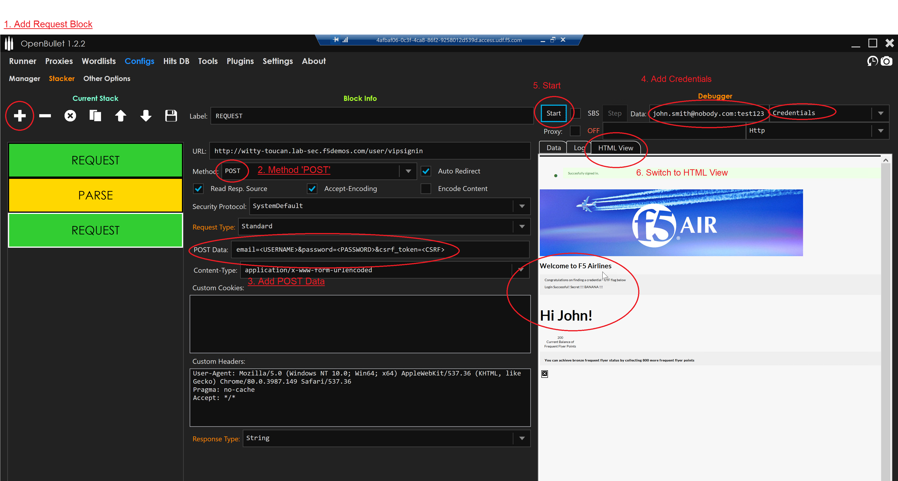
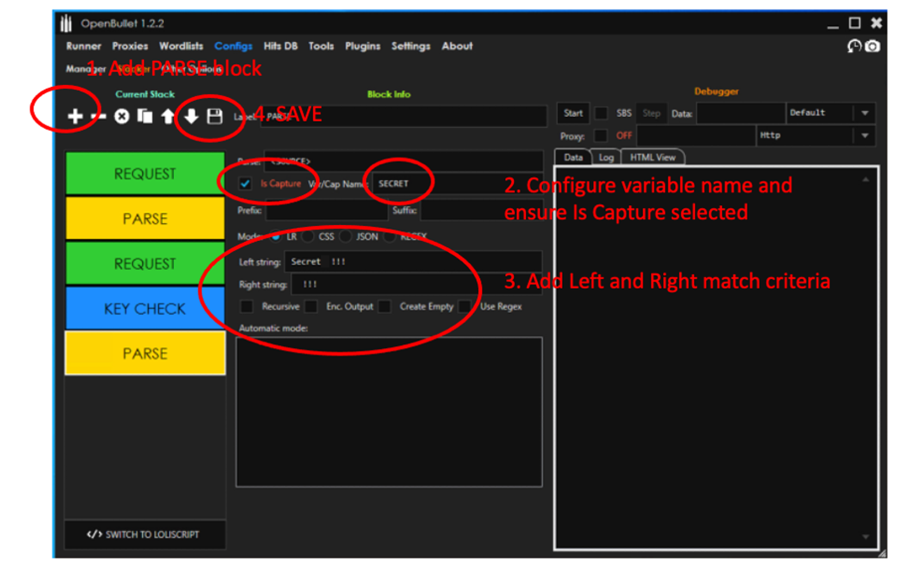

Lab 2: Basic Attack Automation 
==============================

**Run this lab from the JUMPHOST**

In this lab we will be utilizing the automation toolkit known as OpenBullet and taking on the 
role of a credential stuffing attacker.  This is a flexible application that allows you to easily
create credential stuffing and scraping attacks. This will assist you in further understanding the tools
available to "bad actors" to launch highly effective attacks on unprotected sites.

We will start with a simple approach, this method does not use a full browser, no javascript is run rather
it  makes curl like requests.

1. Launch OpenBullet from the desktop of your Lab Jumphost

2. Navigate to **Configs -> Manager -> New**  Give it a name "*Basic Credential Stuffing*" and Accept.  Double click to edit this item.

|lab001|

3. This screen is where we will build the logic for OpenBullet to follow.  It works by adding configurable "blocks" on the left hand side which can be tested in realtime via the right hand side debugging window. We will start building our first configuration.

|lab002|

4. Add a new **REQUEST** block. Configure URL as **http://namespace.lab-sec.f5demos.com/user/vipsignin** ensure Method is **GET**.  While not strictly necessary this will be used to show how to capture and reuse information.

|lab003|

5. Hit **Start** to run the debugger and switch to the **Log** view.  Now at the bottom we will search for "*CSRF*" this was the token we saw earlier in the POST requests.  The next step we will parse the token out.

|lab004|

6. Add a new **PARSE** block. Configure **Var/Cap Name** as "*CSRF*".  
**!!! For this step an issue has been identified copy & pasting these values from the lab document via RDP. They seem to lose escape characters. Ensure you find and copy them from the LOG window as seen in the previous step!!! **
then for the **Left String** we use **<input id="csrf_token" name="csrf_token" type="hidden" value="** and Right String we use **">** Check **ENC. OUTPUT**. This will capture the token between the left and right strings and store it in a variable named CSRF for future use.

|lab005|

7. Add a new **REQUEST** block. Configure URL as **http://namespace.lab-sec.f5demos.com/user/vipsignin** ensure **Method** is **POST**.  In the POST DATA Field use the follow exactly: **email=<USERNAME>&password=<PASSWORD>&csrf_token=<CSRF>**  The information within <> brackets are variables and will be filled in at runtime.  Now fill in the credentials **john.smith@nobody.com:test123** in the **DATA** field and ensure **Credentials** is the method selected.  Now hit **Start**, switch to **HTML View** and we should see the bot was successfully able to log into the account.

|lab006|

8. Next we want to ensure we identify when the login was successful and to capture the secret word.

9. Add a new **KEY CHECK** block. Click the **Keychain +** button twice.  Now in the first entry this will be to determine success we will look in the page source for the follow string.  Enter "Login Successful" in the indicated field.  For the second block we will use this for failure.  Change the type to FAILURE and enter "Incorrect Details" into the indicated field.

|lab007|

10. Add a new **PARSE** block.  Configure **Var/Cap Name** as "*SECRET*" and click "*IS CAPTURE*".  Then for the **Left String** we use **SECRET: !!!** and Right String we use **!!!**   This will capture and save the value to the log during an attack.  Ensure your configuration is *SAVED*.

11. Now its time to run a large credential stuffing attack!

|lab008|

12. Swith to the *RUNNER* menu.  Choose *NEW* and click on the entry to edit it.

|lab009|

13. Choose 3 Bots, this will run 3 checks in parallel, Click *SELECT CFG* and choose the configuration we just created *Basic Credential Stuffing*, click *SELECT LIST* and choose *LAB1-COMBOLIST* and lastly hit *START* and watch the attack begin.  If you need to rerun the test you need to reset the start count to 1 (Used if you have a very long credential list)

|lab010|

14. Now you can see the attack running in realtime on the left hand side and on the right hand side it will show any of the successful attempts.

|lab011|

15. Additionally we can go to the distributed cloud dashboard outside of the RDP Jumphost.  Clickon *HTTP Load Balancers* then *Security Monitoring* and explore using the *Bot Defense* tabs.  One thing to note that this attack is seeing as Token Missing, essentially this means that the unique token embedded in the Javascript file was not provided. This is typically of attacks that don't use a browser to render the page.

|lab012|

**End of Lab 2:**  This concludes Lab 2, feel free to review and test the configuration.
 
|labend|

.. |lab001| image:: _static/Slide6.png
   :width: 800px
.. |lab002| image:: _static/Slide7.png
   :width: 800px
.. |lab003| image:: _static/Slide8.png
   :width: 800px
.. |lab004| image:: _static/Slide9.png
   :width: 800px
.. |lab005| image:: _static/Slide10.png
   :width: 800px

.. |lab007| image:: _static/Slide12.png
   :width: 800px

.. |lab009| image:: _static/Slide14.png
   :width: 800px
.. |lab010| image:: _static/Slide15.png
   :width: 800px
.. |lab011| image:: _static/Slide16.png
   :width: 800px
.. |lab012| image:: _static/Slide17.png
   :width: 800px
.. |labend| image:: _static/labend.png
   :width: 800px
