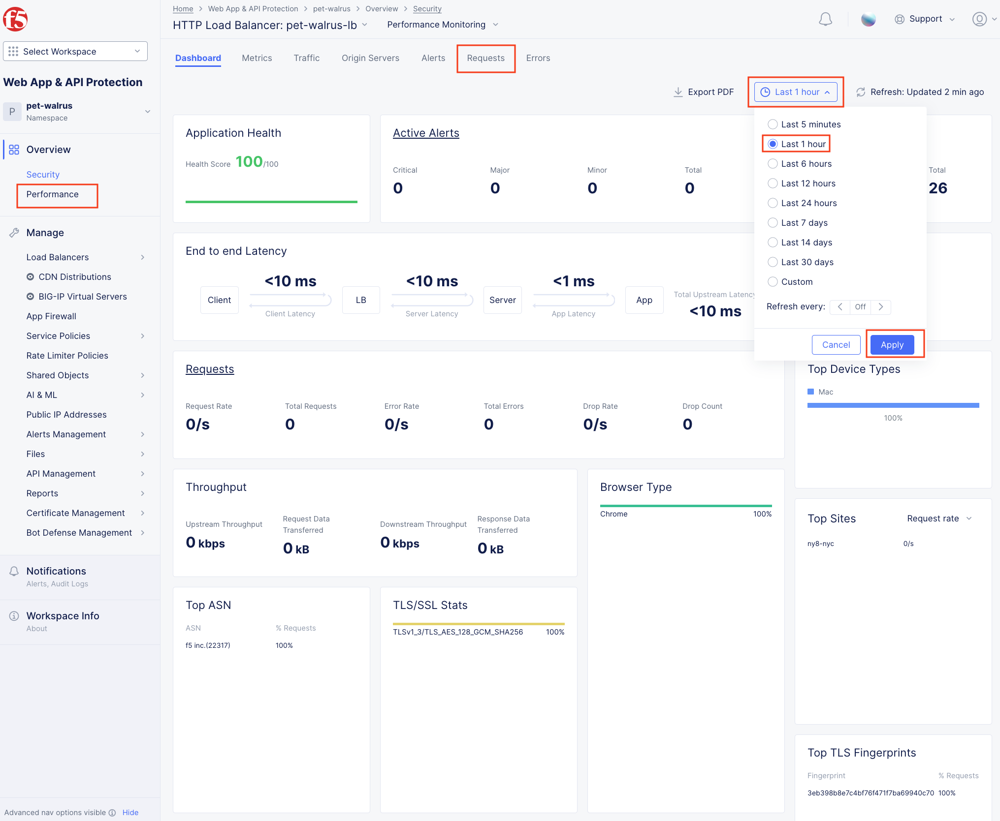
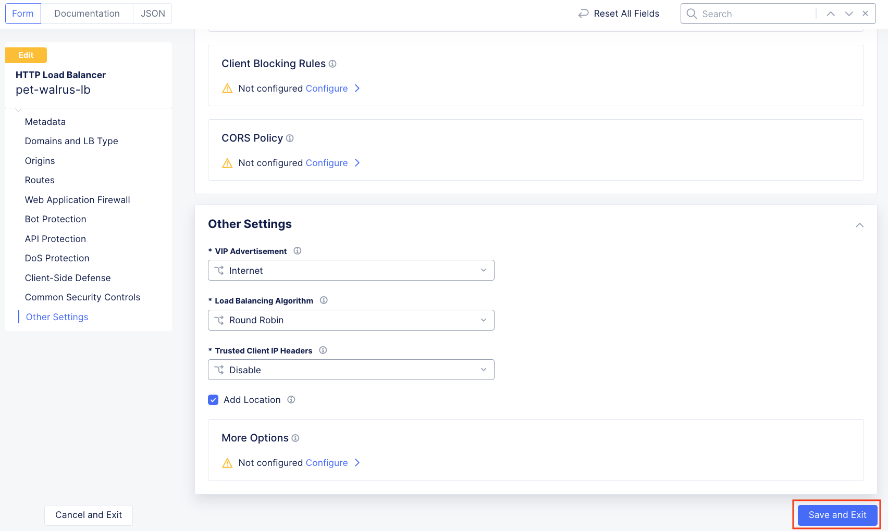
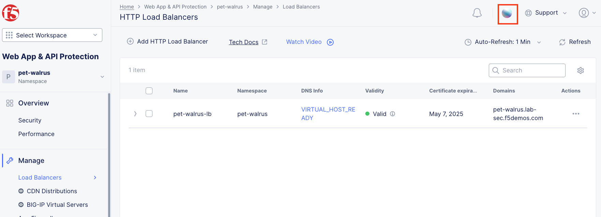
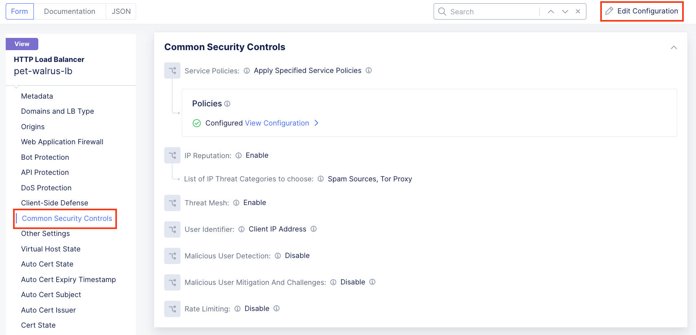
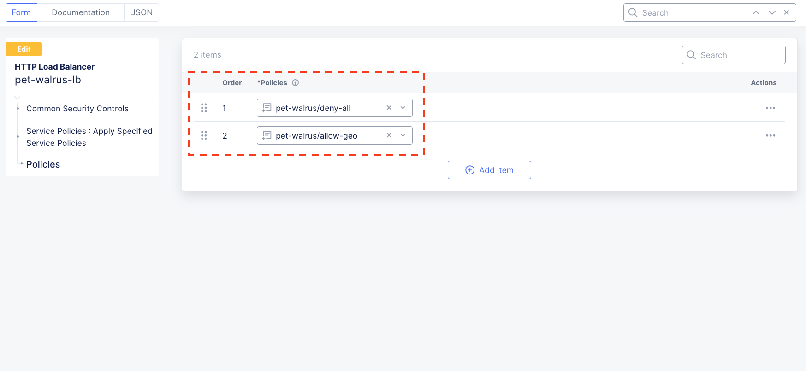

Lab 2: Enabling Application Security with Service Policies 
==========================================================

The following lab tasks will guide you the configuration of various Service Policies 
which can be used to implement a variety of security controls. The goals of this section of the lab will
be to create specific policies to enforce positive and negative enforcement rules based on geo-location,
IP addresses, and custom header properties.  

**Expected Lab Time: 30 minutes**

Task 1: Creating Local Namespace Service Policies  
~~~~~~~~~~~~~~~~~~~~~~~~~~~~~~~~~~~~~~~~~~~~~~~~~

In this task you will add geo-filter and allowed-ip based service policies.  This is a common use
which can be utilized to either explicitly deny or allow client traffic based on their location.

+----------------------------------------------------------------------------------------------+
| 1. Within Web **App & API Protection**, under the **Manage** section in the left-hand        |
|                                                                                              |
|    navigation menu, click **Service Policies**. In the flyout menu, click the **Service**    |
|                                                                                              |
|    **Policies** link.                                                                        |
|                                                                                              |
| 2. Observe the existing Service Policies and note they are source from the **shared**        |
|                                                                                              |
|    namespace which means they could be used within any other namespace.                      |
|                                                                                              |
| 3. Click **Add Service Policy** in the top left area as shown.                               |
|                                                                                              |
| .. note::                                                                                    |
|    *Using shared namespace Service Policies provides the ability to use API-updated*         |
|                                                                                              |
|    *policy controls to implement common service security across multiple resources.*         |
+----------------------------------------------------------------------------------------------+
| |lab001|                                                                                     |
|                                                                                              |
| |lab002|                                                                                     |
+----------------------------------------------------------------------------------------------+

+----------------------------------------------------------------------------------------------+
| 4. In the **Metadata** section enter **geo-filter** for the **Name** and then click **Rules**|
|                                                                                              |
|    in the left-hand navigation.                                                              |
|                                                                                              |
| 5. Select **Denied Sources** from the dropdown for **Select Policy Rules**.                  |
+----------------------------------------------------------------------------------------------+
| |lab003|                                                                                     |
+----------------------------------------------------------------------------------------------+

+----------------------------------------------------------------------------------------------+
| 6. Locate the **Country List** input field and begin typing **Fiji** and then select it from |
|                                                                                              |
|    the list that appears.                                                                    |
|                                                                                              |
| 7. Click the dropdown for **Default Action**. Observe the available options and select       |
|                                                                                              |
|    **Next Policy** then click **Save and Exit**.                                             |
+----------------------------------------------------------------------------------------------+
| |lab004|                                                                                     |
|                                                                                              |
| |lab005|                                                                                     |
+----------------------------------------------------------------------------------------------+

+----------------------------------------------------------------------------------------------+
| 8. Observe the resulting added **geo-filter** Service Policy added in your namespace.        |
+----------------------------------------------------------------------------------------------+
| |lab006|                                                                                     |
+----------------------------------------------------------------------------------------------+

+----------------------------------------------------------------------------------------------+
| 9. Open another tab in your browser (Chrome shown), navigate to https://ipinfo.io and note   |
|                                                                                              |
|    your IP address as shown. (example provided)                                              |
+----------------------------------------------------------------------------------------------+
| |lab007|                                                                                     |
+----------------------------------------------------------------------------------------------+

+----------------------------------------------------------------------------------------------+
| 10. Return to the **Service Policies** window and click **Add Service Policy**.              |
+----------------------------------------------------------------------------------------------+
| |lab008|                                                                                     |
+----------------------------------------------------------------------------------------------+

+----------------------------------------------------------------------------------------------+
| 11. In the **Metadata** section enter **allowed-ip** for the **Name** and then click         |
|                                                                                              |
|     **Rules** in the left-hand navigation.                                                   |
|                                                                                              |
| 12. Select **Allowed Sources** from the dropdown for **Select Policy Rules**.                |
+----------------------------------------------------------------------------------------------+
| |lab009|                                                                                     |
+----------------------------------------------------------------------------------------------+

+----------------------------------------------------------------------------------------------+
| 13. In the updated **IPv4 Prefix List** section, click **Configure** link.                   |
|                                                                                              |
| .. note::                                                                                    |
|    *The section just below "List of IP Prefix Set" allows you to build a collection of*      |
|                                                                                              |
|    *of various IP lists which can be maintained through API controls.*                       |
+----------------------------------------------------------------------------------------------+
| |lab010|                                                                                     |
+----------------------------------------------------------------------------------------------+

+----------------------------------------------------------------------------------------------+
| 14. Enter your IP address captured in Step 9 above with mask notation (**/32**) as shown then|
|                                                                                              |
|     click the **Apply** button.                                                              |
+----------------------------------------------------------------------------------------------+
| |lab011|                                                                                     |
+----------------------------------------------------------------------------------------------+

+----------------------------------------------------------------------------------------------+
| 15. In the resulting window, observer **IPv4 Prefix List** in now configured then scroll to  |
|                                                                                              |
|     the bottom of the **Rules** section.                                                     |
+----------------------------------------------------------------------------------------------+
| |lab012|                                                                                     |
+----------------------------------------------------------------------------------------------+

+----------------------------------------------------------------------------------------------+
| 16. Locate and click the dropdown for **Default Action**, and select **Deny** then click     |
|                                                                                              |
|     **Save and Exit**.                                                                       |
+----------------------------------------------------------------------------------------------+
| |lab013|                                                                                     |
+----------------------------------------------------------------------------------------------+

+----------------------------------------------------------------------------------------------+
| 17. Observe the resulting added **allowed-ip** Service Policy added in your namespace.       |
+----------------------------------------------------------------------------------------------+
| |lab014|                                                                                     |
+----------------------------------------------------------------------------------------------+

Task 2: Attaching Service Policies and configuring IP Reputation
~~~~~~~~~~~~~~~~~~~~~~~~~~~~~~~~~~~~~~~~~~~~~~~~~~~~~~~~~~~~~~~~

The following steps will enable you to attach Service Policies to your configured Load Balancer.
It will also help you understand additional approaches for Service Policies.

+----------------------------------------------------------------------------------------------+
| 1. Return to the Load Balancer in the F5 Distributed Cloud Console,**Manage > Load Balancer**|
|                                                                                              |
|    **> HTTP Load Balancers** and use the **Action Dots** and click **Manage Configuration**  |
|                                                                                              |
| 2. Click **Edit Configuration** in the top right-hand corner.                                |
+----------------------------------------------------------------------------------------------+
| |lab015|                                                                                     |
|                                                                                              |
| |lab016|                                                                                     |
+----------------------------------------------------------------------------------------------+

+----------------------------------------------------------------------------------------------+
| 3. Click **Common Security Controls** in the left-hand navigation.                           |
|                                                                                              |
| 4. From the **Service Policies** dropdown, select **Apply Specified Service Policies**.      |
|                                                                                              |
| 5. In the added menu for **Apply Specified Service Policies**, click **Configure**.          |
+----------------------------------------------------------------------------------------------+
| |lab017|                                                                                     |
|                                                                                              |
| |lab018|                                                                                     |
+----------------------------------------------------------------------------------------------+

+----------------------------------------------------------------------------------------------+
| 6. In the resulting **Policies** window, use the **List of Policies** dropdown to select     |
|                                                                                              |
|    your **<namespace>/geo-filter** Service Policy then click **Apply**.                      |
+----------------------------------------------------------------------------------------------+
| |lab019|                                                                                     |
+----------------------------------------------------------------------------------------------+

+----------------------------------------------------------------------------------------------+
| 7. Returning to the Load Balancer window, you will note the changes shown in your            |
|                                                                                              |
|    **Service Policies** section.                                                             |
|                                                                                              |
| 8. As we are already in this section, we will go ahead and add IP reputation filtering. This |
|                                                                                              |
|    can be added as a Service Policy (shared or local namespace) or as a direct configuration.|
|                                                                                              |
| 9. To start, the IP Reputation as a direct configuration (on the Load Balancer), locate the  |
|                                                                                              |
|    **IP Reputation** section and click the dropdown menu, then select **Enable**.            |
+----------------------------------------------------------------------------------------------+
| |lab020|                                                                                     |
+----------------------------------------------------------------------------------------------+

+----------------------------------------------------------------------------------------------+
| 10. Using the **List of IP Threat Categories to choose** you may add any of the available    |
|                                                                                              |
|     Threat Categories listed.                                                                |
|                                                                                              |
| 11. Select **Spam Sources** and **Tor Proxy**, then click **Other Settings** in the left-hand|
|                                                                                              |
|     navigation or scroll to the bottom of the window and click the **Save and Exit** button. |
+----------------------------------------------------------------------------------------------+
| |lab021|                                                                                     |
|                                                                                              |
| |lab022|                                                                                     |
|                                                                                              |
| |lab023|                                                                                     |
+----------------------------------------------------------------------------------------------+

+----------------------------------------------------------------------------------------------+
| 12. In your browser (Chrome shown), navigate to your application/Load Balancer configuration:|
|                                                                                              |
|     **http://<namespace>.lab-sec.f5demos.com**.                                              |
|                                                                                              |
| 13. You should receive a 403 Forbidden error.  This is due to a Service Policy configuration |
|                                                                                              |
|     error.  Because we only attached the **geo-filter** Service Policy and the **Default**   |
|                                                                                              |
|     **Action** was **Next Policy**, there is no other or next policy to "Allow" traffic,     |
|                                                                                              |
|     therefore, all other traffic is disallowed producing the 403.  This is will also show in |
|                                                                                              |
|     the **Security Events** window.                                                          |
+----------------------------------------------------------------------------------------------+
| |lab024|                                                                                     |
+----------------------------------------------------------------------------------------------+

+----------------------------------------------------------------------------------------------+
| 14. Return to **Web App & API Protection** in the F5 Distributed Cloud Console, **Manage >** |
|                                                                                              |
|     **Load Balancer > HTTP Load Balancers** and use the **Action Dots** and click **Manage** |
|                                                                                              |
|     **Configuration**.                                                                       |
|                                                                                              |
| 15. Click **Edit Configuration** in the top right-hand corner.                               |
+----------------------------------------------------------------------------------------------+
| |lab025|                                                                                     |
|                                                                                              |
| |lab026|                                                                                     |
+----------------------------------------------------------------------------------------------+

+----------------------------------------------------------------------------------------------+
| 16. Click **Common Security Controls** in the left-hand navigation.                          |
|                                                                                              |
| 17. From the **Service Policies** section, click **Edit Configuration**.                     |
+----------------------------------------------------------------------------------------------+
| |lab027|                                                                                     |
+----------------------------------------------------------------------------------------------+

+----------------------------------------------------------------------------------------------+
| 18. In the resulting window click **Add Item** as shown.  From the added dropdown select the |
|                                                                                              |
|     **<namespace>/allowed-ip** Service Policy previously created.                            |
|                                                                                              |
| 19. Observe the order. Service Policies must be ordered correctly in a order to process      |
|                                                                                              |
|     traffic as intended.  Click **Apply** when completed.                                    |
|                                                                                              |
| .. note::                                                                                    |
|   *Because the "allowed-ip" begins with an allowed ip (yours) and ends in a "Deny" a*        |
|                                                                                              |
|   *positive security model will be applied (denying all other traffic).  Similar positive or*|
|                                                                                              |
|   *negative service policies can be created and applied*                                     |
+----------------------------------------------------------------------------------------------+
| |lab028|                                                                                     |
|                                                                                              |
| |lab029|                                                                                     |
|                                                                                              |
| |lab030|                                                                                     |
+----------------------------------------------------------------------------------------------+

+----------------------------------------------------------------------------------------------+
| 20. Click **Other Settings** in the left-hand navigation or scroll to the bottom of the      |
|                                                                                              |
|     HTTP Load Balancer configuration and click **Save and Exit**.                            |
+----------------------------------------------------------------------------------------------+
| |lab031|                                                                                     |
+----------------------------------------------------------------------------------------------+

+----------------------------------------------------------------------------------------------+
| 21. In your browser (Chrome shown), navigate to your application/Load Balancer configuration:|
|                                                                                              |
|     **http://<namespace>.lab-sec.f5demos.com**. You should now be able to successfully       |
|                                                                                              |
|     access the application.                                                                  |
+----------------------------------------------------------------------------------------------+
| |lab032|                                                                                     |
+----------------------------------------------------------------------------------------------+

Task 3: Create, assign and test a Custom Service Policy
~~~~~~~~~~~~~~~~~~~~~~~~~~~~~~~~~~~~~~~~~~~~~~~~~~~~~~~
In this task you will add Custom Policy and assign it to your Load Balancer. Custom Service 
Policies provide the flexibility to build **Positive** or **Negative** security models and custom
rules or controls.

Through prior lab tasks, Fiji has been Geo-location blocked, and your testing resource's 
IP has been allowed, and all other IP addresses have been denied. You will build some additional 
blocking/deny rules to illustrate Service Policy controls. 

+----------------------------------------------------------------------------------------------+
| 1. Before beginning this task, re-evaluate your access from your client to the following:    |
|                                                                                              |
|    * **Browser**: http://<namespace>.lab-sec.f5demos.com/index.php?page=header               |
|    * **cURL**: http://<namespace>.lab-sec.f5demos.com/                                       |
|    * **cURL**: http://<namespace>.lab-sec.f5demos.com/index.php?page=header                  |
|                                                                                              |
|    The expectation is that all are successful based on the current Service Policies.         |
| .. note::                                                                                    |
|    *cURL is supported on Windows, Mac & Linux platforms*.                                    |
+----------------------------------------------------------------------------------------------+
| |lab033|                                                                                     |
|                                                                                              |
| |lab034|                                                                                     |
|                                                                                              |
| |lab035|                                                                                     |
+----------------------------------------------------------------------------------------------+

+----------------------------------------------------------------------------------------------+
| 2. Returning to **Web App & API Protection**, in the left-hand navigation menu, expand the   |
|                                                                                              |
|    **Manage** section and click **Service Policies**. In the flyout menu, click the          |
|                                                                                              |
|    **Service Policies** link.                                                                |
|                                                                                              |
| 3. Observe the existing Service Policies and note that some are sourced from the **shared**  |
|                                                                                              |
|    namespace which means they could be used within any other namespace.                      |
|                                                                                              |
| 4. Click **Add Service Policy** in the top left area as shown.                               |
+----------------------------------------------------------------------------------------------+
| |lab036|                                                                                     |
|                                                                                              |
| |lab037|                                                                                     |
+----------------------------------------------------------------------------------------------+

+----------------------------------------------------------------------------------------------+
| 5. In the **Metadata** section enter **custom-deny** for the **Name** and then click         |
|                                                                                              |
|    **Rules** in the left-hand navigation.                                                    |
|                                                                                              |
| 6. Then select **Custom Rule List** from the dropdown for **Select Policy Rules**.           |
|                                                                                              |
|    Locate **Rules** configuration section and click **Configure**.                           |
+----------------------------------------------------------------------------------------------+
| |lab038|                                                                                     |
+----------------------------------------------------------------------------------------------+

+----------------------------------------------------------------------------------------------+
| 7. In the **Rules** window, click **Add Item**.                                              |
|                                                                                              |
| 8. In the **Metadata** section **Name** field input **curl-deny** and toggle the             |
|                                                                                              |
|    **Show Advanced Fields** to see extra configuration options in **Action** section.        |
|                                                                                              |
| 9. In the **Action** section, select **Deny** for the **Action** and then in the left-hand   |
|                                                                                              |
|    navigation click **Request Match**.                                                       |
+----------------------------------------------------------------------------------------------+
| |lab039|                                                                                     |
|                                                                                              |
| |lab040|                                                                                     |
+----------------------------------------------------------------------------------------------+

+----------------------------------------------------------------------------------------------+
| 10. In the **HTTP Method** section, use the **Method List** dropdown to select **GET**.      |
|                                                                                              |
| 11. In the **HTTP Headers** section click **Add Item**.                                      |
+----------------------------------------------------------------------------------------------+
| |lab041|                                                                                     |
+----------------------------------------------------------------------------------------------+

+----------------------------------------------------------------------------------------------+
| 12. In the **Header Matcher** window, input **user-agent** for **Header Name** as shown.     |
|                                                                                              |
| 13. Click **Add Item** under the **Regex Values** area and input **(?i)^.*curl.*$** then     |
|                                                                                              |
|     click **Apply**                                                                          |
+----------------------------------------------------------------------------------------------+
| |lab042|                                                                                     |
+----------------------------------------------------------------------------------------------+

+----------------------------------------------------------------------------------------------+
| 14. Scroll down to the bottom of the **Rule Configuration** and click **Apply**.             |
+----------------------------------------------------------------------------------------------+
| |lab043|                                                                                     |
+----------------------------------------------------------------------------------------------+

+----------------------------------------------------------------------------------------------+
| 15. In the **custom-deny** Service Policy Rule window, click **Add Item** to add another rule|
|                                                                                              |
| .. note::                                                                                    |
|    *Multiple Rules can be added to a single Service Policy*.                                 |
+----------------------------------------------------------------------------------------------+
| |lab044|                                                                                     |
+----------------------------------------------------------------------------------------------+

+----------------------------------------------------------------------------------------------+
| 16. In the **Metadata** section **Name** field input **header-page-deny** and then click     |
|                                                                                              |
|     **Request Match** in the left-hand navigation.                                           |
+----------------------------------------------------------------------------------------------+
| |lab045|                                                                                     |
+----------------------------------------------------------------------------------------------+

+----------------------------------------------------------------------------------------------+
| 17. In the **Request Match** section under **HTTP Methods**, add **GET** to the method list. |
|                                                                                              |
| 18. In the **HTTP Path** area, click the **Configure** link.                                 |
+----------------------------------------------------------------------------------------------+
| |lab046|                                                                                     |
+----------------------------------------------------------------------------------------------+

+----------------------------------------------------------------------------------------------+
| 19. Click **Add Item** in **Prefix Values** area and in the input field type "/index.php"    |
|                                                                                              |
|     and then click **Apply**.                                                                |
+----------------------------------------------------------------------------------------------+
| |lab047|                                                                                     |
+----------------------------------------------------------------------------------------------+

+----------------------------------------------------------------------------------------------+
| 20. Observe that the **HTTP Path** is now **Configured**.                                    |
|                                                                                              |
| 21. In section **HTTP Query Parameters** click **Add Item**                                  |
+----------------------------------------------------------------------------------------------+
| |lab048|                                                                                     |
+----------------------------------------------------------------------------------------------+

+----------------------------------------------------------------------------------------------+
| 22. In **Query Parameter Matcher** window, in the **Query Parameter Name**, field enter      |
|                                                                                              |
|     **page**.                                                                                |
|                                                                                              |
| 23. In **Match Options** section, ensure **Match Values** is selected and then click **Add** |
|                                                                                              |
|     **Item** in the area with **Exact Values** as shown.                                     |
|                                                                                              |
| 24. Input **header** into the **Exact Values** input field as shown and then click **Apply**.|
+----------------------------------------------------------------------------------------------+
| |lab049|                                                                                     |
+----------------------------------------------------------------------------------------------+

+----------------------------------------------------------------------------------------------+
| 25. Observe that the **HTTP Query Parameters** is now **Configured** and scroll to the       |
|                                                                                              |
|     of the rule configuration and click **Apply**                                            |
+----------------------------------------------------------------------------------------------+
| |lab050|                                                                                     |
|                                                                                              |
| |lab051|                                                                                     |
+----------------------------------------------------------------------------------------------+

+----------------------------------------------------------------------------------------------+
| 26. Observe that both configured rules are present and then click **Apply**.                 |
|                                                                                              |
| .. note::                                                                                    |
|    *Rules within the Service Policy can placed in order as needed*.                          |
+----------------------------------------------------------------------------------------------+
| |lab052|                                                                                     |
+----------------------------------------------------------------------------------------------+

+----------------------------------------------------------------------------------------------+
| 27. Observe that the Custom Rule is now configured for **custom-deny** Service Policy and    |
|                                                                                              |
|     click **Apply**.                                                                         |
+----------------------------------------------------------------------------------------------+
| |lab053|                                                                                     |
+----------------------------------------------------------------------------------------------+

+----------------------------------------------------------------------------------------------+
| 28. The **custom-deny** Service Policy is now listed among all Service Policies and has a    |
|                                                                                              |
|     **Rule Count** of **2**.                                                                 |
|                                                                                              |
| .. note::                                                                                    |
|    *This window also show the Service Policy "Hits" when validating usage*.                  |
+----------------------------------------------------------------------------------------------+
| |lab054|                                                                                     |
+----------------------------------------------------------------------------------------------+

+----------------------------------------------------------------------------------------------+
| 29. Return to **Web App & API Protection** in the F5 Distributed Cloud Console, **Manage >** |
|                                                                                              |
|     **Load Balancer > HTTP Load Balancers** and use the **Action Dots** and click **Manage** |
|                                                                                              |
|     **Configuration**.                                                                       |
|                                                                                              |
| 30. Click **Edit Configuration** in the top right-hand corner.                               |
+----------------------------------------------------------------------------------------------+
| |lab055|                                                                                     |
|                                                                                              |
| |lab056|                                                                                     |
+----------------------------------------------------------------------------------------------+

+----------------------------------------------------------------------------------------------+
| 31. Click **Common Security Controls** in the left-hand navigation.                          |
|                                                                                              |
| 32. From the **Service Policies** section, click **Edit Configuration**.                     |
+----------------------------------------------------------------------------------------------+
| |lab057|                                                                                     |
+----------------------------------------------------------------------------------------------+

+----------------------------------------------------------------------------------------------+
| 33. Observe the order of the previously created Service Policies (geo-filter,allowed-ip) and |
|                                                                                              |
|     click **Add Item**.  Use the drop-down as shown and select **<namespace>/custom-deny**   |
|                                                                                              |
|     from the available Service Policy list.                                                  |
|                                                                                              |
| 34. Click the six squares icon to drag **<namespace>/custom-deny** into the second position  |
|                                                                                              |
|     in policy order as shown then click **Apply**.                                           |
+----------------------------------------------------------------------------------------------+
| |lab058|                                                                                     |
|                                                                                              |
| |lab059|                                                                                     |
+----------------------------------------------------------------------------------------------+

+----------------------------------------------------------------------------------------------+
| 35. Observe the configured state on Services Polices then click **Other Settings** or scroll |
|                                                                                              |
|     to the bottom of the HTTP Load Balancer configuration and click **Save & Exit**.         |
+----------------------------------------------------------------------------------------------+
| |lab060|                                                                                     |
|                                                                                              |
| |lab061|                                                                                     |
+----------------------------------------------------------------------------------------------+

+----------------------------------------------------------------------------------------------+
| 36. Time to re-access your access. Now test the following from your client:                  |
|                                                                                              |
|    * **Browser**: http://<namespace>.lab-sec.f5demos.com/index.php?page=header               |
|    * **cURL**: http://<namespace>.lab-sec.f5demos.com/                                       |
|    * **cURL**: http://<namespace>.lab-sec.f5demos.com/index.php?page=header                  |
|                                                                                              |
| 37. What where your results?  Copy the support id for further investigation in the next task |
+----------------------------------------------------------------------------------------------+
| |lab062|                                                                                     |
+----------------------------------------------------------------------------------------------+

Service Policies provide a powerful framework to implement both positive and negative security models
and you matching criteria from client requests (headers, parameters, paths, request body payload) to 
effectively control the access to protected applications and APIs.

Task 4: Security Observability
~~~~~~~~~~~~~~~~~~~~~~~~~~~~~~
In this task you utilize the native dashboards in F5 Distributed Cloud to review the security events. 
These security events are stored within the F5 platform and can also be streamed to third party 
security information and event management solutions (SIEM's).  These dashboards will provide information
on which security control blocked the client from accessing an application based on the support id.

+----------------------------------------------------------------------------------------------+
| 1. Using the left-hand navigation, click **Dashboards** and then select **Security**         |
|                                                                                              |
|     **Dashboard**.                                                                           |
+----------------------------------------------------------------------------------------------+
| |lab063|                                                                                     |
+----------------------------------------------------------------------------------------------+

+----------------------------------------------------------------------------------------------+
| 2. Review the **Security Dashboard** display (you may have limited data) .                   |
+----------------------------------------------------------------------------------------------+
| |lab064|                                                                                     |
+----------------------------------------------------------------------------------------------+

+----------------------------------------------------------------------------------------------+
| 3. Scroll to **Load Balancers** section and click the **<namespace>-lb** object.             |
+----------------------------------------------------------------------------------------------+
| |lab065|                                                                                     |
+----------------------------------------------------------------------------------------------+

.. note::
   *This is a multi-application view. Here you could get the summary security status of*
   *each application (iw Threat Level, WAF Mode, etc)* and then click into one for more*
   *specific details.*

+----------------------------------------------------------------------------------------------+
| 4. From the **Security Dashboard** view, using the horizontal navigation, click **Security** |
|                                                                                              |
|     **Analytics**.                                                                           |
+----------------------------------------------------------------------------------------------+
| |lab066|                                                                                     |
+----------------------------------------------------------------------------------------------+

+----------------------------------------------------------------------------------------------+
| 5. Expand your latest security event as shown.                                               |
+----------------------------------------------------------------------------------------------+
| |lab067|                                                                                     |
+----------------------------------------------------------------------------------------------+

.. note::
   *You may have to adjust your time filter*

+----------------------------------------------------------------------------------------------+
| 6. Note the summary detail provided **Information** link and identify the **Request ID**     |
|                                                                                              |
|     which is synonymous with **Support ID** (filterable) from the Security Event Block Page. |
+----------------------------------------------------------------------------------------------+
| |lab068|                                                                                     |
+----------------------------------------------------------------------------------------------+

+----------------------------------------------------------------------------------------------+
| 7. Scroll to the bottom of the information screen to see specific signatures detected and    |
|                                                                                              |
|     actions taken during the security event.                                                 |
|                                                                                              |
| 8. Next, click on the **Add Filter** link just under the **Security Analytics** title near   |
|                                                                                              |
|     the top of the **Security Analytics** window.                                            |
+----------------------------------------------------------------------------------------------+
| |lab069|                                                                                     |
+----------------------------------------------------------------------------------------------+

+----------------------------------------------------------------------------------------------+
| 9. Type **req** in the open dialogue window and select **req_id** from the dropdown.         |
|                                                                                              |
| 10. Next, select **In** from the **Select Operator** dropdown.                               |
|                                                                                              |
| 11. Finally, select/assign a value that matches one of your copied **Support IDs** from      |
|                                                                                              |
|     earlier as shown.  You can also optionally just paste the Support ID in the              |
|                                                                                              |
|     value field and click **Apply**.                                                         |
+----------------------------------------------------------------------------------------------+
| |lab070|                                                                                     |
|                                                                                              |
| |lab071|                                                                                     |
|                                                                                              |
| |lab072|                                                                                     |
+----------------------------------------------------------------------------------------------+

+----------------------------------------------------------------------------------------------+
| 12. You should now be filtered to a single "Security Event", as shown with your selected     |
|                                                                                              |
|     filter. You can expand and review the request as desired using the **arrow** icon.       |
+----------------------------------------------------------------------------------------------+

Task 5: OPTIONAL - Service Policy Ordering 
~~~~~~~~~~~~~~~~~~~~~~~~~~~~~~~~~~~~~~~~~~
Service Policies are processed in a top-down manner.  In this lab you will investigate how
ordering of the service policies can affect client traffic.

The objective is to expand the disallowed geo-filter the add a new country to existing Fiji  
location with the country of your test client.

+----------------------------------------------------------------------------------------------+
| 1. Returning to **Web App & API Protection**, in the left-hand navigation menu, expand the   |
|                                                                                              |
| **Manage** section and click **Service Policies**. In the flyout menu, click the             |
|                                                                                              |
| **Service Policies** link.                                                                   |
|                                                                                              |
| 2. Next, use the **Action Dots** for the geo-filter service policy you created earlier and   |
|                                                                                              |
| select **Manage Configuration**.                                                             |
|                                                                                              |  
| 3. Click Edit Configuration in the top right hand corner.                                    |
|                                                                                              |
| 4. Scroll down to Country List.  Fiji should be the only country currently listed.  Next to  |
|                                                                                              |
| Fiji, start typing in the country of your test client and select the appropriate country.    |
|                                                                                              |
| United States is shown in the screenshot below.                                              |
|                                                                                              |
| 5. Scroll down and click **Save and Exit**.                                                  |
|                                                                                              |
+----------------------------------------------------------------------------------------------+
| |lab073|                                                                                     |
|                                                                                              |
| |lab074|                                                                                     |
|                                                                                              |
| |lab075|                                                                                     |
|                                                                                              |
+----------------------------------------------------------------------------------------------+
| 6. Access http://<namespace>.lab-sec.f5demos.com/ from your web browser.                     |
|                                                                                              |
| What happened?  Investigate utilizing the security dashboard to confirm.                     |
|                                                                                              |
| 7. Access the Load Balancer in the F5 Distributed Cloud Console, **Manage > Load Balancer**  |
|                                                                                              |
|    **> HTTP Load Balancers** and use the **Action Dots** and click **Manage Configuration**. |
|                                                                                              |
| 8. Click **Edit Configuration** in the top right-hand corner.                                |
|                                                                                              |
| 9. Click **Common Security Controls** in the left-hand navigation.                           |
|                                                                                              |
| 10. From the **Service Policies** section, select **Edit Configuration**.                    |
|                                                                                              |
| 11. Use the **Action Dots** to reorder the service policies to allow access again.           |
|                                                                                              |
| 12. Click **Apply**.  Then click **Save and Exit**                                           |
|                                                                                              |
| 12. Test from your web browser.  Is access restored?                                         |
|                                                                                              |
+----------------------------------------------------------------------------------------------+
| |lab076|                                                                                     |
|                                                                                              |
| |lab077|                                                                                     |
|                                                                                              |
| |lab078|                                                                                     |
+----------------------------------------------------------------------------------------------+

+----------------------------------------------------------------------------------------------+
| **End of Lab 2:**  This concludes Lab 2, feel free to review and test the configuration.     |
|                                                                                              |
| A Q&A session will begin shortly to conclude the overall lab.                                |
+----------------------------------------------------------------------------------------------+
| |labend|                                                                                     |
+----------------------------------------------------------------------------------------------+

.. |lab002| image:: _static/lab2-002.png
   :width: 800px
.. |lab003| image:: _static/lab2-003.png
   :width: 800px
.. |lab004| image:: _static/lab2-004.png
   :width: 800px
.. |lab005| image:: _static/lab2-005.png
   :width: 800px

.. |lab008| image:: _static/lab2-008.png
   :width: 800px
.. |lab009| image:: _static/lab2-009.png
   :width: 800px

.. |lab013| image:: _static/lab2-013.png
   :width: 800px

.. |lab016| image:: _static/lab2-016.png
   :width: 800px

.. |lab018| image:: _static/lab2-018.png
   :width: 800px

.. |lab023| image:: _static/lab2-023.png
   :width: 800px
.. |lab024| image:: _static/lab2-024.png
   :width: 800px

.. |lab027| image:: _static/lab2-027.png
   :width: 800px

.. |lab029| image:: _static/lab2-029.png
   :width: 800px
.. |lab030| image:: _static/lab2-030.png
   :width: 800px
.. |lab031| image:: _static/lab2-031.png
   :width: 800px
.. |lab032| image:: _static/lab2-032.png
   :width: 800px

.. |lab034| image:: _static/lab2-034.png
   :width: 800px
.. |lab035| image:: _static/lab2-035.png
   :width: 800px
.. |lab036| image:: _static/lab2-036.png
   :width: 800px
.. |lab037| image:: _static/lab2-037.png
   :width: 800px
.. |lab038| image:: _static/lab2-038.png
   :width: 800px
.. |lab039| image:: _static/lab2-039.png
   :width: 800px
.. |lab040| image:: _static/lab2-040.png
   :width: 800px
.. |lab041| image:: _static/lab2-041.png
   :width: 800px
.. |lab042| image:: _static/lab2-042.png
   :width: 800px   
.. |lab043| image:: _static/lab2-043.png
   :width: 800px   
.. |lab044| image:: _static/lab2-044.png
   :width: 800px   
.. |lab045| image:: _static/lab2-045.png
   :width: 800px   
.. |lab046| image:: _static/lab2-046.png
   :width: 800px   
.. |lab047| image:: _static/lab2-047.png
   :width: 800px   
.. |lab048| image:: _static/lab2-048.png
   :width: 800px   
.. |lab049| image:: _static/lab2-049.png
   :width: 800px   
.. |lab050| image:: _static/lab2-050.png
   :width: 800px   
.. |lab051| image:: _static/lab2-051.png
   :width: 800px   
.. |lab052| image:: _static/lab2-052.png
   :width: 800px   
.. |lab053| image:: _static/lab2-053.png
   :width: 800px   
.. |lab054| image:: _static/lab2-054.png
   :width: 800px   
.. |lab055| image:: _static/lab2-055.png
   :width: 800px   
.. |lab056| image:: _static/lab2-056.png
   :width: 800px   
.. |lab057| image:: _static/lab2-057.png
   :width: 800px   
.. |lab058| image:: _static/lab2-058.png
   :width: 800px   
.. |lab059| image:: _static/lab2-059.png
   :width: 800px   
.. |lab060| image:: _static/lab2-060.png
   :width: 800px   
.. |lab061| image:: _static/lab2-061.png
   :width: 800px   
.. |lab062| image:: _static/lab2-062.png
   :width: 800px   
.. |lab063| image:: _static/lab2-063.png
   :width: 800px   
.. |lab064| image:: _static/lab2-064.png
   :width: 800px   
.. |lab065| image:: _static/lab2-065.png
   :width: 800px   
.. |lab066| image:: _static/lab2-066.png
   :width: 800px   
.. |lab067| image:: _static/lab2-067.png
   :width: 800px   
.. |lab068| image:: _static/lab2-068.png
   :width: 800px   
.. |lab069| image:: _static/lab2-069.png
   :width: 800px   
.. |lab070| image:: _static/lab2-070.png
   :width: 800px   
.. |lab071| image:: _static/lab2-071.png
   :width: 800px   
.. |lab072| image:: _static/lab2-072.png
   :width: 800px   
.. |lab073| image:: _static/lab2-073.png
   :width: 800px   
.. |lab074| image:: _static/lab2-074.png
   :width: 800px   
.. |lab075| image:: _static/lab2-075.png
   :width: 800px   
.. |lab076| image:: _static/lab2-076.png
   :width: 800px   
.. |lab077| image:: _static/lab2-077.png
   :width: 800px   
.. |lab078| image:: _static/lab2-078.png
   :width: 800px   
.. |labend| image:: _static/labend.png
   :width: 800px
      
