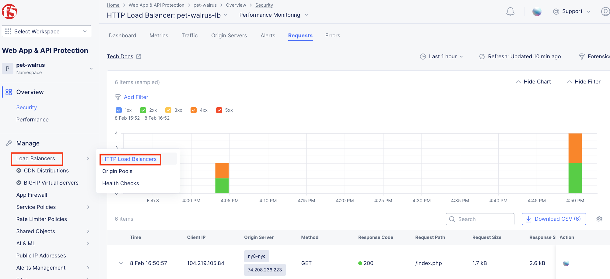
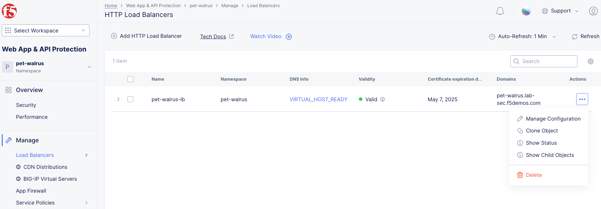
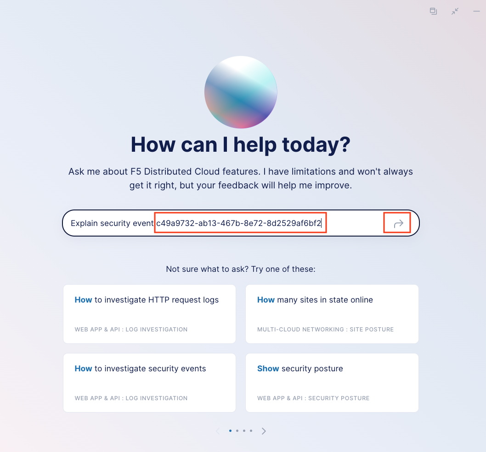
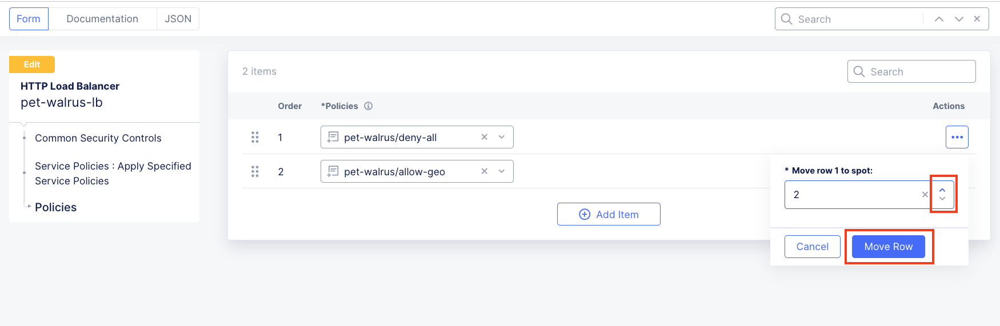

Lab 2: Enabling Positive Application Security with Service Policies 
===================================================================

**Objective:**

* Using console data, build a positive application security model

**Narrative:** 

After building a negative enforcement model, ACME Corp's security team would like to further
increase the security posture of the environment.  Instead of having an "allow-all" rule, the Security team
has tasked you to build a "deny-all" rule to further close down down the attack surface of the application
and more narrowly define the segement of users allowed to access the application. Your goal is to build
this new postive security model on a single application so it does not affect access to other applications 
in the F5 Distributed Cloud Tenant.

**Expected Lab Time: 20 minutes**

Task 1: Reviewing Current Access Trends  
~~~~~~~~~~~~~~~~~~~~~~~~~~~~~~~~~~~~~~

#. Return to the F5 Distributed Cloud Console - **Web Application & API Protection > Overview > Performance** 
   Dashboard.

#. Scroll down and select the load balancer.

#. Update the variable time filter. 

#. Using the horizontal navigation, click **Requests**.  

   |lab001|

#. Expand one of the requests. Record the Client IP address, Country and ASN. This information will help you build
   a positive enforcement service policy.

   |lab002|

#. You can also leverage the AI Assistant to provide you a summary of the request.  

   |lab003|

Task 2: Create A Deny-All Enforcement Service Policy
~~~~~~~~~~~~~~~~~~~~~~~~~~~~~~~~~~~~~~~~~~~~~~~~~~~~
In this task you will modify the HTTP load balancer to utilize a new set of service policies.

#. Under Manage, click **Load Balancers > HTTP Load Balancers**.

   |lab004|

#. Select the Action dropdown and click **Manage Configuration**.

   |lab005|

#. Select **Common Security Controls** on the left-hand menu.  Click **Edit Configuration** in the upper right-hand corner. 

   |lab006|

#. Select the dropdown for **Service Policies** and change from the namespace option to select **Apply Specified Service Policies**.

#. Click **Configure** to setup the new Service Policies.  

   |lab007|

   |lab008|

#. For the **FIRST** ordered policy, select the drop down and click **Add Item**

   |lab009|

#. Name the policy **deny-all**.  Click the dropdown for *Select Policy Rules* and select **Deny All Requests**.  Click **Continue**
   when completed.

   |lab010|

#. Click **Apply** to update the Service Policy to be applied specifically to this Application.

   |lab011|

#. Scroll down and click **Save and Exit**. 

   |lab012|

#. Browse to the ACME Corp application at *<namespace>.lab-sec.f5demos.com*.  You should see a 403 Forbidden Error.  Copy the Support ID.

   |lab013|

#. Let's use the F5 Distributed Cloud AI Assistant to determine if it matched the correct policy.  Return to the F5 Distributed 
   Cloud console.  Click the AI Assistant icon in the upper-right hand corner. 

   |lab014|

#. By clicking into the prompt, AI Assistant will prompt with some suggested natural language queries.  Select *Explain security 
   event [request-id]*

#. Be sure to edit the prompt with the support ID from your block page.  The support ID is equivalent to the request id.

#. The AI Assistant will confirm that we did match the **deny-all** rule and denied our request.  Minimize the AI Assistant
   
   |lab015|

   |lab016|

   |lab017|

Task 3: Create specific rules define allowed traffic for positive enforcement
~~~~~~~~~~~~~~~~~~~~~~~~~~~~~~~~~~~~~~~~~~~~~~~~~~~~~~~~~~~~~~~~~~~~~~~~~~~~~

#. Return back to the HTTP Load Balancer page to Manage the Configuration of our application.

   |lab018|

#. Click to **Common Security Controls** and **Edit Configuration**.

   |lab019|

#. Under Service Policies, click **View Configuration**.

   |lab020|

#. Click **Edit Configuration** in the top right hand corner to add new policies.

   |lab021|

#. Click **Add Item** to add a new policy.  This will add a new row in our policies to evaluate.

   |lab022|

#. Click the dropdown in policy row 2 and click **Add Item**

   |lab023|

#. Name the policy **allow-geo** and change the *Select Policy Rules* to **Allowed Sources**

   |lab024|

#. Scroll down to the Country List and select the country that matches your client.  This information was gathered in Task 1.  Click 
   **Continue**.

   |lab025|

#. Click **Apply**.

   |lab026|

#. Click **Save and Exit**.

   |lab027|

#. Browse to the ACME Corp application at *<namespace>.lab-sec.f5demos.com*.  Why are you seeing a 403 error?  Service Policies are enforced based on 
   the order of their rules.  

#. Lets return to the specific Service Policy applied to the HTTP load balancer.  Note the order of the Service Policies.  The deny-all policy is
   listed first.   Service Policies must be ordered correctly in a order to process traffic as intended.

   |lab028|

#. Click the Actions menu under the deny-all rule.  Select **Move to another spot**.

#. Use the arrows to update the *deny-all* rule to move to row 2.  Click **Move Row** when complete.

#. Click **Apply**.

   |lab029|

   |lab030|

   |lab031|

#. Click **Save and Exit**.

#. Browse to the ACME Corp application at *<namespace>.lab-sec.f5demos.com*.  Access should be restored.

   |lab032|

   |lab033|

Narrative Check
-----------------
You have now created a positive security model for your application.  F5 Distributed Cloud allows users to 
specifically bypass the Fiji blocking namespace security model from Lab 1 to apply service policies specifically
to the HTTP load balancer.  In this positive enforcement model, you created a policy to allow based on geo-location but
service policies can also be used to allow based on IP addresses, BGP ASNs, user-agents, and custom headers.  

+----------------------------------------------------------------------------------------------+
| **End of Lab 2:**  This concludes Lab 2, feel free to review and test the configuration.     |
|                                                                                              |
| A brief presentation will be shared prior to the beginning of Lab 3.                         |
+----------------------------------------------------------------------------------------------+
| |labend|                                                                                     |
+----------------------------------------------------------------------------------------------+

.. |lab001| image:: _static/lab2-001.png
   :width: 800px

.. |lab006| image:: _static/lab2-006.png
   :width: 800px
.. |lab007| image:: _static/lab2-007.png
   :width: 800px

.. |lab010| image:: _static/lab2-010.png
   :width: 800px
.. |lab011| image:: _static/lab2-011.png
   :width: 800px
.. |lab012| image:: _static/lab2-012.png
   :width: 800px

.. |lab014| image:: _static/lab2-014.png
   :width: 800px
.. |lab015| image:: _static/lab2-015.png
   :width: 800px

.. |lab017| image:: _static/lab2-017.png
   :width: 800px

.. |lab019| image:: _static/lab2-019.png
   :width: 800px
.. |lab020| image:: _static/lab2-020.png
   :width: 800px
.. |lab021| image:: _static/lab2-021.png
   :width: 800px
.. |lab022| image:: _static/lab2-022.png
   :width: 800px

.. |lab025| image:: _static/lab2-025.png
   :width: 800px
.. |lab026| image:: _static/lab2-026.png
   :width: 800px
.. |lab027| image:: _static/lab2-027.png
   :width: 800px
.. |lab028| image:: _static/lab2-028.png
   :width: 800px
.. |lab029| image:: _static/lab2-029.png
   :width: 800px

.. |lab033| image:: _static/lab2-033.png
   :width: 800px
.. |labend| image:: _static/labend.png
   :width: 800px
      
