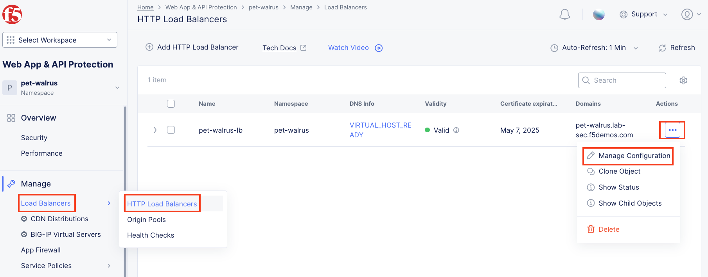
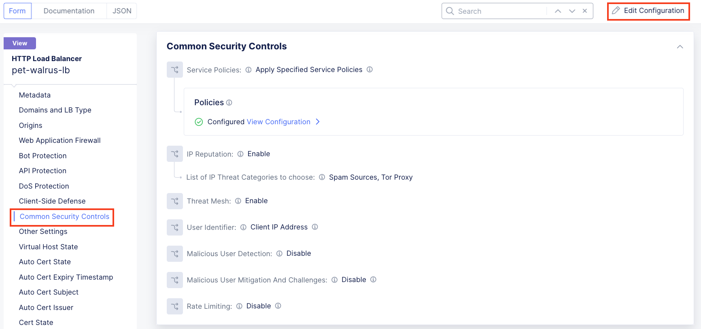
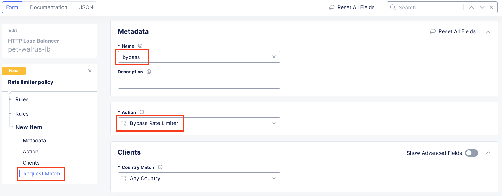
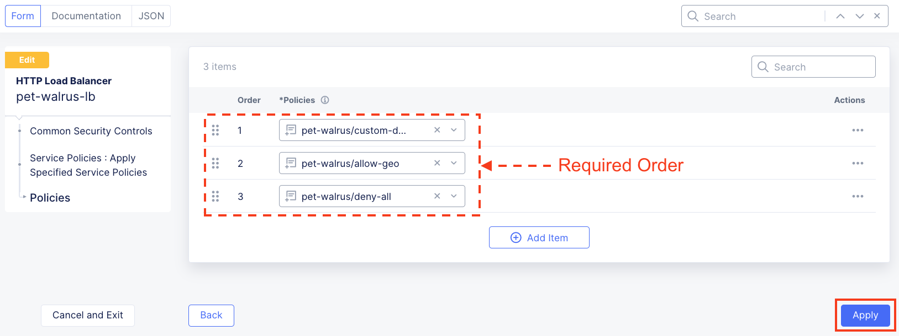
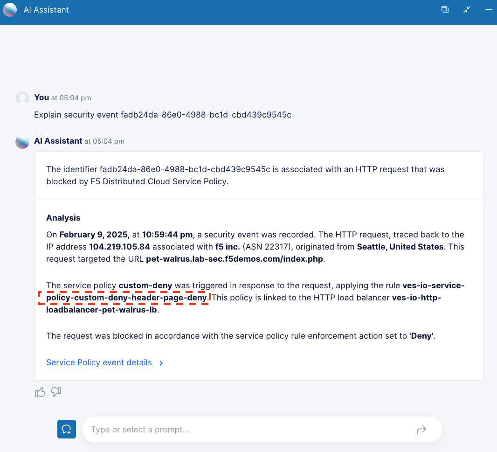

Lab 3: Exploring Rate Limiting & Routes
=======================================

The following lab tasks will guide you through the configuration of Rate Limiting feature sets.
Rate Limiting can be used to implement a variety of L7 security controls; assisting in L7 DDoS, 
protecting heavy URLs (service process impactful) or mitigating impacts to other controlled endpoints.  

Routes in F5 XC can be utilized to accomplish L7 routing based on URI to multiple origin pools. 

**Expected Lab Time: 20 minutes**

Task 1: Establishing a Baseline
~~~~~~~~~~~~~~~~~~~~~~~~~~~~~~~

In this task you will access a test website/webpage to experience access without a Rate Limiting Policy
engaged.  Following completion of Task1, you will build a Rate Limit Policy (Task2) and the test the 
Rate Limited experience (Task3).

+----------------------------------------------------------------------------------------------+
| 1. In your local web browser access the following link, replacing namespace with your own:   |
|                                                                                              |
|    **http://<namespace>.lab-sec.f5demos.com/ratelimit.php**                                  |
|                                                                                              |
| 2. Refresh the page multiple times and notice you do not receive any errors nor blocked      |
|                                                                                              |
|    messages. You can also open your browser's developers to observe requests receiving 200Ks.|
|                                                                                              |
|    Let's change that behavior.                                                               |
+----------------------------------------------------------------------------------------------+
| |lab000|                                                                                     |
+----------------------------------------------------------------------------------------------+

Task 2: Creating a Rate Limiting Policy 
~~~~~~~~~~~~~~~~~~~~~~~~~~~~~~~~~~~~~~~

In this task you will add a Rate Limiting Policy to the application Load Balancer previously created.

+----------------------------------------------------------------------------------------------+
| 1. Return to the **Web App & API Protection** configuration window. In the left-hand         |
|                                                                                              |
|    navigation, expand **Manage** and click **Load Balancers > HTTP Load Balancers**.         |
|                                                                                              |
| 2. Use the **Action Dots** and click **Manage Configuration**                                |
|                                                                                              |
| 3. Click **Edit Configuration** in the top right-hand corner.                                |
+----------------------------------------------------------------------------------------------+
| |lab001|                                                                                     |
|                                                                                              |
| |lab002|                                                                                     |
+----------------------------------------------------------------------------------------------+

+----------------------------------------------------------------------------------------------+
| 4. Click **Common Security Controls** in the left-hand navigation & locate **Rate Limiting**.|
|                                                                                              |
| 5. Click the dropdown for **Rate Limiting** and select **Custom Rate Limiting Parameters**.  |
+----------------------------------------------------------------------------------------------+
| |lab003|                                                                                     |
+----------------------------------------------------------------------------------------------+

+----------------------------------------------------------------------------------------------+
| 6. In the expanded **Custom Rate Limiting Parameters** click the **View Configuration** Link.|
+----------------------------------------------------------------------------------------------+
| |lab004|                                                                                     |
+----------------------------------------------------------------------------------------------+

+----------------------------------------------------------------------------------------------+
| 7. In the resulting **Rate Limit Configuration** window, in the **Request Rate Limiter**     |
|                                                                                              |
|    section set the following values as shown:                                                |
|                                                                                              |
|    * **Number:** 2                                                                           |
|    * **Per Period:** Minute                                                                  |
|    * **Burst Multiplier:** 1                                                                 |
|                                                                                              |
| 8. Click the drop-down for **Rate Limiter Policies** and select **Rate Limiter Policies**.   |
+----------------------------------------------------------------------------------------------+
| |lab005|                                                                                     |
+----------------------------------------------------------------------------------------------+

+----------------------------------------------------------------------------------------------+
| 9. In the new row for **Rate Limiter Policies**, click the dropdown an then select **Add**   |
|                                                                                              |
|    **Item** from the list as shown.                                                          |
+----------------------------------------------------------------------------------------------+
| |lab006|                                                                                     |
+----------------------------------------------------------------------------------------------+

+----------------------------------------------------------------------------------------------+
| 10. In the **Rate Limiter Policy** window, enter **rate-limit** in the **Name** field in     |
|                                                                                              |
|     **Metadata** section and then click **Configure** within the **Rules** section.          |
|                                                                                              |
| 11. In the resulting **Rules** window, click **Add Item**.                                   |
+----------------------------------------------------------------------------------------------+
| |lab007|                                                                                     |
|                                                                                              |
| |lab008|                                                                                     |
+----------------------------------------------------------------------------------------------+

+----------------------------------------------------------------------------------------------+
| 12. In the **Rate Limiter Policy** window within the **Metadata** section input              |
|                                                                                              |
|     **rate-limit-auth** into the **Name** field.                                             |
|                                                                                              |
| 13. Using the **Actions** drop-down select, **Apply Rate Limiter**.                          |
|                                                                                              |
| 14. In the left-hand navigation, click on **Request Match**.                                 |
+----------------------------------------------------------------------------------------------+
| |lab009|                                                                                     |
+----------------------------------------------------------------------------------------------+

+----------------------------------------------------------------------------------------------+
| 15. In the **Request Match** section and select the **Configure** link in the **HTTP Method**|
|                                                                                              |
|     section as shown.                                                                        |
|                                                                                              |
| 16. In the resulting **HTTP Method** window under **Method List**, select **POST** then      |
|                                                                                              |
|     click **Apply**.                                                                         |
+----------------------------------------------------------------------------------------------+
| |lab010|                                                                                     |
|                                                                                              |
| |lab011|                                                                                     |
+----------------------------------------------------------------------------------------------+

+----------------------------------------------------------------------------------------------+
| 17. Observe that **HTTP Method** now appears **Configured**.                                 |
|                                                                                              |
| 18. Further down in the **Request Match** section, select the **Configure** link in the      |
|                                                                                              |
|     **HTTP Path** section as shown.                                                          |
|                                                                                              |
| 19. Observe the various Path definition options, click **Add Item** in the **Prefix Values** |
|                                                                                              |
|     section the input **/auth.php** as shown and then click **Apply**.                       |
|                                                                                              |
+----------------------------------------------------------------------------------------------+
| |lab012|                                                                                     |
|                                                                                              |
| |lab013|                                                                                     |
+----------------------------------------------------------------------------------------------+

+----------------------------------------------------------------------------------------------+
| 20. Observe that **HTTP Path** now also appears **Configured**. Click **Apply** on the       |
|                                                                                              |
|     **Rate Limiter Policy** window.                                                          |
|                                                                                              |
| 21. Observe the rate limit rule just created and click **Add Item** to build another rule.   |
+----------------------------------------------------------------------------------------------+
| |lab014|                                                                                     |
|                                                                                              |
| |lab015|                                                                                     |
+----------------------------------------------------------------------------------------------+

+----------------------------------------------------------------------------------------------+
| 22. In the **Rate Limiter Policy** window within the **Metadata** section input              |
|                                                                                              |
|     **rate-limit-page** into the **Name** field.                                             |
|                                                                                              |
| 23. Using the **Actions** drop-down select, **Apply Rate Limiter**.                          |
|                                                                                              |
| 24. In the left-hand navigation, click on **Request Match**.                                 |
+----------------------------------------------------------------------------------------------+
| |lab016|                                                                                     |
+----------------------------------------------------------------------------------------------+

+----------------------------------------------------------------------------------------------+
| 25. In the **Request Match** section and select the **Configure** link in the **HTTP Method**|
|                                                                                              |
|     section as shown.                                                                        |
|                                                                                              |
| 26. In the resulting **HTTP Method** window under **Method List**, select **GET** then       |
|                                                                                              |
|     click **Apply**.                                                                         |
+----------------------------------------------------------------------------------------------+
| |lab017|                                                                                     |
|                                                                                              |
| |lab018|                                                                                     |
+----------------------------------------------------------------------------------------------+

+----------------------------------------------------------------------------------------------+
| 27. Observe that **HTTP Method** now appears **Configured**.                                 |
|                                                                                              |
| 28. Further down in the **Request Match** section, select the **Configure** link in the      |
|                                                                                              |
|     **HTTP Path** section as shown.                                                          |
|                                                                                              |
| 29. Observe the various Path definition options, click **Add Item** in the **Prefix Values** |
|                                                                                              |
|     section the input **/ratelimit.php** as shown and then click **Apply**.                  |
+----------------------------------------------------------------------------------------------+
| |lab019|                                                                                     |
|                                                                                              |
| |lab020|                                                                                     |
+----------------------------------------------------------------------------------------------+

+----------------------------------------------------------------------------------------------+
| 30. Observe that **HTTP Path** now also appears **Configured**. Click **Apply** on the       |
|                                                                                              |
|     **Rate Limiter Policy** window.                                                          |
|                                                                                              |
| 31. Observe the added rate limit rule and click **Add Item** to build another rule.          |
+----------------------------------------------------------------------------------------------+
| |lab021|                                                                                     |
|                                                                                              |
| |lab022|                                                                                     |
+----------------------------------------------------------------------------------------------+

+----------------------------------------------------------------------------------------------+
| 32. In the **Rate Limiter Policy** window within the **Metadata** section input              |
|                                                                                              |
|     **bypass** into the **Name** field.                                                      |
|                                                                                              |
| 33. Using the **Actions** drop-down select, **Bypass Rate Limiter**.                         |
|                                                                                              |
| 34. In the left-hand navigation, click on **Request Match**.                                 |
+----------------------------------------------------------------------------------------------+
| |lab023|                                                                                     |
+----------------------------------------------------------------------------------------------+

+----------------------------------------------------------------------------------------------+
| 35. In the **Request Match** section and select the **Configure** link in the **HTTP Method**|
|                                                                                              |
|     section as shown.                                                                        |
|                                                                                              |
| 36. In the resulting **HTTP Method** window under **Method List**, select **ANY** then       |
|                                                                                              |
|     click **Apply**.                                                                         |
+----------------------------------------------------------------------------------------------+
| |lab024|                                                                                     |
|                                                                                              |
| |lab025|                                                                                     |
+----------------------------------------------------------------------------------------------+

+----------------------------------------------------------------------------------------------+
| 37. Observe that **HTTP Method** now appears **Configured**.                                 |
|                                                                                              |
| 38. Further down in the **Request Match** section, select the **Configure** link in the      |
|                                                                                              |
|     **HTTP Path** section as shown.                                                          |
|                                                                                              |
| 39. Observe the various Path definition options, click **Add Item** in the **Prefix Values** |
|                                                                                              |
|     section the input **/** as shown and then click **Apply**.                               |
+----------------------------------------------------------------------------------------------+
| |lab026|                                                                                     |
|                                                                                              |
| |lab027|                                                                                     |
+----------------------------------------------------------------------------------------------+

+----------------------------------------------------------------------------------------------+
| 40. Observe that **HTTP Path** now also appears **Configured**. Click **Apply** on the       |
|                                                                                              |
|     **Rate Limiter Policy** window.                                                          |
|                                                                                              |
| 41. Observe the three created rate limit rules and click **Apply**.                          |
+----------------------------------------------------------------------------------------------+
| |lab028|                                                                                     |
|                                                                                              |
| |lab029|                                                                                     |
+----------------------------------------------------------------------------------------------+

+----------------------------------------------------------------------------------------------+
| 42. Observe that rules are now **Configured**. Complete the custom **Rate Limiter Policy** by|
|                                                                                              |
|     clicking **Continue**.                                                                   |
+----------------------------------------------------------------------------------------------+
| |lab030|                                                                                     |
+----------------------------------------------------------------------------------------------+

+----------------------------------------------------------------------------------------------+
| 43. Observe the **Request Rate Limiter** options for number of requests, the Per Period      |
|                                                                                              |
|     interval and the Burst Multiplier.                                                       |
|                                                                                              |
| 44. Also observe that IPs can be allowed without Rate Limiting policies being applied        |
|                                                                                              |
| 45. Click **Apply** to add the **Rate Limit Configuration** to the application Load Balancer.|
|                                                                                              |
| .. note::                                                                                    |
|                                                                                              |
|    *Although only one policy is being added, multiple Rate Limit policies can be attached.*  |
+----------------------------------------------------------------------------------------------+
| |lab031|                                                                                     |
+----------------------------------------------------------------------------------------------+

+----------------------------------------------------------------------------------------------+
| 46. Observe that the **Custom Rate Limiting Parameters** now show **Configured** and then    |
|                                                                                              |
|     click on **Other Settings** in the left-hand navigation.                                 |
|                                                                                              |
| 47. Once at the bottom of the **HTTP Load Balancer** configuration, click **Save and Exit**. |
+----------------------------------------------------------------------------------------------+
| |lab032|                                                                                     |
|                                                                                              |
| |lab033|                                                                                     |
+----------------------------------------------------------------------------------------------+

Task 3: Testing Rate Limiting
~~~~~~~~~~~~~~~~~~~~~~~~~~~~~

Now we will retest access to our website and see if our experience has indeed changed.

+----------------------------------------------------------------------------------------------+
| 1. In your local web browser access the following link, replacing namespace with your own:   |
|                                                                                              |
|    **http://<namespace>.lab-sec.f5demos.com/ratelimit.php**                                  |
|                                                                                              |
| 2. Refresh the page multiple times and quickly... did you experience a different result?     |
|                                                                                              |
|    Rate Limited responses receive **429** response codes and block pages as shown in the     |
|                                                                                              |
|    image below.                                                                              |
+----------------------------------------------------------------------------------------------+
| |lab034|                                                                                     |
+----------------------------------------------------------------------------------------------+

+----------------------------------------------------------------------------------------------+
| 3. Rate Limited requests can also be seen in **Security Events** as Service Policy blocks.   |
|                                                                                              |
| 4. Review your Security Events by navigating back to the Security Dashboard to see the 429   |
|                                                                                              |
|    blocks.                                                                                   |
|                                                                                              |
| .. note::                                                                                    |
|                                                                                              |
|    *Review Lab2/Task4 to find Security Events. You can copy you support ID to search with!*  |
+----------------------------------------------------------------------------------------------+
| |lab035|                                                                                     |
|                                                                                              |
| |lab036|                                                                                     |
+----------------------------------------------------------------------------------------------+

Task 4: Observing Route Configurations
~~~~~~~~~~~~~~~~~~~~~~~~~~~~~~~~~~~~~~

The following steps will enable you to attach Service Policies to your configured Load Balancer.
It will also help you understand additional approaches for Service Policies.

+----------------------------------------------------------------------------------------------+
| 1. Within **Web App & API Protection** in the F5 Distributed Cloud Console, **Manage >**     |
|                                                                                              |
|    **Load Balancer > HTTP Load Balancers** and use the **Action Dots** and click **Manage**  |
|                                                                                              |
|    **Configuration**.                                                                        |
|                                                                                              |
| 2. Click **Edit Configuration** in the top right-hand corner.                                |
+----------------------------------------------------------------------------------------------+
| |lab063|                                                                                     |
|                                                                                              |
| |lab064|                                                                                     |
+----------------------------------------------------------------------------------------------+

+----------------------------------------------------------------------------------------------+
| 3. Click **Routes** in the left-hand navigation and the click **Configure** as shown.        |
|                                                                                              |
| 4. In **Routes** window, click the **Add Item** link.                                        |
+----------------------------------------------------------------------------------------------+
| |lab065|                                                                                     |
|                                                                                              |
| |lab066|                                                                                     |
+----------------------------------------------------------------------------------------------+

+----------------------------------------------------------------------------------------------+
| 5. Observe the various route types and matching criteria controls that can be leveraged to   |
|                                                                                              |
|    securely control application flow, perform pool targeting, make path responses or develop |
|                                                                                              |
|    custom control to secure protected applications.                                          |
|                                                                                              |
| 6. An example walkthrough of **Simple Route** is shown but feel free to look at all the      |
|                                                                                              |
|    route types: .                                                                            |
|                                                                                              |
|    * **Simple Route:** Matches on path and/or HTTP method and forward traffic to the         |
|                        associated pool.                                                      |
|    * **Redirect Route:** Matches on path and/or HTTP method and redirects matching traffic   |
|                        to a different URL.                                                   |
|    * **Direct Response Route:** Matches on path and/or HTTP method and responds directly to  |
|                        matching traffic.                                                     |
|    * **Custom Route Object:** Leverages a reference route object created outside this view.  |
|                                                                                              |
| 7. Click **Cancel and Exit** once through with exploring the feature.                        |
+----------------------------------------------------------------------------------------------+
| |lab067|                                                                                     |
|                                                                                              |
| |lab068|                                                                                     |
|                                                                                              |
| |lab069|                                                                                     |
+----------------------------------------------------------------------------------------------+

+----------------------------------------------------------------------------------------------+
| **End of Lab 5:**  This concludes Lab 5, feel free to review and test the configuration.     |
|                                                                                              |
| A Q&A session will begin shortly to conclude the overall lab.                                |
+----------------------------------------------------------------------------------------------+
| |labend|                                                                                     |
+----------------------------------------------------------------------------------------------+

.. |lab000| image:: _static/lab3-000.png
   :width: 800px

.. |lab003| image:: _static/lab3-003.png
   :width: 800px
.. |lab004| image:: _static/lab3-004.png
   :width: 800px
.. |lab005| image:: _static/lab3-005.png
   :width: 800px

.. |lab008| image:: _static/lab3-008.png
   :width: 800px

.. |lab011| image:: _static/lab3-011.png
   :width: 800px
.. |lab012| image:: _static/lab3-012.png
   :width: 800px
.. |lab013| image:: _static/lab3-013.png
   :width: 800px
.. |lab014| image:: _static/lab3-014.png
   :width: 800px
.. |lab015| image:: _static/lab3-015.png
   :width: 800px
.. |lab016| image:: _static/lab3-016.png
   :width: 800px
.. |lab017| image:: _static/lab3-017.png
   :width: 800px

.. |lab020| image:: _static/lab3-020.png
   :width: 800px

.. |lab022| image:: _static/lab3-022.png
   :width: 800px

.. |lab024| image:: _static/lab3-024.png
   :width: 800px
.. |lab025| image:: _static/lab3-025.png
   :width: 800px
.. |lab026| image:: _static/lab3-026.png
   :width: 800px
.. |lab027| image:: _static/lab3-027.png
   :width: 800px

.. |lab029| image:: _static/lab3-029.png
   :width: 800px

.. |lab032| image:: _static/lab3-032.png
   :width: 800px

.. |lab034| image:: _static/lab3-034.png
   :width: 800px
.. |lab035| image:: _static/lab3-035.png
   :width: 800px
.. |lab036| image:: _static/lab3-036.png
   :width: 800px
.. |labend| image:: _static/labend.png
   :width: 800px
.. |lab063| image:: _static/lab3-063.png
   :width: 800px   

.. |lab065| image:: _static/lab3-065.png
   :width: 800px   
.. |lab066| image:: _static/lab3-066.png
   :width: 800px   

.. |lab068| image:: _static/lab3-068.png
   :width: 800px   
.. |lab069| image:: _static/lab3-069.png
   :width: 800px   
.. |labend| image:: _static/labend.png
   :width: 800px
      
