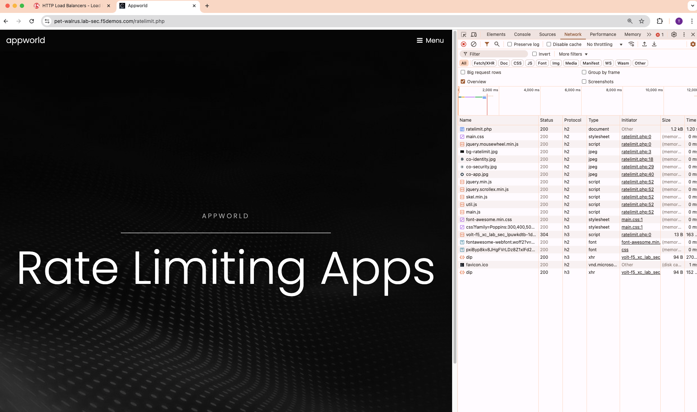
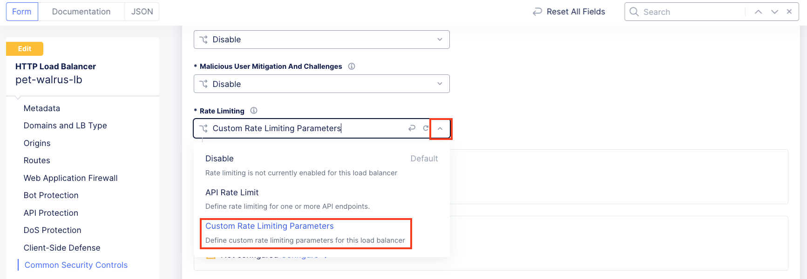
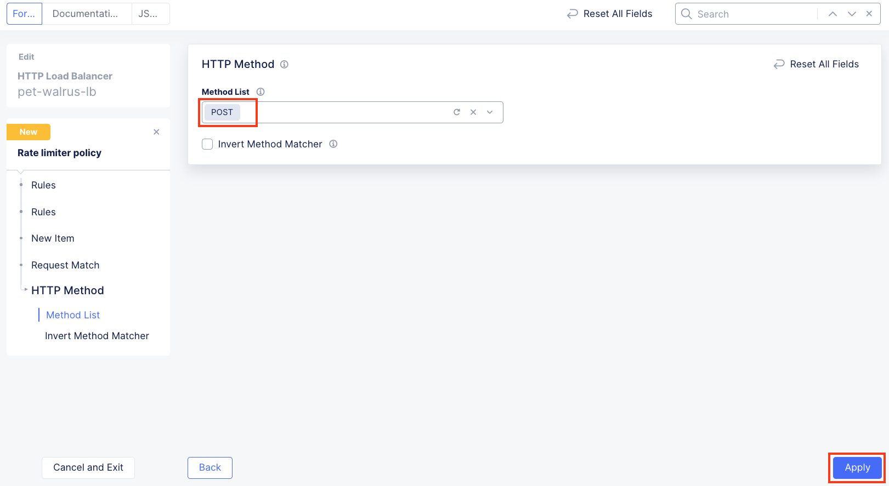
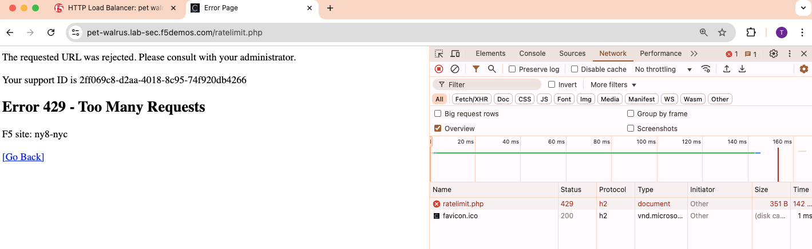
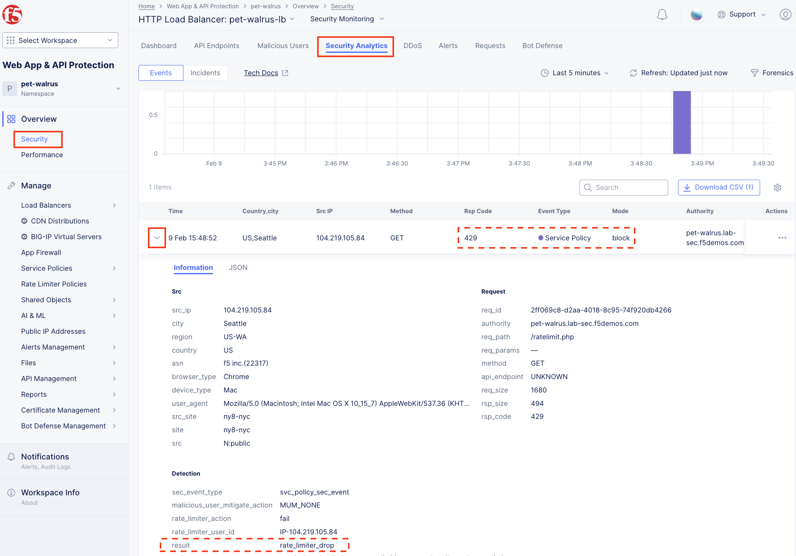
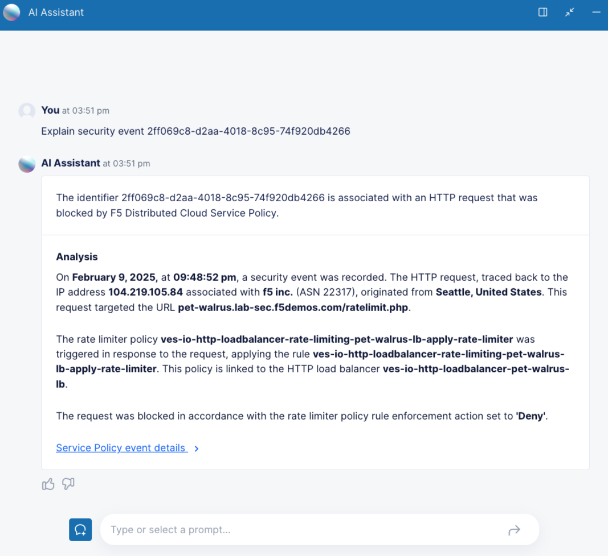
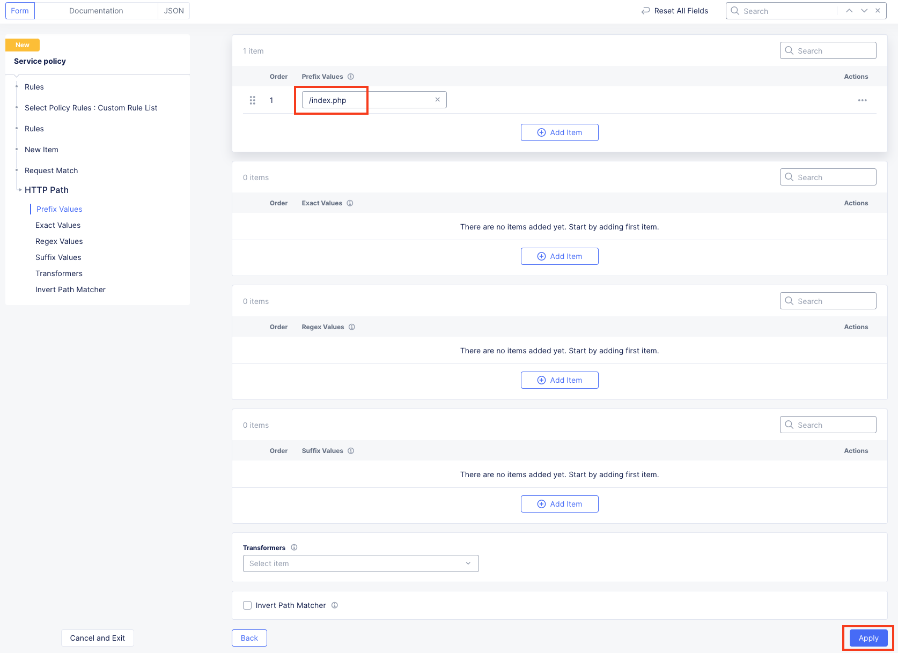

Lab 3: Zero Day Exploit Response with Rate Limiting and Custom Service Policies
===============================================================================

**Objective:**

* Protect against a Zero Day Exploit using Rate Limiting

* Build Custom Service Policies

**Narrative:** 

You've been called into an all-hands incident response conference call.  There is a zero-day exploit specifically
targeting one of ACME Corp's application.  The attacks are coming from multiple IP addresses so a simple IP shun 
will not be effective.  The attacks are compomising the application as valid users are getting poor performance
as your application infrastructure is being overloaded.  

After reviewing the data, the application team has asked if you can deploy Rate Limiting to help ACME Corp limit 
the load that each individual user can request.  Based on the discoveries made, there are two rate limiting rules 
that need to configured.  
  * HTTP POST requests to the login page 
  * HTTP GET requests to the rate-limit page. 
The application team would like all other requests to be allowed without any rate-limiting.  You leave the all-hands 
call to focus on the F5 Distributed Cloud configurations while the team members investigate the underlying nature 
of the exploit.

**Expected Lab Time: 30 minutes**

Task 1: Establishing a Baseline
~~~~~~~~~~~~~~~~~~~~~~~~~~~~~~~

In this task you will access a test website/webpage to experience access without a Rate Limiting Policy
engaged.  This will demonstrate that any user can request data from the application without limits.  

#. In your web browser, enable Developer Tools and browse to the ACME Corp application.  
   Chrome is shown in this example (F12)  

   **http://<namespace>.lab-sec.f5demos.com/ratelimit.php**  

#. Refresh the page multiple times and notice you do not receive any errors nor blocked messages.  
   The browser's developer tool will display multiple HTTP 200 OK responses.  Let's change that behavior.

   |lab000|

Task 2: Creating a Rate Limiting Policy 
~~~~~~~~~~~~~~~~~~~~~~~~~~~~~~~~~~~~~~~

In this task you will add a Rate Limiting Policy to the application Load Balancer previously created.
Rate Limiting can be used to implement a variety of L7 security controls; assisting in L7 DDoS, 
protecting heavy URLs (service process impactful) or mitigating impacts to other controlled endpoints.  
This will help alleviate the strain on the application infrastructure by limiting the number of requests
each client can make while ACME corp works to protect itself from the zero-day.

#. Return to the **Web App & API Protection** configuration window. In the left-hand 
   navigation, expand **Manage** and click **Load Balancers > HTTP Load Balancers**.

#. Use the **Action Dots** and click **Manage Configuration**

#. Click **Common Security Controls** in the left-hand menu and **Edit Configuration** in the top 
   right-hand corner.

   |lab001|

   |lab002|

#. Click the dropdown for **Rate Limiting** and select **Custom Rate Limiting Parameters**.

#. In the expanded **Custom Rate Limiting Parameters** click the **View Configuration** Link.

   |lab003|

   |lab004|

#. In the resulting **Rate Limit Configuration** window, in the **Request Rate Limiter**
   section set the following values as shown:

   * **Number:** 3 
   * **Per Period:** Minute 
   * **Burst Multiplier:** 1 
  
#. Click the drop-down for **Rate Limiter Policies** and select **Rate Limiter Policies**.

   |lab005|

#. In the new row for **Rate Limiter Policies**, click the dropdown an then select **Add Item**
   from the list as shown.

   |lab006| 

#. In the **Rate Limiter Policy** window, enter **rate-limit** in the **Name** field in
   **Metadata** section and then click **Configure** within the **Rules** section.

#. In the resulting **Rules** window, click **Add Item**.

   |lab007|

   |lab008|

#. In the **Rate Limiter Policy** window within the **Metadata** section input **rate-limit-auth** 
   into the **Name** field. 

#. Using the **Actions** drop-down select, **Apply Rate Limiter**.

#. In the left-hand navigation, click on **Request Match**.

   |lab009|

#. In the **Request Match** section and select the **Configure** link in the **HTTP Method**
   section as shown. 

#. In the resulting **HTTP Method** window under **Method List**, select **POST** then click **Apply**.

   |lab010|

   |lab011|

#. Observe that **HTTP Method** now appears **Configured**. 

#. Further down in the **Request Match** section, select the **Configure** link in the **HTTP Path** 
   section as shown.

#. Observe the various Path definition options, click **Add Item** in the **Prefix Values**
   section the input **/auth.php** as shown and then click **Apply**.

   |lab012|

   |lab013|
   
#. Observe that **HTTP Path** now also appears **Configured**. Click **Apply** on the
   **Rate Limiter Policy** window.

#. Observe the rate limit rule just created and click **Add Item** to build another rule.

   |lab014|

   |lab015|

#. In the **Rate Limiter Policy** window within the **Metadata** section input **rate-limit-page** 
   into the **Name** field. 

#. Using the **Actions** drop-down select, **Apply Rate Limiter**.

#. In the left-hand navigation, click on **Request Match**. 

   |lab016|

#. In the **Request Match** section and select the **Configure** link in the **HTTP Method** 
   section as shown. 

#. In the resulting **HTTP Method** window under **Method List**, select **GET** then click **Apply**. 

   |lab017|

   |lab018|

#. Observe that **HTTP Method** now appears **Configured**. 

#. Further down in the **Request Match** section, select the **Configure** link in the **HTTP Path** 
   section as shown.

#. Observe the various Path definition options, click **Add Item** in the **Prefix Values** 
   section the input **/ratelimit.php** as shown and then click **Apply**.

   |lab019|

   |lab020|

#. Observe that **HTTP Path** now also appears **Configured**. Click **Apply** on the 
   **Rate Limiter Policy** window. 

#. Observe the added rate limit rule and click **Add Item** to build another rule.

   |lab021|

   |lab022|

#. In the **Rate Limiter Policy** window within the **Metadata** section input **bypass** into 
   the **Name** field

#. Using the **Actions** drop-down, select **Bypass Rate Limiter**. 

#. In the left-hand navigation, click on **Request Match**.

   |lab023|

#. In the **Request Match** section, select the **Configure** link in the **HTTP Method** 
   section as shown.

#. In the resulting **HTTP Method** window under **Method List**, select **ANY** then click **Apply**.

   |lab024|

   |lab025|

#. Observe that **HTTP Method** now appears **Configured**. 

#. Further down in the **Request Match** section, select the **Configure** link in the 
   **HTTP Path** section as shown.

#. Observe the various Path definition options, click **Add Item** in the **Prefix Values**
   section the input **/** as shown and then click **Apply**.

   |lab026|

   |lab027|

#. Observe that **HTTP Path** now also appears **Configured**. Click **Apply** on the 
   **Rate Limiter Policy** window.

#. Observe the three created rate limit rules and click **Apply**. 

   |lab028|

   |lab029|

#. Observe that rules are now **Configured**. Complete the custom **Rate Limiter Policy** by
   clicking **Continue**.

   |lab030|

#. Observe the **Request Rate Limiter** options for number of requests, the Per Period interval 
   and the Burst Multiplier.

#. Also observe that IPs can be allowed without Rate Limiting policies being applied.

#. Click **Apply** to add the **Rate Limit Configuration** to the application Load Balancer.

   .. note::
      *Although only one policy is being added, multiple Rate Limit policies can be attached.* 

   |lab031|

#. Observe that the **Custom Rate Limiting Parameters** now show **Configured** and then 
   click on **Other Settings** in the left-hand navigation.                                 
                                                                                            
#. Once at the bottom of the **HTTP Load Balancer** configuration, click **Save and Exit**. 

   |lab032|
   |lab033|

Task 3: Testing Rate Limiting
~~~~~~~~~~~~~~~~~~~~~~~~~~~~~

Now we will retest access to our website and see if our experience has indeed changed.

#. In your local web browser access the following link, replacing namespace with your own:
    **https://<namespace>.lab-sec.f5demos.com/ratelimit.php** 

#. Refresh the page multiple times and quickly... did you experience a different result? 
   Rate Limited responses receive **429** response codes and block pages as shown.

   |lab034|

#. Rate Limited requests can also be seen in **Security Analytics** as Service Policy blocks.

#. Review your Security Events by navigating back to the Security Dashboard to see the 429 blocks.
   You can also use the AI Assistant to investigate the support ID. 

   .. note::
      *Review the Lab 1 to find Security Events. You can copy you support ID to search with!* 
   
   |lab035|

   |lab036|

   |lab037|

Narrative Check
-----------------
You have now configured rate limiting on the ACME Corp application.  This will slow down the attackers
from making multiple requests to your application.  

Following your rate limiting deployment, you hop back on the all-hands call and find out that the 
security and application team have uncovered the attack methodology by reviewing applicaiton logs.  
First the attackers are using CURL to launch their attacks.  

Let's focus on building that custom policy to close the vulnerability that the attackers are using.  

Task 4: Create, assign and test a Custom Service Policy
~~~~~~~~~~~~~~~~~~~~~~~~~~~~~~~~~~~~~~~~~~~~~~~~~~~~~~~
In this task you will add a Custom Policy and assign it to your Load Balancer. Custom Service 
Policies provide the flexibility to build **Positive** or **Negative** security models and custom
rules or controls.

This Custom Service Policy will be focused on limiting CURL access as logs are indicating that 
the attackers are using CURL to access the application.  The Custom policy will also focus on protecting
a specific page of the application that is vulnerable to close the Zero Day exploit.

#. Before beginning this task, re-evaluate your access from your client to the following: 
  
   * **Browser**: *https://<namespace>.lab-sec.f5demos.com/index.php?page=header*
   * **cURL**: *https://<namespace>.lab-sec.f5demos.com/*
   * **cURL**: *https://<namespace>.lab-sec.f5demos.com/index.php?page=header* 

   The expectation is that all are successful based on the current Service Policies.

   .. note:: 
      cURL is supported on Windows, Mac & Linux platforms.

   |lab038|

   |lab039|

   |lab039a|

#. Returning to **Web App & API Protection**, in the left-hand navigation menu, expand the **Manage** 
   section and click **Service Policies**. In the flyout menu, click the **Service Policies** link.

#. Observe the existing Service Policies and note that some are sourced from the **shared** namespace 
   which means they could be used within any other namespace. 

#. Click **Add Service Policy** in the top left area as shown

   |lab040|

   |lab041|

#. In the **Metadata** section enter **custom-deny** for the **Name** and then click **Rules** in the 
   left-hand navigation.

#. Then select **Custom Rule List** from the dropdown for **Select Policy Rules**.  Locate **Rules** 
   configuration section and click **Configure**.

   |lab042|

#. In the **Rules** window, click **Add Item**.

#. In the **Metadata** section **Name** field input **curl-deny** and toggle the **Show Advanced Fields** 
   to see extra configuration options in **Action** section.

#. In the **Action** section, select **Deny** for the **Action** and then in the left-hand navigation 
   click **Request Match**.

   |lab043|

   |lab044|

#. In the **HTTP Method** section, use the **Method List** dropdown to select **GET**.

#. In the **HTTP Headers** section click **Add Item**. 

   |lab045|

#. In the **Header Matcher** window, input **user-agent** for **Header Name** as shown.

#. Click **Add Item** under the **Regex Values** area and input **(?i)^.*curl.*$** then click **Apply**.

   |lab046|

#. Scroll down to the bottom of the **Rule Configuration** and click **Apply**. 

   |lab047|

#. In the **custom-deny** Service Policy Rule window, click **Add Item** to add another rule.

   .. note:: 
      *Multiple Rules can be added to a single Service Policy*. 

   |lab048|

#. In the **Metadata** section **Name** field input **header-page-deny** and then click 
   **Request Match** in the left-hand navigation.

   |lab049|

#. In the **Request Match** section under **HTTP Methods**, add **GET** to the method list.

#. In the **HTTP Path** area, click the **Configure** link. 

   |lab050|

#. Click **Add Item** in **Prefix Values** area and in the input field type **/index.php**.
   Click **Apply**.

   |lab051|

#. Observe that the **HTTP Path** is now **Configured**.

#. In section **HTTP Query Parameters** click **Add Item**. 

   |lab052|

#. In **Query Parameter Matcher** window, in the **Query Parameter Name** field, enter **page**.

#. In **Match Options** section, ensure **Match Values** is selected and then click **Add Item** 
   in the area with **Exact Values** as shown. 

#. Input **header** into the **Exact Values** input field as shown and then click **Apply**.

   |lab053|

#. Observe that the **HTTP Query Parameters** has the value we configured and scroll to the
   bottom of the rule configuration and click **Apply**. 

   |lab054|

   |lab055|

#. Observe that both configured rules are present and then click **Apply**.  

   .. note::
      *Rules within the Service Policy can placed in order as needed*.

   |lab056|

#. Observe that the Custom Rule is now configured for **custom-deny** Service Policy and click **Apply**. 

   |lab057|

#. The **custom-deny** Service Policy is now listed among all Service Policies and has a **Rule Count** of **2**. 

   .. note::
      *This window also show the Service Policy "Hits" when validating usage*.

   |lab058|

#. Return to **Web App & API Protection** in the F5 Distributed Cloud Console, **Manage > Load Balancer >**
   **HTTP Load Balancers** and use the **Action Dots** and click **Manage**.

#. Click **Edit Configuration** in the top right-hand corner.

   |lab059|

   |lab060|

#. Click **Common Security Controls** in the left-hand navigation.

#. From the **Service Policies** section, click **Edit Configuration**. 

   |lab061|

#. Observe the order of the previously created Service Policies (allow-geo,deny-all) and click **Add Item**.

#. Use the drop-down as shown and select **<namespace>/custom-deny** from the available Service Policy list.

#. Click the six squares icon to drag **<namespace>/custom-deny** into the first position in policy order as 
   shown then click **Apply**. 

   |lab062|

   |lab063|

   |lab064|

#. Scroll to the bottom and click **Save & Exit**.

   |lab065|

#. Time to test to see if the web vulenrability is patched. Now test the following from your client:

   * **Browser**: *https://<namespace>.lab-sec.f5demos.com/index.php?page=header*
   * **cURL**: *https://<namespace>.lab-sec.f5demos.com/*
   * **cURL**: *https://<namespace>.lab-sec.f5demos.com/index.php?page=header*
  

   |lab066|

#. What where your results?  The zero-day vulnerability should be closed.  Check the Security Dashboard or 
   AI Assistant to confirm that the **custom-deny** policy is blocking the request.

   |lab067|

#. Finally, let's make sure access via the Browser is still valid for normal traffic.

   * **Browser**: *https://<namespace>.lab-sec.f5demos.com/* 

Narrative Check
-----------------
You have now configured a "custom web application vulnerability signature" for the ACME Corp application using 
Service Policies. 

Service Policies provide a powerful framework to implement both positive and negative security models
and you matching criteria from client requests (headers, parameters, paths, request body payload) to 
effectively control the access to protected applications and APIs.

Service Policies can be a foundational part of an organizations security program by extending zero-trust segmentation
capabilities beyond a company's traditional network  utilizng F5's Regional Edges and Application Delivery Network.
Service Policies can also be a key part of security incident response to quickly stop zero-day attacks.

+----------------------------------------------------------------------------------------------+
| **End of Lab 3:**  This concludes Lab 3, feel free to review and test the configuration.     |
|                                                                                              |
| A Q&A session will begin shortly to conclude the overall lab.                                |
+----------------------------------------------------------------------------------------------+
| |labend|                                                                                     |
+----------------------------------------------------------------------------------------------+

.. |lab001| image:: _static/lab3-001.png
   :width: 800px
.. |lab002| image:: _static/lab3-002.png
   :width: 800px

.. |lab004| image:: _static/lab3-004.png
   :width: 800px

.. |lab006| image:: _static/lab3-006.png
   :width: 800px
.. |lab007| image:: _static/lab3-007.png
   :width: 800px

.. |lab009| image:: _static/lab3-009.png
   :width: 800px
.. |lab010| image:: _static/lab3-010.png
   :width: 800px

.. |lab014| image:: _static/lab3-014.png
   :width: 800px
.. |lab015| image:: _static/lab3-015.png
   :width: 800px
.. |lab016| image:: _static/lab3-016.png
   :width: 800px
.. |lab017| image:: _static/lab3-017.png
   :width: 800px
.. |lab018| image:: _static/lab3-018.png
   :width: 800px
.. |lab019| image:: _static/lab3-019.png
   :width: 800px
.. |lab020| image:: _static/lab3-020.png
   :width: 800px
.. |lab021| image:: _static/lab3-021.png
   :width: 800px
.. |lab022| image:: _static/lab3-022.png
   :width: 800px
.. |lab023| image:: _static/lab3-023.png
   :width: 800px
.. |lab024| image:: _static/lab3-024.png
   :width: 800px
.. |lab025| image:: _static/lab3-025.png
   :width: 800px

.. |lab027| image:: _static/lab3-027.png
   :width: 800px
.. |lab028| image:: _static/lab3-028.png
   :width: 800px
.. |lab029| image:: _static/lab3-029.png
   :width: 800px
.. |lab030| image:: _static/lab3-030.png
   :width: 800px
.. |lab031| image:: _static/lab3-031.png
   :width: 800px
.. |lab032| image:: _static/lab3-032.png
   :width: 800px
.. |lab033| image:: _static/lab3-033.png
   :width: 800px

.. |lab036| image:: _static/lab3-036.png
   :width: 800px

.. |lab039a| image:: _static/lab3-039a.png
   :width: 800px

.. |lab042| image:: _static/lab3-042.png
   :width: 800px

.. |lab063| image:: _static/lab3-063.png
   :width: 800px
.. |lab064| image:: _static/lab3-064.png
   :width: 800px
.. |lab065| image:: _static/lab3-065.png
   :width: 800px
.. |lab066| image:: _static/lab3-066.png
   :width: 800px
.. |lab067| image:: _static/lab3-067.png
   :width: 800px

.. |labend| image:: _static/labend.png
   :width: 800px
      
