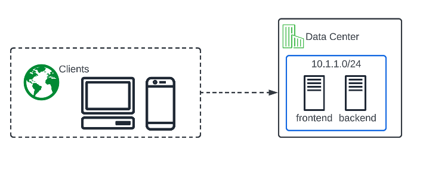
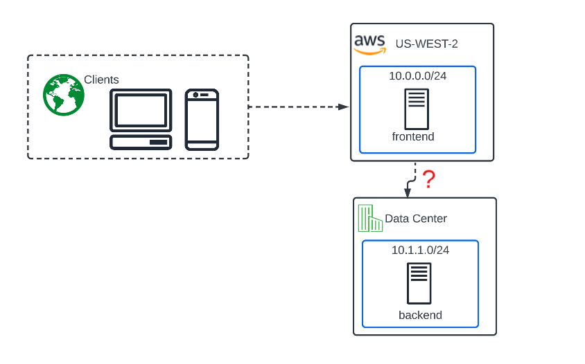

Introduction to the Lab
=======================

**Narrative:**

Congratulations! You are a Network Engineer at ACME Corp. 

ACME has an Application team that supports internally developed traditional and modern apps, vendor provided and SaaS applications. 
They have started utilizing some public cloud (AWS) IaaS for several applications and have come to you with a new requirement that an on-prem backend server must be able to securely communicate
with the AWS workloads over a secure connection. For lab simplicity, the backend server in the "Data Center" is a pretend security device in this exercise, and needs to scan the AWS workload on port 80. 
It could just as easily be thought of as a API to API, container to container or frontend to backend. Other backends or frontends may be added in the future.  

<<<<<<< Updated upstream
As the Network Engineer, you are tasked with evaluating how to will securely connect the Data Center network to the AWS network. 
At first you consider the classic methods of deploying and managing your own IPSEC solution but realize that this will be complex and costly.
=======
As the Network Engineer, you are tasked with evaluating how to securely connect the Data Center network to the AWS network. 
At first you consider the classic methods of deploying and managing your own IP-SEC solution but realize that this will be complex and costly.
>>>>>>> Stashed changes

You recently saw a post on LinkedIn about a SaaS product that F5 has, claiming to solve multi-cloud network complexities. 
Given your current predicament and industry knowledge of F5 being a leader for decades, you decide to check it out and end up in the chair you are sitting in today, taking a first-hand look at how F5 makes Multi-Cloud Networking (MCN) simple and secure. 

.. Note:: The requirements start out easy enough but will get progressively more "Real World" as the labs progress.

**Before Cloud Migration - "The Good Ol' Days"**

**After Cloud Migration - "Current State"**

**Your job, should you choose to accept it, and not get demoted, is to figure out the best way for the backend workload to privately communicate with the frontend workload.**

Lab Environment
---------------

The Data Center environment is emulated by the F5 UDF lab framework and contains an Ubuntu Server and an XC Node that you will be configuring in Lab 1. 

The AWS cloud environment contains a prebuilt XC Node and a workload hosting a web frontend.  **You will not have access to the AWS console.**

The Azure cloud environment contains a prebuilt XC Node and a workload hosting a web frontend.  **You will not have access to the Azure console.**

.. Important:: While we are keeping the labs intentionally simple today with just a single Data Center and 2 CSP's, F5 Distributed Cloud supports much more advanced use-cases. 

.. toctree::
   :maxdepth: 1
   :glob:

