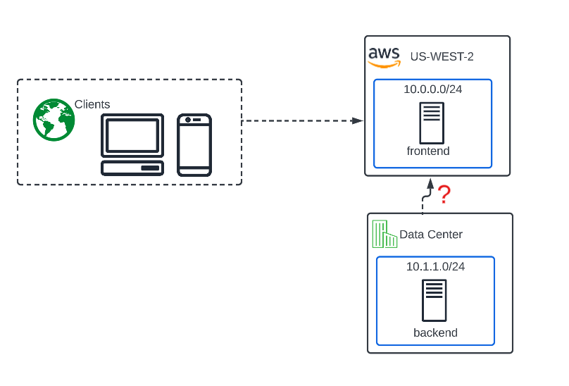

Introduction to the Lab
=======================

This Lab environment highlights some of the basic concepts of F5 Distributed Cloud (XC) Multicloud Networking concepts.

Narrative
---------

You are a Network Engineer at ACME company. ACME company has decided to investigate SAAS solutions to improve performance and time to market.

Maintenance windows and outages are especially costly to ACME company and security is a primary concern although availability is often
favored if patching means downtime. SAAS has a great reputation for removing several classic time sucking and risk inducing elements of the Data Center. 
 
ACME has a group of Application Engineers that support internally developed traditional and modern apps, vendor provided and SAAS applications. 
They have started utilizing some public cloud (AWS) IAAS for several applications. 
ACME company also recently acquired a smaller company that has been leveraging public cloud (Azure) for several years. 
There is an immediate need for the network team to provide private connectivity between the applications in Azure and the applications in AWS. 
Both public cloud sites should have connectivity to the corporate on-prem Data Centers which are Active/Active and separated by geographical boundary.  

As the Network Engineer you are tasked with evaluating how you will interconnect all these environments. At first you consider the classic methods of deploying Express Routes or Direct Connects but realize that this will be complex, very costly and does not solve the cloud-to-cloud-to-on-prem connectivity requirements without backhauling all that traffic back to your on-prem Data Centers which introduces significant latency. Additionally, you don’t even have the hardware to support all these tunnels and no capex budget until next year.
You recently saw a post on LinkedIn about a SAAS product that F5 has, claiming to solve multi-cloud network complexities. Given your current predicament and industry knowledge of F5 being a leader for decades, you decide to check it out and end up in the chair you are sitting in today, taking a first-hand look at how F5 makes Multi-Cloud Networking (MCN) simple and secure. 

In this first lab we are starting with an "on-prem" Data Center. We have long-term requirements, covered in sequence in todays lab, to connect to both AWS and Azure. 
The near term goal is to address an application that has both a frontend and a backend. The "backend" could be a database, legacy system, etc but **the requirement is for 
the front end to always be able to talk to the backend.**

**Before Cloud Migration**

.. image:: ./images/pre-migration.png

**Intended design after Cloud Migration**

Your job as a Network Engineer is to figure out the best way for these systems to communicate. 
How will the frontend talk to the backend? 

Lab Environment
---------------

The on-prem environment is emulated by using a UDF environment that contains NGINX
resources.

The first cloud environment is emulated by using a UDF Cloud Account in AWS that contains
NGINX resources. **You will not have access to this account or the AWS console.**

The second cloud environment is emulated by using a UDF Cloud Account in AZURE that contains
NGINX resources. **You will not have access to this account or the AZURE console.**

.. toctree::
   :maxdepth: 1
   :glob:

