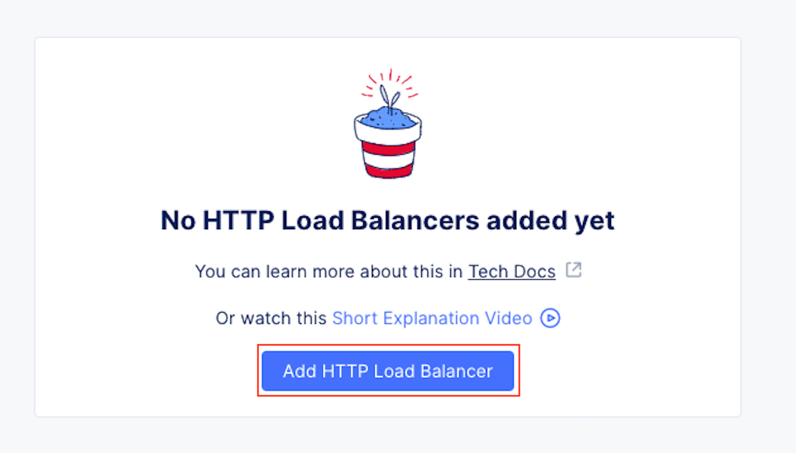
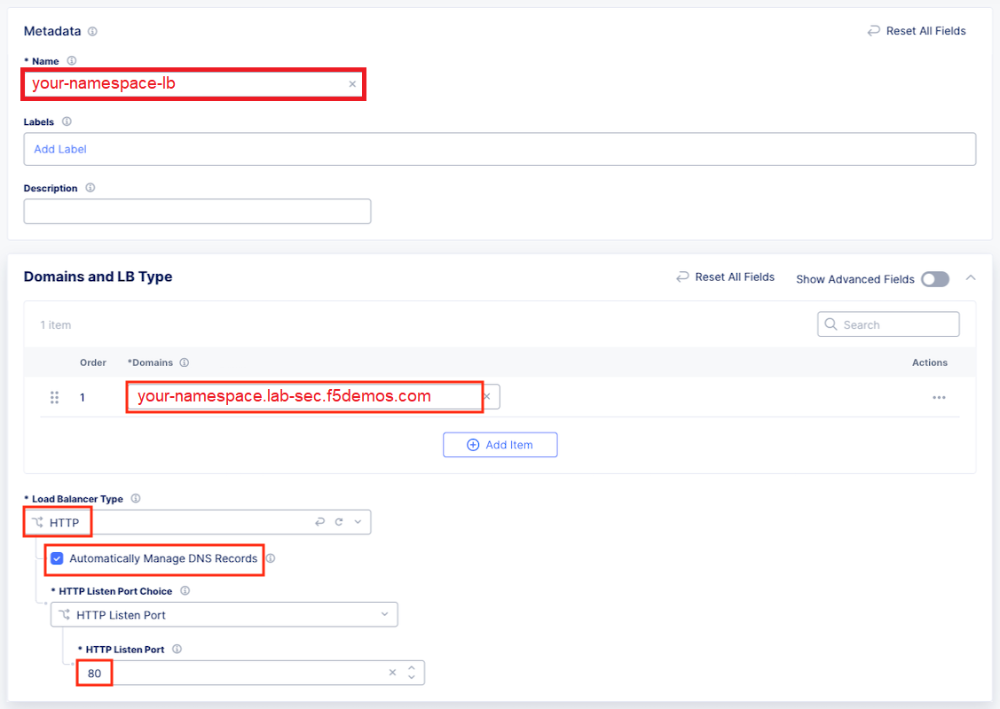
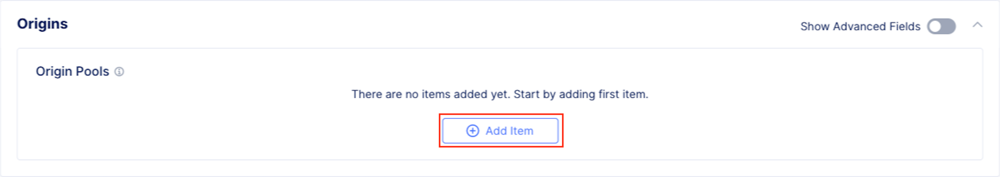
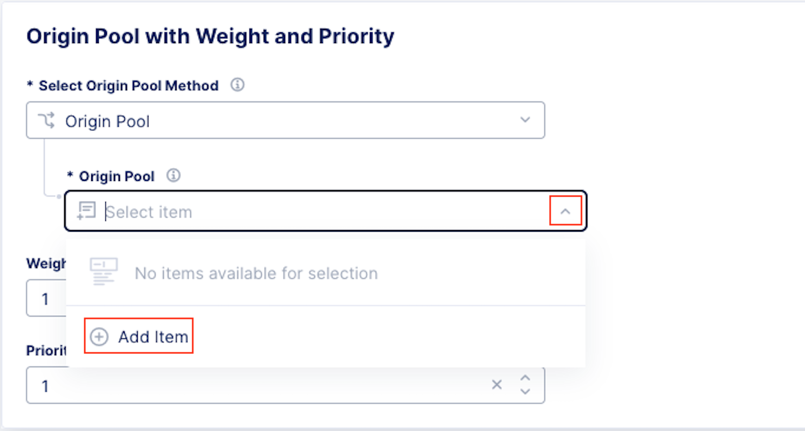
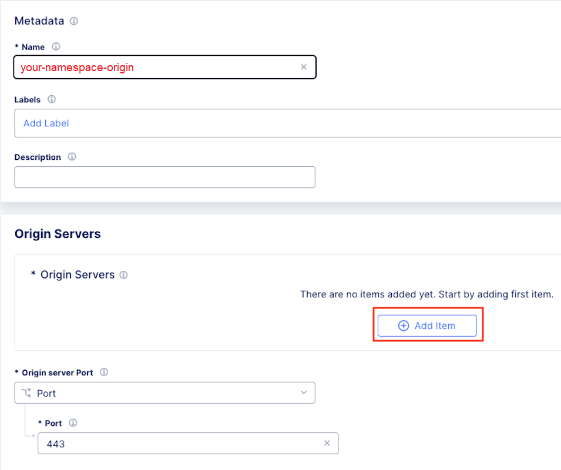
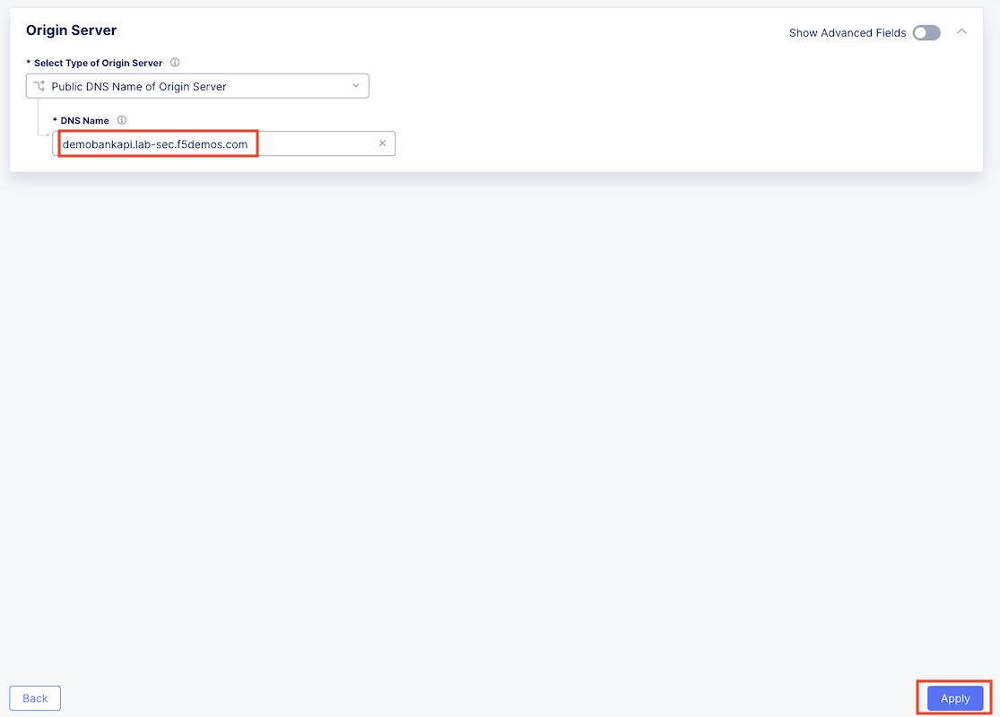
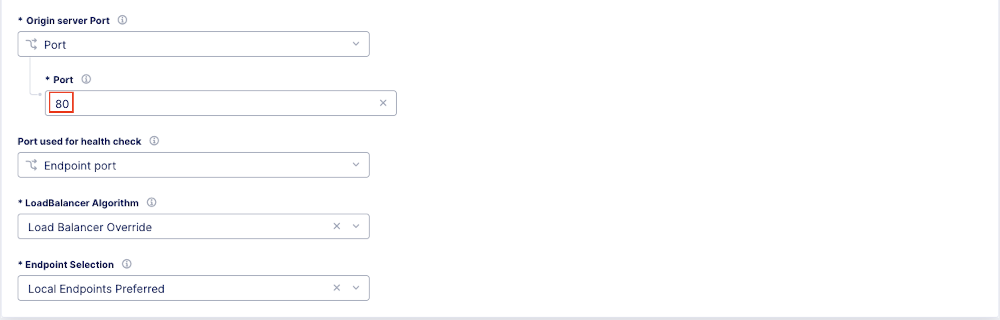
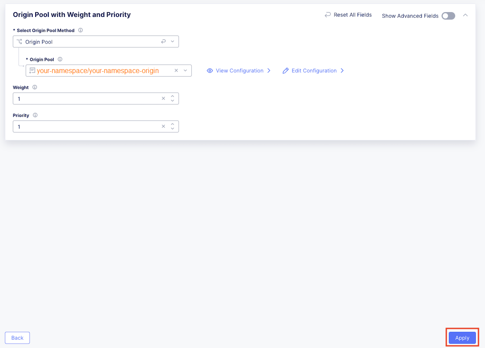
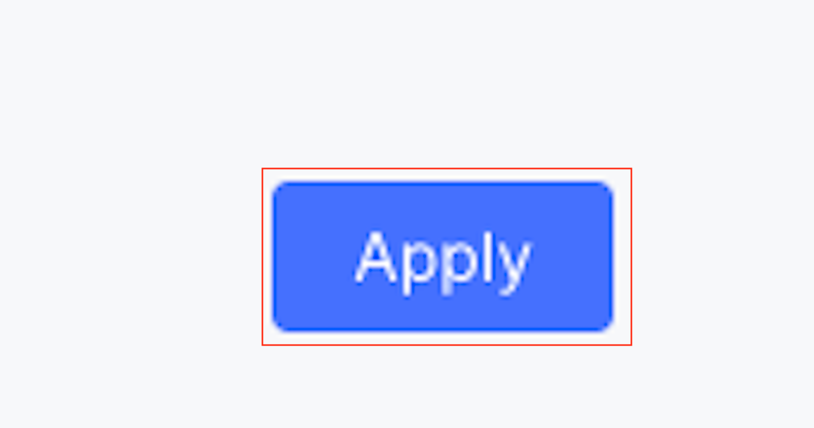
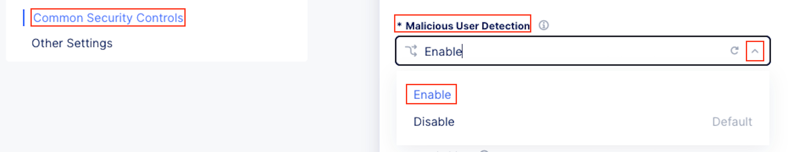

Lab 1: API Discovery
=========================================================================================

.. warning :: If you are using multiple labs in one course, understand that some steps below
   may be redundant depending on labs deployed. To gain full benefits from this lab, please 
   delete any objects created in your prior lab and continue with this lab as all necessary
   objects will be recreated. 

Lab 1 will focus on the deployment and security of an existing hosted application using F5 
Distributed Cloud Platform and Services. This lab will be deployed in a SaaS only configuration 
with no on-premises (public or private cloud) elements.  All configurations will be made via 
the F5 Distributed Cloud Console and within the F5 Distributed Cloud Global Network services architecture.

For the tasks that follow, you should have already noted your individual **namespace**. If you 
failed to note it, return to the **Introduction** section of this lab, follow the instructions
provided and note your **namespace** accordingly. The **Delegated Domain** and the F5 Distributed Cloud 
**Tenant** are listed below for your convenience as they will be the same for all lab attendees.

* **Delegated Domain:** *.lab-sec.f5demos.com* 
* **F5 Distributed Cloud Tenant:** https://f5-xc-lab-sec.console.ves.volterra.io 

Following the tasks in the prior **Introduction** Section, you should now be able to access the
F5 Distributed Cloud Console, having set your Work Domain Roles and Skill levels. If you have not
done so already, please login to your tenant for this lab and proceed to Task 1.

**Expected Lab Time: 25 minutes**

Task 1: Configure Load Balancer and Origin Pool
~~~~~~~~~~~~~~~~~~~~~~~~~~~~~~~~~~~~~~~~~~~~~~~

The following steps will allow you to deploy and advertise a globally available application.  These
steps will define an application, register its DNS and assign a target as an origin.

+----------------------------------------------------------------------------------------------+
| 1. Following the **Introduction** section instructions, you should now be in the **Web**     |
|                                                                                              |
|    **App & API Protection** configuration window.                                            |
|                                                                                              |
| .. note::                                                                                    |
|    If for some reason you are not in the                                                     |
|                                                                                              |
|    **Web App & API Protection** window, use the **Select Service** in the left-hand          |
|                                                                                              |
|    navigation, and click **Web App & API Protection** as shown in the *Introduction Section* |
|                                                                                              |
| 2. In the left-hand navigation expand **Manage** and click **Load Balancers > HTTP Load**    |
|                                                                                              |
|    **Balancers**                                                                             |
|                                                                                              |
| 3. In the resulting screen click the **Add HTTP Load Balancer** in the graphic as shown.     |
+----------------------------------------------------------------------------------------------+
| |lab1-task1-001|                                                                             |
|                                                                                              |
| |lab1-task1-002|                                                                             |
+----------------------------------------------------------------------------------------------+

.. note::
   *You have defaulted to your specific namespace as that is the only namespace to which you*
   *have administrative access.*

+----------------------------------------------------------------------------------------------+
| 4. Using the left-hand navigation and in the sections as shown, enter the following          |
|                                                                                              |
|    data. Values where **<namespace>** is required, use the name of your given namespace.     |
|                                                                                              |
|    * **Metadata:Name ID:**  *<namespace>-lb*                                                 |
|    * **Basic Configuration: List of Domains:** *<namespace>.lab-sec.f5demos.com*             |
|    * **Basic Configuration: Select Type of Load Balancer:** *HTTP*                           |
|    * **Basic Configuration: Automatically Manage DNS Records:** *(Check the checkbox)*       |
|    * **Basic Configuration: HTTP Port:** *80*                                                |
+----------------------------------------------------------------------------------------------+
| |lab1-task1-003|                                                                             |
+----------------------------------------------------------------------------------------------+

+----------------------------------------------------------------------------------------------+
| 5. In the current window's left-hand navigation, click **Origins**. In the adjacent          |
|                                                                                              |
|    **Origins** section, under **Origin Pools**, click **Add Item**.                          |
+----------------------------------------------------------------------------------------------+
| |lab1-task1-004|                                                                             |
+----------------------------------------------------------------------------------------------+

+----------------------------------------------------------------------------------------------+
| 6. In the resulting window, use the drop down as shown and click **Add Item**.               |
+----------------------------------------------------------------------------------------------+
| |lab1-task1-005|                                                                             |
+----------------------------------------------------------------------------------------------+

+----------------------------------------------------------------------------------------------+
| 7. In the resulting window, enter **<namespace>-pool** in the **Name** field and click       |
|                                                                                              |
|    **Add Item** under **Origin Servers** as shown.                                           |
+----------------------------------------------------------------------------------------------+
| |lab1-task1-006|                                                                             |
+----------------------------------------------------------------------------------------------+

+----------------------------------------------------------------------------------------------+
| 8. In the resulting window, **Public DNS Name of Origin Server** should be selected for      |
|                                                                                              |
|    **Select Type of Origin Server**.                                                         |
|                                                                                              |
| 9. In the **DNS Name** field enter the following hostname:                                   |
|                                                                                              |
|    **petapi.cloud.myf5demo.com** and then click **Apply**                                    |
+----------------------------------------------------------------------------------------------+
| |lab1-task1-007|                                                                             |
+----------------------------------------------------------------------------------------------+

+----------------------------------------------------------------------------------------------+
| 10. After returning to the prior window, make sure **Port:** within the **Origin Servers**   |
|                                                                                              |
|     section, under **Origin Server Port** is configured for **80**.                          |
|                                                                                              |
| 11. Leave all other values as shown while scrolling to the bottom and click, **Continue**.   |
|                                                                                              |
| 12. After returning to the next window and confirming the content, click **Apply**.          |
+----------------------------------------------------------------------------------------------+
| |lab1-task1-008|                                                                             |
|                                                                                              |
| |lab1-task1-009|                                                                             |
|                                                                                              |
| |lab1-task1-010|                                                                             |
+----------------------------------------------------------------------------------------------+

+----------------------------------------------------------------------------------------------+
| 13. After returning to the HTTP Load Balancer window, select **Other Settings** on the left  |
|                                                                                              |
|     then click on **Save and Exit** at the bottom right of window.                           |
+----------------------------------------------------------------------------------------------+
| |lab1-task1-011|                                                                             |
+----------------------------------------------------------------------------------------------+

+----------------------------------------------------------------------------------------------+
| 14. Using another browser tab, navigate to the the following URL to confirm the Load Balancer|
|                                                                                              |
|     has been configured properly.                                                            |
|                                                                                              |
|     **http://<namespace>.lab-sec.f5demos.com/api/CatLookup/GetAllCats**                      |
|                                                                                              |
| .. note::                                                                                    |
|    If dogs are more your style, **/DogLookup/GetAllDogs** is also available.                 |
+----------------------------------------------------------------------------------------------+
| |lab1-task1-012|                                                                             |
+----------------------------------------------------------------------------------------------+

Task 2: Swagger File Import & Version Control
~~~~~~~~~~~~~~~~~~~~~~~~~~~~~~~~~~~~~~~~~~~~~~~~~

In this task's series of steps you will import swagger files into the F5 Distributed Cloud tenant and explore 
version control features.

+----------------------------------------------------------------------------------------------+
| 1. For the next series of steps, to download the JSON/OpenAPI spec file **app-api-v1.json**  |
|                                                                                              |
|    **app-api-v1.json** to your local desktop or workspace.                                   |
|                                                                                              |
|    Link::                                                                                    |
|      http://petapi.cloud.myf5demo.com/lab/app-api-v1.json                                    |
+----------------------------------------------------------------------------------------------+

+----------------------------------------------------------------------------------------------+
| 2. In the left top click the F5 ball and navigate to the **Web App & API Protection** Tile.  |
+----------------------------------------------------------------------------------------------+
| |lab1-task2-001|                                                                             |
+----------------------------------------------------------------------------------------------+

+----------------------------------------------------------------------------------------------+
| 3. In the left-hand navigation, click on **Files** under the **Manage** section.             |
|                                                                                              |
| 4. Click **Add Swagger File** in the main window area as shown. Alternatively, the link near |
|                                                                                              |
|    the top of the window can also be used.                                                   |
+----------------------------------------------------------------------------------------------+
| |lab1-task2-002|                                                                             |
+----------------------------------------------------------------------------------------------+

+----------------------------------------------------------------------------------------------+
| 5. In the resulting **New Swagger File** window, input **app-api** for the **Name** under    |
|                                                                                              |
|    the **Metadata** section.                                                                 |
|                                                                                              |
| 6. In the **Upload Swagger File** section, click the **Upload File** button. Select the file |
|                                                                                              |
|    downloaded in Step 1 above and click **Open**.                                            |
+----------------------------------------------------------------------------------------------+
| |lab1-task2-003|                                                                             |
+----------------------------------------------------------------------------------------------+

+----------------------------------------------------------------------------------------------+
| 7. Observe that the file **app-api-v1**  is present and the click **Save and Exit**          |
+----------------------------------------------------------------------------------------------+
| |lab1-task2-004|                                                                             |
+----------------------------------------------------------------------------------------------+

+----------------------------------------------------------------------------------------------+
| 8. In the resulting **Swagger Files** window, you will see the upload file with additional   |
|                                                                                              |
|    metadata.                                                                                 |
|                                                                                              |
| .. note::                                                                                    |
|    *You will also see a dialogue box, in the bottom left of your screen indicating the file* |
|                                                                                              |
|    *has been successfully added.*                                                            |
+----------------------------------------------------------------------------------------------+
| |lab1-task2-005|                                                                             |
+----------------------------------------------------------------------------------------------+

+----------------------------------------------------------------------------------------------+
| 9. For the next step, use the following link, to download the JSON/OpenAPI spec file         |
|                                                                                              |
|    **app-api-v2.json** to your local desktop or workspace.                                   |
|                                                                                              |
|    Link::                                                                                    |
|      http://petapi.cloud.myf5demo.com/lab/app-api-v2.json                                    |
|                                                                                              |
| .. note::                                                                                    |
|    *This is a modified version (v2) of the JSON/OpenAPI spec file you previously downloaded* |
+----------------------------------------------------------------------------------------------+

+----------------------------------------------------------------------------------------------+
| 10. Returning to the **Swagger Files** window you were at previously, click the three dots … |
|                                                                                              |
|     in the **Action** column.  In the resulting selection menu, select **Update New Version**|
+----------------------------------------------------------------------------------------------+
| |lab1-task2-006|                                                                             |
+----------------------------------------------------------------------------------------------+

+----------------------------------------------------------------------------------------------+
| 11. In the **Upload Swagger File** section, click the **Upload File** button. Select the file|
|                                                                                              |
|     downloaded in Step 9 above and click **Open**.                                           |
|                                                                                              |
| 12. Observe that the file **app-api-v2**  is present and the click **Save and Exit**         |
+----------------------------------------------------------------------------------------------+
| |lab1-task2-007|                                                                             |
|                                                                                              |
| |lab1-task2-008|                                                                             |
+----------------------------------------------------------------------------------------------+

+----------------------------------------------------------------------------------------------+
| 13. In the resulting **Swagger Files** window, you will see the upload file with additional  |
|                                                                                              |
|     metadata seen previously.                                                                |
|                                                                                              |
| 14. Note now that there are **2** versions available of the **app-api** file.                |
|                                                                                              |
|     Click the **2** in the **Versions** column.                                              |
+----------------------------------------------------------------------------------------------+
| |lab1-task2-009|                                                                             |
+----------------------------------------------------------------------------------------------+

+----------------------------------------------------------------------------------------------+
| 15. In the resulting window, observe there are now two versions of the **app-api**           |
|                                                                                              |
|     spec file.                                                                               |
|                                                                                              |
| .. note::                                                                                    |
|    *This is an API File update process which can also be performed through the F5*           |
|                                                                                              |
|    *Distributed Cloud API framework.*                                                        |
|                                                                                              |
| 16. Click **X** in the top-right corner and proceed to the next task.                        |
+----------------------------------------------------------------------------------------------+
| |lab1-task2-010|                                                                             |
+----------------------------------------------------------------------------------------------+

Task 3: Swagger Definition
~~~~~~~~~~~~~~~~~~~~~~~~~~

In this task's series of steps you will establish the Swagger Definition which serves as an object

pointer to imported swagger files you just uploaded.

+----------------------------------------------------------------------------------------------+
| 1. In the left-hand navigation of the **Web App & API Protection** service, click on **API** |
|                                                                                              |
|    **Management** under the **Manage** section and then click **API Definition**.            |
+----------------------------------------------------------------------------------------------+
| |lab1-task3-001|                                                                             |
+----------------------------------------------------------------------------------------------+

+----------------------------------------------------------------------------------------------+
| 2. In the resulting **API Definition** window, click **Add API Definition** in the main      |
|                                                                                              |
|    window area as shown.                                                                     |
+----------------------------------------------------------------------------------------------+
| |lab1-task3-002|                                                                             |
+----------------------------------------------------------------------------------------------+

+----------------------------------------------------------------------------------------------+
| 3. In the resulting **New API Definition** window, input **app-api-spec**                    |
|                                                                                              |
|    for the **Name** under the **Metadata** section.                                          |
|                                                                                              |
| 4. In the **Swagger Specs** section, click **Add Item** box in the                           |
|                                                                                              |
|    **Swagger Specs** column.                                                                 |
|                                                                                              |
| 5. Select the version 2 of the previously uploaded swagger spec file. It will be in the      |
|                                                                                              |
|    format **<namespace>/app-api/v2-<current-date>**.                                         |
|                                                                                              |
| 6. Once selected, click **Save and Exit** in the bottom-right corner.                        |
+----------------------------------------------------------------------------------------------+
| |lab1-task3-003|                                                                             |
+----------------------------------------------------------------------------------------------+

Task 4: Enabling API Inventory and Discovery
~~~~~~~~~~~~~~~~~~~~~~~~~~

In this task's series of steps you will enable the API Inventory and Discovery feature on the 
previously built Load Balancer object delivering the targeted application/API.

+----------------------------------------------------------------------------------------------+
| 1. In the left-hand navigation of the **Web App & API Protection** service, click on **Load**|
|                                                                                              |
|    **Balancers** under the **Manage** section.                                               |
|                                                                                              |
| 2. In the resulting **Load Balancers** window, click on the three dots **...** in the        |
|                                                                                              |
|    **Action** column, and the select **Manage Configuration**.                               |
+----------------------------------------------------------------------------------------------+
| |lab1-task4-002|                                                                             |
+----------------------------------------------------------------------------------------------+

+----------------------------------------------------------------------------------------------+
| 3. Click **Edit Configuration** in the top-right corner.                                     |
+----------------------------------------------------------------------------------------------+
| |lab1-task4-003|                                                                             |
+----------------------------------------------------------------------------------------------+

+----------------------------------------------------------------------------------------------+
| 4. Click **API Protection** in the left-hand navigation.                                     |
|                                                                                              |
| 5. In the **API Protection** section, click the drop-down arrow next to **API Definition**   |
|                                                                                              |
|    and select **Enable**.                                                                    |
+----------------------------------------------------------------------------------------------+
| |lab1-task4-004|                                                                             |
+----------------------------------------------------------------------------------------------+

+----------------------------------------------------------------------------------------------+
| 6. In the updated **Use API Definition** section, click the drop-down arrow and select the   |
|                                                                                              |
| 7. previously created API Definition **<namespace>/app-api-spec**.                           |
+----------------------------------------------------------------------------------------------+
| |lab1-task4-005|                                                                             |
+----------------------------------------------------------------------------------------------+

+----------------------------------------------------------------------------------------------+
| 8. In the **API Protection** section, click the drop-down arrow next to **API Discovery**    |
|                                                                                              |
|    and select **Enable**.                                                                    |
+----------------------------------------------------------------------------------------------+
| |lab1-task4-006|                                                                             |
+----------------------------------------------------------------------------------------------+

+----------------------------------------------------------------------------------------------+
| 9. In the updated **API Discovery** section, click the drop-down arrow next to **Learn**     |
|                                                                                              |
|    **from Traffic with Redirect Response** and then select **Enable Learning from Redirect** |
|                                                                                              |
|    *Traffic**.                                                                               |
|                                                                                              |
| .. note::                                                                                    |
|    *API Discovery will be explored within a demo following this lab*                         |
+----------------------------------------------------------------------------------------------+
| |lab1-task4-007|                                                                             |
+----------------------------------------------------------------------------------------------+

+----------------------------------------------------------------------------------------------+
| 10. Select **Other Settings** on the left then click on **Save and Exit**                    |
|                                                                                              |
|     at the bottom right of window.                                                           |
+----------------------------------------------------------------------------------------------+
| |lab1-task4-008|                                                                             |
+----------------------------------------------------------------------------------------------+

+----------------------------------------------------------------------------------------------+
| **End of Lab 1:**  This concludes Lab 1, feel free to review and test the configuration.     |
|                                                                                              |
| A brief presentation and demo will be shared prior to the beginning of Lab 2.                |
+----------------------------------------------------------------------------------------------+
| |labend|                                                                                     |
+----------------------------------------------------------------------------------------------+

.. |lab1-task1-001| image:: _static/lab1-task1-001.png
   :width: 800px

.. |lab1-task1-012| image:: _static/lab1-task1-012.png
   :width: 800px
.. |lab1-task2-001| image:: _static/lab1-task2-001.png
   :width: 800px
.. |lab1-task2-002| image:: _static/lab1-task2-002.png
   :width: 800px
.. |lab1-task2-003| image:: _static/lab1-task2-003.png
   :width: 800px
.. |lab1-task2-004| image:: _static/lab1-task2-004.png
   :width: 800px
.. |lab1-task2-005| image:: _static/lab1-task2-005.png
   :width: 800px
.. |lab1-task2-006| image:: _static/lab1-task2-006.png
   :width: 800px
.. |lab1-task2-007| image:: _static/lab1-task2-007.png
   :width: 800px
.. |lab1-task2-008| image:: _static/lab1-task2-008.png
   :width: 800px
.. |lab1-task2-009| image:: _static/lab1-task2-009.png
   :width: 800px
.. |lab1-task2-010| image:: _static/lab1-task2-010.png
   :width: 800px
.. |lab1-task3-001| image:: _static/lab1-task3-001.png
   :width: 800px
.. |lab1-task3-002| image:: _static/lab1-task3-002.png
   :width: 800px
.. |lab1-task3-003| image:: _static/lab1-task3-003.png
   :width: 800px
.. |lab1-task4-001| image:: _static/lab1-task4-001.png
   :width: 800px
.. |lab1-task4-002| image:: _static/lab1-task4-002.png
   :width: 800px
.. |lab1-task4-003| image:: _static/lab1-task4-003.png
   :width: 800px
.. |lab1-task4-004| image:: _static/lab1-task4-004.png
   :width: 800px
.. |lab1-task4-005| image:: _static/lab1-task4-005.png
   :width: 800px
.. |lab1-task4-006| image:: _static/lab1-task4-006.png
   :width: 800px
.. |lab1-task4-007| image:: _static/lab1-task4-007.png
   :width: 800px
.. |lab1-task4-008| image:: _static/lab1-task4-008.png
   :width: 800px
.. |labend| image:: _static/labend.png
   :width: 800px
