Lab 2: API Protection & Rate Limiting
=================================

F5® Distributed Cloud API Protection provides key security functionality to secure APIs.

This lab's tasks will walk through the configuration steps and note additional configurations available.

Task 1: Attaching API Protection to Load Balancer Object 
~~~~~~~~~~~~~~~~~~~~~~~~~~~~~~~~~~~~~~~~~~~~~~~~~~~~~~~~~~~~~~~~~~~~

In this task's series of steps you will enable the API Discovery & Protection feature on the 
previously built Load Balancer object delivering the targeted application/API.

+----------------------------------------------------------------------------------------------+
| 1. In the left-hand navigation of the **Web App & API Protection** service, click on **Load**|
|                                                                                              |
|    **Balancers** under the **Manage** section.                                               |
+----------------------------------------------------------------------------------------------+
| |lab2-task1-001|                                                                             |
+----------------------------------------------------------------------------------------------+

+----------------------------------------------------------------------------------------------+
| 2. In the resulting **Load Balancers** window, click on the three dots **...** in the        |
|                                                                                              |
|    **Action** column, and the select **Manage Configuration**.                               |
+----------------------------------------------------------------------------------------------+
| |lab2-task1-002|                                                                             |
+----------------------------------------------------------------------------------------------+

+----------------------------------------------------------------------------------------------+
| 3. Click **Edit Configuration** in the top-right corner.                                     |
+----------------------------------------------------------------------------------------------+
| |lab2-task1-003|                                                                             |
+----------------------------------------------------------------------------------------------+

+----------------------------------------------------------------------------------------------+
| 4. In the **API Protection Rules** section, click the **Configure** link.                    |
+----------------------------------------------------------------------------------------------+
| |lab2-task1-004|                                                                             |
+----------------------------------------------------------------------------------------------+

+----------------------------------------------------------------------------------------------+
| 5. In the resulting **API Protection Rules** window, click **Configure** in the              |
|                                                                                              |
|    **API Endpoints** section.                                                                |
+----------------------------------------------------------------------------------------------+
| |lab2-task1-005|                                                                             |
+----------------------------------------------------------------------------------------------+

+----------------------------------------------------------------------------------------------+
| 6. Click **Add Item** in the **API Endpoints** window.                                       |
+----------------------------------------------------------------------------------------------+
| |lab2-task1-006|                                                                             |
+----------------------------------------------------------------------------------------------+

+----------------------------------------------------------------------------------------------+
| 7. In the resulting window, input **block-endpoint** in the **Name** field of the            |
|                                                                                              |
|    **Metadata** section.                                                                     |
|                                                                                              |
| 8. In the **Action** area, click the drop-down arrow indicated and select **Deny**.          |
+----------------------------------------------------------------------------------------------+
| |lab2-task1-007|                                                                             |
+----------------------------------------------------------------------------------------------+

+----------------------------------------------------------------------------------------------+
| 9. In the **API Endpoint** section, click on the **API Endpoint** input field as indicated.  |
|                                                                                              |
| 10. Select the **See Suggestions** link.                                                     |
+----------------------------------------------------------------------------------------------+
| |lab2-task1-008|                                                                             |
+----------------------------------------------------------------------------------------------+

+----------------------------------------------------------------------------------------------+
| 11. Select **/api/CatLookup/GetAllCats** from the available options provided.                |
|                                                                                              |
| .. note::                                                                                    |
|    *The available endpoints are provided by the swagger previously imported,                 |
|    or identified by API Discovery*                                                           |
|                                                                                              |
| 12. In the **HTTP Methods** area, click in the **Method List** input field.                  |
+----------------------------------------------------------------------------------------------+
| |lab2-task1-009|                                                                             |
+----------------------------------------------------------------------------------------------+

+----------------------------------------------------------------------------------------------+
| 13. Select **Any** from the available methods provided.                                      |
|                                                                                              |
| .. note::                                                                                    |
|    *Multiple methods can be selected if needed*                                              |
+----------------------------------------------------------------------------------------------+
| |lab2-task1-010|                                                                             |
+----------------------------------------------------------------------------------------------+

+----------------------------------------------------------------------------------------------+
| 14. Review the configuration and click, the **Apply** button.                                |
+----------------------------------------------------------------------------------------------+
| |lab2-task1-011|                                                                             |
+----------------------------------------------------------------------------------------------+

+----------------------------------------------------------------------------------------------+
| 15. Review the API Endpoint deny rule and click, the **Apply** button.                       |
+----------------------------------------------------------------------------------------------+
| |lab2-task1-012|                                                                             |
+----------------------------------------------------------------------------------------------+

+----------------------------------------------------------------------------------------------+
| 16. Note that API Protection Rules are configure for the API Endpoints and click, the        |
|                                                                                              |
|     **Apply** button.                                                                        |
+----------------------------------------------------------------------------------------------+
| |lab2-task1-013|                                                                             |
+----------------------------------------------------------------------------------------------+

+----------------------------------------------------------------------------------------------+
| 17. Select **Other Settings** on the left then click on **Save and Exit**                    |
|                                                                                              |
|     at the bottom right of window.                                                           |
+----------------------------------------------------------------------------------------------+
| |lab2-task2-009|                                                                             |
+----------------------------------------------------------------------------------------------+

+----------------------------------------------------------------------------------------------+
| 18. Using another browser tab, navigate to the the following URL to confirm                  |
|                                                                                              |
|     access is denied.                                                                        |
|                                                                                              |
|     **http://<namespace>.lab-sec.f5demos.com/api/CatLookup/GetAllCats**                      |
+----------------------------------------------------------------------------------------------+

Task 2: Attach API Rate Limiting to Load Balancer Object 
~~~~~~~~~~~~~~~~~~~~~~~~~~~~~~~~~~~~~~~~~~~~~~~~~~~~~~~~~~~~~~~~~~~~

In this task's series of steps you will enable the API Rate Limiting feature on the 
previously built Load Balancer object delivering the targeted application/API.

+----------------------------------------------------------------------------------------------+
| 1. In the left-hand navigation of the **Web App & API Protection** service, click on **Load**|
|                                                                                              |
|    **Balancers** under the **Manage** section.                                               |
+----------------------------------------------------------------------------------------------+
| |lab2-task1-001|                                                                             |
+----------------------------------------------------------------------------------------------+

+----------------------------------------------------------------------------------------------+
| 2. In the resulting **Load Balancers** window, click on the three dots **...** in the        |
|                                                                                              |
|    **Action** column, and the select **Manage Configuration**.                               |
+----------------------------------------------------------------------------------------------+
| |lab2-task1-002|                                                                             |
+----------------------------------------------------------------------------------------------+

+----------------------------------------------------------------------------------------------+
| 3. Click **Edit Configuration** in the top-right corner.                                     |
+----------------------------------------------------------------------------------------------+
| |lab2-task1-003|                                                                             |
+----------------------------------------------------------------------------------------------+

+----------------------------------------------------------------------------------------------+
| 4. Using the left-hand navigation, click the **Common Security Controls** link.              |
+----------------------------------------------------------------------------------------------+
| |lab2-task2-001|                                                                             |
+----------------------------------------------------------------------------------------------+

+----------------------------------------------------------------------------------------------+
| 5. Locate the **Rate Limiting** area of the **Common Security Controls** and use the         |
|                                                                                              |
|    drop-down to select **API Rate Limit**.                                                   |
+----------------------------------------------------------------------------------------------+
| |lab2-task2-003|                                                                             |
+----------------------------------------------------------------------------------------------+

+----------------------------------------------------------------------------------------------+
| 6. In the expanded menu under **Rate Limiting**, click **Configure** in the **API**          |
|                                                                                              |
|    **Endpoints** area.                                                                       |
+----------------------------------------------------------------------------------------------+
| |lab2-task2-004|                                                                             |
+----------------------------------------------------------------------------------------------+

+----------------------------------------------------------------------------------------------+
| 7. In the resulting window **API Endpoints** window, click **Add Item**.                     |
+----------------------------------------------------------------------------------------------+
| |lab2-task2-005|                                                                             |
+----------------------------------------------------------------------------------------------+

+----------------------------------------------------------------------------------------------+
| 8. In the resulting configuration window, select **/api/DogLookup/GetAllDogs** for **API**   |
|                                                                                              |
|    **Endpoint** input.                                                                       |
|                                                                                              |
| 9. Select **ANY** for **Method** input and then click the **Apply** button.                  |
+----------------------------------------------------------------------------------------------+
| |lab2-task2-006|                                                                             |
+----------------------------------------------------------------------------------------------+

+----------------------------------------------------------------------------------------------+
| 10. Review the API Endpoint rate limiting rule and click, the **Apply** button.              |
+----------------------------------------------------------------------------------------------+
| |lab2-task2-007|                                                                             |
+----------------------------------------------------------------------------------------------+

+----------------------------------------------------------------------------------------------+
| 11. Note the updated configuration for API Rate limiting, Click **Other Settings** on the    |
|                                                                                              |
|     the left, navigation on the bottom right then click on **Save and Exit**                 |
+----------------------------------------------------------------------------------------------+
| |lab2-task2-008|                                                                             |
+----------------------------------------------------------------------------------------------+
| |lab2-task2-009|                                                                             |
+----------------------------------------------------------------------------------------------+

+----------------------------------------------------------------------------------------------+
| 12. Using another browser tab, navigate to the the following URL to confirm                  |
|                                                                                              |
|     rate limiting, by freshing your tab several times.                                       |
|                                                                                              |
|     **http://<namespace>.lab-sec.f5demos.com/api/DogLookup/GetAllDogs**                      |
+----------------------------------------------------------------------------------------------+

+----------------------------------------------------------------------------------------------+
| This configuration highlights the elements needed to deploy API Discovery & Protection. This |
|                                                                                              |
| configuration can also be fully deployed and managed via the F5 Distributed Cloud API.       |
+----------------------------------------------------------------------------------------------+

+----------------------------------------------------------------------------------------------+
| **End of Lab 2:**  This concludes Lab 2.                                                     |
|                                                                                              |
| A Q&A session will begin shortly after conclusion of the overall lab.                        |
+----------------------------------------------------------------------------------------------+
| |labend|                                                                                     |
+----------------------------------------------------------------------------------------------+

.. |lab2-task1-001| image:: _static/lab2-task1-001.png
   :width: 800px
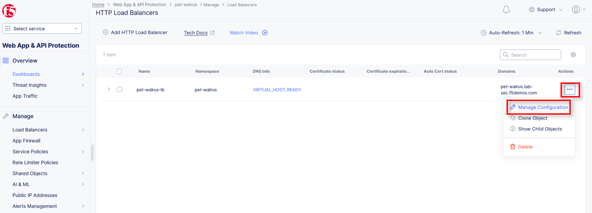
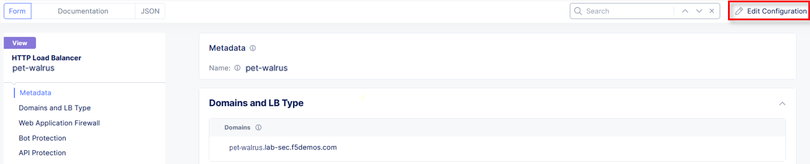
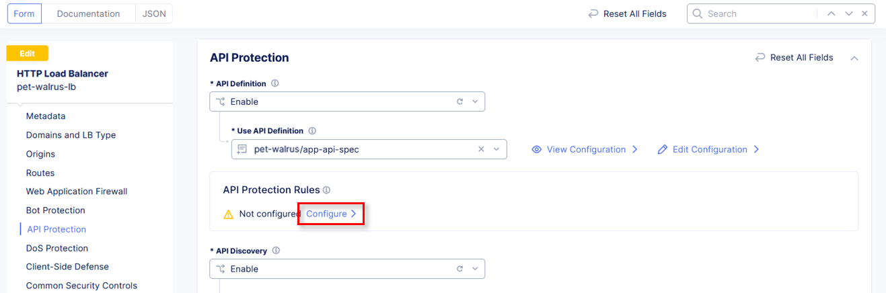
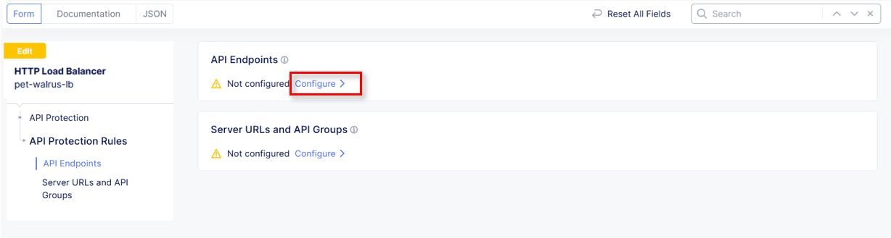
.. |lab2-task1-006| image:: _static/lab2-task1-006.png
   :width: 800px
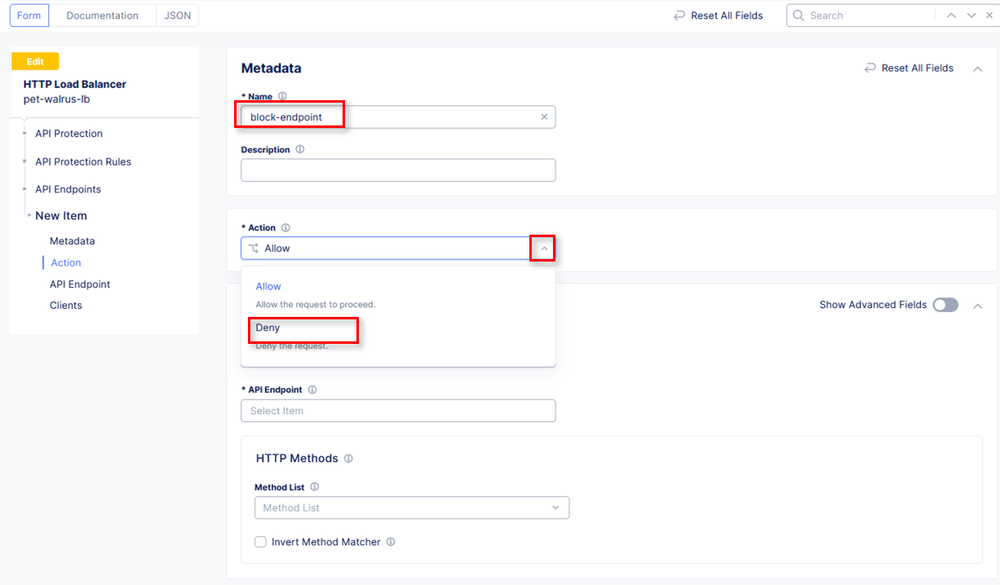
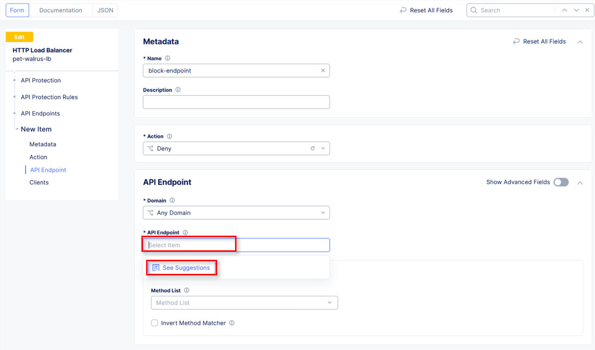
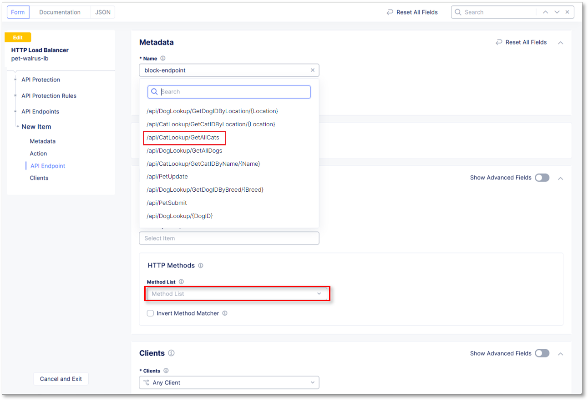
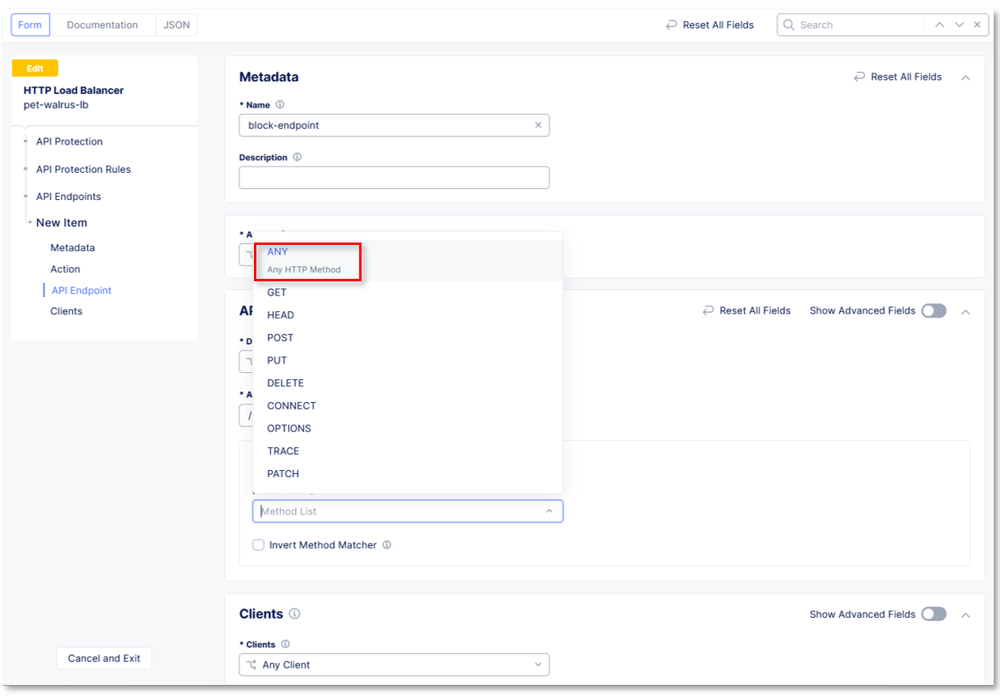
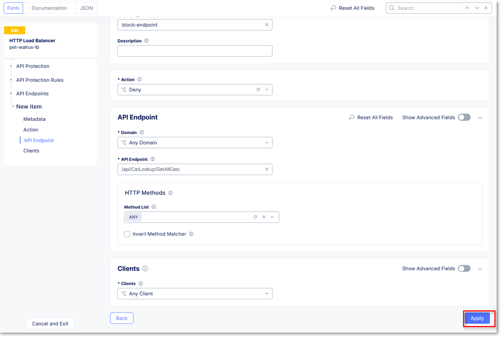
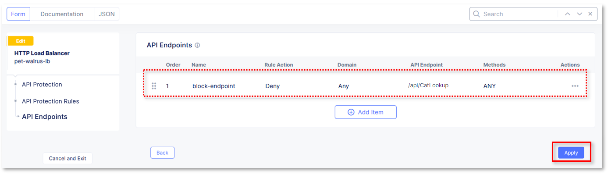
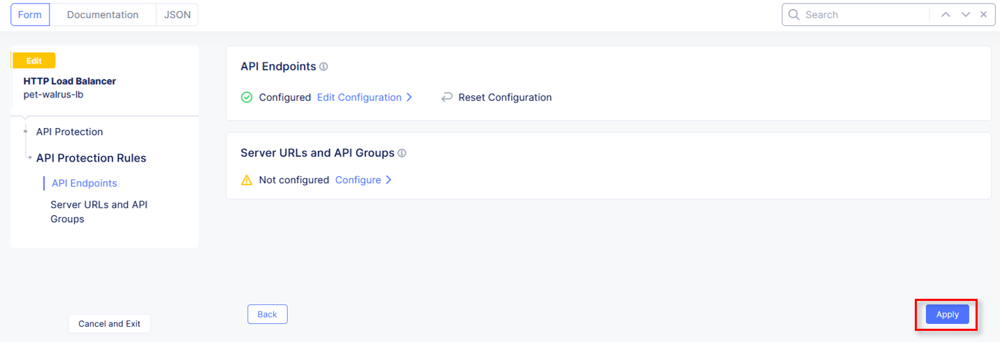
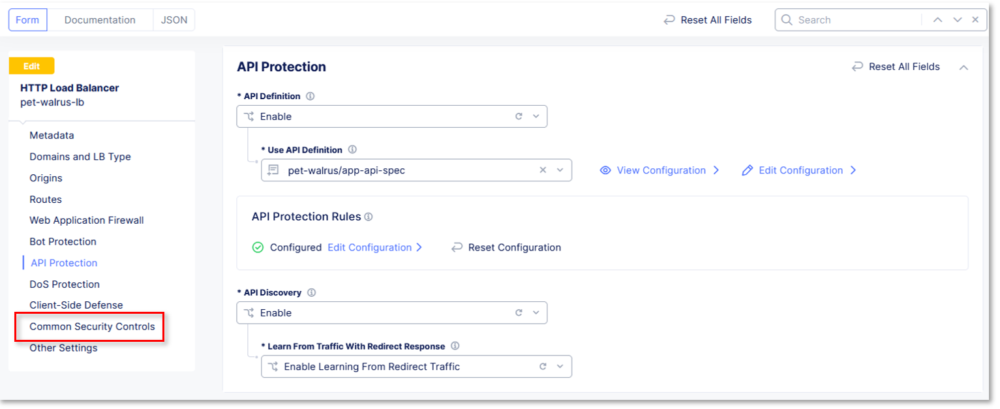
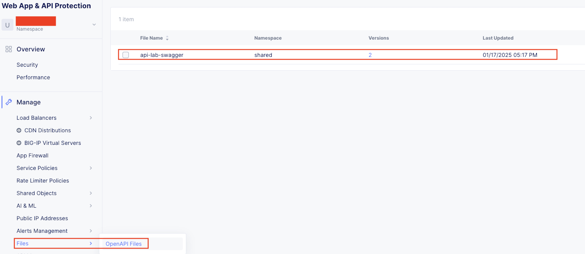
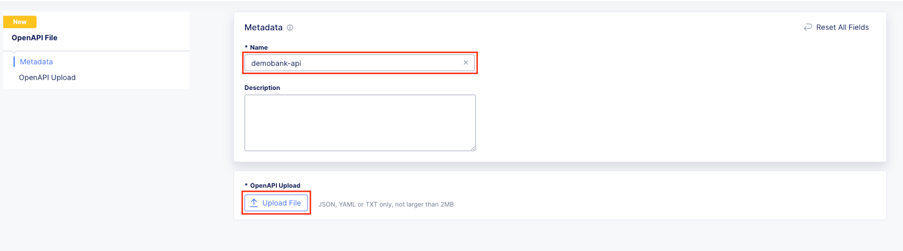
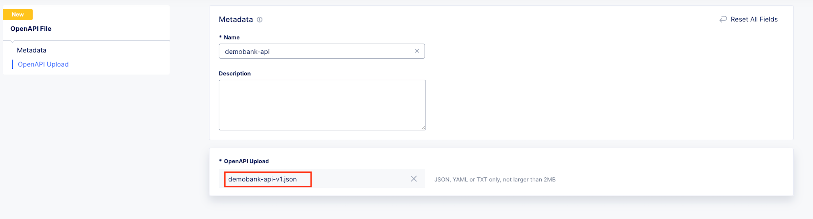
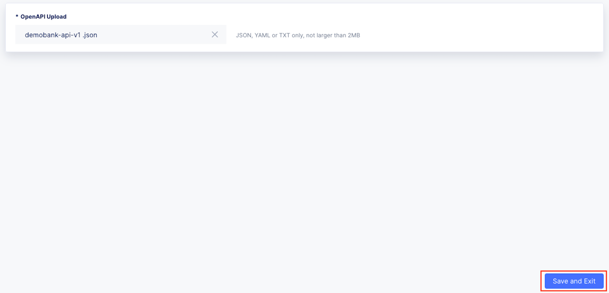
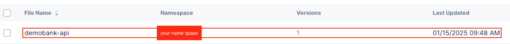
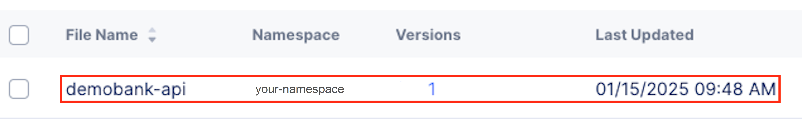
.. |lab2-task2-008| image:: _static/lab2-task2-008.png
   :width: 800px
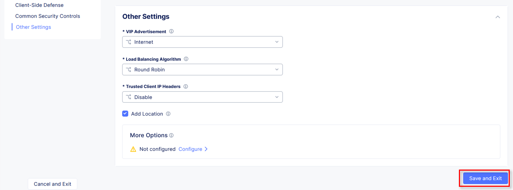
.. |labend| image:: _static/labend.png
   :width: 800px
