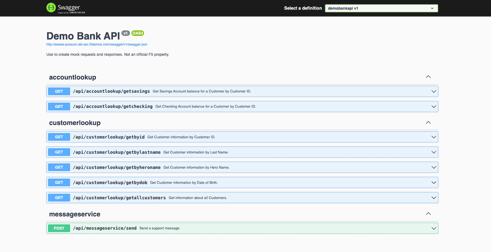
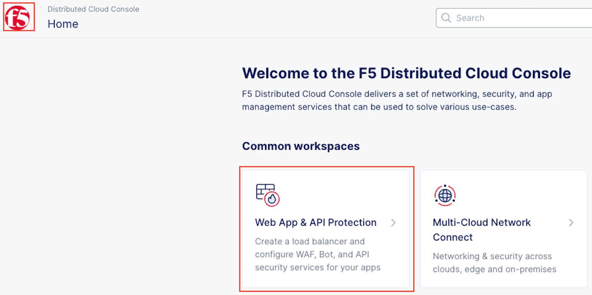
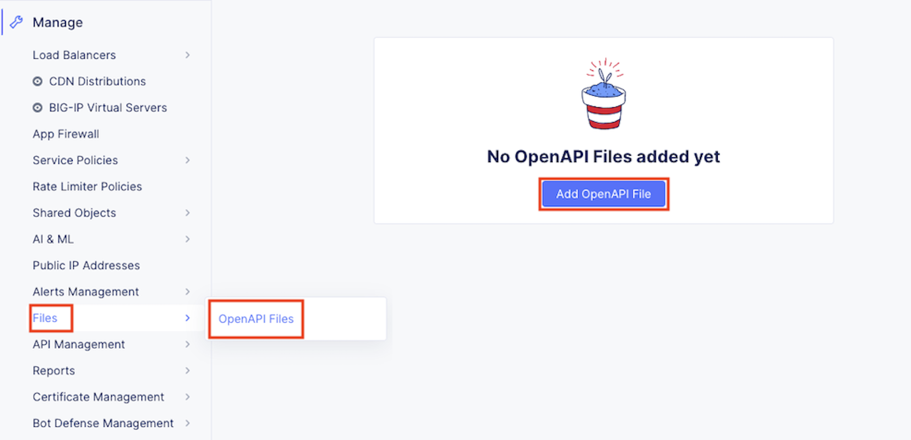
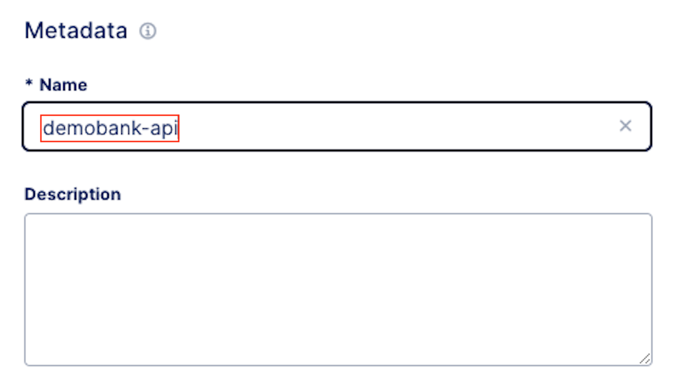
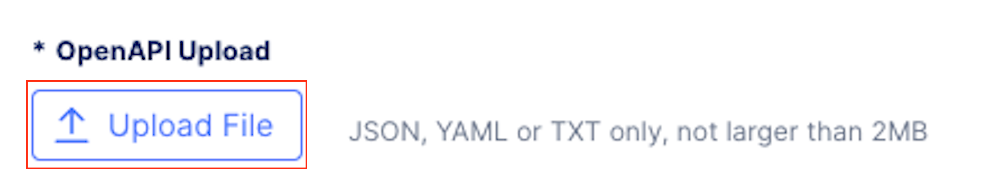

Lab 2: API Protection & Rate Limiting
=====================================

F5® Distributed Cloud API Protection provides key security functionality to secure APIs.

This lab's tasks will walk through the configuration steps and note additional configurations available.

Task 1: Attaching API Protection to Load Balancer Object
~~~~~~~~~~~~~~~~~~~~~~~~~~~~~~~~~~~~~~~~~~~~~~~~~~~~~~~~

In this task's series of steps you will enable the API Discovery & Protection feature on the
previously built Load Balancer object delivering the targeted application/API.

#. In the left-hand navigation of the **Web App & API Protection** service, click on **Load
   Balancers** under the **Manage** section.

   |class4-shared-002|

#. In the resulting **Load Balancers** window, click on the three dots **...** in the
   **Action** column, and the select **Manage Configuration**.

   |class4-shared-003|

#. Click **Edit Configuration** in the top-right corner.

   |class4-shared-004|

#. In the **API Protection Rules** section, click the **Configure** link.

   |lab2-task1-004|

#. In the resulting **API Protection Rules** window, click **Configure** in the
   **API Endpoints** section.

   |lab2-task1-005|

#. Click **Add Item** in the **API Endpoints** window.

   |lab2-task1-006|

#. In the resulting window, input **block-endpoint** in the **Name** field of the
   **Metadata** section.

#. In the **Action** area, click the drop-down arrow indicated and select **Deny**.

   |lab2-task1-007|

#. In the **API Endpoint** section, click on the **API Endpoint** input field as indicated.

#. Select the **See Suggestions** link.

   |lab2-task1-008|

#. Select **/api/CatLookup/GetAllCats** from the available options provided.

   .. note::
      *The available endpoints are provided by the swagger previously imported,
      or identified by API Discovery*

#. In the **HTTP Methods** area, click in the **Method List** input field.

   |lab2-task1-009|

#. Select **Any** from the available methods provided.

   .. note::
      *Multiple methods can be selected if needed*

   |lab2-task1-010|

#. Review the configuration and click, the **Apply** button.

   |lab2-task1-011|

#. Review the API Endpoint deny rule and click, the **Apply** button.

   |lab2-task1-012|

#. Note that API Protection Rules are configure for the API Endpoints and click, the
   **Apply** button.

   |lab2-task1-013|

#. Select **Other Settings** on the left then click on **Save and Exit**
   at the bottom right of window.

   |lab2-task2-009|

#. Using another browser tab, navigate to the the following URL to confirm
   access is denied.

   **http://<namespace>.lab-sec.f5demos.com/api/CatLookup/GetAllCats**

   |lab2-task1-014|

#. Select **Security Dashboard** within the XC tab, scroll down and click on the
   **<namespace>.lab-sec.f5demos.com** load balancer name.

   |class4-shared-005|

   |class4-shared-006|

#. Click on **Security Analytics**, observe the event. Expand event details by clicking on the **right arrow**.
   Events with the response code of **403** will be present.

   .. note::
      *Change time to 1 hour, and make sure the page has been refreshed*

   |Lab2_Task2_Step20_response_code_403|

   .. note::
      *Detection information will be near the bottom of the event detail.
      api_sec_event will be listed with details regarding "api protection."*

Task 2: Attach API Rate Limiting to Load Balancer Object
~~~~~~~~~~~~~~~~~~~~~~~~~~~~~~~~~~~~~~~~~~~~~~~~~~~~~~~~~~~~~~~~~~~~

In this task's series of steps you will enable the API Rate Limiting feature on the
previously built Load Balancer object delivering the targeted application/API.

#. In the left-hand navigation of the **Web App & API Protection** service, click on **Load
   Balancers** under the **Manage** section.

   |class4-shared-002|

#. In the resulting **Load Balancers** window, click on the three dots **...** in the
   **Action** column, and the select **Manage Configuration**.

   |class4-shared-003|

#. Click **Edit Configuration** in the top-right corner.

   |class4-shared-004|

#. Using the left-hand navigation, click the **Common Security Controls** link.

   |lab2-task2-001|

#. Locate the **Rate Limiting** area of the **Common Security Controls** and use the
   drop-down to select **API Rate Limit**.

   |lab2-task2-003|

#. In the expanded menu under **Rate Limiting**, click **Configure** in the **API
   Endpoints** area.

   |lab2-task2-004|

#. In the resulting window **API Endpoints** window, click **Add Item**.

   |lab2-task2-005|

#. In the resulting configuration window, select **/api/DogLookup/GetAllDogs** for **API
   Endpoint** input.

#. Select **ANY** for **Method** input and then click the **Apply** button.

   |lab2-task2-006|

#. Review the API Endpoint rate limiting rule and click, the **Apply** button.

   |lab2-task2-007|

#. Note the updated configuration for API Rate limiting, Click **Other Settings** on the
   the left, navigation on the bottom right then click on **Save and Exit**

   |lab2-task2-008|

   |lab2-task2-009|

#. Using another browser tab, navigate to the the following URL to confirm
   rate limiting, by freshing your tab several times.

   **http://<namespace>.lab-sec.f5demos.com/api/DogLookup/GetAllDogs**

   |lab2-task2-010|

#. Select **Security Dashboard** within the XC tab, scroll down and click on the
   **<namespace>.lab-sec.f5demos.com** load balancer name.

   |class4-shared-005|

   |class4-shared-006|

#. Click on **Security Analytics**, observe the event. Expand event details by clicking on the **right arrow**.
   Events with the response code of **429** will be present.

   .. note::
      *Change time to 1 hour, and make sure the page has been refreshed*

   |Lab2_Task1_Step14_response_code_429|

   .. note::
      *Detection information will be near the bottom of the event detail.
      api_sec_event will be listed with details regarding "rate limiting."*

This configuration highlights the elements needed to deploy API Discovery & Protection. This
configuration can also be fully deployed and managed via the F5 Distributed Cloud API.

**End of Lab 2:**  This concludes Lab 2. A Q&A session will begin shortly after conclusion of the overall lab.

|labend|

.. |class4-shared-001| image:: _static/class4-shared-001.png
   :width: 800px
.. |class4-shared-002| image:: _static/class4-shared-002.png
   :width: 800px
.. |class4-shared-003| image:: _static/class4-shared-003.png
   :width: 800px
.. |class4-shared-004| image:: _static/class4-shared-004.png
   :width: 800px
.. |class4-shared-005| image:: _static/class4-shared-005.png
   :width: 800px
.. |class4-shared-006| image:: _static/class4-shared-006.png
   :width: 800px
.. |class4-shared-007| image:: _static/class4-shared-007.png
   :width: 800px

.. |lab2-task1-002| image:: _static/lab2-task1-002.png
   :width: 800px
.. |lab2-task1-003| image:: _static/lab2-task1-003.png
   :width: 800px
.. |lab2-task1-004| image:: _static/lab2-task1-004.png
   :width: 800px
.. |lab2-task1-005| image:: _static/lab2-task1-005.png
   :width: 800px
.. |lab2-task1-006| image:: _static/lab2-task1-006.png
   :width: 800px
.. |lab2-task1-007| image:: _static/lab2-task1-007.png
   :width: 800px
.. |lab2-task1-008| image:: _static/lab2-task1-008.png
   :width: 800px
.. |lab2-task1-009| image:: _static/lab2-task1-009.png
   :width: 800px
.. |lab2-task1-010| image:: _static/lab2-task1-010.png
   :width: 800px
.. |lab2-task1-011| image:: _static/lab2-task1-011.png
   :width: 800px
.. |lab2-task1-012| image:: _static/lab2-task1-012.png
   :width: 800px
.. |lab2-task1-013| image:: _static/lab2-task1-013.png
   :width: 800px
.. |lab2-task1-014| image:: _static/lab2-task1-014.png
   :width: 500px

.. |lab2-task2-008| image:: _static/lab2-task2-008.png
   :width: 800px
.. |lab2-task2-009| image:: _static/lab2-task2-009.png
   :width: 800px
.. |lab2-task2-010| image:: _static/lab2-task2-010.png
   :width: 500px
.. |Lab2_Task1_Step14_response_code_429| image:: _static/Lab2_Task1_Step14_response_code_429.png   
   :width: 800px
.. |Lab2_Task2_Step20_response_code_403| image:: _static/Lab2_Task2_Step20_response_code_403.png   
   :width: 800px   
.. |labend| image:: _static/labend.png
   :width: 800px
