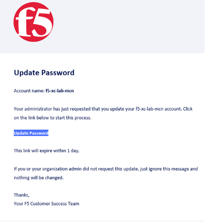
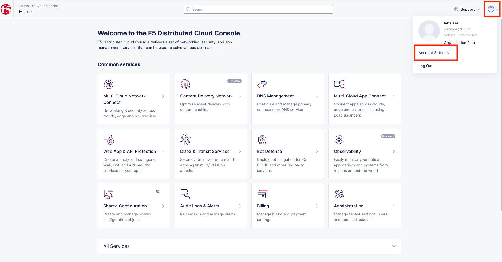
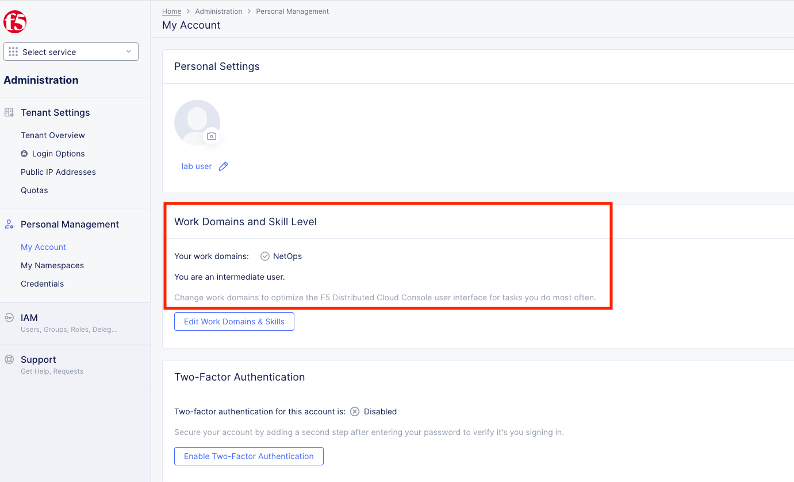
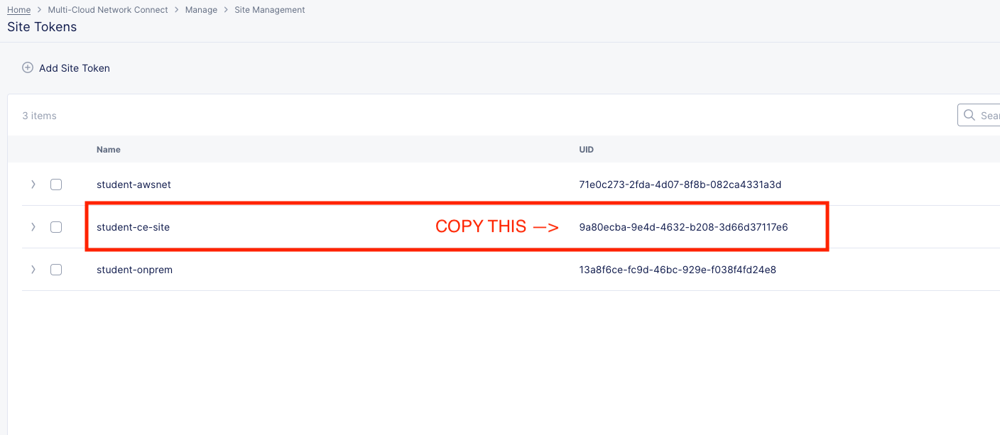
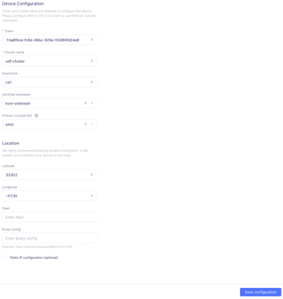
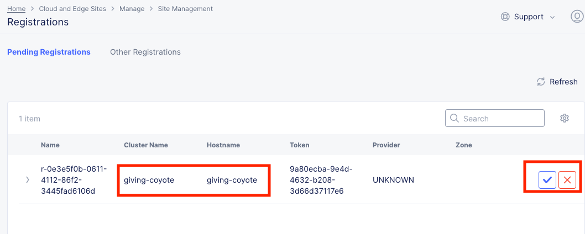

Lab 1: Building an XC Node (CE)
==================================

**Objective:**

* Get familiar with the UDF Lab Environment. 

* Deploy an XC Node to define the Customer Edge at the UDF Data Center.

* Explore and become familiar with the Distributed Cloud Console.

**Narrative:** 

After consulting with your trusty F5 Solutions Engineer, you decide to setup F5 Distributed Cloud, Network Connect. This will allow for privately routed network connectivity between two disparate networks. 
You also found out that you can use the F5 Distributed Cloud, Enhanced Firewall to provide network security between Sites. 
We already did a push-button deployment of the AWS XC Node to define the Customer Edge in the ACME VPC, which only took a few moments. 

Now, Lab 1 starts right after you have loaded the downloadable XC Node OVA on to your Data Center's local hypervisor (VMWARE or KVM). 

.. NOTE:: Your Data Center environment in these labs is the F5 UDF platform, which uses KVM as it's underlying virtualization technology. The OVA has already been imported for you. We also have hardware and container deployment options for Production XC Nodes. 

|

|

**Prerequisite**
------------------

.. NOTE:: You should have received an email from F5 Distributed Cloud User Management <no-reply@volterratmails.io> with the content as follows:

|

|
 
If you have not already, please click on **Update Password**, and change your credentials. Ensure you adhere to the password strength restrictions and make a mental note of these credentials as you will need them several times throughout the labs today. 

Once you've set your new password (make sure to include 1 upper, 1 lower and 1 special character), you will be asked to "Log In" and then presented with the following screen:

|

|

In the domain field, enter: **f5-xc-lab-mcn**, click **Next** and sign in with your email address and password you've just set, and proceed to accepting the Terms and Conditions. 

.. warning:: If you have not received the email to change your credentials or ran into problems changing your credentials, please stop and get help from one of the Lab Assistants. 

**Logging into the XC Console**
---------------------------------

After accepting the Terms of Service and Privacy Policy, you will need to select your "Persona". 

Enter your persona as **"NetOps"** and click **next**. 

Enter your level as **"Intermediate"** and then click **Get Started**.  

Your persona will highlight workflows within F5 Distributed Cloud.
You will be able to access all services, but making use of personas can focus your view on particular tasks that are relevant to your role.

You can change these settings at any time. 

Click on **"Account Settings"** by expanding the **"Account"** icon in the top right of the screen and clicking on **"Account Settings".**  
In the resulting window you can observe the **Work domains and skill level** section and other administrative functions.
   
.. note:: **For the purposes of this lab, permissions have been restricted to lab operations. Some menus/functions will be locked and/or not visible.**

|

|

**For informational purposes only:**

|

|

**Find your Namespace**
---------------------------------

Namespaces, which provide an environment for isolating configured applications or enforcing role-based access controls, are leveraged
within the F5 Distributed Cloud Console. For the purposes of this lab, each lab attendee has been pre-assigned a unique **namespace**.

From the **Select service** menu, click on **Web App & API Protection**. 

|

|

In the **Web App & API Protection Security Dashboard** configuration screen **observe** the browser URL. In the URI path, locate the **<adjective-animal>** namespace that you have
been assigned. It will be located in the portion of the URI path between */namespaces/* and */overview/* as shown in this example: **…/namespaces/<namespace>/overview/**. 
   
**Note your namespace as it will be used throughout the labs today.**

.. warning:: If you have problems locating your namespace, please see a lab assistance.

|

|

.. note:: Administratively, there are other ways to find namespaces. Due to permission restrictions for this particular lab, those menus are not available.

**Site Token**
----------------

Soon, you will be configuring an XC Node in the F5 UDF Lab Environment (Data Center) that will need a way to authenticate to the Distributed Cloud Infrastructure and associate it with your tenant. For this, you will need a Site Token. 

If you are not already logged into the console, please do so now by opening the following URL in your browser: 

https://f5-xc-lab-mcn.console.ves.volterra.io/

From the **Select service** menu, click on **Multi-Cloud Network Connect**. 

|

|

On the side menu go down to **Manage**, then select **Site Management >> Site Tokens**
    
In the lab we have generated a Site Token for you to use named **student-ce-site**.  
In your production environment you will need to create your own Site Token to register your Customer Edge Node, which is literally two clicks and a name. Very simple! 

|

|

Copy the UID of the the **student-ce-site** token and paste it somewhere you can reference later (word, notepad etc).

|

|

**Setting up the Customer Edge**
----------------------------------

In your browser, you should have a tab open to the UDF course. Under the F5 Distributed Cloud CE, click on **Access >> Site UI**

|

|

This should prompt you for authentication and then open the Customer Edge Node Admin portal.

Type in the default username/password:

==============================  =====
Variable                        Value
==============================  =====
Default Username:                **admin**
Default Password:                **Volterra123**
==============================  =====

|

|

You will be prompted to change the password at the initial log in. **Make a mental note of these credentials as you will need them several times throughout the labs today.** 

|

|

After you set the password, the services will need to restart and then the Customer Edge node will present the Dashboard

.. Note:: You may have to Refresh your browser and log in again. 

|

.. image:: ../images/restart.png 

|

Once all services are up and running you should see the Dashboard which will have various colors and state as shown:

|

|

If you mouse-over each of the icons, the specific services will report their status in addition to the status reflected by the icon.

Mouse over each of the components under VP Manager Status and note the components and their condition.  You can also click on **“Show full status”** and see a JSON report that is used to present the VP Manager Status in detail.

You can also scroll down and see hardware details that describe the platform that the Customer Edge is installed on. 

Click the blue **Configure Now** button.

|

|

This will take you to the **Customer Edge Device Configuration** page.

Set the following parameters and leave everything else as default:

==============================  =====
Variable                        Value
==============================  =====
Token                           Insert the Site Token UID you collected earlier
Cluster Name                    Insert your unique namespace <verb-animal>
Hostname                        Insert your unique namespace <verb-animal> 
Latitude                        33.812
Longitude                       -117.91
==============================  =====

The end result should look like the image below, and then click **Save Configuration.**

|

|

After you save the configuration, you will be taken back to the Dashboard, notice the status change to **“Approval”** after a few moments. (May need to refresh page)

|

|

**If you encounter it, you can safely ignore this benign timing error due to the UDF lab environment.**

|

|

We will now go accept the Customer Edge registration in Distributed Cloud console. 

**Registering the Customer Edge**
----------------------------------

Go back to the Distributed Cloud console.  If the session timed out, you will need to log back into the console using the following URL or refreshing your browser:

https://f5-xc-lab-mcn.console.ves.volterra.io/

From the **Select service** menu, click on **Multi-Cloud Network Connect**.

On the side menu go down to **Manage >> Site Management >> Registrations.**

|

|

The Customer Edge node you configured from the previous step should appear on this list, if not give it a couple moments and refresh the screen by clicking the **Refresh button** at the top right-hand corner.  

|

|

.. Tip:: This process can take a few minutes for the node to register with Distributed Cloud. 

Once the Node appears in the Registration list, accept the registration by clicking on the blue check mark.

**Click the blue check mark** to accept the registration. 

.. Note::  If you DO NOT see a blue check mark, it's likely your browser width is NOT wide enough.  Simply increase the width of the browser and you should see the blue checkmark to approve the registration.

Once you have clicked the checkmark, the console will bring up the Registration Acceptance menu which shows all the settings of the Customer Edge node.  Note the parameters you’ve entered from the previous exercise are populated into the appropriate fields. 

.. Important:: Look at the Cluster Size parameter and notice this is set to 1.  In this lab, we will only deploy a single-node-cluster and thus leave this setting as 1.  In a production environment, the best practice is to deploy a 3-node-cluster minimum.  In that case, the Cluster Size parameter would be set to 3 so an appropriately sized cluster can be formed.

**Leave the cluster size set to 1**

|

.. image:: ../images/clustersize.png

|

Scroll down to Site to Site Tunnel Type and click on the drop down arrow

|

|

This setting determines the VPN connectivity protocols used between the Customer Edge and the Regional Edges. The XC Node will automatically bring up redundant tunnels to two different RE's. 
These tunnels are self-healing and can fallback when using the configuration setting of IPSEC or SSL.
Select **IPSEC or SSL** from the list.  

|

|

Click **Save and Exit**. 

Once the registration completes, you can see the cluster in the “Other Registrations” tab and the current state will be ADMITTED.

|

|

The Customer Edge Node Admin portal will also reflect some changes in its status, although the node still requires some additional configuration.
From the menu on the left click on **Sites** and observe your Nodes (animal-name). Hint: You may have to hit **Refresh**  in the upper right corner. 

|

|
|

You should see the CE you just deployed on this list go through several phases of provisioning and you can observe the  **Site Admin State, Health Score, and Software Version and OS version.**
You may also observe the Health score going up and down as services are spun up and restarted. 

.. Note:: This step takes about 10 -15 minutes to complete and will finish up while we start our presentation and lecture. 

The end result should look something like the following screen where the node is green at 100 percent health and has the latest software version. 

.. Important:: Do not move on to Lab 2 until the CE is fully provisioned and **Online**. 

|

|

Sanity Check
-------------
**This is what you just deployed.**

|

|

**We hope you enjoyed this lab!**

**End of Lab 1**
