Lab 2: Configuring Network Connect (L3/L4 Routing Firewall )
=============================================================

**Objective:**

* Verify the XC Node's health. 

* Configure Network Connect to connect the Data Center network to the AWS Network.

* Test connectivity and configure Enhanced Firewall for network security

**Narrative:** 
Now that your XC Node is provisioned, it's time to verify, explore the XC Console and set up Network Connect to establish secure connectivity between the Data Center and AWS networks. 
After the setup is complete, you will test connectivity and configure network security. 

|

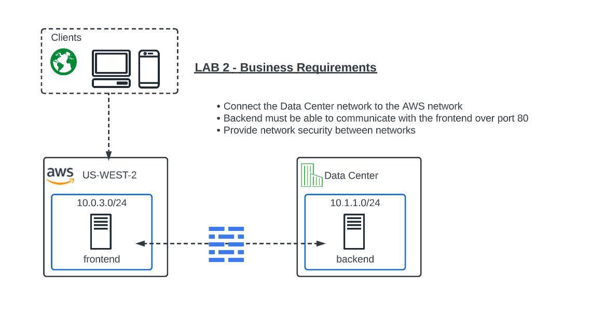

|

Verify the XC Node's Health
---------------------------

If you are not already logged into the console, please do so now by opening the following URL in your browser: 

https://f5-xc-lab-mcn.console.ves.volterra.io/

From the **Select service** menu, click on **Multi-Cloud Network Connect** and then click on **Site List,**

Your XC Node should have registered successfully and will appear green with a Health Score of 100. You may need to click **Refresh** in the top right corner
if you do not see your animal name. In this example I was assigned **rested-tiger**.

|

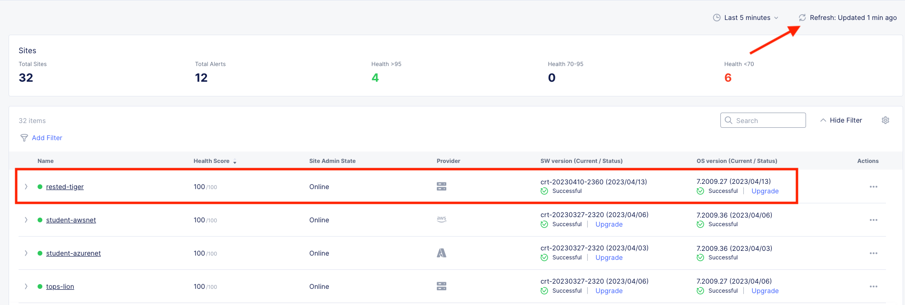

|

.. Important:: If you do not see your Site as registered or in a healthy state please see a Lab Assistant.

From this Dashboard you can note the current **Site Admin State, Provider, SW version, and OS version.** 

**Please DO NOT click "Upgrade" on any of the Sites!**

Instead, **Click** on the three dots under the **Actions** column at the far right of the screen of **"your animal"**  Site and click on **Manage Configuration**. In this screenshot I was **rested-tiger**. 

|

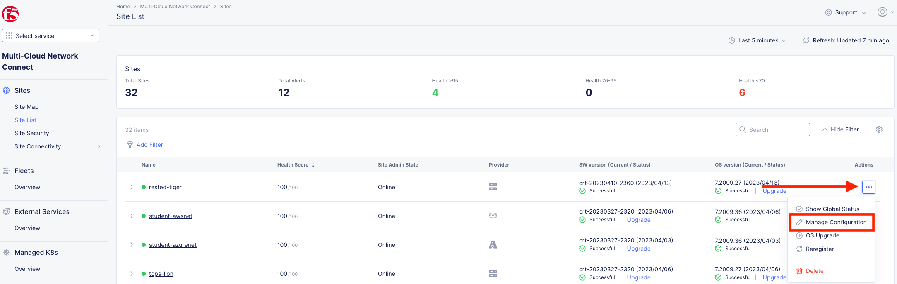

|   

Review the **Metadata, Site Type** and **Coordinates** fields as well as the **Connected REs** (Regional Edge) section.  

These are the closest Regional Edge sites based on the latitude and longitude information provided during the deployment process. **Each CE has an auto-provisioned self-healing secure tunnel to redundant RE's.** 

|

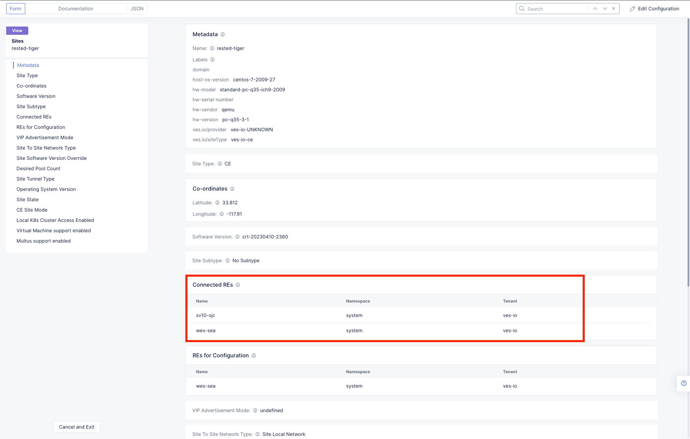

|

Look at the top left-hand corner where you see Form, Documentation and JSON. **You will see these fields throughout the Distributed Cloud Console configuration menus.**

.. Important:: Distributed Cloud is built with an API-first strategy. All the configurations can be done via GUI or API calls. 

|

You can view the JSON file of the configuration by clicking **JSON**. 

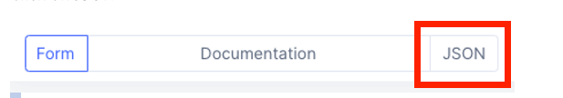

This is the JSON code of the configuration which could be saved to create a backup of the Customer Edge configuration, but that is beyond the scope of this lab. 

|

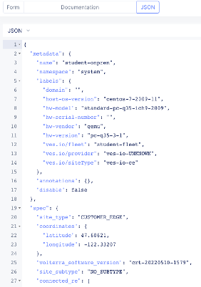

|

Click on **Documentation**.

|

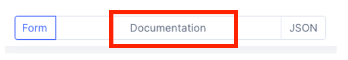

|

This will load the API specification for a Customer Edge Node. Review briefly and click **Cancel and Exit**

|

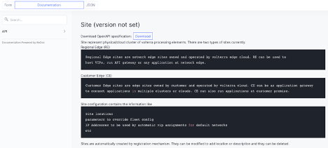

|

In the **Site List** screen, click on your Customer Edge Node **animal name**.  

The default landing is a Dashboard giving you a detailed summary of the Customer Edge Node.  **Briefly** explore the extensive menus and analytics at the top of the screen.

|

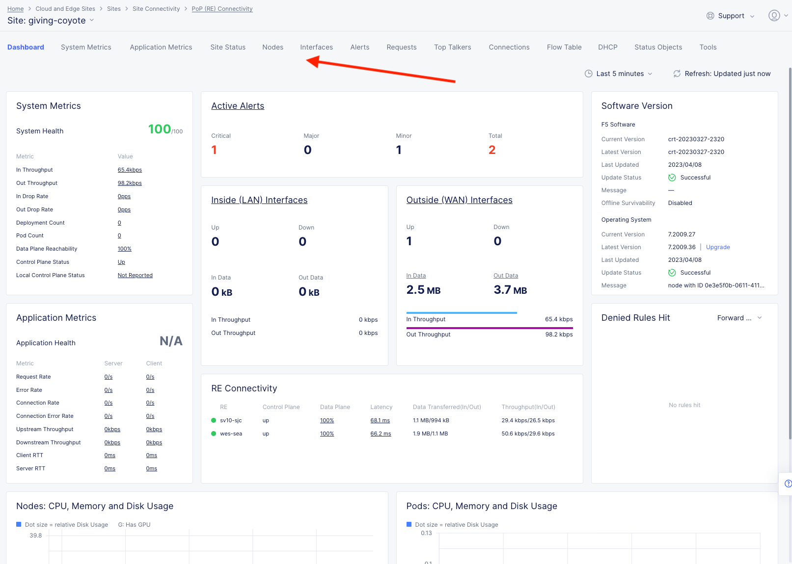

|

Narrative Check
-----------------

Now that you are familiar with your new "Software Defined" Node, we can start getting our hands dirty with the real configuration necessary to meet ACME Corp's first requirement to
get the network in the Data Center connected to the network in AWS. The backend security device will need to "scan" the frontend in AWS on port 80 and all other ports must be blocked. 

Configuring Network Connect
---------------------------------------

In our lab today, an Ubuntu Server in the UDF environment will simulate the backend. 
The AWS frontend workload is already deployed along with an XC Node to extend the Customer Edge in the AWS cloud. 

.. NOTE:: The Data Center backend has a pre-existing route to 10.0.3.0/24 and it points to the single outside interface of the Data Center XC Node.  The AWS workload has a route to 10.1.1.0/24 that points to the inside interface of the AWS XC Node. 

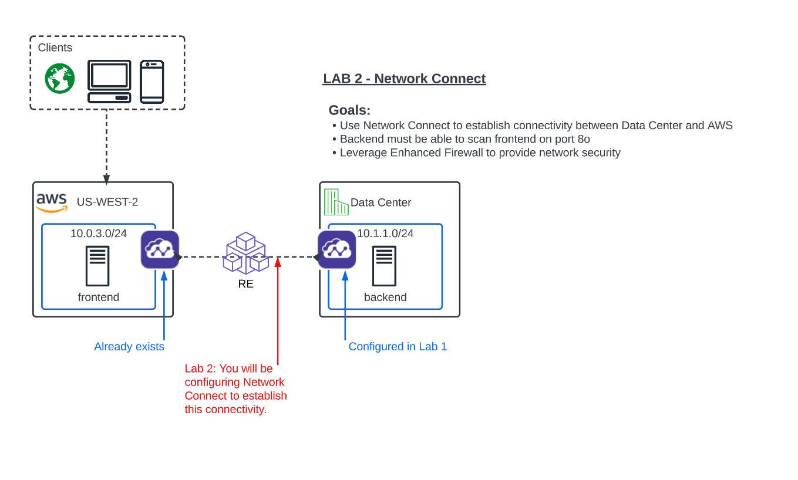

What you have done so far in Lab 1 and the beginning of Lab 2, is setup the ACME Data Center XC Node to extend the Data Center Customer Edge. 
Your next goal is to simply establish routing between these environments by using a hub and spoke model with our Regional Edges as shown in the diagram above.

**All traffic between these networks will now be routed through auto-provisioned, self-healing and encrypted tunnels between the defined Customer Edges and the XC Regional Edges.**

.. Note:: In this lab some objects are already created due to permission requirements in the XC Lab environment. You will still observe and walkthrough the configuration for referrence. 

Global Virtual Network  
------------------------

To connect two or more Distributed Cloud node environments together across the Distributed Cloud network we will need to connect the sites through a Global Virtual Network.  

Confirm you are still in the **Multi-Cloud Network Connect** Console under **Site List**. If not, click on the **Select Service** in the left-hand navigation and click on **Multi-Cloud Network Connect**.

On the left side menu, navigate to  **Manage >> Networking >> Virtual Networks**. 

**Observe** the pre-configured **student-global** Virtual Network. Click the the dots under the **Action** menu for **student-global** and then **Manage Config**. Note the very simple config. 

|

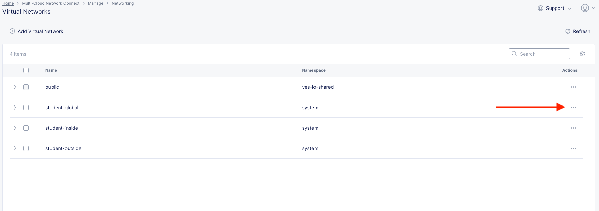

|

Click **Cancel and Exit**. 

.. Note:: Due to tenant permissions you will not be able to create your own Global Virtual Network.  
 
If you wanted to configure this outside of the lab, you would literally click **Add Virtual Network** button, enter a name for the Virtual Network and make sure it is type **Global**. Very simple! 

The configuration **would** look like the screen below.
 

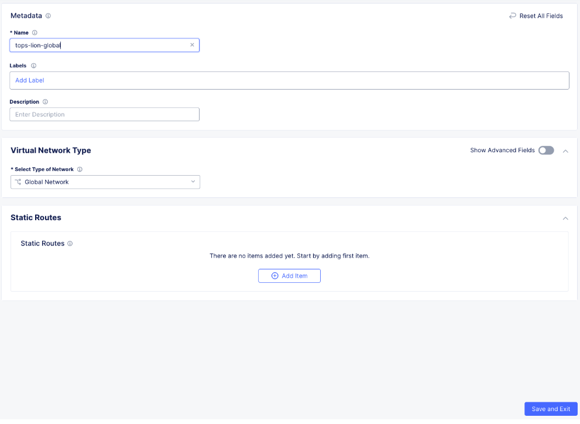

Fleets
------------------
A Fleet is used to configure infrastructure components (like nodes) in one or more F5® Distributed Cloud Services Customer Edge (CE) sites homogeneously. 

Fleet configuration includes the following information

* Software image release to be deployed on the Fleet

* Virtual networks

* List of interface and devices to be configured on every node

* Connections between the virtual networks

* Security policies applied in the Site

.. Note:: In this lab we have already created a fleet called "student-fleet" for you due to permission restrictions.  

Review Fleet Config
------------------------

In Multi-Cloud Network Connect context, go down to **Manage >> Site Management >> Fleets.**

Click on the 3 dots at the far right hand side of student-fleet and select **Manage Configuration**

|

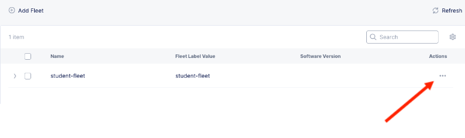

|

In the next screen click on **Edit Configuration** in the top right of the screen and **Observe** the Fleet Configuration and Network Connectors. 

A Network Connector is used to create a connection between two virtual networks on a given site. 

For more information on Network Connectors and their functions you can review this link: https://docs.cloud.f5.com/docs/how-to/networking/network-connectors

The **Network Connectors** are configured as:

**student-global-connector** 

* Network Connector Type: Direct, Site Local Inside to a Global Network

* Global Virtual Network: system/student-global 

|

**student-snat-connector**

*Network Connector Type: SNAT, Site Local Inside to Site Local Outside

* Routing Mode: Default Gateway

* SNAT Source IP Selection: Interface IP

|

**student-ce-global-connector**

* Network Connector Type: Direct, Site Local Outside to a Global Network

* Global Virtual Network: system/student-global 

|

Also, notice Network Firewall is **NOT** currently defined. We will come back to that in a few moments. 

Click **Cancel and Exit.**

Fleet Label 
-------------
Fleet has a field called fleet_label. When a Fleet object is created, the system automatically creates a known_label ves.io/fleet=. 
The known_label is created in the Shared namespace for the tenant. A site is made a "member of Fleet" when this known_label is added to the site. 
A site can have at most one known_label of type ves.io/fleet and hence belongs to exactly one Fleet at any given time.

**Note** the **Fleet Label Value** of the **student-fleet**. The label is also named **student-fleet**. 

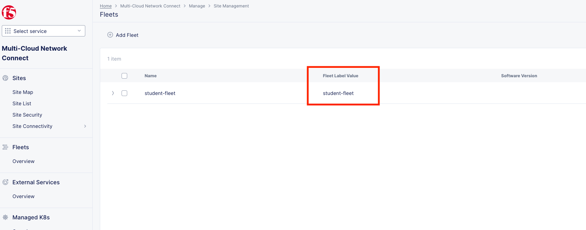

Bringing up the Connection
----------------------------
From your UDF environment browser tab,  click on **Access >> Web Shell** on the Ubuntu Client. This will open a new tab to a Web Shell. 

|

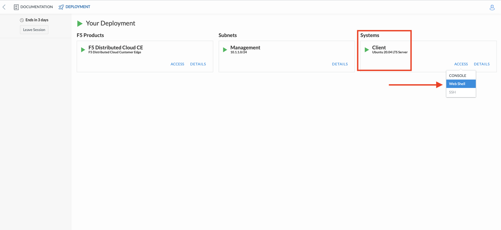

|

**The workload in AWS has an IP address of 10.0.3.253**

Type **ping 10.0.3.253** and hit **Enter**. You **WILL NOT** get a response. 

Back in the XC Console, navigate to **Multi-Cloud Network Connect >> Sites >> Site List** and find your **"animal-name"**
Click the **3 buttons** under the **Action Menu** under **"your animal name"** and select **Manage Configuration**. 

In the top right click **Edit Configuration**. 

You should be here. We will be adding a **Fleet Label** to tag our CE Node into the fleet. 

|

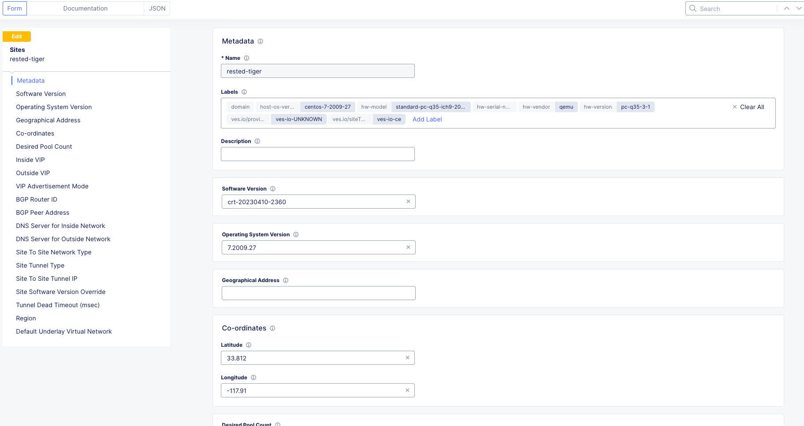

|

Click **Add Label** under the **Labels** section and select the label **ves.io/fleet.** 
For the value click on **student-fleet**, scroll down, **Save and Exit**. 

|

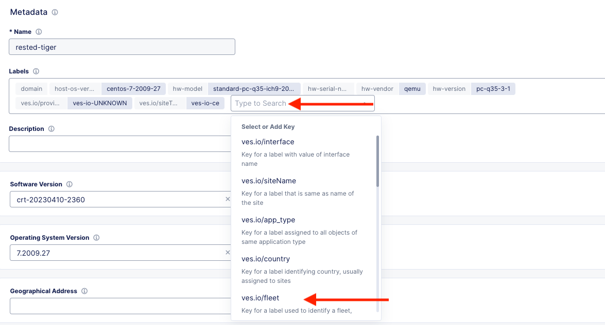

|

It should look like this: 

|

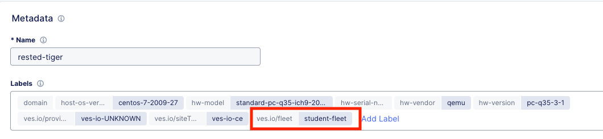

|

Check back on your web shell tab with the ping going. Success!!

|

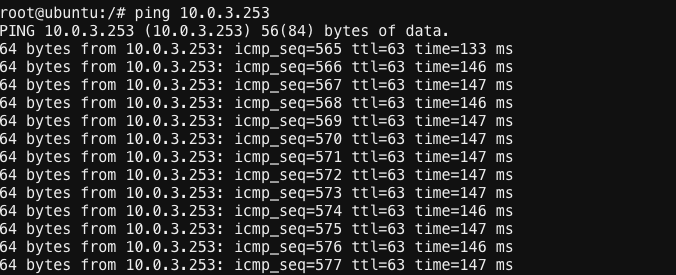

|

.. important:: If you want to tear down this connectivity it is as easy as removing the label. 

In XC Console, navigate to **Multi-Cloud Network Connect** >> **Sites** click on **Site List**, click directly on your **"animal-name"** and finally click on the **Tools** menu on the top, far right. 

Click on **Show Routes** 

|

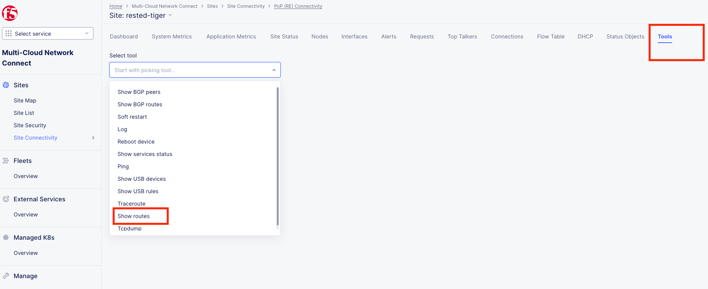

|

Set Virtual Network Type to: **VIRTUAL_NETWORK_SITE_LOCAL_INSIDE** and click the blue **Show routes** button

|

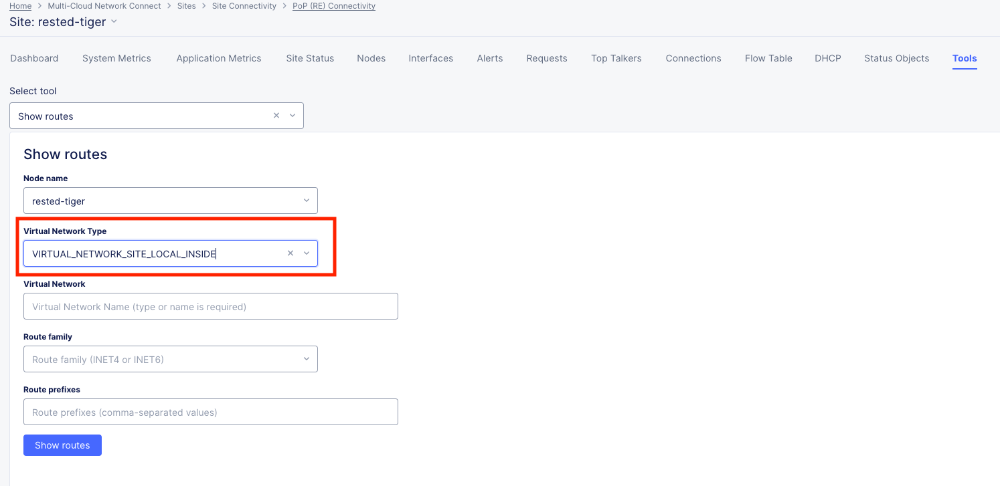

|

Scroll down to see the AWS subnet route **"10.0.3.0/24** being advertised through the tunnel. 

|

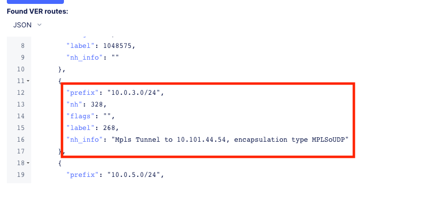

|

Routing is good, now let's test some other ports. 
Go back to the web shell where you ran a ping. We will now test 2 ports that we know the server is listening on. 

**Port 80** - Simple Web page

**Port 8080** - Diagnostic tool

Our first test will be to port 80. In the web shell type: **curl \-\-head http://10.0.3.253** 

|

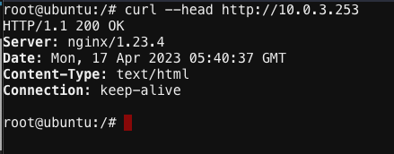

|

Next, push the keyboard "up arrow " and run the same command but targeted at port 8080 like this: **curl \-\-head http://10.0.3.253:8080** 

|

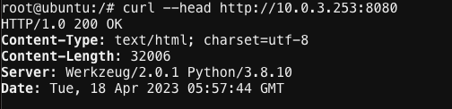

|

.. Important:: If you are not getting a **"200 OK"** repsponse, please see a lab assistant before moving on. 

.. Note:: We now have to close port 8080 per the ACME Corp security department requirement. 

Enhanced Firewall Policy
---------------------------------

You will now configure the F5 Distributed Cloud Enhanced Firewall to provide network security between these sites. 

.. Note:: Due to lab architecture, we will only be able to configure the policies but not apply. We will show you the final step to apply your policy for reference, but you will not actually be able to apply or test.  

Navigate to **Manage >> Firewall >> Enhanced Firewall Policies** and click **Add Enhanced Firewall Policy**.  

|

=========================================    =====
Variable                                     Value
=========================================    =====
Name                                         [animal-name]-fwp
Select Enhanced Firewall Policy Rule Type    Custom Enhanced Firewall Policy Rule Selection
=========================================    =====

Click the blue **Configure** hyperlink.

|

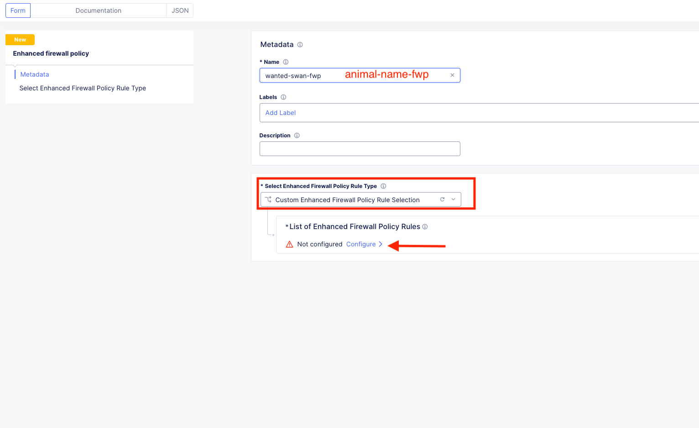

|

Click on **Add Item** to bring up the Rules creation screen. Here you will notice several powerful **"Enhanced"** Source and Destination Traffic filters.  

=================================               =====
Variable                                        Value
=================================               =====
Name                                            [animal-name]-allow-80
Source Traffic Filter                           IPv4 Prefix List >> Click Configure and add 10.1.1.0/24 then click **Apply**.
Destination Traffic Filter                      IPv4 Prefix List >> Click Configure and add 10.0.3.0/24 then click **Apply**.
Select Type of Traffic to Match                 Match Protocol and Port Ranges
Match Protocol and Port Ranges                  TCP >> click **Add Item** and add **80**. 
Action                                          Allow
=================================               =====

|

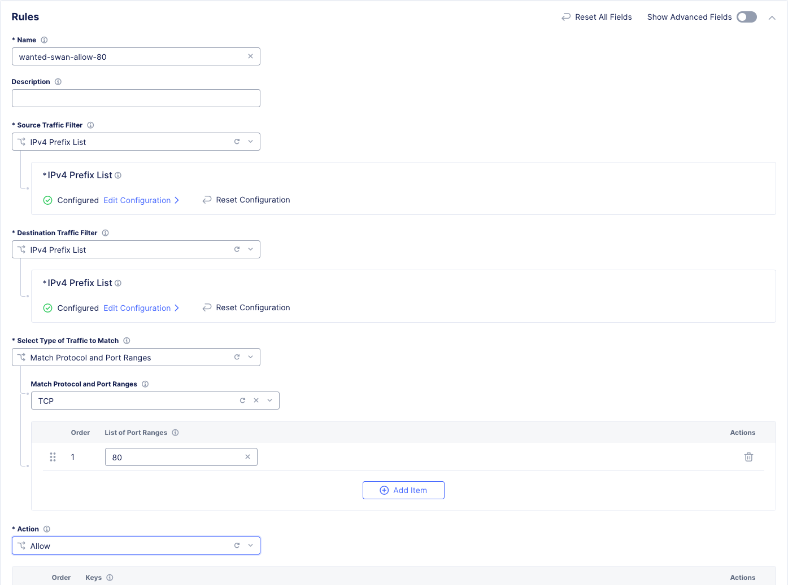

|

Click **Apply** and your screen should look like this: 

|

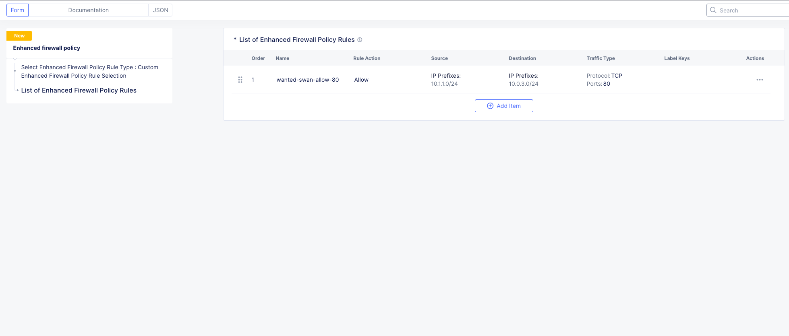

|

Now we will create the **default deny** to prevent any other traffic between these two networks. 

Click **Add Item** again to add another rule to the **Enhanced Firewall Policy**. 

=================================               =====
Variable                                        Value
=================================               =====
Name                                            [animal-name]-deny-all
Source Traffic Filter                           IPv4 Prefix List >> Click Configure and add 10.1.1.0/24 then click **Apply**.
Destination Traffic Filter                      IPv4 Prefix List >> Click Configure and add 10.0.3.0/24 then click **Apply**.
Select Type of Traffic to Match                 Match All Traffic
Action                                          Deny
=================================               =====

|

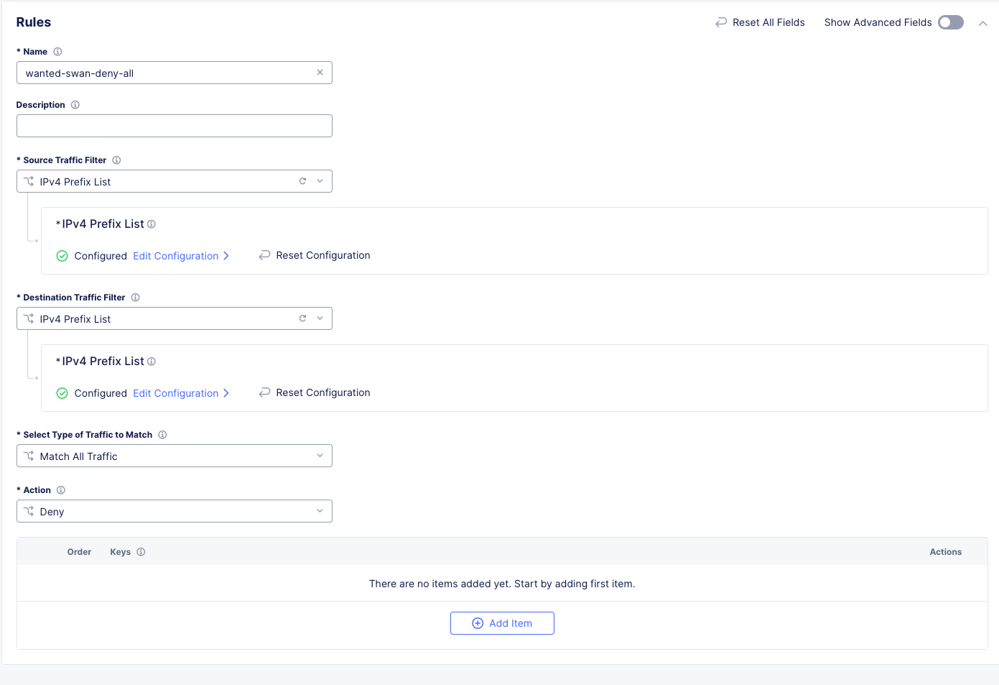

|

Click **Apply** and your screen should look like this: 

|

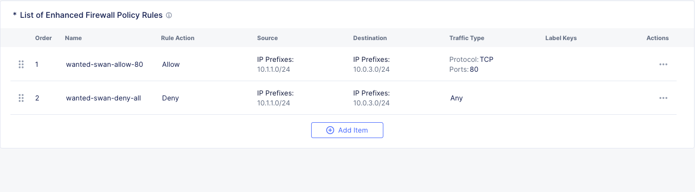

|

Click **Apply** and **Save and Exit**.

|

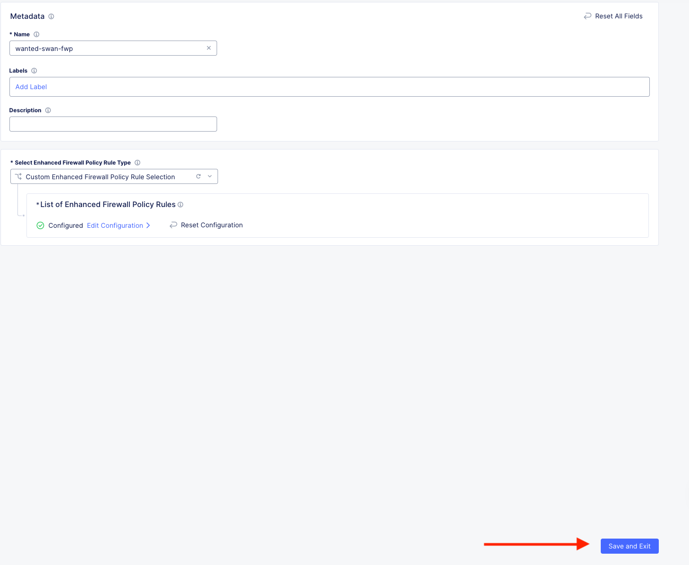

|

Summary
---------------------------------
You have now created the firewall policy necessary to secure these two networks. Outside of the lab envirnoment you would now add this policy to the fleet by managing your fleet and adding an Enhanced Firewall policy.

|

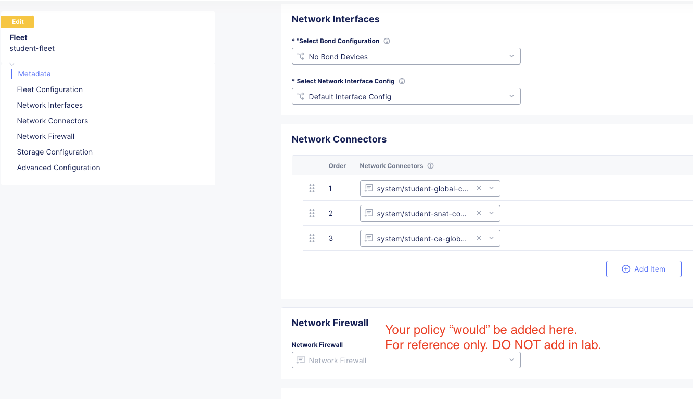

|

Logging
---------
Customers often ask about the logging options with F5 Distributed Cloud. There are two main options for logging. 

1. Global Logging - Logging related to activities that occur within Distributed Cloud and on the Regional Edges such as load balancers or WAAP/Bot policy.

2. Site Local Logging - Logging related to activities that occur within the Customer Edge Boundary such as load balancers or WAAP/Bot policies runnning locally on an XC Node.

.. Note:: This is the last "Read Only" lab section. Our apologies for the inconvenience.

**Global Logging**:

To observe **(NOT configure)** the Global Logging configuration options, in the side-menu, browse to **Manage >> Log Management >> Global Log Receiver** and click **Add Global Log Receiver**.

Take particular notice of the different **Log Types** and **Receiver Configurations** which include AWS, Azure and Splunk options to namedrop a few. 

|

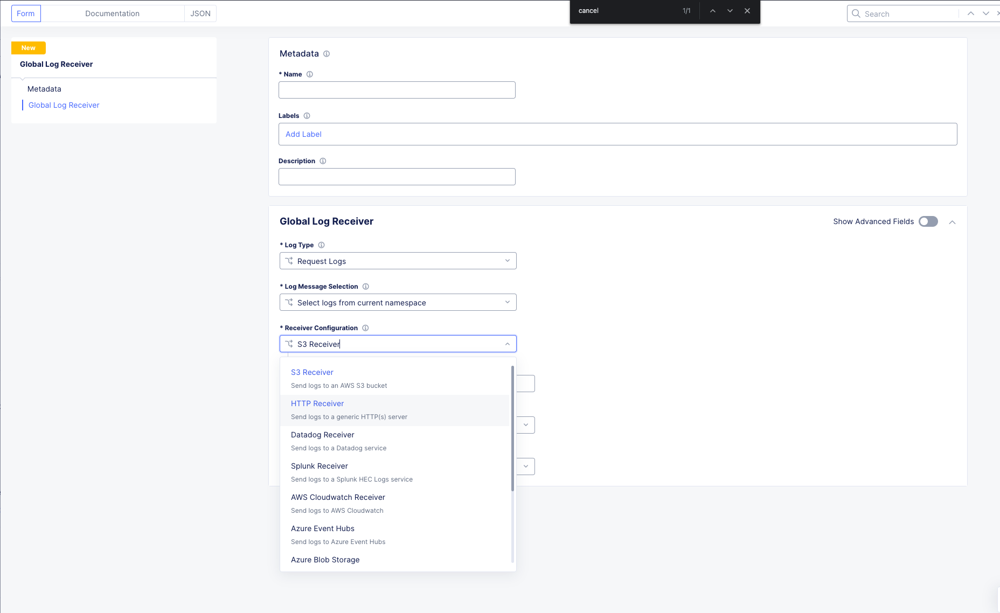

|

Click **Cancel and Exit** and Discard any changes.

**Site Local Logging**:

To observe **(NOT configure)** the Site Local Logging configuration options, in the side-menu, browse to **Manage >> Log Management >> Log Receiver** and click **Add Log Receiver**.

Click on the **Show Advanced Fields** button on the right and take note of the **Where** 

Click **Cancel and Exit** and Discard any changes.

|

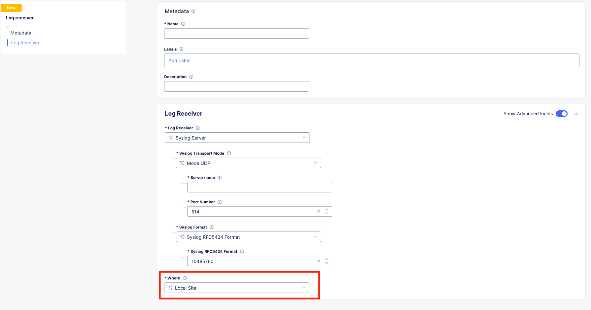

|

**Applying Site Local Logging**:

To observe **(NOT configure)** the application of the Site Local Logging profile, browse to **Manage >> Site Management >> Fleets**, click the **3 button** Action menu and click **Manage Configuration**. 

Scroll down to observe the **Logs Streaming** field under **Advanced Configuration**. Outside of the lab environment, you would enable this and select your **Log Receiver** profile.

|

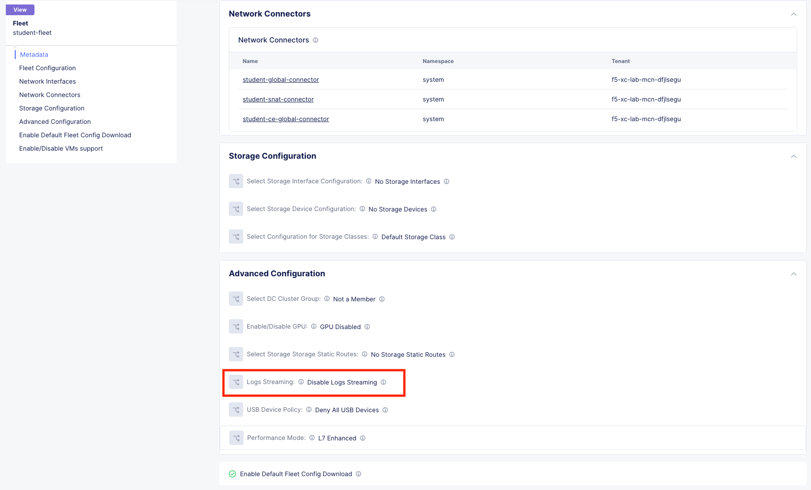

|

Click **Cancel and Exit**.

You can now feel free to explore the **Multi-Cloud Network Connect** Site menus while everyone is getting caught up. 

Click on **Site Map**, **Site Security**, which is where we would review our firewall logs in "real world", and finally, head down to the **Service Info** Section and click on **About**. 

Sanity Check
-------------
**This is what you just deployed.**

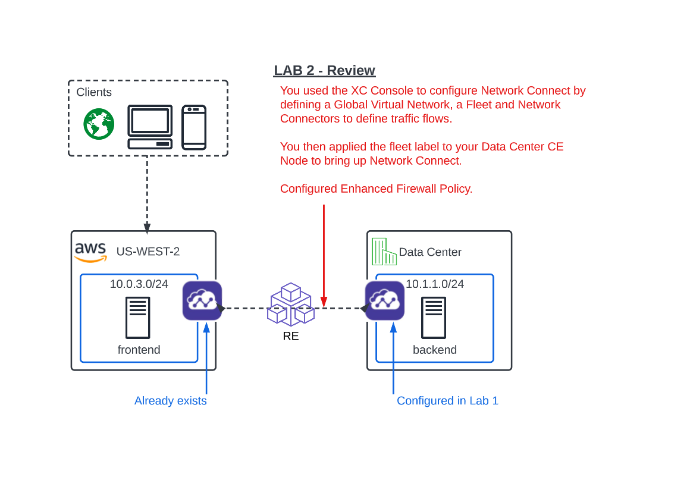

**We hope you enjoyed this lab!**

**End of Lab 2**