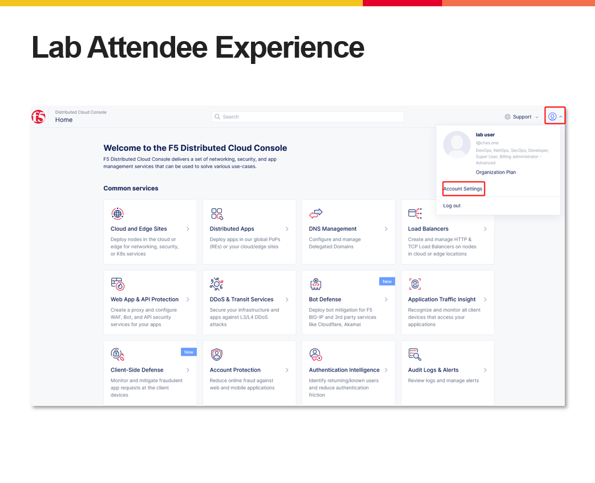
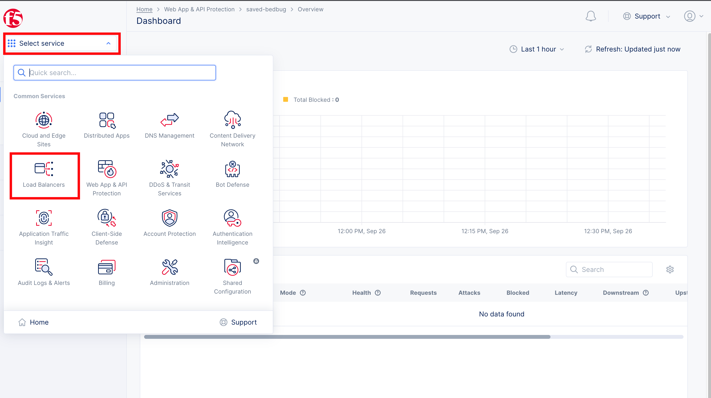
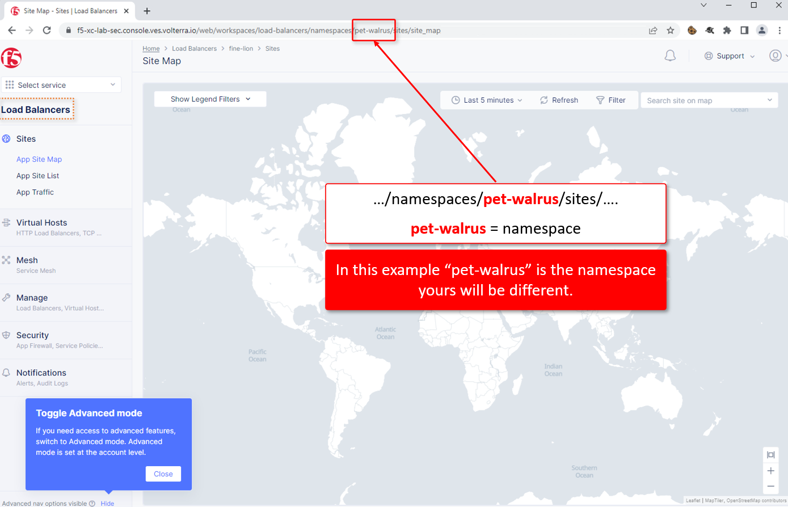

Lab 1: Access the Shared Lab Environment
========================================

Previously you should have received an email to access the shared Distributed Cloud Lab Environment.

Start by logging into Distributed Cloud Console.  You should have previously received an email to create an account.

#. Please log into your assigned Distributed Cloud tenant. https://f5-xc-lab-mcn.console.ves.volterra.io 

   .. note:: The Distributed Cloud GUI has a relatively short timeout. This is not configurable. We have an enhancement request to allow this to be configured.

#. When you first login you will need to select your "persona"

   Enter your persona as "NetOps" and level as "Intermediate".  You can change these settings after logging in as well.

   Your persona will highlight workflows within F5 Distributed Cloud.  You will be able to access all services, but making use of
   personas can focus your view on particular tasks that are relevant to your role.

#. Several tooltips will appear.  You can close these out.

#. Click on "Account Settings" by expanding the "Account" icon in the top right of the screen and 
   clicking on "Account Settings".  In the resulting window you can observe the **Work domains and skill level** section and 
   other administrative functions.
   
.. note::
   *For the purposes of this lab, permissions have been restricted to lab operations.  As some menus will be locked and not visible.*

|intro006|

|intro007|

#. Namespaces, which provide an environment for isolating configured applications or enforcing role-based access controls, are leveraged
   within the F5 Distributed Cloud Console.  For the purposes of this lab, each lab attendee has been provided a unique **namespace** which
   you will be defaulted to (in terms of GUI navigation) for all tasks performed through the course of this lab.

#. Click on the **Select Service** in the left-hand navigation. In the resulting fly out navigation, click **Load Balancers**.

#. In the **Load Balancers** configuration screen observe the URL. In the URI path, locate the **<adjective-animal>** namespace that you have
   been assigned. It will be located in the portion of the URI path between */namespaces/* and */sites/* as shown in this example 
   **…/namespaces/<namespace>/sites/…**. Note the namespace as it will be used throughout the lab tasks that follow.

   .. note::                                                                               
      *Administratively, there are other ways to find namespaces. Due to access and permission restrictions for this particular lab, those menus are not available.*

|intro008|
                                                                                   |
|intro009|                                                                                   |

.. |intro007| image:: ../images/intro-007.png
   :width: 800px

