Lab 4: App Connect - Solving IP Overlap 
===========================================

**Objective:**

*Implement App Connect to overcome IP Address overlap in AWS/Azure.  

*Provide private and secure connectivity between all sites. 

*Configure policy to only permit port 80 between these sites. 

*Review network security events in the XC console.

|

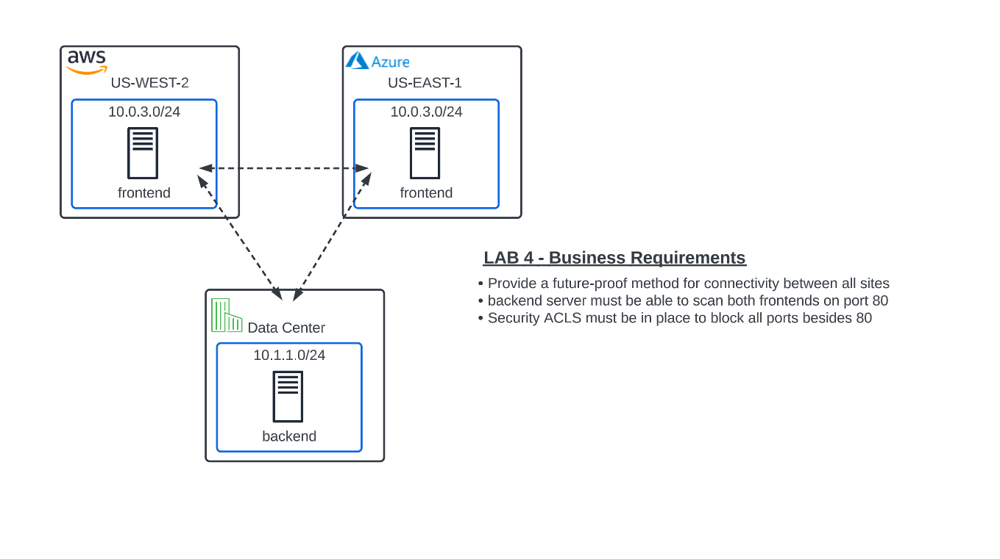

|

**Narrative:** 

Now that the globally available frontend has been deployed, it's time to start working on **Deliverable #2** and configure backend connectivity. Since Network Connect does **NOT** support IP overlap, we will configure the XC Nodes with App Connect proxies. 
Recall that Network Connect, connects networks by using the XC Nodes as Software-Defined Routers and App Connect uses the XC Nodes as Software-Defined Proxies to connect applications. Think...NetworkAAS or ProxyAAS. 

|

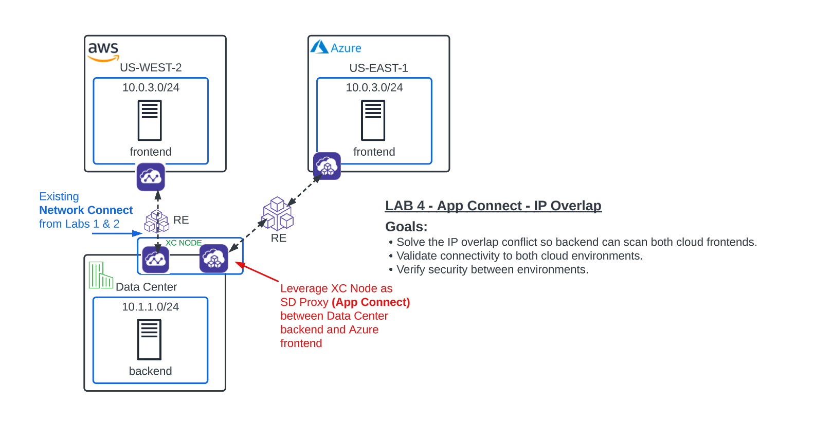

|

Multi-Cloud App Connect
----------------------------

In the **Side menu** under **Manage** click on **Load Balancers** >> **HTTP Load Balancers** and click the **Add HTTP Load Balancer** button. 

Enter the following values:

==================================      ==============
Variable                                Value
==================================      ==============
Name                                    [animal-name]-backend-vip-to-azure
Domains and LB Type                     [animal-name]-backend-vip-to-azure.lab-mcn.f5demos.com
Load Balancer Type                      HTTP
Automatically Manage DNS Records        **uncheck**
HTTP Port                               80
Origin Pools                            See Below 
==================================      ==============

**Origin Pools**

Click **Add Item** and under "Origin Pool" select the **Azure pool** with your animal name. 

Your config should look like this so far: 

|

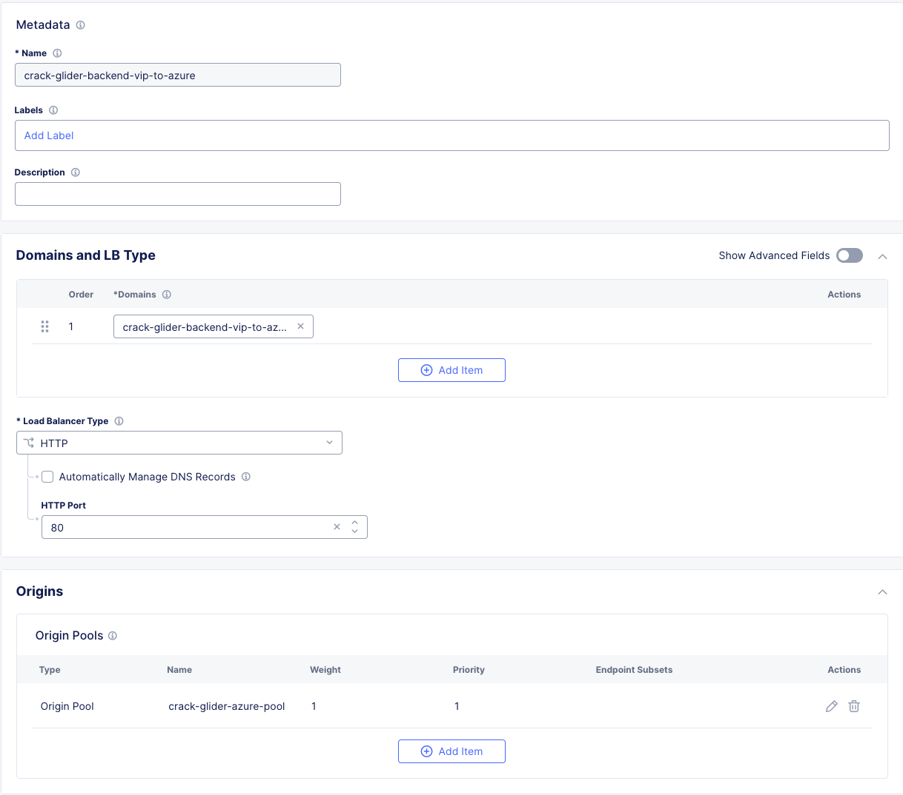

|

**Scroll** all the way down until you reach the **Other Settings** section. Here you will find the **VIP Advertisement** field. 

.. Important:: In the previous lab, we took the default of **Internet** here. This means that the load balancer will be distributed across all Regional Edges in our anycast network. This time we will choose our Data Center CE to host the load balancer.

Hit the dropdown and select **Custom**. 

|

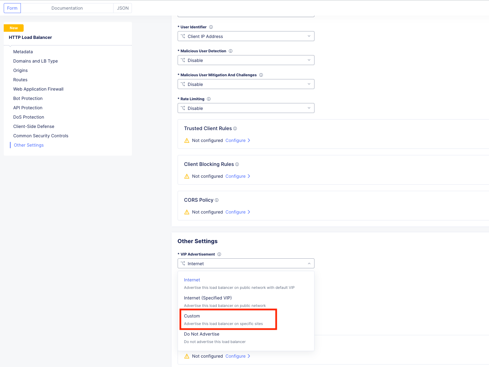

|

Now click the **Configure** link right below that field: 

|

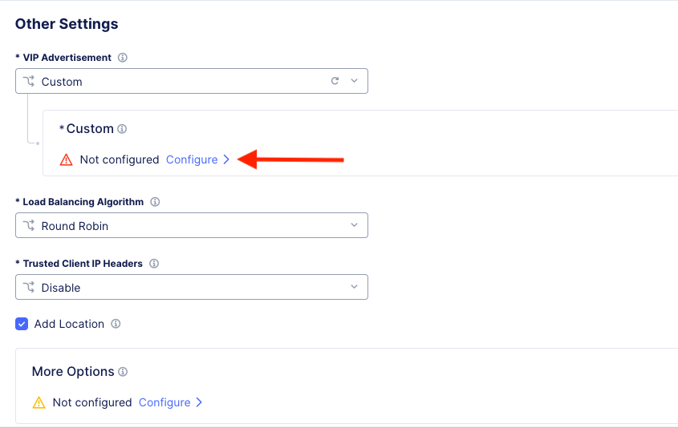

|

On the **"List of Sites to Advertise"** screen click **Add Item**. 

Enter the following values:

==============================    =========================================================
Variable                          Value
==============================    =========================================================
Select Where to Advertise         Site
Site Network                      Outside Network (Since we only have 1 interface on our CE Node, it is "Outside" by default)
Site Reference                    system/[animal-name]
TCP Listen Port Choice            TCP Listen Port
TCP Listen Port                   80
==============================    =========================================================

|

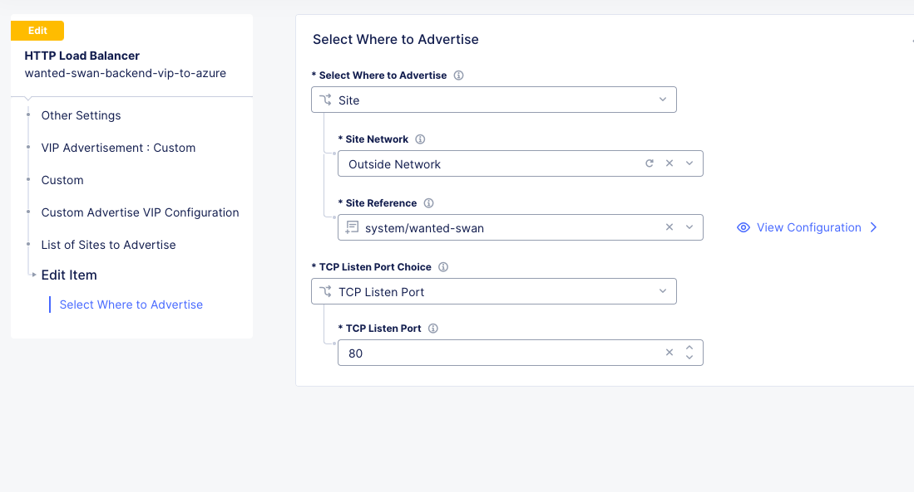

|

Click on **Apply**, **Apply**, and then **Save and Exit** on the main **HTTP Load Balancer** config screen. 

Testing Internal LB
----------------------
If that seemed easy, it's because it was. Now, you will test the load balancer that you just configured on the Data Center XC Node.  

|

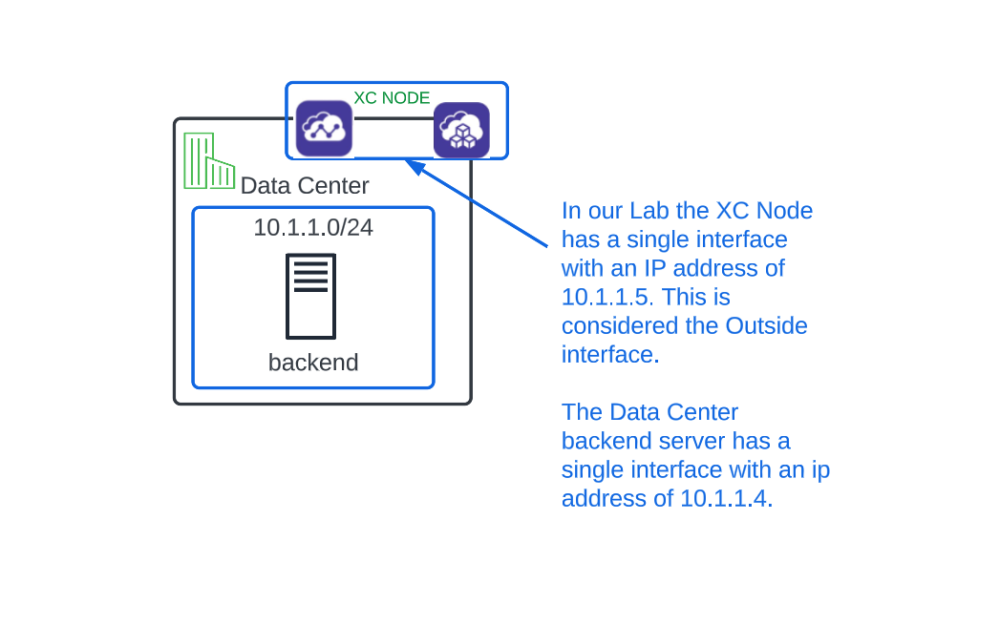

|

From the Ubuntu Client (backend) **Web Shell** browser tab, type the following command and hit Enter. 

curl http://10.1.1.5 

|

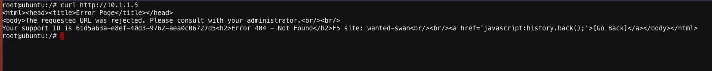

|

Uh oh....! **404 Not Found**? But why? 

Recall the mandatory **Domains** field that was required when you configured the HTTP load balancer. **XC App Connect HTTP Load Balancers natively perform Domain Name enforcement and DO NOT respond to requests without the expected Domain Name.**

|

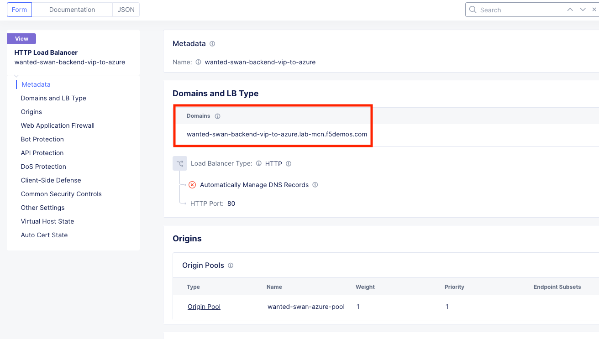

|

We will now use a tool to help test this with a built-in "resolve" function. 

From the Ubuntu Client **Web Shell** browser tab, type the following command **(with your animal-name)** and hit **Enter**.::

    curl --head http://[animal-name]-backend-vip-to-azure.lab-mcn.f5demos.com --resolve [animal-name]-backend-vip-to-azure.lab-mcn.f5demos.com:80:10.1.1.5

|

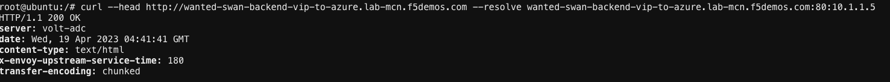

|

In my example, my animal-name was **wanted-swan**. If you want to see the full HTML of the site you can **up arrow** and run the command again without the **\-\-head** flag.::

    curl  http://[animal-name]-backend-vip-to-azure.lab-mcn.f5demos.com --resolve [animal-name]-backend-vip-to-azure.lab-mcn.f5demos.com:80:10.1.1.5

|

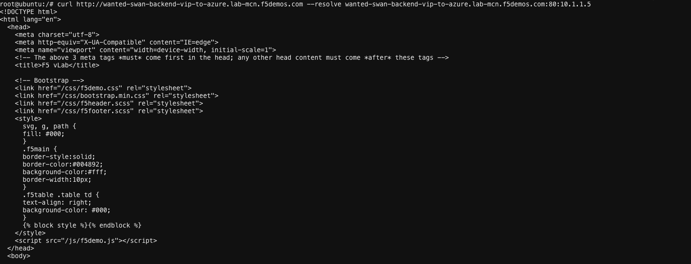

|

Success! Your stomach growls and it's time for lunch! You have now met every requirement thrown at you thus far with F5 Distrib.... **Ring Ring** 

.. Important:: Your phone rings! Just as you were finishing up your testing and about to head to lunch, the CIO calls your desk directly with an urgent request and it sounds like that new Pho restaurant is going to have to wait. There is an immediate requirement for the frontend in AWS to connect to and API on the frontend in Azure privately over port 80. Additionally, this API should be "Read Only" for any API clients originating in the Data Center. This traffic CAN NOT be sent unencrypted over the Internet. Can we use F5 Distributed Cloud? 

Narrative Update
----------------------
You have met all the requirements thus far, but that phone call had a real sense of urgency to it so, you're going to have to act fast. 

Unfortunately, you don't have access to any of the workloads in the CSP environments but one of your friends over on the Application team recently let you know about a diagnostic tool they use on their AWS frontend. It's called the "In-Container-Diagnostic tool" and it runs on their AWS instance on port 8080. 
They said you could use it if you need to test connectivity from the AWS frontend to the Azure frontend but they can't give you direct access to the container or workload itself. 

"No problem" you reply, and quickly set out to configure a new frontend in XC for the Diag tool. After you expose the Diag tool, you will configure and test via the Diag tool, an internal load balancer for port 80 traffic between the AWS frontend and Azure frontend. 

|

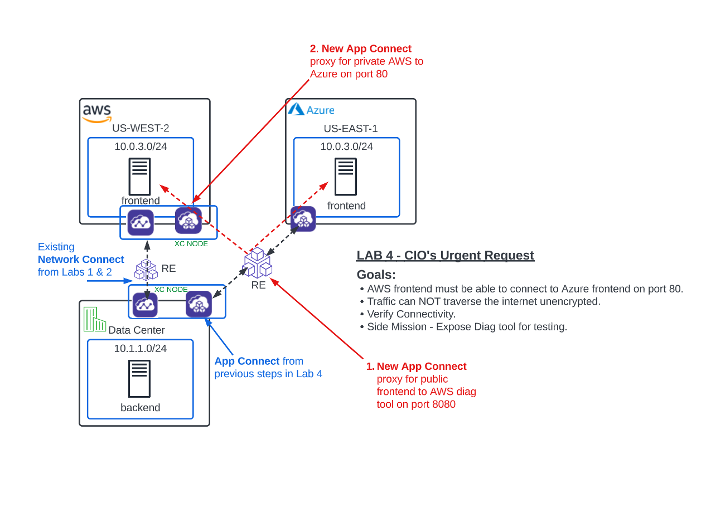

|

Expose AWS Diag Tool
----------------------

In the **Side menu** under **Manage** click on **Load Balancers** >> **Origin Pools** and click the **Add Origin Pool** button. 

==================================      ==============
Variable                                Value
==================================      ==============
Name                                    [animal-name]-awstool-pool
Origin Servers                          **Add Item** > See Below
Origin Server Port                      8080
==================================      ==============

**Origin Servers**

==================================      ==============
Variable                                Value
==================================      ==============
Select Type of Origin Server            IP address of Origin Server on given Sites
IP                                      10.0.3.253
Site or Virtual Site                    Site
Site                                    system/student-awsnet
Select Network on the site              Inside
==================================      ==============

Click **Apply** and the **Save and Exit**. 

|

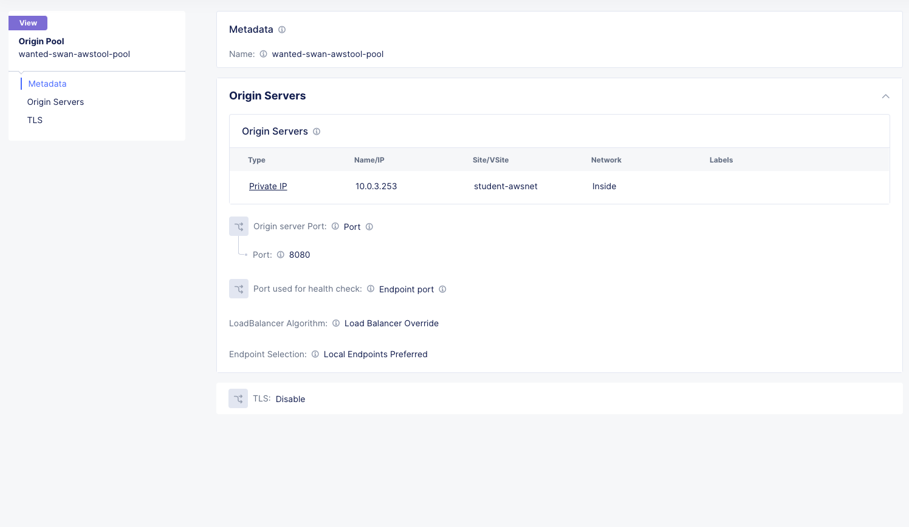

|

In the **Side menu** under **Manage** click on **Load Balancers** >> **HTTP Load Balancers** and click the **Add HTTP Load Balancer** button. 

Enter the following values:

==================================      ==============
Variable                                Value
==================================      ==============
Name                                    [animal-name]-awstool
Domains and LB Type                     [animal-name]-awstool.lab-mcn.f5demos.com
Load Balancer Type                      HTTP
Automatically Manage DNS Records        **check** (Important!)
HTTP Port                               80
Origin Pools                            **Add Item** and select [animal-name-awstool-pool] and click **Apply**. 
==================================      ==============

|

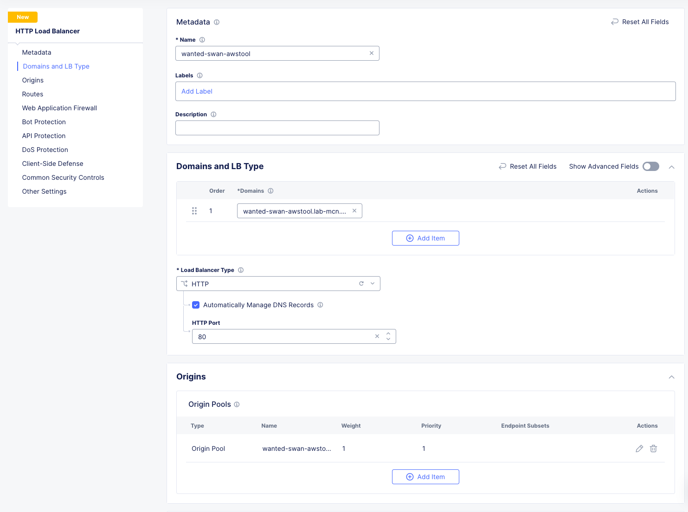

|

Click **Save and Exit**. 

You should now be able to access the new globally availalable tool by accessing the following URL with your animal-name: 

http://[animal-name]-awstool.lab-mcn.f5demos.com

|

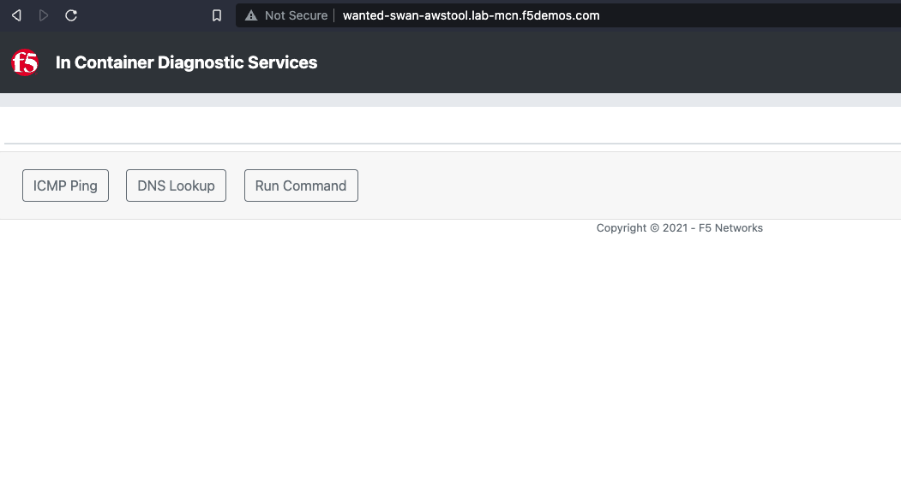

|

.. Note:: Please see a lab assistant if you can not access the tool site. 

Create AWS to Azure LB
------------------------

Now that we have a way to test connectivity between AWS and Azure all we need to do is setup the HTTP Load Balancer (App Connect Proxy) to provide the secure connectivity. 

Back in XC Console, from the **Side menu** under **Manage** click on **Load Balancers** >> **HTTP Load Balancers** and click the **Add HTTP Load Balancer** button. 

Enter the following values:

==================================      ==============
Variable                                Value
==================================      ==============
Name                                    [animal-name]-aws-to-azure-lb
Domains and LB Type                     [animal-name]-aws-to-azure-lb.lab-mcn.f5demos.com
Load Balancer Type                      HTTP
Automatically Manage DNS Records        **uncheck**
HTTP Port                               80
Origin Pools                            **Add Item** and select [animal-name-azure-pool] and click **Apply**. 
VIP Advertisement (at bottom)           **Custom** Click **Configure** See Below. 
==================================      ==============

Under **List of Sites to Advertise**,  click **Add Item**. 

**VIP Advertisement**

==================================      ==============
Variable                                Value
==================================      ==============
Select Where to Advertise               Site
Site Network                            Inside (The AWS node has 2 interface. Inside/Outside)
Site Reference                          system/student-awsnet
TCP Listen Port Choice                  TCP Listen Port
TCP Listen Port                         80
==================================      ==============

Click **Apply** and it should look ike this:  

|

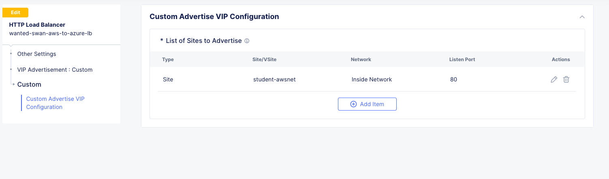

|

Click **Apply** and then **Save and Exit** from the HTTP Load Balancer creation screen.

If you search your HTTP Load Balancers for your **animal-name**, you should now see 4 as per the example below:

|

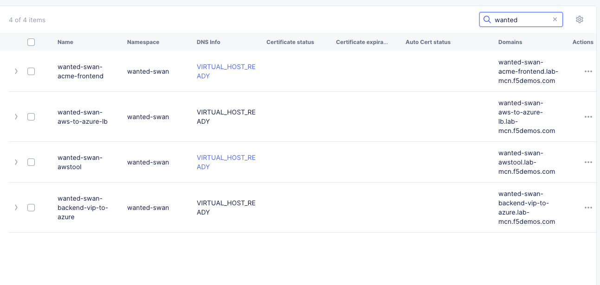

|

Testing AWS to Azure LB
------------------------

You now have a load balancer running in AWS on the inside interface of your AWS XC Node. The inside interface IP of the AWS XC Node is **10.0.5.176**. 

We will now use the In-Container Diag tool to test connectivity.  

If you don't already have a tab open to the Diag tool, in your browser go to: http://[animal-name]-awstool.lab-mcn.f5demos.com

Click on **Run Command** and paste in the following:: 

    curl  http://[animal-name]-aws-to-azure-lb.lab-mcn.f5demos.com --resolve [animal-name]-aws-to-azure-lb.lab-mcn.f5demos.com:80:10.0.5.176

|

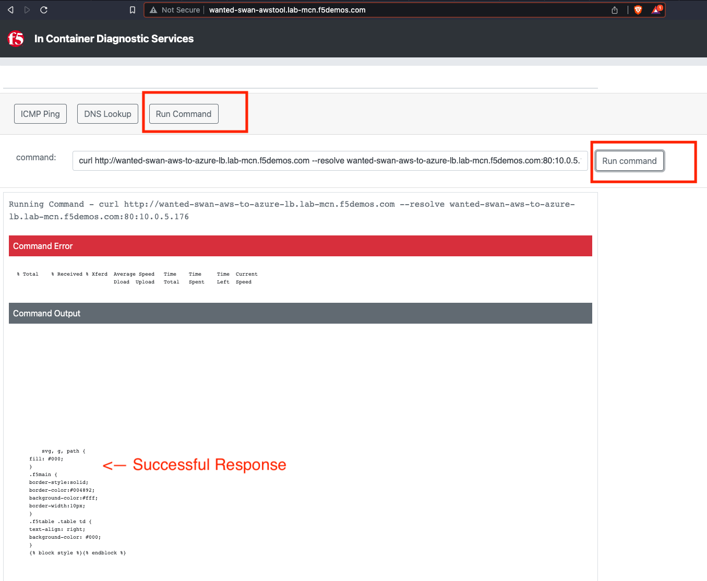

|

In just a few moments, you now have full proxy connectivity between IP Overlapped AWS and Azure resources over a private encrypted tunnel! Pretty sweet huh?

Let's try that command again but with the shorthand version by using **\-\-head**::

    curl --head  http://[animal-name]-aws-to-azure-lb.lab-mcn.f5demos.com --resolve [animal-name]-aws-to-azure-lb.lab-mcn.f5demos.com:80:10.0.5.176

|

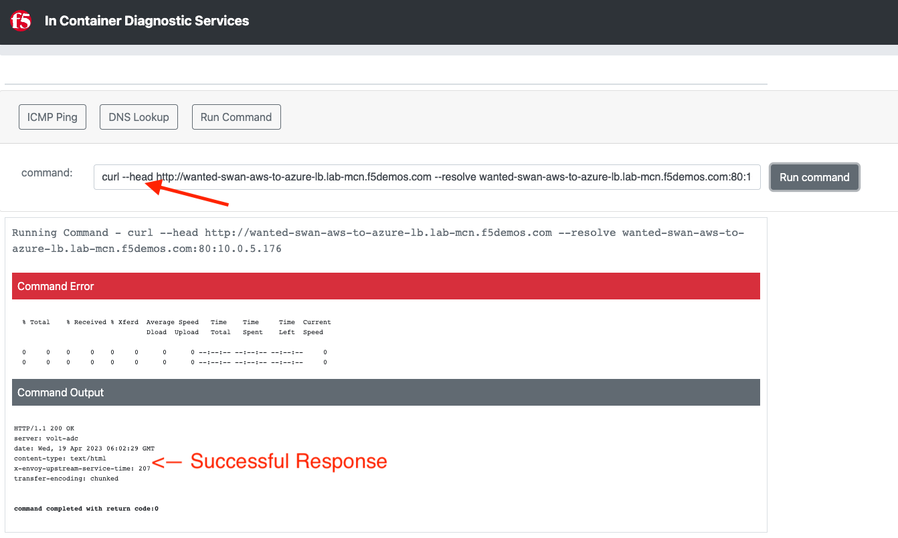

|

Adding Security
------------------------

You just configured an App Connect Proxy listening on port 80 of the Inside interface of the AWS XC Node. Since the App Connect Proxy is **default-deny** and only accepts traffic on the configured load balancer port with the appropriate Layer 7 Domain information, we can rest assured that no other ports will be permitted. 

The second request to ensure that the **pretend API running on port 80 in Azure is Read Only or R/O**, can easily be solved with a Service Policy. For ease of demonstration we will make use of two HTTP methods and **pretend that HEAD is R/W** and of course **GET is natively R/O.**

Head is one of many HTTP methods used to interact with API's amongst other things. Some other common ones are GET, POST and PUT. 

Technically speaking, The HEAD method is identical to GET except that the server MUST NOT return a message-body in the response. 

.. Note:: In our Lab we are just pretending that HEAD is R/W. 

What if we we didn't want to allow **HEAD** or only allow certain HTTP methods between these two workloads? 

In general, for any of our HTTP Load Balancers, what if we wanted to block a geolocation? 
What if we wanted to allow some IP's and disallow others? How about file type enforcements?

**Service Policies to the Rescue!**

Service Policies
------------------

While Service Policies can do many things, we will go through a quick exercise to simply block the HTTP Method of **HEAD** for our AWS to Azure HTTP Load Balancer. This example could easily be expanded upon. 

When you create a **Service Policy** it intrinsically contains a **default deny**. Therefore, our Service Policy will actually be a definition of what is allowed. 

Back in XC Console, from the **Side menu** under **Security**, click on **Service Policies** >> **Service Policies** and click the **Add Service Policy** button. 

==================================      ==============
Variable                                Value
==================================      ==============
Name                                    [animal-name-allow-get-sp]
Server Selection                        Server Name
Server Name                             [animal-name]-aws-to-azure-lb.lab-mcn.f5demos.com
Select Policy Rules                     Custom Rule List
Rules                                   **Configure**, Click **Add Item** > See Below:
==================================      ==============

**Rules**

==================================      ==============
Variable                                Value
==================================      ==============
Name                                    allow-get
Action                                  Allow
Clients                                 Any Client
Servers                                 **Add Item** >> [animal-name]-aws-to-azure-lb.lab-mcn.f5demos.com
HTTP Method/Method List                 Get
HTTP Path                               **Configure** >> **Add Item** add **/** under **Prefix Values**. 
==================================      ==============

Click **Apply**. 

|

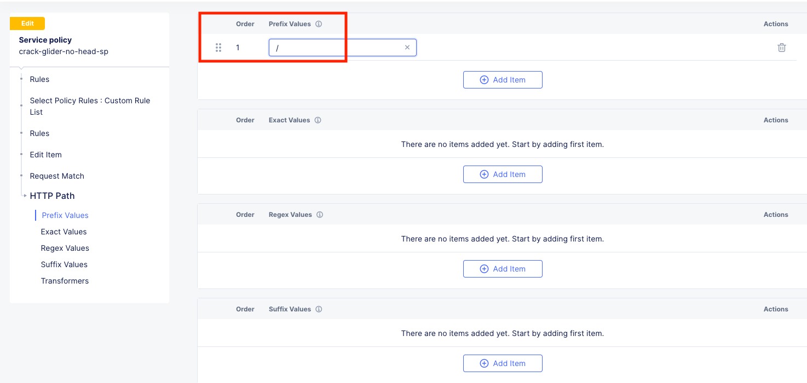

|

|

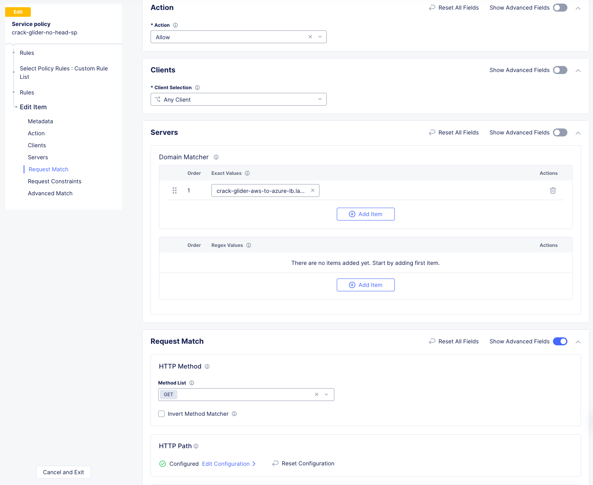

|

Scroll down and click **Apply**. 

|

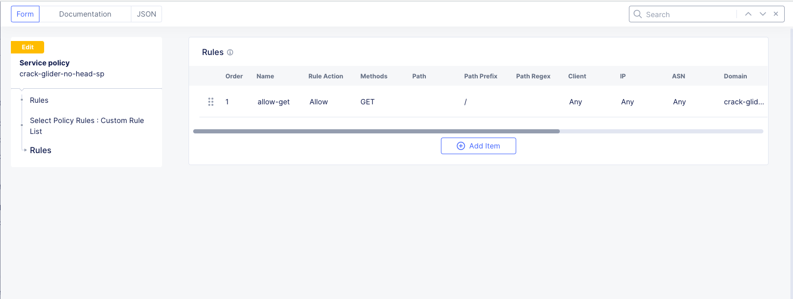

|

Click **Apply**. 

|

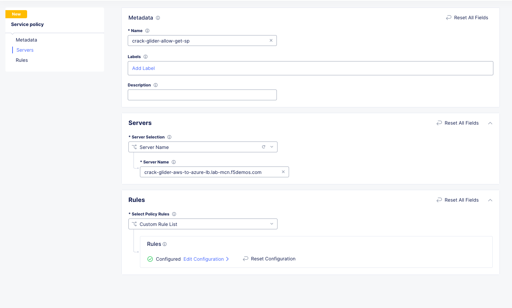

|

Click **Save and Exit**. 

Apply Service Policy
---------------------

In the **Side menu** under **Manage** click on **Load Balancers** >> **HTTP Load Balancers** and then click the **3 Button** Action Menu >> **Manage Configuration** under your **[animal-name]-aws-to-azure-lb**.

Click **Edit Configuration** and scroll down to **Common Security Controls**. 

Under **Service Policies**, hit the dropdown and choose, **Apply Specified Service Policies** and then click the blue **Configure**.

Choose your **[animal-name]-allow-get-sp** and click **Apply** and then **Save and Exit**. 

|

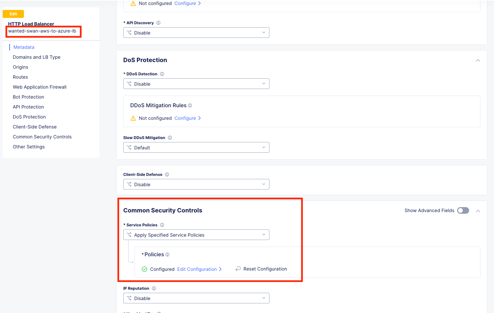

|

Test Service Policy
-------------------

If you don't already have a tab open to the Diag tool, in your browser go to: http://[animal-name]-awstool.lab-mcn.f5demos.com

Try your curl command again **without** the **--head** flag.:: 

    curl http://[animal-name]-aws-to-azure-lb.lab-mcn.f5demos.com --resolve [animal-name]-aws-to-azure-lb.lab-mcn.f5demos.com:80:10.0.5.176

|

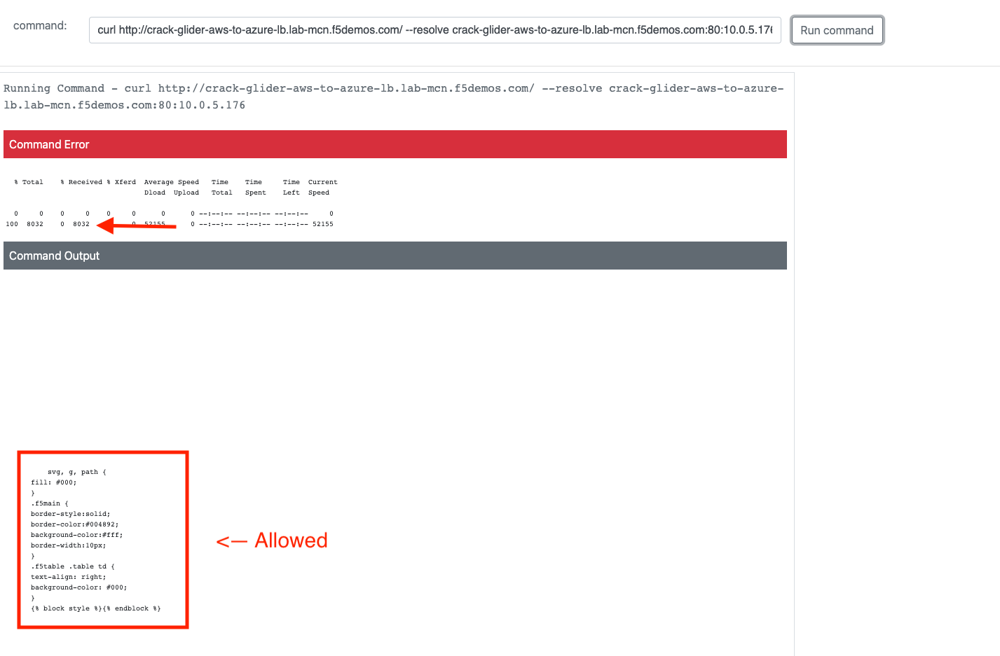

|

Now run the command again but insert the **\-\-head** command.::

    curl --head  http://[animal-name]-aws-to-azure-lb.lab-mcn.f5demos.com --resolve [animal-name]-aws-to-azure-lb.lab-mcn.f5demos.com:80:10.0.5.176

|

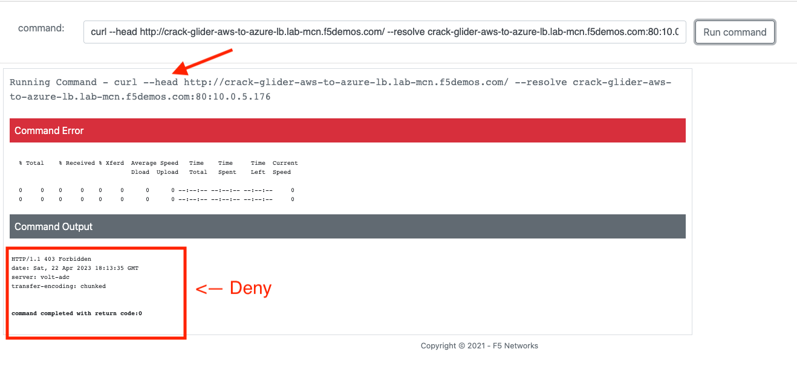

|

You have now successfully configured an application layer **Service Policy** that enforces HTTP methods. 

.. Note:: This is a primitive example of a much more powerful construct that can be used to enforce, secure and manipulate HTTP traffic much like iRules did on F5's classic BIG-IP platform. 

Review Service Policy Logs
---------------------------

Back in XC Console, from the **Side menu** under **Virtual Hosts** click on **HTTP Load Balancers** and then click on your **[animal-name]-aws-to-azure-lb**.

|

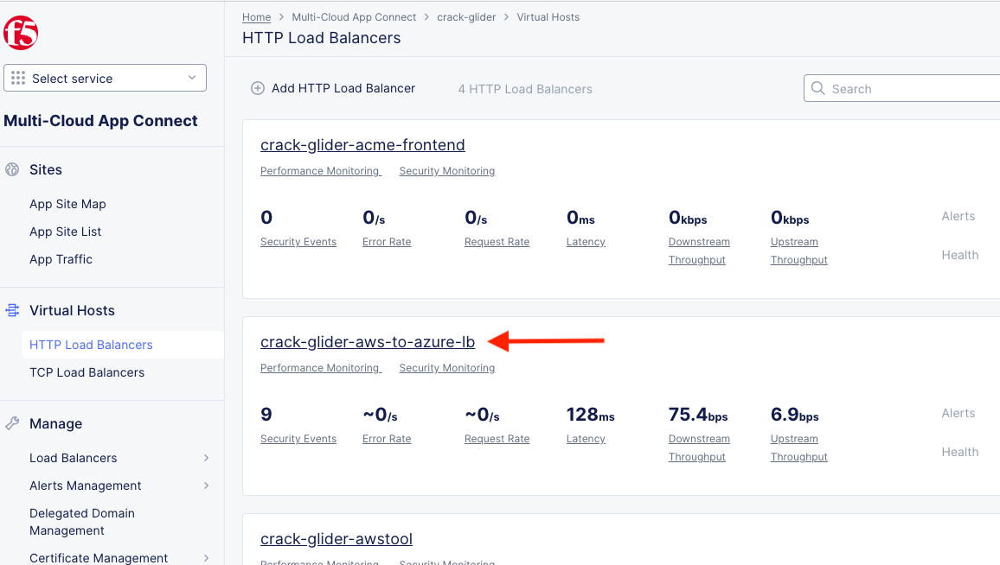

|

Take a moment to observe some of the analytics and then click on the **Requests** tab at the top of the page. 

|

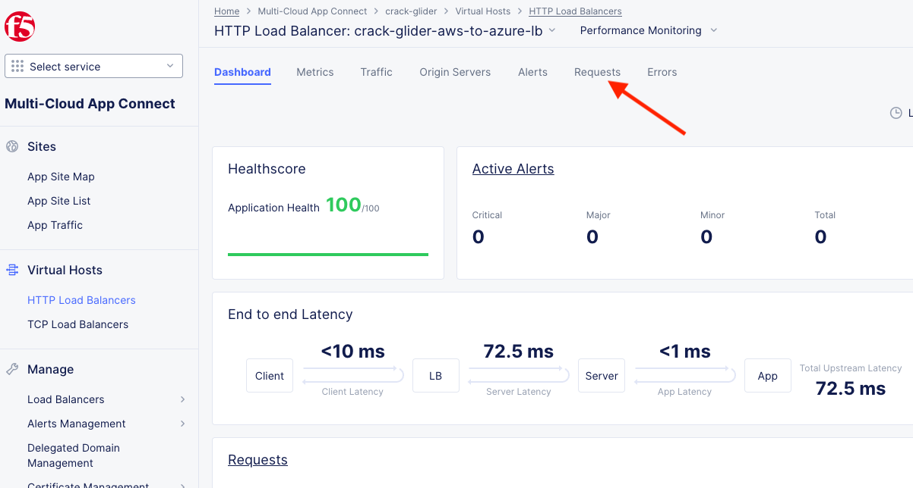

|

Here you will find the full request log. You will see the request path as well as the response code given back to the client. 
You may have to click refresh in the upper right or change your time frame if you took a break or don't see any data. 

|

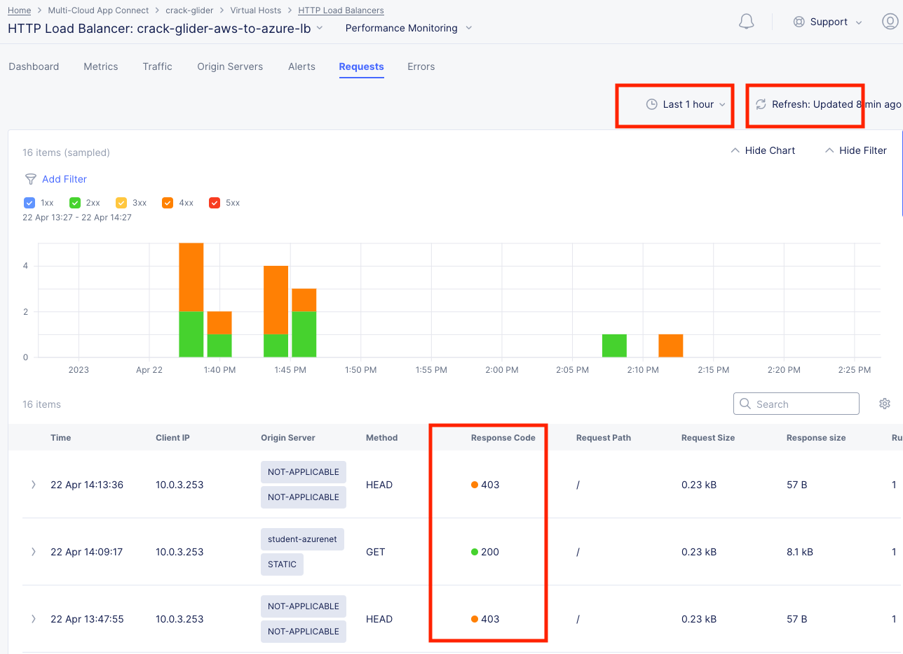

|

**Expand** one of the log entries that had a **403** response code. These were the forbidden **Head** requests. 
Look through the request data and determine the policy that was applied to the request as well as the **result**. 

|

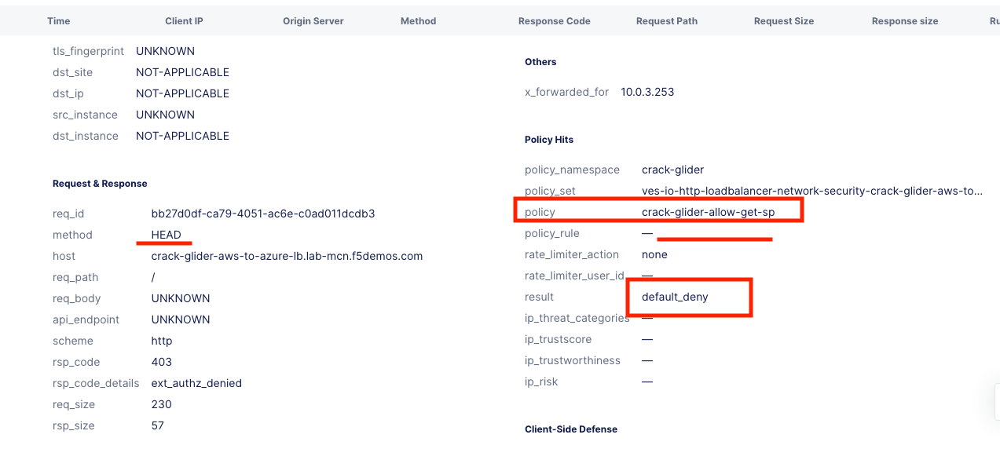

|

**Expand** one of the log entries that had a **200** response code. These were the allowed **Get** requests. 
Look through the request data and determine the policy that was applied to the request as well as the **result**. 

|

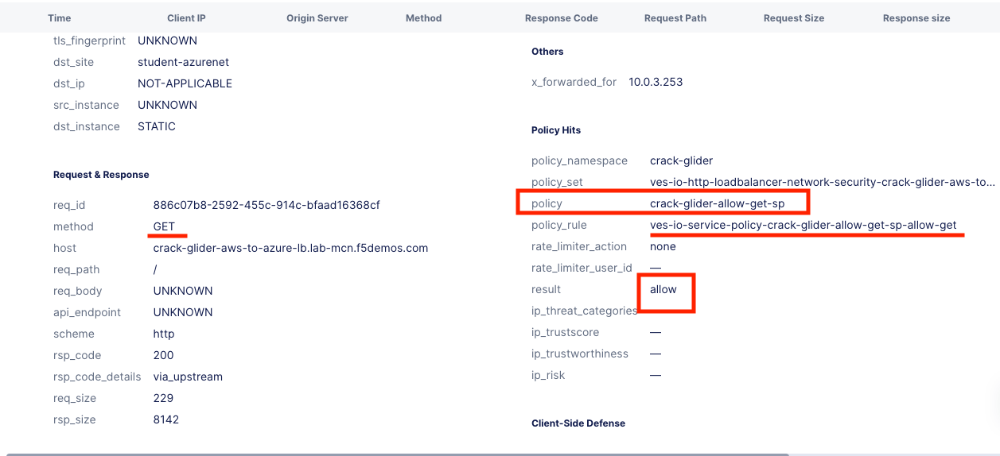

|

**Great job! You have now quickly completed every requirement thrown at you with F5 Distributed Cloud App Connect and Network Connect concepts.**

There is a final bonus lab that will showcase some App Layer Routing and Security Concepts as well. 

Sanity Check
-------------
**This is what you just deployed.**

|

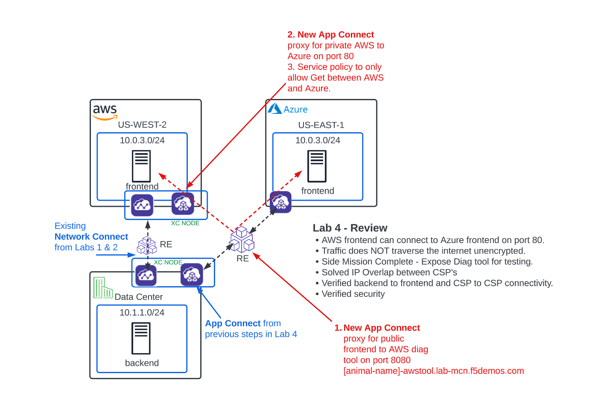

|

**We hope you enjoyed this lab!**

**End of Lab 4**
