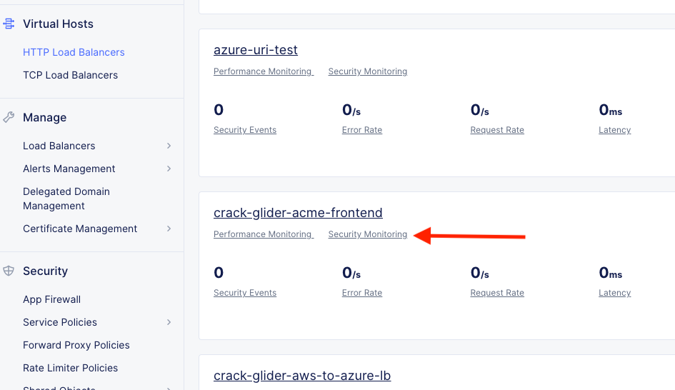

Lab 5: Bonus Lab - L7 App Routing & Security 
==============================================

**Objective:**

*Configure the Global Frontend to perform Layer 7 routing.

*Configure security policy to protect the frontends from OWASP Top 10 web attacks.  

*Test connectivity and review application security events in the XC console.

**Narrative:** 

Much like "The Real World", the requirements never stop coming. Now, ACME has 2 new deliverables for you to figure out. 

**First**, a new API has been added to the cloud frontends and will require Layer 7 routing at the global frontend in XC. 
The requirement is for any requests that have **/aws** in the URI should be routed to AWS. 
Any requests with **/azure** should be routed to Azure. 

**Second**, ever since exposing the frontends globally, they have noticed alot of attack type traffic coming in to their application. 
They have asked if there is a way to apply security policy to identify and remediate these attacks which seem to target the application with common OWASP Top 10 type attacks.  

|

|

L7 App Routing
---------------

**Adding Layer 7 App Routing with F5 Distributed Cloud is a simple task,** but one thing we haven't done yet is configure an **internal pool** for the **AWS workload**. So far, we have been pointing at a public DNS name in the AWS Origin pool, so that could in theory, change or resolve to different IP's/AZ's, at different times. 
What we essentially want is a static proxy into the AWS environment that this one particular frontend is located in, which is also where our CE Node is deployed.

In the **Side menu** under **Manage** click on **Load Balancers** >> **Origin Pools** and click **Manage Configuration** under the **3 Button** Action Menu on your **[animal-name]-azure-pool**. 

Cick **Clone Object**.

|

.. image:: ../images/clone.png

|

For the name call it: **[animal-name]-aws-internal** and click the pencil **edit** icon next to the **Origin Server**. 

|

|

Simply change the **Site** from **system/student-azurenet** to **system/student-awsnet**. 

|

|

Click **Apply** 

Your Origin Pool config should now look like this: 

|

|

Click **Save and Exit**. 

Now we will configure the **Global Frontend** Load Balancer to point at both the AWS and Azure "IP-overlapped workloads" and we will add Layer 7 URI routing so traffic arrives at the appropriate Origin Server.  

In the **Side menu** under **Manage** click on **Load Balancers** >> **HTTP Load Balancers** and click on the **3 Buttons** under the **Actions** menu for your **animal-name-acme-frontend**.

Click **Manage Configuration** and then **Edit Configuration** in the top right. 

|

|

Scroll down to where you see **Routes** and click the blue hyperlink "**Configure**"

|

|

Click **Add Item**.

Enter the following values:

==================================      ==============
Variable                                Value
==================================      ==============
Route Type                              Simple Route
HTTP Method                             GET
Path Match                              Prefix
Prefix                                  /aws
Headers                                 Leave Default
Origin Pools                            **Add Item** >> Origin Pool = **[animal-name]-aws-internal**, Click **Apply**.
Host Rewrite Method                     Disable Host Rewrite
==================================      ==============

Click **Apply**. 

Click **Add Item** again.

==================================      ==============
Variable                                Value
==================================      ==============
Route Type                              Simple Route
HTTP Method                             GET
Path Match                              Prefix
Prefix                                  /azure
Headers                                 Leave Default
Origin Pools                            **Add Item** >> Origin Pool = **[animal-name]-azure-pool**, Click **Apply**.
Host Rewrite Method                     Disable Host Rewrite
==================================      ==============

Click **Apply**, **Apply**, **Save and Exit**.

|

|

Testing L7 Routing
--------------------

In your browser open a new tab to: **http://[animal-name]-frontend.lab-mcn.f5demos.com**

Once you have loaded the site sucessfully, try adding the URI **/aws** and reload the page. 

You should see this: 

|

|

Now try adding the URI **/azure** and reload the page.

You should see this: 

|

|

So, how do we know for certain which workload was actually answering and this wasn't all smoke and mirrors?

Back in XC Console, from the **Side menu** under **Virtual Hosts**, click on **HTTP Load Balancers**. 

Click on **Performance Monitoring** under your **[animal-name-acme-frontend]** and then click the **Requests** tab (top middle).

.. Note:: Remember to click refresh and adjust time-frame as necessary. 

|

|

Notice the requests clearly show the URI and the Origin Server. 

|

|

Mission accomplished yet again!!! And with only a few short steps and simple concepts. The more you use F5 Distributed Cloud, the more powerful you become but as you know, with that power comes great responsibility...especially with security! 

L7 Security
---------------

If you haven't noticed, all along today, there has always been an underlying theme of security in all of the configurations we setup. It's very rare in this day and age to expose a resource or public frontend without some basic protection. 

A common theme was also reviewed in the narrative above. Your new public frontend has started getting alot of unwanted attention and there is an immediate need to apply some security controls to expose and mitigate the unwanted traffic. We hear from customers with this request every day. 

With **F5 Distributed Cloud App Connect**, adding a WAF policy is just as easy as everything else we've setup so far. 

**First**, we will test out our attacks on the site without any WAF policy and observe the response. 

Testing Vulns
---------------

For a SQL Injection (SQLi) attack, run the following command from your "Online Diag Tool". If you closed or lost that tab, the link is: **http://[animal-name]-awstool.lab-mcn.f5demos.com**

SQLi::

    curl -A "Mozilla/5.0', (select*from(select(sleep(20)))a)) #" http://[animal-name]-frontend.lab-mcn.f5demos.com/ --resolve [animal-name]-frontend.lab-mcn.f5demos.com:80:159.60.128.61

|

|

For some various other attacks you can modify the command and URI as shown below and try these: 

Other Attack Samples::

    curl -X GET "http://[animal-name]-frontend.lab-mcn.f5demos.com/?cmd=cat%20/etc/passwd" --resolve [animal-name]-frontend.lab-mcn.f5demos.com:80:159.60.128.61

Or::
    
    curl -X GET "http://[animal-name]-frontend.lab-mcn.f5demos.com/product?id=4%20OR%201=1" --resolve [animal-name]-frontend.lab-mcn.f5demos.com:80:159.60.128.61

Or::

    curl -X GET "http://[animal-name]-frontend.lab-mcn.f5demos.com/../../../../etc/shadow" --resolve [animal-name]-frontend.lab-mcn.f5demos.com:80:159.60.128.61

Here are the URI paths from above for easy reference: 

**/?cmd=cat%20/etc/passwd**

**/product?id=4%20OR%201=1**

**/../../../../etc/shadow**

|

|

Now that you've confirmed that the application is indeed vulnerable to these types of attacks, it's time to put a WAF policy in place and start blocking these immediately. 

Applying WAF 
---------------

Back in XC Console, from the **Side menu** under **Manage**, click on **Load Balancers**, **HTTP Load Balancers** >> Actions >> **Manage Configuration** for the **[animal-name]-acme-frontend**. 

Click **Edit Configuration** and scroll down to the **Web Application Firewall** section. In the dropdown choose **Enable**

Under **Enable**, click **Add Item**. 

For a name, call it your **[animal-name]-waf** and set the **Enforcement Mode** to blocking. Leave all others **default** and click **Continue**. 

|

|

Your HTTP Load Balancer Configuration should now look like this. 

|

|

Click **Save and Exit**. 

Testing Vulns with WAF 
-----------------------

For the SQL Injection (SQLi) attack, run the following command from your "Online Diag Tool". If you closed or lost that tab, the link is: **http://[animal-name]-awstool.lab-mcn.f5demos.com**

SQLi::

    curl -A "Mozilla/5.0', (select*from(select(sleep(20)))a)) #" http://[animal-name]-frontend.lab-mcn.f5demos.com/ --resolve [animal-name]-frontend.lab-mcn.f5demos.com:80:159.60.128.61

|

|

For some various other attacks you can modify the command and URI as shown below and try these: **All should be Blocked or "Rejected"**.

Other Attack Samples::

    curl -X GET "http://[animal-name]-frontend.lab-mcn.f5demos.com/?cmd=cat%20/etc/passwd" --resolve [animal-name]-frontend.lab-mcn.f5demos.com:80:159.60.128.61

Or::
    
    curl -X GET "http://[animal-name]-frontend.lab-mcn.f5demos.com/product?id=4%20OR%201=1" --resolve [animal-name]-frontend.lab-mcn.f5demos.com:80:159.60.128.61

Or::

    curl -X GET "http://[animal-name]-frontend.lab-mcn.f5demos.com/../../../../etc/shadow" --resolve [animal-name]-frontend.lab-mcn.f5demos.com:80:159.60.128.61

|

|

Reviewing WAF Logs 
-----------------------

In this final section, we will review the WAF logs for the attacks we just tested.

Back in XC Console, from the **Side menu** under **Virtual Hosts**, click on **HTTP Load Balancers**. 

Click on **Security Monitoring** under your **[animal-name-acme-frontend]** and then click the **Security Events** tab (top middle).

|

|

.. Note:: Remember to click refresh and adjust time-frame as necessary. 

|

|

Click on the **Requests** tab (top middle) and then click the **Add Filter** icon: 

|

|

Type **waf** in the search field, and select **waf_action** >> **In** >> **Block** >> **Apply**. 

|

|

You can now see a filtered **Request Log** view of all blocked events. Feel free to play around with other filters and explore the security events. 

Sanity Check
-------------
**This is what you just deployed.**

|

|

Outro
--------

What a long day it has been at ACME corp.... but you look at your watch and realize that you could have never setup what you just did, in the time it took you, even 3 years ago. The magic of F5 Distributed Cloud Network Connect and App Connect solutions greatly simplify modern problems while saving time and enhancing security. 

**We hope you enjoyed this lab!**

**End of Lab 5**

