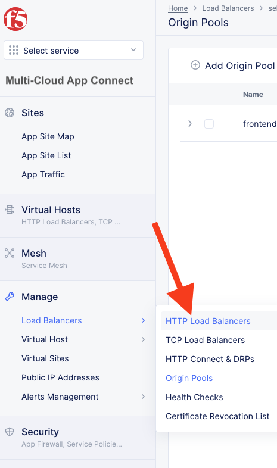
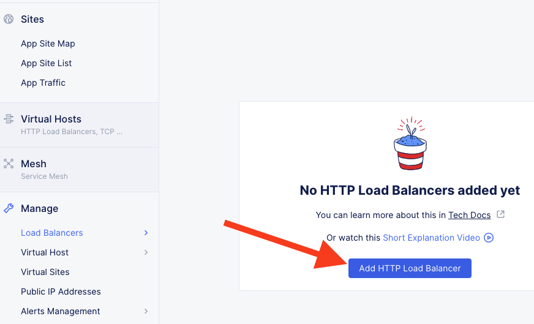

Lab 2: Create HTTP Load Balancer
================================

In this lab exercise we will create an HTTP Load Balancer that will allow you
to access frontend application that will allow you to explore the AWS environment.

We will first access the AWS environment by connecting directly to an EC2 instance 
that is directly exposed on the Public Internet.

Afterwards we will connect via a secure tunnel through a Distributed Cloud Mesh node
to an EC2 instance that does not have a Public IP.

You will first create an origin pool for your frontend application in AWS.

Afterwards you will create a HTTP Load Balancer that will reference your origin pool 
and expose the service on Distributed Cloud's Regional Edge.

In the following lab we will add an additional "backend" resource that will allow us 
to connect to our "on-prem" site.

.. image:: ../images/httplb-lab.png

Regional Edge
~~~~~~~~~~~~~

We have already deployed the UDF / AWS sites. These are considered a "Customer Edge (CE)" and they make use of a Regional Edge (RE) to communicate. (Each CE is associated with two REs.) REs are part of the Distributed Cloud Global Network that provides connectivity to services.

Exercise 1:  Public Origin Pool
~~~~~~~~~~~~~~~~~~~~~~~~~~~~~~~~~~~
We will first create an Origin Pool that refers to the frontend application service running in our AWS site.

#. Prior to beginning this section, make sure you have the name of your namespace (in the format *adjective-animal*). If you need it, it can be found in your URI path, between /namespaces/ and /sites/ as shown in this example …/namespaces/<namespace>/sites/…

   In the following example, the namespace is "select-weasel". Yours will be different.

   .. image:: ../images/namespace_url.png

#. Start in Distributed Cloud Console and switch to the "Multi-Cloud App Connect" context. It can be access either from the Home page or an internal page.

   .. image:: ../images/load-balancers-menu-aprilui.png
       :width: 50%

#. Navigate the menu to go to "Manage"->"Load Balancers"->"Origin Pools". Click on *Add Origin Pool*.

   .. image:: ../images/menu-manage-load-balancers-origin-aprilui.png
      :width: 35%

#. Enter the following variables:

   ================================= =====
   Variable                          Value
   ================================= =====
   Name                              frontend-public
   ================================= =====

#. Click on "Add Item" under Origin Servers

#. Enter the following information 

   ================================= =====
   Variable                          Value
   ================================= =====   
   Select Type of Origin Server      Public DNS Name of Origin Server (default)
   DNS Name                          public.lab.f5demos.com
   ================================= =====

   |op-pool-basic|

#. Click on "Apply" to return to the previous screen

#. Enter "80" for the "Port"

#. Under the *Health Checks* section, click the *Add Item* button.

#. Click the *Health Check object* dropdown list. Click the *Add Item* button.

#. Enter the following variables in the "Metadata" section:

   ========= =====
   Variable  Value
   ========= =====
   Name      http
   ========= =====

#. Click the *View Configuration* button under "HTTP HealthCheck"

#. Leave the default values and click *Apply* to exit the "Health Check HTTP Request Parameters" dialogue.
#. Click *Continue* to return to the "Origin Pool" configuration.
#. Click the *Save and Exit* button to create the Origin Pool.

Exercise 2: HTTP Load Balancer Configuration
~~~~~~~~~~~~~~~~~~~~~~~~~~~~~~~~~~~~~~~~~~~~

#. Navigate the menu to go to "Manage"->"Load Balancers"->"HTTP Load Balancers" and click on "Add HTTP Load Balancer".

   |http_lb_menu| |http_lb_add|

#. Enter the following variables (and replace [adjective-animal] with the namespace found in your account settings from the previous step):

   ================================= =====
   Variable                          Value
   ================================= =====
   Name                              frontend
   Domains                           [adjective-animal].lab-sec.f5demos.com
   Select type of Load Balancer      HTTP
   Automatically Manage DNS Records  Yes/Check 
   ================================= =====

   |lb-basic|

Exercise 3: Configure Default Origin Server
~~~~~~~~~~~~~~~~~~~~~~~~~~~~~~~~~~~~~~~~~~~
We'll next configure the "Default Origin Servers". 
    
#. Click on the *Add Item* in the *Origin Pools* section.

#. The "Select Origin Pool Method" will be set to "Origin Pool". Under the "Origin Pool" dropdown menu select the "[adjective-animal]/fronted-public" you created earlier.
 
#. Click *Apply* to exit the "Origin Pool with Weight and Priority" dialogue.

#. Notice that in the "Other Settings" section, *Internet* has been selected by default as "VIP Advertisement".

   |lb-vip|

#. Click *Save and Exit* to create the HTTP Load Balancer.

Once the HTTP Load Balancer has been deployed, you should now be able to go to the DNS name that you entered 
previously in a web browser.  The FQDN this example is http://select-weasel.lab-sec.f5demos.com.  
Your FQDN should follow the format of [unique name].[supplied domain name for your tenant].

The public demo app should look like the following:

.. image:: ../images/frontend-public-vip.png

In this topology we are sending traffic to an AnyCast IP that is hosted in the F5 Distributed Cloud Regional Edge.

We then connect to the AWS resource via it's Public IP address.  Next we will demonstrate how we 
can securely connect to your private AWS resources via a Distributed Cloud Mesh node.

Exercise 4: Private Origin Pool
~~~~~~~~~~~~~~~~~~~~~~~~~~~~~~~~~

In this exercise we will create a new origin pool that connects to our AWS site via the F5 Distributed Clouds Global Network.  

#. Navigate the menu to go to "Manage"->"Load Balancers"->"Origin Pools". Click on *Add Origin Pool*.
 
   |op-add-pool|

#. Enter the following variables in the "Metadata" section:

   ================================= =====
   Variable                          Value
   ================================= =====
   Name                              frontend-private
   ================================= =====

#. Click on "Add Item" under Origin Servers

   ================================= =====
   Variable                          Value
   ================================= =====
   Select Type of Origin Server      DNS Name of Origin Server on given Sites
   DNS Name                          jumphost.lab.f5demos.internal
   Site                              system/student-awsnet
   Select Network on the site        Inside Network
   ================================= =====

   .. image:: ../images/op-pool-basic-private.png

   Click on "Apply" to return to the previous screen

#. Enter "8080" for the Port
#. Select the http health check that you previously created

   .. image:: ../images/existing-health-check.png 

#. Click the *Save and Exit* button to create the Origin Pool.

Exercise 5: Edit HTTP Load Balancer Configuration
~~~~~~~~~~~~~~~~~~~~~~~~~~~~~~~~~~~~~~~~~~~~~~~~~

#. Navigate the menu to go to "Manage"->"Load Balancers"->"HTTP Load Balancers" and click on "..." next to the HTTP LB 
   that you previously created.

   .. image:: ../images/edit-http-lb.png

   Then click on "Manage Configuration"

#. In the upper right click on "Edit Configuration"

#. Under "Origins" click on *the pencil icon* under the Actions column for your original Origin Pool (frontend-public) to edit
   
#. Select your "frontend-private" pool to replace the "frontend-public" pool

#. Click on "Apply"
#. Click on "Save and Exit"
#. Refresh your browser window for "http://[adjective-animal].lab-sec.f5demos.com" (example: http://select-weasel.lab-sec.f5demos.com) and you should now see the private demo app.

   .. image:: ../images/m-container-tool-aprilui.png

Exercise 6: Review General Monitoring Stats
~~~~~~~~~~~~~~~~~~~~~~~~~~~~~~~~~~~~~~~~~~~

We can also view analytics of our HTTP Load Balancer.

#. Navigate the menu to go to "Virtual Hosts"->"HTTP Load Balancers" and click on "Performance Monitoring" under "frontend"

   .. image:: ../images/http_lb_stats-aprilui.png

#. Review the Performance Dashboard and ensure Healthscore section shows an Application Health of 100/100 and is green.

   .. image:: ../images/healthscore-100.png
       :width: 25%

** Extra Credit: Exercise 7: Create HTTPS Load Balancer **
~~~~~~~~~~~~~~~~~~~~~~~~~~~~~~~~~~~~~~~~~~~~~~~~~~~~~~~~~~

*Note: This exercise is completely optional. To make it more challenging, the exact steps needed to accomplish this are left up to the student.*

#. Configure a new **HTTPS** load balancer with the name, "frontend-secure", that points to the *frontend-private* origin pool. (For help, see https://docs.cloud.f5.com/docs/how-to/app-networking/http-load-balancer).
#. Ensure the new site works by navigating to https://[adjective-animal].lab-sec.f5demos.com (where [adjective-animal] is you namespace.
#. Use ssllabs.com to ensure the site gets an "A" score.
#. For the remainder of this workshop, use this new HTTPS load balancer instead of the HTTP version previously created whenever a load balancer is mentioned.

   .. image:: ../images/ssllabs-A-grade.png

.. |app-context| image:: ../images/app-context.png

.. |http_lb| image:: ../images/http_lb.png
.. |http_lb_origin_pool_config| image:: ../images/http_lb_origin_pool_config.png
.. |http_lb_origin_pool_health_check| image:: ../images/http_lb_origin_pool_health_check.png
.. |lb-basic| image:: ../images/lb-basic.png

.. |lb-default-origin| image:: ../images/lb-default-origin.png
.. |lb-route1| image:: ../images/lb-route1.png
.. |lb-op-api| image:: ../images/lb-op-api.png
.. |lb-route2| image:: ../images/lb-route2.png
.. |lb-vip| image:: ../images/lb-vip.png

.. |op-add-pool| image:: ../images/op-add-pool.png
.. |op-pool-basic| image:: ../images/op-pool-basic.png
.. |op-spa-check| image:: ../images/op-spa-check.png

.. |origin_pools_menu| image:: ../images/origin_pools_menu.png
.. |origin_pools_add| image:: ../images/origin_pools_add.png
.. |origin_pools_config| image:: ../images/origin_pools_config.png
.. |origin_pools_config_api| image:: ../images/origin_pools_config_api.png
.. |origin_pools_config_mongodb| image:: ../images/origin_pools_config_mongodb.png
.. |origin_pools_show_child_objects| image:: ../images/origin_pools_show_child_objects.png
.. |origin_pools_show_child_objects_status| image:: ../images/origin_pools_show_child_objects_status.png
.. |http_lb_origin_pool_health_check| image:: ../images/http_lb_origin_pool_health_check.png
.. |http_lb_origin_pool_health_check2| image:: ../images/http_lb_origin_pool_health_check2.png
