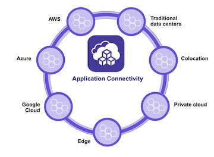
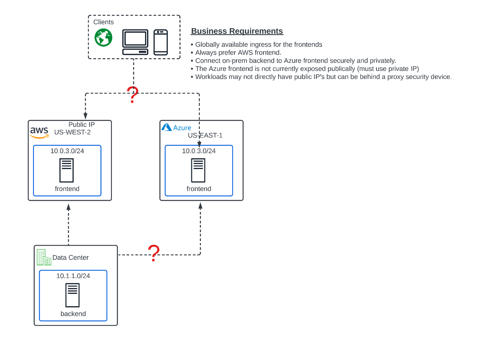

Module 2: App Connect 
========================================

**Narrative:** 
Everything has been running terrific at ACME with your current Network Connect model. Your boss is pleased with your work and has a new assignment for you. 
ACME has aquired a new company that utilizes Azure IAAS but none of their servers are public facing due to security governance. 

ACME wants to implement a globally available frontend that can serve content from either AWS or Azure without directly giving any of the Azure workloads a public IP. 
Inbound Internet traffic should always be sent to the public AWS frontend DNS name with the Azure private-ip frontend acting as a backup for now.  

The on-prem backend server must be able to scan the private frontend in Azure on port 80. 
The frontend server in Azure WILL NOT have a public IP. ACME has truly gone multi-cloud!

**In Lab 3** we will be satisfying the latest ACME business requirements by using App Connect to provide a globally available frontend for the cloud application

**In Lab 4** we will solve the IP overlap problem introduced by the Azure acquisition by leveraging App Connect. 

**In Lab 5** we are offering a bonus App Connect, "Application Routing" lab, where requests from Internet Clients will be routed to AWS or Azure frontend based on URI. You will also 
be configuring application security policy on the globally available frontend load balancer in XC to portect against OWASP Top 10 attacks. 

.. toctree::
   :maxdepth: 1
   :glob:

   lab*
