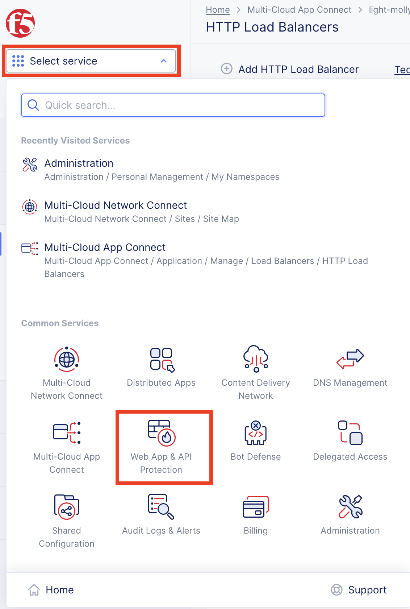
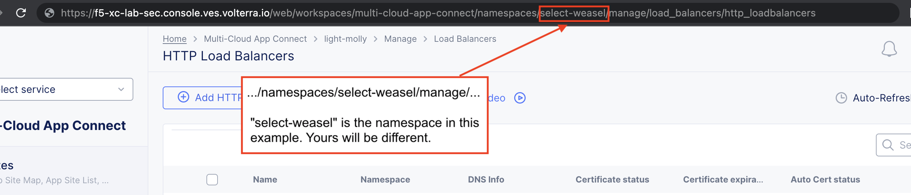
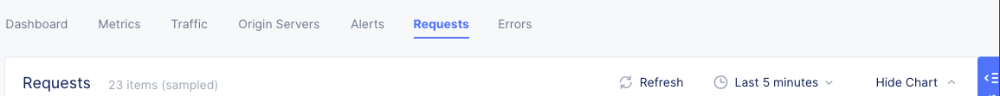

Lab 3: Protecting a Public and Private Endpoint
===============================================

During this lab you will be introduced to creating a WAF policy in F5 Distributed Cloud
and using that policy to protect your lab resource that is a "Public Endpoint"
in AWS (webserver with an EIP).

Task 1. Create WAF Policy
-------------------------

F5 Distributed Cloud WAF shares the same WAF engine that is used by F5 BIG-IP WAF and F5 NGINX App Protect.

The F5 Distributed Cloud WAF engine provides preset categories of rules to protect your web 
applications, provides the ability to run in a monitor or blocking mode, prevent 
false positives by excluding individual rules, IP addresses, or web application paths

In the next exercise you will configure a basic WAF policy 

Exercise 1: Create WAF Policy
^^^^^^^^^^^^^^^^^^^^^^^^^^^^^

We will create a blocking WAF policy.

#. Start in F5 Distributed Cloud Console and switch to the "Web App & API Protection" context. 

   It can be access either from the main Home page... 
  
   ...or via the "Select Service" menu on the top left corner of any other page:

   |select-service|
   
#. Ensure you are in the proper namespace (an adjective-animal combination) and not the default namespace. It is ok if you do not see your namespace as you will be defaulted to it as seen in your URI path as in the Introduction section.

   |namespace-selection|
#. Navigate the menu to go to "Manage"->"App Firewall". Click on *Add App Firewall*.

#. Enter the following variables:

   ================================= ============================================
   Variable                          Value
   ================================= ============================================
   Name                              blocking-app-firewall
   Enforcement Mode                  Blocking
   ================================= ============================================

   In this mode we change the policy to block attacks that are included in 
   the default policy.  Later we will look at how we can customize these settings.

   .. image:: _static/blocking-app-firewall-policy.png

#. Click the *Save and Exit* button to create the policy

Exercise 2: Apply WAF Policy to HTTP Load Balancer
^^^^^^^^^^^^^^^^^^^^^^^^^^^^^^^^^^^^^^^^^^^^^^^^^^

#. Navigate the menu to go to "Manage"->"HTTP Load Balancers" and look for the Load Balancer named [adjective-animal].lab-sec.f5demos.com that you previously created.

#. Click on the three dots "..." to the right of the name of your Load Balancer and select the "Manage Configuration" option.

   .. image:: _static/screenshot-global-vip-actions-manage.png

#. Click on "Edit Configuration" in the upper right of the screen.

#. Under the *Web Application Firewall* section 

#. Choose the following options:

   =============================== =================================
   Variable                        Value
   =============================== =================================
   Web Application Firewall (WAF)  Enable
   Select App Firewall             [NAMESPACE]/blocking-app-firewall
   =============================== =================================

#. Click "*Save and Exit* to update the HTTP Load Balancer.

Exercise 3: Verify Configuration
^^^^^^^^^^^^^^^^^^^^^^^^^^^^^^^^

The public demo app should look like the following:

.. image:: _static/screenshot-global-vip-public.png
   :width: 50%

In this topology we are sending traffic to an AnyCast IP that is hosted in F5 Distributed Cloud's Regional Edge.

We then connect to the AWS resource via it's Public IP address.  

Try adding the following to the URL "/?cat%20/etc/passwd".

You should see a block page.

.. image:: _static/screenshot-global-vip-public-cat-etc-passwd.png

Exercise 4: Performance and Security 
^^^^^^^^^^^^^^^^^^^^^^^^^^^^^^^^^^^^

#. You should already be in the "Web App & API Protection" context from the previous lab. If not, click on "Select service" and select "Web App & API Protection".

   |select-service|

#. Click on Dashboards --> Performance Dashboard.

   .. image:: _static/performance-overview.png
      :width: 50%

   You will see a health score of your environment and several other metrics.

   .. image:: _static/screenshot-global-vip-performance-dashboard.png
      :width: 50%
  
#. Scroll to the bottom of the page and click on the load balancer you just configured to see its performance statistics.

   .. image:: _static/screenshot-global-vip-loadbalancer-performance-select.png

#. View the dashboard.

   .. image:: _static/screenshot-global-vip-loadbalancer-dashboard.png
      :width: 50%

#. Click on "Requests" in the upper page navigation.

   |select-requests|

#. If you visited the website ([adjective-animal].lab-sec.f5demos.com/) more than 5 minutes ago, you may need to click on the drop-down timeframe menu in the upper-right and update it to "Last 1 hour". (Make a note of this step in case it become needed for future steps in this lab.)

   .. image:: _static/update-last-hour.png
      :width: 25%

   You should now be able to view logs for individual requests.

   .. image:: _static/screenshot-global-vip-public-requests.png
      :width: 50%

#. In the left navigation bar, under Overview, click on Dashboards --> Security Dashboard.

   .. image:: _static/select-security-dashboard.png
      :width: 50%

#. Scroll to the bottom of the page and click on the load balancer you previously configured to see its security metrics.

   .. image:: _static/screenshot-global-vip-loadbalancer-performance-select.png

#. Click on the "Security Events" tab at the top of the page.

   .. image:: _static/security-events-tab.png
     :width: 75%

   You will be able to see details of the security events.

   .. image:: _static/screenshot-global-vip-public-security-events.png

   Clicking on the arrow to the left of a security event will expand the details.

   .. image:: _static/screenshot-global-vip-public-security-events-details.png
      :width: 100%

Next we will demonstrate applying the same WAF Policy to your private end point.

#. Navigate the menu to go to Manage --> Load Balancers --> HTTP Load Balancers and look for the Load Balancer that you previously created.

#. Click on the three dots "..." to the right of the name of your Load Balancer and select the "Manage Configuration" option.

#. Click on the "Edit Configuration" in the far upper-right corner of the page.

   .. image:: _static/edit-configuration-button.png
      :width: 50%

#. [Instruction]

   .. image:: _static/select-origin-pool.png
      :width: 100%
      
#. [Instruction]

   .. image:: _static/edit-origin-pool-configuration.png
      :width: 75%

#. Under "Origins" find your previous "frontend-public" Origin pool and click on the three dots "..." to the right under "Actions" and select "Edit"

   .. image:: _static/screenshot-global-vip-edit-config-pools.png

#. Change the selection of "Origin Pool" to "frontend-private" from "frontend-public" and click "Apply"

   .. image:: _static/screenshot-global-vip-edit-config-pools-select.png
   
   (OR)
   
   .. image:: _static/change-origin-pool-public-to-private.png

.. |app-context| image:: _static/app-context.png
   :width: 75%

.. |op-pool-basic| image:: _static/op-pool-basic.png
.. |lb-basic| image:: _static/lb-basic.png

.. |origin_pools_menu| image:: _static/origin_pools_menu.png
.. |origin_pools_add| image:: _static/origin_pools_add.png
.. |origin_pools_config| image:: _static/origin_pools_config.png
.. |origin_pools_config_api| image:: _static/origin_pools_config_api.png
.. |origin_pools_config_mongodb| image:: _static/origin_pools_config_mongodb.png
.. |origin_pools_show_child_objects| image:: _static/origin_pools_show_child_objects.png
.. |origin_pools_show_child_objects_status| image:: _static/origin_pools_show_child_objects_status.png
.. |http_lb_origin_pool_health_check| image:: _static/http_lb_origin_pool_health_check.png
.. |http_lb_origin_pool_health_check2| image:: _static/http_lb_origin_pool_health_check2.png
.. |op-add-pool| image:: _static/op-add-pool.png
.. |op-api-pool| image:: _static/op-api-pool.png
.. |op-spa-check| image:: _static/op-spa-check.png
.. |op-tshoot| image:: _static/op-tshoot.png

